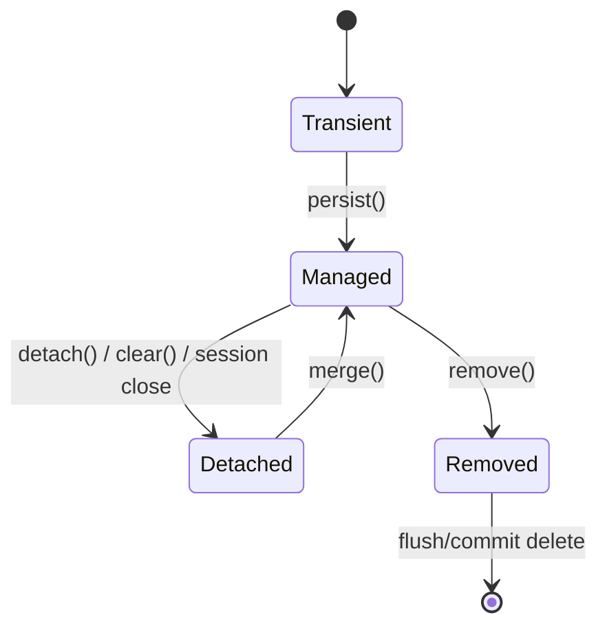
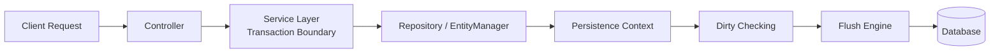
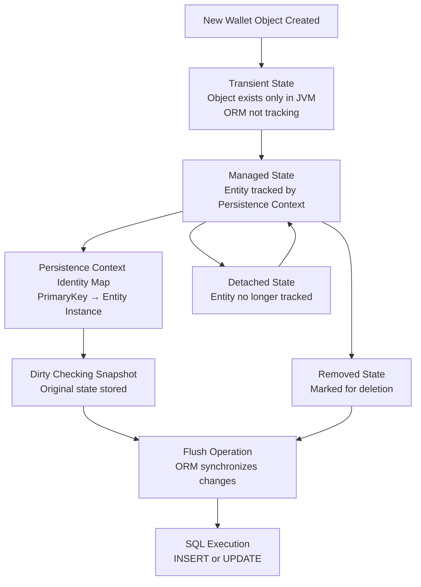
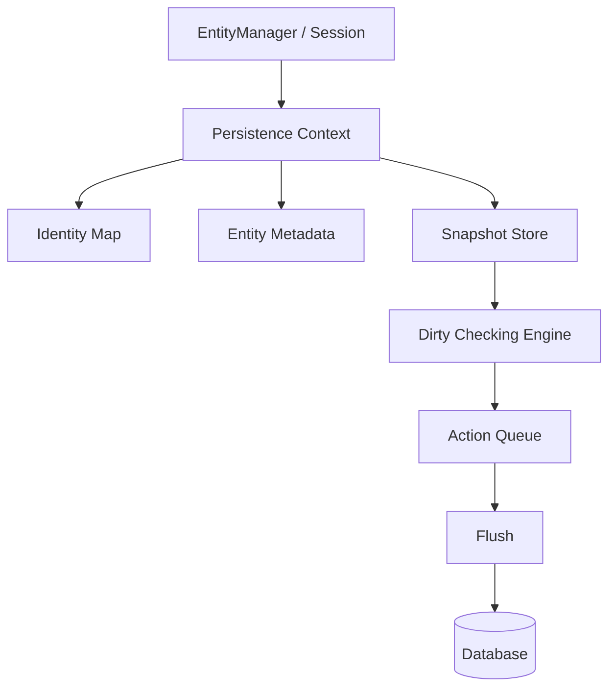
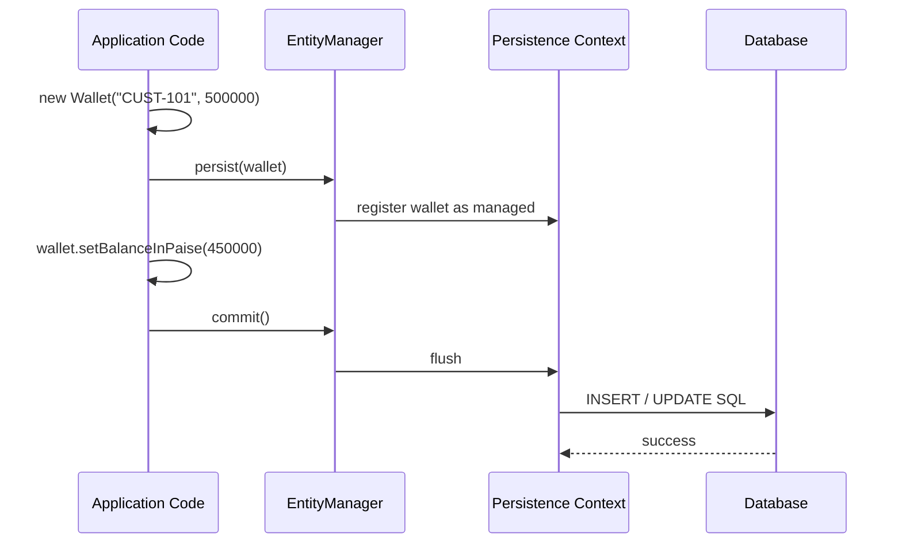
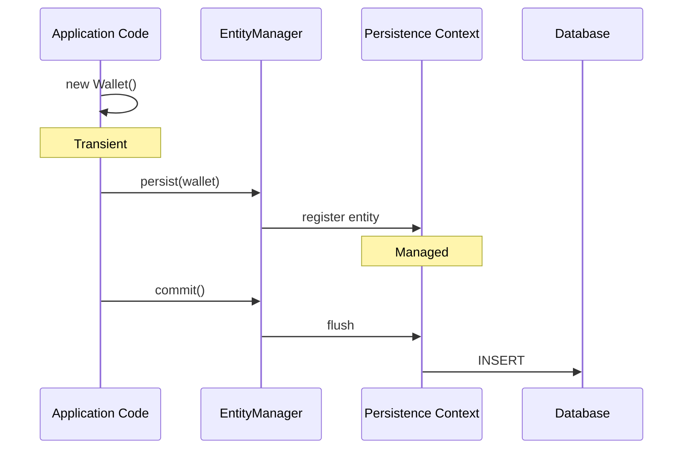
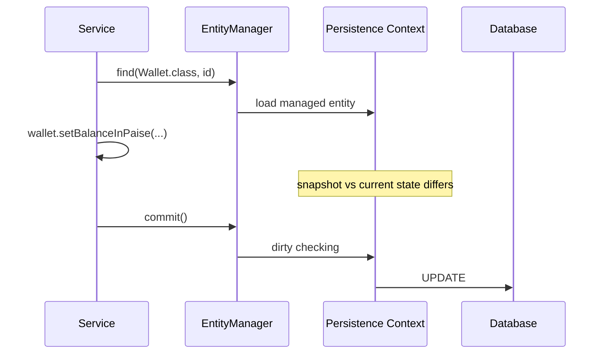
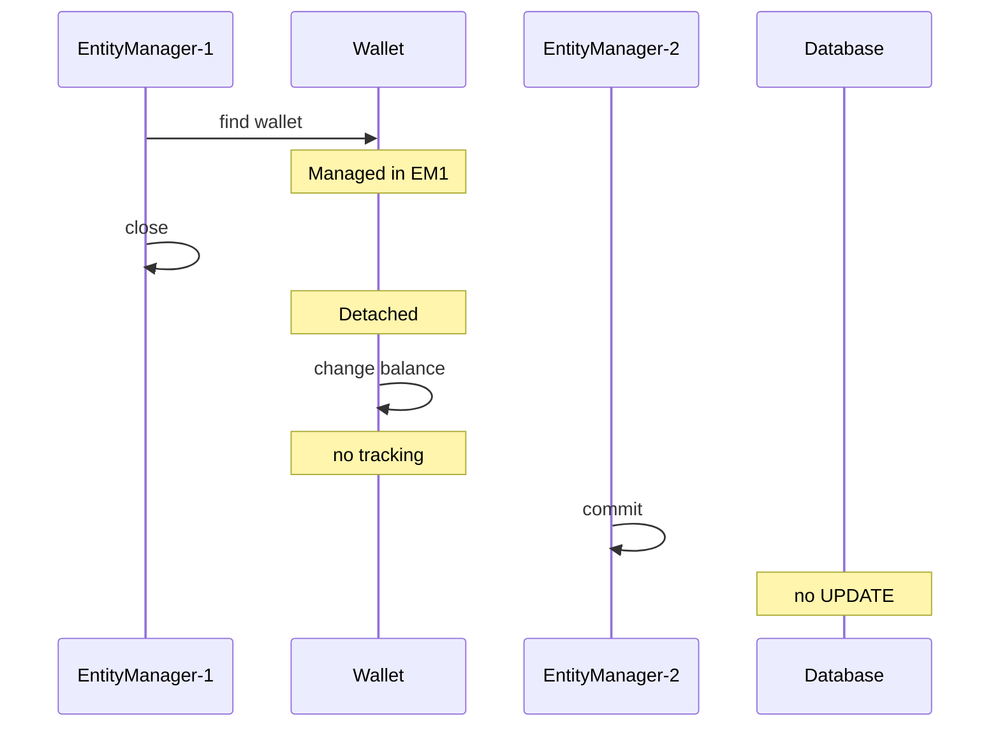
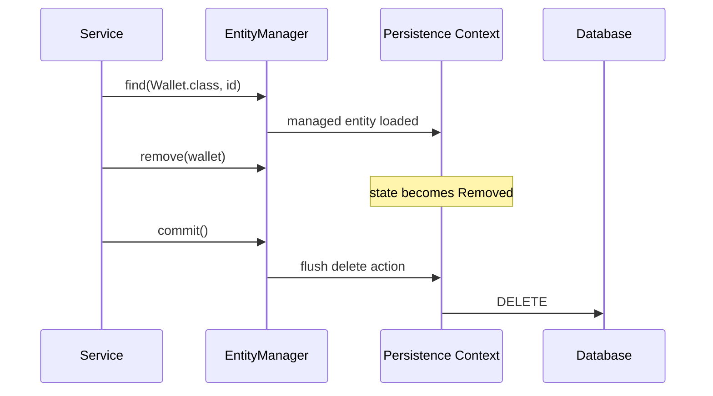
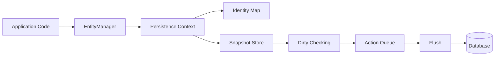

Absolutely. Below is a **fully rewritten, senior-engineer-grade, self-study-friendly** version of **Entity Lifecycle**, keeping the topic intact while restructuring it into your exact requested flow and preserving all core details:

# Entity Lifecycle

---

## 1) What

**Entity Lifecycle** defines the **runtime states an entity object passes through while interacting with JPA/Hibernate, the persistence context, and the database**.

An entity is not just a Java object. Its behavior changes depending on whether Hibernate is currently tracking it or not.

The four primary lifecycle states are:

| State                    | Meaning                                                                                       |
| ------------------------ | --------------------------------------------------------------------------------------------- |
| **Transient**            | Entity exists only in JVM memory. It is not associated with the persistence context.          |
| **Managed / Persistent** | Entity is associated with the current persistence context and is tracked by Hibernate.        |
| **Detached**             | Entity was previously managed, but is no longer tracked by the current persistence context.   |
| **Removed**              | Entity is managed and marked for deletion. Actual DELETE usually happens during flush/commit. |

### Example Entity

```java
import jakarta.persistence.*;

@Entity
@Table(name = "wallets")
public class Wallet {

    @Id
    @GeneratedValue(strategy = GenerationType.IDENTITY)
    private Long id;

    private String customerId;
    private long balanceInPaise;

    public Wallet() {
    }

    public Wallet(String customerId, long balanceInPaise) {
        this.customerId = customerId;
        this.balanceInPaise = balanceInPaise;
    }

    public Long getId() {
        return id;
    }

    public String getCustomerId() {
        return customerId;
    }

    public long getBalanceInPaise() {
        return balanceInPaise;
    }

    public void setCustomerId(String customerId) {
        this.customerId = customerId;
    }

    public void setBalanceInPaise(long balanceInPaise) {
        this.balanceInPaise = balanceInPaise;
    }
}
```

### Core Understanding

Entity Lifecycle is about answering questions like:

* Is this entity currently tracked?
* Will changing a field trigger an SQL update?
* Will `persist()` insert it?
* Will `remove()` delete it immediately?
* Why did one change go to DB and another one did not?
* Why is one object auto-synchronized and another ignored?

This topic is foundational because many JPA/Hibernate runtime issues are actually **entity state problems**, not annotation problems.

---

## 2) Why does it exist

Entity Lifecycle exists because ORM frameworks must manage a **controlled runtime relationship between in-memory objects and relational rows**.

Without lifecycle management, the ORM cannot reliably answer:

* Which object is new?
* Which object is already loaded?
* Which object changed?
* Which change should become SQL?
* Which object is no longer being tracked?
* Which object should be deleted?

### Why Hibernate needs lifecycle states

Hibernate is not simply a JDBC wrapper.
It is an **object state management engine**.

To function correctly, it must know:

* whether an object is part of the current unit of work
* whether it has a DB identity
* whether its state has changed
* whether it should be written, ignored, merged, or deleted

### Why senior engineers must understand it

For 5–10+ years experienced engineers, Entity Lifecycle matters because it directly impacts:

* transaction behavior
* dirty checking
* flush timing
* implicit updates
* merge semantics
* lazy loading behavior
* correctness of update flows
* API boundary design
* performance tuning
* debugging missing or unexpected SQL

### Real-world importance

In production systems, lifecycle misunderstanding causes:

* updates happening without explicit save
* updates not happening even though field was changed
* duplicate inserts
* stale detached entities
* LazyInitializationException
* unexpected delete timing
* merge confusion
* corrupted business flows across transaction boundaries

So Entity Lifecycle exists because ORM needs a **formal state machine** to translate domain object behavior into correct database behavior.

---

## 3) When to use it

You do not “use” Entity Lifecycle as a standalone feature.
You use lifecycle knowledge **whenever you work with entities in JPA/Hibernate**.

### Lifecycle understanding is required when:

* creating new entities
* loading and updating entities
* deleting entities
* using transactions
* working with EntityManager/Session
* moving data across layers
* handling detached objects
* designing REST APIs
* implementing batch jobs
* debugging persistence issues
* dealing with flush vs commit
* using merge, detach, clear, refresh

### Typical situations

#### A. New record creation

You create a new entity object. It starts as **Transient**.

#### B. Transactional update

You fetch an entity in a transaction. It becomes **Managed**.

#### C. Service-to-controller boundary

When the transaction/session ends, the entity often becomes **Detached**.

#### D. Delete flow

When `remove()` is called on a managed entity, it becomes **Removed**.

#### E. Detached object update

When an older entity instance comes from another layer/request/session, you must decide whether to reload or merge it.

### Practical interpretation

Entity Lifecycle knowledge is required **every time your code assumes something about what ORM will do next**.

---

## 4) Where to use it

Entity Lifecycle matters in all layers where entities are created, modified, passed, or persisted.

### Typical layers

#### Controller Layer

* receives request DTOs
* should not blindly treat request payloads as managed entities

#### Service Layer

* usually defines transaction boundary
* most lifecycle-sensitive business logic belongs here

#### Repository Layer

* loads entities into managed state
* persists/removes entities

#### ORM Runtime

* persistence context tracks identity and state
* dirty checking compares snapshots
* flush synchronizes to database

#### Database Layer

* receives final SQL operations after flush/commit

### Real systems where this matters

* Banking and payments systems
* Inventory and ERP systems
* Healthcare EMR applications
* Telecom order management
* Audit-heavy transactional applications
* Event-driven consumers with transactional persistence
* Batch processing pipelines
* Multi-layer Spring Boot applications

### Most important architectural place

The most important place where Entity Lifecycle matters is the **service layer with transaction boundaries**, because that is where entities are usually:

* loaded
* mutated
* synchronized
* detached after method completion

---

## 5) How to implement

Entity Lifecycle is implemented through **EntityManager/Session operations**, transaction boundaries, and persistence context behavior.

### Main operations involved

* `new` → creates **Transient**
* `persist()` → makes entity **Managed**
* `find()` / query load → returns **Managed**
* `detach()` / `clear()` / session close → makes entity **Detached**
* `merge()` → copies detached state into a **Managed** instance
* `remove()` → marks a managed entity as **Removed**
* `flush()` / `commit()` → synchronizes SQL with DB

### Basic state transition model



### State-by-state implementation view

#### Transient

```java
Wallet wallet = new Wallet("CUST-101", 500_000L);
```

#### Managed

```java
entityManager.persist(wallet);
```

or

```java
Wallet wallet = entityManager.find(Wallet.class, 1L);
```

#### Detached

```java
entityManager.detach(wallet);
```

or when transaction/session closes.

#### Removed

```java
entityManager.remove(wallet);
```

### Important runtime detail

`persist()`, `remove()`, and field changes do not always execute SQL immediately.
They often register intent inside the persistence context, and real SQL is emitted during **flush/commit**.

---

## 6) Architecture Diagram

### High-Level Architecture



### Internal Runtime Diagram



### Persistence Context Internal Structure



### Sequence Diagram



---

## 7) Scenario

A wallet service in a digital payments platform manages customer balances.

A team implements the following flow:

* create a new wallet
* save it
* fetch it again for debit operation
* modify balance
* return the entity outside the service layer
* later update the same object in another flow
* sometimes delete the wallet

The team believes:

* all updates require explicit save
* any entity object can be changed and Hibernate will understand it
* `persist()` is a generic save method
* if `remove()` is called, delete happens immediately
* merge just reattaches the same object exactly as-is

In production, they see:

* one balance change is auto-updated without calling save
* another balance change is not saved at all
* delete SQL is delayed
* a detached object is changed but ignored
* a merge causes confusion because returned object reference is different from expectation

The root cause is poor understanding of **Entity Lifecycle**.

---

## 8) Goal

The goal of learning Entity Lifecycle is to enable engineers to:

* correctly identify current entity state
* predict Hibernate behavior before SQL happens
* design correct service-layer transaction flows
* distinguish managed vs detached behavior
* avoid lost updates and accidental updates
* handle merge/detach/remove correctly
* debug persistence behavior confidently
* teach ORM runtime behavior to other engineers

For experienced engineers, the real goal is:

> make ORM behavior explainable, predictable, and production-safe

---

## 9) What Can Go Wrong with wrong code

Below are common lifecycle failures with meaningful wrong code.

---

### Wrong Case 1: Assuming new object is automatically persistent

```java
public void createWalletWrong() {
    Wallet wallet = new Wallet("CUST-1001", 500_000L);
    wallet.setBalanceInPaise(450_000L);

    System.out.println("Wallet created: " + wallet.getCustomerId());
    // Developer assumes DB row now exists
}
```

### What goes wrong

No DB insert occurs.

---

### Wrong Case 2: Updating detached entity and expecting auto-save

```java
public void detachedUpdateWrong(EntityManagerFactory emf) {
    EntityManager em1 = emf.createEntityManager();
    Wallet wallet = em1.find(Wallet.class, 1L);
    em1.close(); // wallet becomes detached

    wallet.setBalanceInPaise(300_000L); // modified while detached

    EntityManager em2 = emf.createEntityManager();
    em2.getTransaction().begin();
    em2.getTransaction().commit(); // no merge, no reload
    em2.close();
}
```

### What goes wrong

No SQL update is issued.

---

### Wrong Case 3: Using persist on logically existing entity

```java
public void persistExistingWrong(EntityManager em) {
    Wallet wallet = new Wallet("CUST-1001", 400_000L);
    // Assume this object represents already existing business data
    em.getTransaction().begin();
    em.persist(wallet);
    em.getTransaction().commit();
}
```

### What goes wrong

A new row may be inserted instead of updating existing data.

---

### Wrong Case 4: Assuming remove deletes immediately

```java
public void removeWrong(EntityManager em) {
    em.getTransaction().begin();
    Wallet wallet = em.find(Wallet.class, 1L);
    em.remove(wallet);

    System.out.println("Developer assumes DB delete already completed");
    // still inside transaction, flush may not yet have happened

    em.getTransaction().commit();
}
```

### What goes wrong

Delete may not happen until flush/commit.

---

### Wrong Case 5: Using entity outside transaction boundary

```java
public Wallet fetchWalletWrong(EntityManager em) {
    em.getTransaction().begin();
    Wallet wallet = em.find(Wallet.class, 1L);
    em.getTransaction().commit();
    em.close();

    return wallet; // detached
}
```

Then later:

```java
Wallet wallet = service.fetchWalletWrong(em);
wallet.setBalanceInPaise(200_000L); // developer expects DB update later
```

### What goes wrong

Detached object is modified, but ORM is no longer tracking it.

---

## 10) Why It Fails

These failures happen because developers confuse:

* object existing in memory
  with
* object being tracked by persistence context

Those are not the same thing.

### Detailed reasons

#### Failure Reason 1: Transient is not persistent

Creating an object with `new` does not register it with Hibernate.

#### Failure Reason 2: Dirty checking only works for managed entities

Hibernate only compares snapshots for entities inside the persistence context.

#### Failure Reason 3: Detached objects are plain Java objects

Once detached, the object is no longer part of the current unit of work.

#### Failure Reason 4: SQL is deferred

Hibernate often delays SQL until flush/commit.

#### Failure Reason 5: persist is not generic update

`persist()` is intended for new entity instances entering the persistence context.

#### Failure Reason 6: remove is a state transition first

`remove()` marks the entity as removed; actual delete is synchronized later.

#### Failure Reason 7: session/transaction scope matters

When session closes, the tracking boundary ends.

### Internal reason

Hibernate works as a **Unit of Work + Identity Map + Dirty Checking engine**.

If the entity is not under that engine’s tracking, Hibernate has nothing to synchronize.

---

## 11) Correct Approach

A correct approach starts with one discipline:

> Always know the entity’s current lifecycle state before operating on it.

### Correct design approach

#### For new entities

* create new object
* call `persist()` inside transaction

#### For updates

* load entity inside current transaction
* modify the managed entity
* let dirty checking synchronize changes

#### For detached incoming objects

* prefer reload + copy changes
* use `merge()` carefully when needed

#### For deletes

* load managed entity
* call `remove()`
* understand delete happens at flush/commit

#### For API boundaries

* pass DTOs, not live entities, across layers where possible

### Practical enterprise rule

Prefer this pattern:

1. Controller receives DTO
2. Service starts transaction
3. Service loads managed entity or creates new one
4. Service mutates managed entity
5. Hibernate flushes changes
6. Response is mapped to DTO

This is far safer than moving detached entities across layers and hoping ORM will infer intent.

---

## 12) Key Principles

### Principle 1: Entity state determines ORM behavior

Same Java class, different lifecycle state, different persistence behavior.

### Principle 2: Managed entities are tracked automatically

Field changes on managed entities may become SQL updates through dirty checking.

### Principle 3: Detached entities are not tracked

Changes on detached entities stay in memory unless merged or reloaded.

### Principle 4: Persistence Context is the tracking boundary

Lifecycle behavior depends on whether entity is inside that boundary.

### Principle 5: One row, one managed instance per persistence context

Identity Map prevents multiple managed objects representing the same row in the same context.

### Principle 6: Flush is synchronization, commit is transaction completion

Flush may happen before commit; they are related but not identical.

### Principle 7: persist is for new entities

Do not treat it as a universal save/update method.

### Principle 8: remove marks, flush executes

Deletion is usually deferred until synchronization.

### Principle 9: merge copies state into managed instance

Do not assume the detached object itself becomes the active managed reference in the way many developers imagine.

### Principle 10: Lifecycle knowledge is required for performance and correctness

This is not only conceptual knowledge; it changes real SQL behavior.

---

## 13) Correct Implementation

Below is a full plain JPA implementation showing major state transitions.

```java
import jakarta.persistence.EntityManager;
import jakarta.persistence.EntityManagerFactory;
import jakarta.persistence.EntityTransaction;
import jakarta.persistence.Persistence;

public class EntityLifecycleDemo {

    public static void main(String[] args) {
        EntityManagerFactory emf = Persistence.createEntityManagerFactory("wallet-pu");

        createWallet(emf);
        updateManagedWallet(emf);
        updateDetachedWalletWrongWay(emf);
        updateDetachedWalletCorrectWay(emf);
        removeWallet(emf);

        emf.close();
    }

    private static void createWallet(EntityManagerFactory emf) {
        EntityManager em = emf.createEntityManager();
        EntityTransaction tx = em.getTransaction();

        Wallet wallet = new Wallet("CUST-1001", 500_000L); // Transient

        System.out.println("Before persist: transient wallet created");

        tx.begin();
        em.persist(wallet); // Managed
        System.out.println("After persist: wallet is managed");
        tx.commit(); // INSERT during flush/commit

        em.close(); // detached after close
    }

    private static void updateManagedWallet(EntityManagerFactory emf) {
        EntityManager em = emf.createEntityManager();
        EntityTransaction tx = em.getTransaction();

        tx.begin();
        Wallet wallet = em.find(Wallet.class, 1L); // Managed

        if (wallet != null) {
            wallet.setBalanceInPaise(wallet.getBalanceInPaise() - 50_000L);
            System.out.println("Managed wallet updated in memory");
        }

        tx.commit(); // Dirty checking triggers UPDATE
        em.close();
    }

    private static void updateDetachedWalletWrongWay(EntityManagerFactory emf) {
        EntityManager em1 = emf.createEntityManager();
        Wallet wallet = em1.find(Wallet.class, 1L); // Managed in em1
        em1.close(); // Detached

        if (wallet != null) {
            wallet.setBalanceInPaise(wallet.getBalanceInPaise() - 10_000L); // Detached change
            System.out.println("Detached wallet modified");
        }

        EntityManager em2 = emf.createEntityManager();
        EntityTransaction tx2 = em2.getTransaction();
        tx2.begin();
        tx2.commit(); // No merge, so no update
        em2.close();
    }

    private static void updateDetachedWalletCorrectWay(EntityManagerFactory emf) {
        EntityManager em1 = emf.createEntityManager();
        Wallet detachedWallet = em1.find(Wallet.class, 1L);
        em1.close(); // Detached

        if (detachedWallet != null) {
            detachedWallet.setBalanceInPaise(detachedWallet.getBalanceInPaise() - 5_000L);
        }

        EntityManager em2 = emf.createEntityManager();
        EntityTransaction tx2 = em2.getTransaction();
        tx2.begin();

        Wallet managedWallet = em2.merge(detachedWallet); // Managed copy/state reattached
        System.out.println("Merged wallet customerId: " + managedWallet.getCustomerId());

        tx2.commit();
        em2.close();
    }

    private static void removeWallet(EntityManagerFactory emf) {
        EntityManager em = emf.createEntityManager();
        EntityTransaction tx = em.getTransaction();

        tx.begin();
        Wallet wallet = em.find(Wallet.class, 1L); // Managed

        if (wallet != null) {
            em.remove(wallet); // Removed
            System.out.println("Wallet marked for deletion");
        }

        tx.commit(); // DELETE during flush/commit
        em.close();
    }
}
```

---

## 14) Execution Flow

### Flow 1: Create



### Flow 2: Update Managed Entity



### Flow 3: Detached Update Failure



### Flow 4: Remove



### Internal Runtime Flow Recap



---

## 15) Common Mistakes

### 1. Treating `new Entity()` as persistent data

It is only transient until registered.

### 2. Assuming explicit save is always required for update

Managed entities may auto-update on flush.

### 3. Assuming changed detached object will be saved

Detached changes are ignored unless merged/reloaded.

### 4. Misusing `persist()` for existing business objects

Can create unintended inserts.

### 5. Not understanding transaction boundary

Lifecycle changes depend heavily on session/transaction scope.

### 6. Returning live entities directly across layers

Leads to detached/lazy issues and confusion.

### 7. Assuming `remove()` immediately executes delete SQL

Delete is typically deferred.

### 8. Blindly using `merge()` everywhere

This hides intent and causes unnecessary complexity.

### 9. Forgetting `merge()` returns the managed instance

Developers often keep using the detached reference.

### 10. Ignoring persistence context identity rules

This creates confusion when same DB row seems to map to shared object behavior.

---

## 16) Best Practices

### Best Practice 1: Update managed entities inside transactions

Load, mutate, commit. Keep update flow simple and explicit.

### Best Practice 2: Use DTOs at boundaries

Do not move entities across layers unless there is a strong reason.

### Best Practice 3: Prefer reload-and-apply over blind merge

Especially for important domain objects.

### Best Practice 4: Keep transaction scope intentional

Too short causes detach problems; too broad causes side effects.

### Best Practice 5: Know flush behavior

Flush timing explains most “why did SQL happen here?” questions.

### Best Practice 6: Log SQL and transaction boundaries during debugging

This reveals lifecycle behavior quickly.

### Best Practice 7: Teach team members the four states explicitly

A shared mental model reduces ORM bugs significantly.

### Best Practice 8: Use entities as domain state, not transport format

This improves correctness and architectural clarity.

### Best Practice 9: Be careful with async/thread boundaries

Entities become unsafe assumptions outside original persistence context.

### Best Practice 10: Think in unit-of-work terms

Hibernate tracks business changes within a controlled runtime boundary.

---

## 17) Decision Matrix

| Situation                                        | Current State         | Recommended Action                                   | Why                                           |
| ------------------------------------------------ | --------------------- | ---------------------------------------------------- | --------------------------------------------- |
| New object created from request                  | Transient             | `persist()`                                          | New entity must enter persistence context     |
| Entity loaded in current transaction             | Managed               | Modify directly                                      | Dirty checking will synchronize changes       |
| Existing object coming from earlier session      | Detached              | Reload and apply changes, or use `merge()` carefully | Detached object is not tracked                |
| Need to stop tracking changes                    | Managed               | `detach()` or `clear()`                              | Prevent unintended synchronization            |
| Need to delete loaded entity                     | Managed               | `remove()`                                           | Correct state transition to Removed           |
| Need to return response to API                   | Managed/Detached risk | Map to DTO                                           | Avoid lifecycle leakage and lazy problems     |
| Unsure whether entity is managed                 | Unknown               | `entityManager.contains(entity)`                     | Make state explicit                           |
| Need DB synchronization before commit            | Managed               | `flush()`                                            | Force synchronization point                   |
| Same row accessed multiple times in one context  | Managed               | Trust identity map behavior                          | ORM ensures one managed instance per identity |
| Detached object modified after transaction ended | Detached              | Do not expect auto-save                              | No dirty checking outside persistence context |

---

# Final Senior-Level Summary

Entity Lifecycle is the **runtime state model that governs how JPA/Hibernate interprets an entity object**.

It explains:

* why some objects are tracked and some are not
* why some changes become SQL automatically
* why others are ignored
* why delete is often delayed
* why merge is sometimes needed
* why transaction boundary is so important

The most important mental model is:

> Hibernate only manages what is inside the persistence context.

That means:

* **Transient** → object exists, but ORM does not care yet
* **Managed** → ORM tracks it and may synchronize changes
* **Detached** → object still exists, but ORM stopped tracking it
* **Removed** → object is scheduled for deletion

For experienced engineers, mastering Entity Lifecycle is what transforms JPA/Hibernate from “sometimes magical and unpredictable” into **fully understandable runtime behavior**.

If you want, I can next do **Persistence Context Identity Map** in the exact same structure so the whole module stays aligned.
