# Deep Dive: Mastering JPA/Hibernate for Payment Systems
**Principal Software Architect & Expert Technical Trainer**  
*Audience: Senior Engineers (5-10+ years)*  
*Stack: Java, Spring Boot, JPA/Hibernate, PostgreSQL*  
*Duration: Self-study (approx. 12–15 hours)*

---

## Module Overview
This module is structured into 10 interconnected sections, each following a rigorous 16-step framework designed to expose architectural trade-offs, edge cases, and production-grade implementations. You will not find beginner tutorials here—only the nuanced reality of building scalable, secure, and maintainable payment systems with JPA/Hibernate and Spring.

Each section includes:
- **What** – Concise definition.
- **Why exists** – The problem it solves.
- **When/Where** – Usage triggers and architectural layer.
- **How** – High-level implementation steps.
- **Architecture Diagram** (Mermaid JS).
- **Scenario** – Real-world payment use case.
- **Goal** – Measurable outcome.
- **What Can Go Wrong** – Failure modes with broken code.
- **Why It Fails** – Root cause analysis.
- **Correct Approach** – Pattern to mitigate failure.
- **Key Principles** – Guiding laws.
- **Correct Implementation** – Production-grade code.
- **Execution Flow** – Sequence diagram.
- **Common Mistakes** – Anti-patterns seen in senior engineering.
- **Decision Matrix** – Compare with alternatives.

Let’s begin.

---

## Section 1: Entity Lifecycle, Persistence Context & Dirty Checking

### 1. What
**Entity Lifecycle** defines the states an object goes through in JPA: Transient, Managed, Detached, Removed.  
**Persistence Context (PC)** is a first-level cache that tracks changes to managed entities.  
**Dirty Checking** is Hibernate’s mechanism to automatically detect changes to managed entities and flush corresponding SQL at transaction commit.

### 2. Why does it exist
Without a managed context, developers would have to manually issue `UPDATE` statements for every change. Dirty checking provides an abstraction that makes working with domain objects feel natural—modify a Java object, and the changes magically persist. However, this magic fails when developers misunderstand the lifecycle boundaries.

### 3. When to use it
- Always when using JPA in a transactional service layer.
- The PC is typically scoped to a transaction (default in Spring: `TransactionScopedPersistenceContext`).

### 4. Where to use it
- **Service Layer**: Methods annotated with `@Transactional` that load and modify entities.
- **Repository Layer**: Spring Data repositories interact with the PC automatically.

### 5. How to implement (High-level)
1. Define entities with `@Entity`.
2. Inject repositories or `EntityManager` in services.
3. Annotate service methods that perform writes with `@Transactional`.
4. Load entities inside the transaction.
5. Modify entity state—no explicit save required.
6. Commit happens at method exit (or explicit `flush`).

### 6. Architecture Diagram
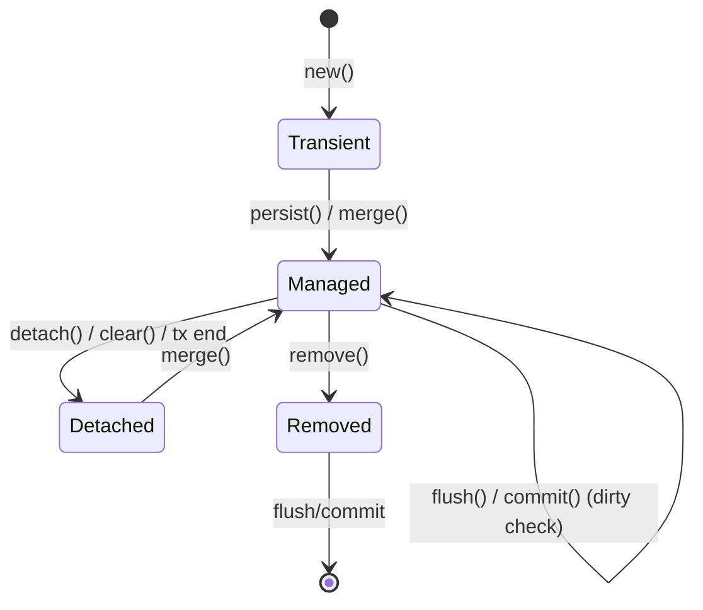

### 7. Scenario
**SecurePayment Gateway** – A junior developer writes code to update a wallet balance after a successful payment. The change works in tests but in production updates silently disappear. Hibernate logs show “no dirty fields detected”. The payment was debited from the external system but the wallet balance was never persisted. Financial discrepancy triggers a regulatory incident.

### 8. Goal
Understand how JPA entity states interact with the Persistence Context, and how Hibernate’s automatic dirty checking, flush timing, and commit ordering affect whether your changes actually reach the database. Achieve zero silent data loss.

### 9. What Can Go Wrong (with broken code)
```java
// BROKEN: Modifying a detached entity without re-attaching
@Service
public class BrokenWalletService {
    @Autowired private WalletRepository walletRepository;

    // No @Transactional – findById() opens a short-lived tx just for SELECT
    public void creditWallet(Long walletId, BigDecimal amount) {
        Optional<Wallet> opt = walletRepository.findById(walletId); // SELECT
        Wallet wallet = opt.orElseThrow();
        wallet.setBalance(wallet.getBalance().add(amount)); // Modification on DETACHED entity
        // No save() call, no @Transactional → Hibernate never issues UPDATE
    }
}

// BROKEN: Calling save() outside @Transactional when using flush mode AUTO
@Service
public class BrokenPaymentFlusher {
    @Autowired private EntityManager em;

    public void markPaid(Long paymentId) {
        Payment p = em.find(Payment.class, paymentId);
        p.setStatus(PaymentStatus.SETTLED);
        // flush mode AUTO only flushes before a query within a transaction.
        // Without a transaction, no flush and no commit ever happen.
    }
}
```

### 10. Why It Fails
- `findById()` without `@Transactional` opens a transaction just for the SELECT and closes it immediately. The returned entity becomes **Detached**—the Persistence Context is gone.
- Dirty checking only tracks **Managed** entities. Modifications to Detached entities are invisible.
- `flush()` only happens automatically before query execution if within a transaction; without a transaction, no flush occurs.
- `save()` on a Detached entity calls `merge()` but the caller’s reference remains detached—changes to the original are lost.

### 11. Correct Approach
Maintain a **transactional boundary** around all write operations. Inside the transaction, entities are Managed and modifications are tracked.

### 12. Key Principles
- All business logic that modifies entity state must execute within an `@Transactional` boundary.
- The Persistence Context is scoped per transaction in Spring (default).
- Dirty checking compares current state against a snapshot taken at load time.
- `flush()` writes SQL to the connection buffer; `commit()` makes it durable.
- `save()` on a Managed entity is a no-op—dirty checking handles updates.

### 13. Correct Implementation
```java
package com.securepayment.wallet.service;

import com.securepayment.wallet.domain.Wallet;
import com.securepayment.wallet.repository.WalletRepository;
import lombok.RequiredArgsConstructor;
import org.slf4j.Logger;
import org.slf4j.LoggerFactory;
import org.springframework.stereotype.Service;
import org.springframework.transaction.annotation.Transactional;

import java.math.BigDecimal;

@Service
@RequiredArgsConstructor
public class WalletService {
    private static final Logger log = LoggerFactory.getLogger(WalletService.class);
    private final WalletRepository walletRepository;

    @Transactional
    public void creditWallet(Long walletId, BigDecimal amount) {
        log.info("Crediting wallet={} amount={}", walletId, amount);
        Wallet wallet = walletRepository.findById(walletId)
            .orElseThrow(() -> new IllegalArgumentException("Wallet not found: " + walletId));
        wallet.setBalance(wallet.getBalance().add(amount));
        // No explicit save() needed – Hibernate will issue UPDATE on commit
        log.info("Wallet balance after credit: {}", wallet.getBalance());
    }

    @Transactional
    public Wallet updateAndVerify(Long walletId, BigDecimal newBalance) {
        Wallet wallet = walletRepository.findById(walletId).orElseThrow();
        wallet.setBalance(newBalance);
        walletRepository.flush(); // Force flush before subsequent query
        // Now any query will see the updated balance
        return wallet;
    }
}
```

### 14. Execution Flow (Sequence Diagram)
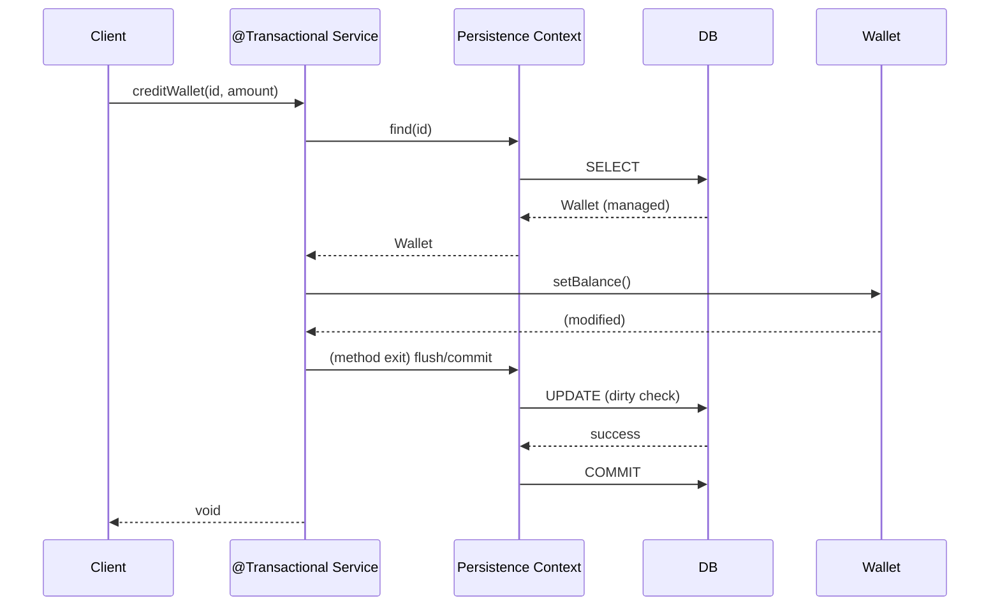

### 15. Common Mistakes
1. **Modifying entities outside `@Transactional`** – changes silently discarded. Detection: enable `spring.jpa.show-sql=true` and verify UPDATEs appear.
2. **Calling `save()` on a detached entity and thinking it updates** – always use the return value of `save()` (the merged instance).
3. **`@Transactional` on private methods** – ignored by Spring proxy. Use `public` or `protected` and call via injected bean.
4. **Long-lived Persistence Contexts (EXTENDED)** – causes OOM in high-throughput systems. Stick to TRANSACTION scope.
5. **Mixing `em.flush()` with declarative transactions** – `flush()` does not commit; rollback still possible.
6. **Not setting audit timestamps via `@PreUpdate`** – breaks data lineage for reconciliation.

### 16. Decision Matrix: JPA State Management vs Alternatives
| Approach               | Pros                                      | Cons                                      | When to Choose |
|------------------------|-------------------------------------------|-------------------------------------------|----------------|
| JPA with @Transactional | Automatic dirty checking, less code       | Requires understanding of lifecycle       | Default for OLTP services |
| Manual JDBC updates     | Full control, no magic                    | Boilerplate, error-prone                  | Bulk operations, ETL |
| Spring Data JDBC        | Simpler than JPA, no PC overhead          | No automatic dirty checking                | Simple CRUD, no complex graphs |

---

## Section 2: Entity Constraints, Embedded Objects & Relationship Mappings

### 1. What
**Entity constraints** define database-level rules (unique, nullable) and bean validation annotations.  
**Embedded objects** are value types (e.g., `MoneyAmount`, `CardReference`) that have no identity and are mapped as columns in the owning table.  
**Relationship mappings** (`@ManyToOne`, `@OneToMany`, `@OneToOne`, `@ManyToMany`) define how entities associate, with fetch types (`LAZY`/`EAGER`) and ownership.

### 2. Why does it exist
To model domain relationships while maintaining referential integrity, and to avoid redundant columns by grouping related fields into reusable components. Without proper mapping, you get incorrect SQL, performance disasters, or data inconsistency.

### 3. When to use it
- Use embedded objects for any group of fields that together represent a value (e.g., address, money, contact info).
- Use `@ManyToOne` for associations where the child table holds the foreign key.
- Use `@OneToMany(mappedBy=...)` for bidirectional collections, designating the owning side.
- Default to `FetchType.LAZY` everywhere; eagerly fetch only when proven necessary.

### 4. Where to use it
- Domain entities (JPA `@Entity` classes) in the model layer.
- Value objects (`@Embeddable`) live inside entities.

### 5. How to implement (High-level)
1. Identify value objects and annotate with `@Embeddable`.
2. Define relationships: foreign key side is the owning side (`@ManyToOne`).
3. Use `mappedBy` on the inverse side (`@OneToMany`).
4. Specify fetch type explicitly (prefer `LAZY`).
5. Add validation annotations (`@NotNull`, `@Size`, etc.) and database constraints (`@Column`, `@Table(indexes=...)`).

### 6. Architecture Diagram
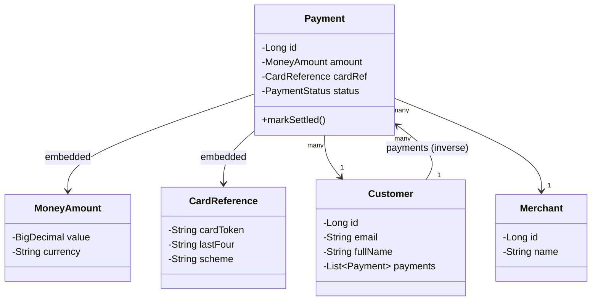

### 7. Scenario
SecurePayment Gateway onboards a new merchant. The `Payment` entity references `Customer`, `Merchant`, and `PaymentMethod`. A developer uses `FetchType.EAGER` on all three associations. A simple “list transactions” API causes Hibernate to execute 14 SQL queries to load 5 payment records—the latency SLA is breached, and the load balancer times out during peak.

### 8. Goal
Model the domain correctly using embedded objects and proper relationship mappings, with appropriate fetch strategies that avoid N+1 queries or Cartesian products.

### 9. What Can Go Wrong (with broken code)
```java
// BROKEN: EAGER fetching on all associations – performance time-bomb
@Entity
public class Payment {
    @ManyToOne(fetch = FetchType.EAGER) @JoinColumn(name = "customer_id")
    private Customer customer;

    @ManyToOne(fetch = FetchType.EAGER) @JoinColumn(name = "merchant_id")
    private Merchant merchant;

    private String cardNumber; // Should be embedded, also stores raw PAN
    private String cvv; // NEVER store CVV – PCI-DSS violation
}

// BROKEN: Bidirectional @OneToMany without mappedBy – creates a join table
@Entity
public class Customer {
    @OneToMany // Missing mappedBy! Hibernate creates extra customer_payments table
    private List<Payment> payments;
}
```

### 10. Why It Fails
- `FetchType.EAGER` on `@ManyToOne` means every `SELECT * FROM payments` triggers additional SELECTs for each associated entity (N+1).
- Bidirectional `@OneToMany` without `mappedBy` makes both sides owning, forcing a junction table and redundant foreign keys.
- Storing `cvv` in entity violates PCI-DSS (never store CVV).
- Raw card number storage increases PCI scope; should be tokenized.

### 11. Correct Approach
Use `LAZY` as default. Model value types as `@Embeddable`. Define ownership clearly with `mappedBy`. Apply validation and constraints. Never store raw PAN or CVV.

### 12. Key Principles
- Default to `FetchType.LAZY` on all associations.
- `@Embedded` for value objects without identity.
- Always specify `mappedBy` on inverse side.
- Never store CVV; tokenize PAN.
- Use `CascadeType` conservatively (PERSIST/MERGE only).
- Add indexes on foreign key columns and frequently queried fields.

### 13. Correct Implementation
```java
// VALUE OBJECT: MoneyAmount (embedded)
@Embeddable
public class MoneyAmount {
    @Column(nullable = false, precision = 19, scale = 4)
    private BigDecimal value;
    @Column(nullable = false, length = 3)
    private String currency;

    protected MoneyAmount() {}
    public MoneyAmount(BigDecimal value, String currency) {
        if (value == null || value.compareTo(BigDecimal.ZERO) < 0)
            throw new IllegalArgumentException("Amount must be non-negative");
        if (currency == null || currency.length() != 3)
            throw new IllegalArgumentException("Currency must be ISO 4217");
        this.value = value; this.currency = currency;
    }
    // getters
}

// VALUE OBJECT: CardReference (tokenized)
@Embeddable
public class CardReference {
    @Column(nullable = false, length = 64)
    private String cardToken;
    @Column(length = 4) @Pattern(regexp = "\\d{4}")
    private String lastFour;
    @Column(length = 20)
    private String scheme;

    protected CardReference() {}
    public CardReference(String cardToken, String lastFour, String scheme) {
        this.cardToken = cardToken; this.lastFour = lastFour; this.scheme = scheme;
    }
}

// ENTITY: Payment
@Entity
@Table(name = "payments", indexes = {
    @Index(name = "idx_payments_customer_id", columnList = "customer_id"),
    @Index(name = "idx_payments_merchant_id", columnList = "merchant_id"),
    @Index(name = "idx_payments_created_at", columnList = "created_at")
})
public class Payment {
    @Id @GeneratedValue(strategy = GenerationType.IDENTITY)
    private Long id;

    @ManyToOne(fetch = FetchType.LAZY, optional = false)
    @JoinColumn(name = "customer_id", nullable = false, updatable = false)
    @NotNull
    private Customer customer;

    @ManyToOne(fetch = FetchType.LAZY, optional = false)
    @JoinColumn(name = "merchant_id", nullable = false, updatable = false)
    @NotNull
    private Merchant merchant;

    @Embedded @NotNull @Valid
    private MoneyAmount amount;

    @Embedded
    private CardReference cardReference;

    @Enumerated(EnumType.STRING)
    @Column(nullable = false, length = 30)
    private PaymentStatus status;

    @Version private Long version;
    @Column(nullable = false, updatable = false) private Instant createdAt;
    @Column(nullable = false) private Instant updatedAt;

    @PrePersist void onCreate() { this.createdAt = Instant.now(); this.updatedAt = Instant.now(); }
    @PreUpdate void onUpdate() { this.updatedAt = Instant.now(); }

    public void markSettled() {
        if (this.status != PaymentStatus.AUTHORIZED)
            throw new IllegalStateException("Cannot settle payment in status: " + this.status);
        this.status = PaymentStatus.SETTLED;
    }
    // getters
}

// ENTITY: Customer (inverse side)
@Entity
@Table(name = "customers")
public class Customer {
    @Id @GeneratedValue(strategy = GenerationType.IDENTITY)
    private Long id;
    @Column(nullable = false, unique = true) @Email @NotBlank
    private String email;
    @Column(nullable = false) @NotBlank
    private String fullName;

    @OneToMany(mappedBy = "customer", fetch = FetchType.LAZY,
               cascade = { CascadeType.PERSIST, CascadeType.MERGE })
    private List<Payment> payments = new ArrayList<>();

    public void addPayment(Payment payment) {
        payments.add(payment);
        payment.setCustomer(this); // always set both sides
    }
    // getters
}
```

### 14. Execution Flow (Relationship Loading)
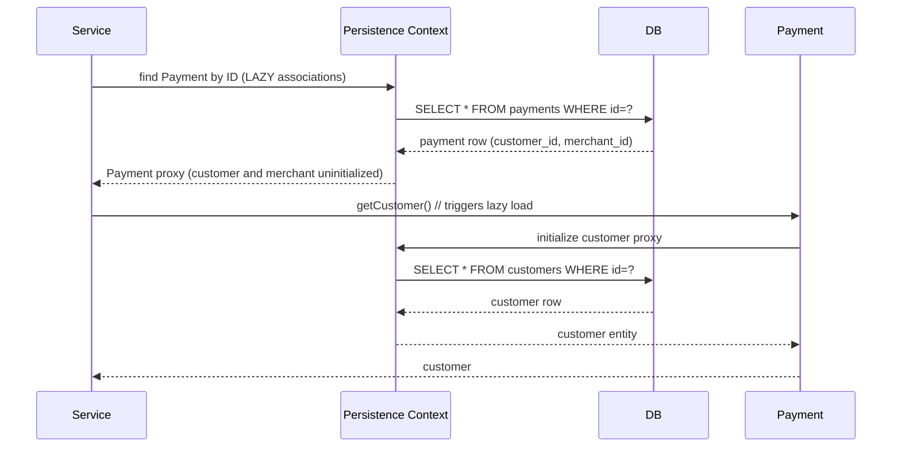

### 15. Common Mistakes
1. **Using `@ManyToMany` for order-product** – creates junction table that becomes write bottleneck. Use explicit `OrderLineItem` entity instead.
2. **Not setting `updatable=false` on immutable fields** – allows accidental updates.
3. **`FetchType.EAGER` on `@OneToMany`** – loads entire collection every time.
4. **Storing full address as flattened columns** – use `@Embedded` to keep domain clean.
5. **Inconsistent bidirectional management** – update both sides or use helper methods.
6. **Enum mapping with `ORDINAL`** – reordering breaks history. Always use `STRING`.

### 16. Decision Matrix: Relationship Fetch Strategies
| Fetch Type | Use Case                                   | Performance Impact                          |
|------------|--------------------------------------------|---------------------------------------------|
| LAZY       | Default for all associations               | Extra query when accessed; risk of N+1      |
| EAGER      | Small, always-needed relations (e.g., category) | Joins or extra selects; can cause Cartesian |
| JOIN FETCH | Explicit in JPQL when needed                | Single query with join; use sparingly       |
| EntityGraph| Declarative fetch plan, reusable            | Same as JOIN FETCH but more flexible        |

---

## Section 3: Spring Data Repositories, Queries & Transaction Propagation

### 1. What
**Spring Data repositories** provide a powerful abstraction over JPA, allowing derived queries, pagination, and custom JPQL/native queries. **Transaction propagation** defines how methods behave regarding transactions (REQUIRED, REQUIRES_NEW, etc.). **Rollback rules** determine which exceptions trigger rollback.

### 2. Why does it exist
To reduce boilerplate data access code and ensure data consistency across multiple operations. Without proper transaction boundaries, partial failures can corrupt data (e.g., payments settled but merchant balance not updated).

### 3. When to use it
- Every data access layer in a Spring application.
- Use derived queries for simple lookups; JPQL for complex but portable queries; native SQL for vendor-specific features.
- Use propagation `REQUIRES_NEW` for audit logs that must survive main transaction rollback.

### 4. Where to use it
- Repository interfaces extending `JpaRepository`.
- Service layer methods annotated with `@Transactional`.

### 5. How to implement (High-level)
1. Define repository interfaces with method signatures.
2. Write derived queries by naming convention or use `@Query`.
3. Annotate service methods with `@Transactional` and set propagation, rollbackFor.
4. Use `Pageable` for pagination.
5. For bulk updates, use `@Modifying` and ensure transaction.

### 6. Architecture Diagram
```mermaid
graph TD
    A[Controller] --> B[Service @Transactional]
    B --> C[Repository Interface]
    C --> D[Spring Data Proxy]
    D --> E[EntityManager]
    E --> F[Database]
    B --> G[AuditService @Transactional(propagation=REQUIRES_NEW)]
    G --> H[AuditRepository]
```

### 7. Scenario
The SecurePayment Gateway processes 500,000 transactions/day. The settlement job must atomically: (1) mark authorized payments as settled, (2) update merchant balance, (3) write a settlement record. During a network blip, the DB connection drops midway. Payments are marked settled but merchant balance is never updated—creating a ₹12 lakh discrepancy.

### 8. Goal
Build correct repositories, write efficient queries, and configure transaction propagation so that partial failures are impossible and rollback is atomic.

### 9. What Can Go Wrong (with broken code)
```java
// BROKEN: Multiple @Transactional methods called from non-transactional context
@Service
public class BrokenSettlementService {
    @Autowired private PaymentRepository paymentRepository;
    @Autowired private MerchantRepository merchantRepository;
    @Autowired private SettlementRepository settlementRepository;

    public void settleForMerchant(Long merchantId, LocalDate date) {
        markPaymentsSettled(merchantId, date); // Tx 1: commits independently
        updateMerchantBalance(merchantId, date); // Tx 2: may fail
        writeSettlementRecord(merchantId, date); // Tx 3: may not run
    }

    @Transactional
    public void markPaymentsSettled(Long merchantId, LocalDate date) { /* commits */ }

    @Transactional
    public void updateMerchantBalance(Long merchantId, LocalDate date) {
        throw new RuntimeException("DB connection lost");
    }

    @Transactional
    public void writeSettlementRecord(Long merchantId, LocalDate date) { /* ... */ }
}

// BROKEN: Using @Transactional(rollbackFor) incorrectly
@Service
public class BrokenPaymentCreator {
    @Transactional // default: only rolls back on RuntimeException and Error
    public void createPayment(PaymentRequest request) throws IOException {
        paymentRepository.save(mapToEntity(request));
        notificationService.sendConfirmation(request); // throws IOException (checked)
        // IOException is checked – transaction does NOT roll back!
    }
}
```

### 10. Why It Fails
- Default `@Transactional` propagation is `REQUIRED` – each method gets its own transaction if called from outside. Without a wrapping transaction, each commits independently.
- `@Transactional` by default rolls back only on `RuntimeException` and `Error`, not on checked exceptions like `IOException`.
- Self-invocation (`this.markPaymentsSettled()`) bypasses the proxy, so `@Transactional` on the called method has no effect.

### 11. Correct Approach
The outermost service method should own the transaction boundary. Sub-operations use `REQUIRED` to join. Use `rollbackFor` for checked exceptions. Use `REQUIRES_NEW` for audit logs.

### 12. Key Principles
- The outermost service method should own the transaction boundary.
- Always specify `rollbackFor` when methods throw checked exceptions that should trigger rollback.
- Use `REQUIRES_NEW` for audit logging – audit records must persist even if main transaction rolls back.
- Prefer `@Transactional(readOnly = true)` for query-only methods – skips dirty checking and hints at read replicas.
- Use pagination for all list APIs to avoid full-table scans.

### 13. Correct Implementation
```java
// PaymentRepository with various query types
@Repository
public interface PaymentRepository extends JpaRepository<Payment, Long> {
    // Derived query
    List<Payment> findByCustomerId(Long customerId);

    // Pagination
    Page<Payment> findByCustomerIdOrderByCreatedAtDesc(Long customerId, Pageable pageable);

    // JPQL
    @Query("SELECT p FROM Payment p WHERE p.merchant.id = :merchantId AND p.status = :status")
    List<Payment> findByMerchantAndStatus(@Param("merchantId") Long merchantId,
                                          @Param("status") PaymentStatus status);

    // JPQL with JOIN FETCH
    @Query("SELECT p FROM Payment p JOIN FETCH p.customer WHERE p.id IN :ids")
    List<Payment> findByIdsWithCustomer(@Param("ids") List<Long> ids);

    // Bulk update
    @Modifying(clearAutomatically = true)
    @Query("UPDATE Payment p SET p.status = :newStatus WHERE p.status = :oldStatus")
    int bulkUpdateStatus(@Param("oldStatus") PaymentStatus oldStatus,
                         @Param("newStatus") PaymentStatus newStatus);
}

// SettlementService with correct transaction boundary
@Service
@RequiredArgsConstructor
public class SettlementService {
    private final PaymentRepository paymentRepository;
    private final MerchantRepository merchantRepository;
    private final SettlementRepository settlementRepository;
    private final AuditLogService auditLogService;

    @Transactional(rollbackFor = Exception.class)
    public void settleForMerchant(Long merchantId, LocalDate settleDate) {
        log.info("Starting settlement for merchant={} date={}", merchantId, settleDate);
        Instant dayStart = settleDate.atStartOfDay().toInstant(ZoneOffset.UTC);
        Instant dayEnd = dayStart.plusSeconds(86400);

        // Step 1: Bulk-update authorized payments to settled
        int updated = paymentRepository.bulkUpdateStatus(
            PaymentStatus.AUTHORIZED, PaymentStatus.SETTLED);

        // Step 2: Calculate and update merchant balance (all in same transaction)
        BigDecimal settlementAmount = calculateSettlementAmount(merchantId, dayStart, dayEnd);
        merchantRepository.incrementBalance(merchantId, settlementAmount);

        // Step 3: Write settlement record
        Settlement settlement = new Settlement(merchantId, settleDate, settlementAmount, updated);
        settlementRepository.save(settlement);

        // Step 4: Audit log – uses REQUIRES_NEW so it commits independently
        auditLogService.logSettlementAttempt(merchantId, settleDate, settlementAmount);
    }

    private BigDecimal calculateSettlementAmount(Long merchantId, Instant from, Instant to) {
        return paymentRepository.findByMerchantAndStatus(merchantId, PaymentStatus.SETTLED)
            .stream().map(p -> p.getAmount().getValue())
            .reduce(BigDecimal.ZERO, BigDecimal::add);
    }
}

// AuditLogService with REQUIRES_NEW
@Service
public class AuditLogService {
    @Transactional(propagation = Propagation.REQUIRES_NEW)
    public void logSettlementAttempt(Long merchantId, LocalDate date, BigDecimal amount) {
        AuditRecord record = new AuditRecord("SETTLEMENT_ATTEMPT", merchantId, date, amount, Instant.now());
        auditRepository.save(record);
    }
}
```

### 14. Execution Flow (Transaction Propagation)
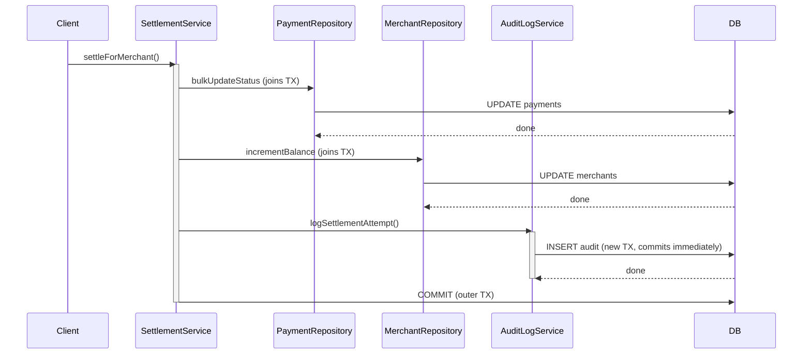

### 15. Common Mistakes
1. **`@Transactional` on private methods** – ignored. Use public/protected.
2. **Calling `@Transactional` methods within the same class** – bypasses proxy. Extract to separate bean or use self-injection.
3. **`@Modifying` without `@Transactional`** – throws exception.
4. **Not using `clearAutomatically=true` on bulk updates** – PC stale after update.
5. **`findAll()` without pagination** – OOM in production.
6. **`spring.jpa.open-in-view=true`** – keeps session open during view rendering, masking N+1 issues. Set to `false`.

### 16. Decision Matrix: Transaction Propagation
| Propagation  | Behavior                                      | Use Case                                  |
|--------------|-----------------------------------------------|-------------------------------------------|
| REQUIRED     | Join existing or create new                   | Default for service methods               |
| REQUIRES_NEW | Always create new, suspend outer              | Audit logging, independent operations     |
| NESTED       | Savepoint within existing transaction         | Partial rollback (e.g., batch with skip)  |
| MANDATORY    | Must exist, else throw                        | Repository helpers                        |
| NEVER        | Must NOT exist, else throw                    | Read-only reporting                       |

---

## Section 4: N+1 Problem, Fetch Joins, Batch Inserts & Locking Overview

### 1. What
**N+1 problem**: When you execute one query to fetch N parent entities, and then for each parent you execute an additional query to fetch its lazy association, resulting in N+1 total queries.  
**Fetch joins** are JPQL clauses (`JOIN FETCH`) that load associations in the same query.  
**Batch inserts** combine multiple INSERT statements into one round-trip to improve performance.  
**Locking overview**: Optimistic and pessimistic strategies to handle concurrent modifications.

### 2. Why does it exist
N+1 arises from naive use of lazy loading inside loops. Without proper batching, database round-trips explode. Batch inserts are necessary to handle bulk ingestion efficiently.

### 3. When to use it
- Use `JOIN FETCH` when you need associated data for all parent entities in a read operation.
- Use batch inserts for any bulk write (import, settlement batch).
- Use locking when multiple transactions may update the same data.

### 4. Where to use it
- Repository layer for queries and batch inserts.
- Service layer for transaction management.

### 5. How to implement (High-level)
- Detect N+1 via SQL logging; fix with `JOIN FETCH` or `@EntityGraph`.
- Enable JDBC batching via properties: `hibernate.jdbc.batch_size`, `order_inserts`.
- For large imports, manually flush and clear PC periodically.

### 6. Architecture Diagram (N+1 vs Fetch Join)
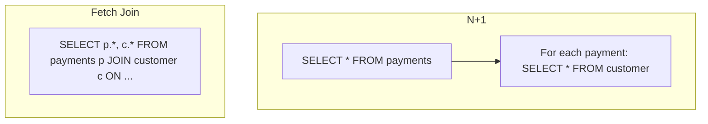

### 7. Scenario
The SecurePayment Gateway's transaction history API is performing adequately for individual customers. But a new "merchant dashboard" loads all transactions per day with customer names. The first production deployment with 200 concurrent merchant users saturates the database with 18,000 queries per second – latency jumps from 45ms to 4.2 seconds, DB CPU hits 100%.

### 8. Goal
Eliminate N+1, implement batch inserts for bulk operations, and understand locking strategies (detailed in Section 6).

### 9. What Can Go Wrong (with broken code)
```java
// BROKEN: Classic N+1
@Service
public class BrokenMerchantDashboardService {
    @Autowired private PaymentRepository paymentRepository;

    @Transactional(readOnly = true)
    public List<MerchantTransactionView> getDashboard(Long merchantId) {
        List<Payment> payments = paymentRepository.findAllByMerchantIdAndStatus(merchantId, PaymentStatus.SETTLED);
        return payments.stream().map(p -> {
            Customer c = p.getCustomer(); // LAZY load triggers per payment!
            return new MerchantTransactionView(p.getId(), c.getEmail(), c.getFullName(), p.getAmount());
        }).toList();
    }
}

// BROKEN: Bulk insert via loop
@Service
public class BrokenPaymentImporter {
    @Autowired private PaymentRepository repo;

    @Transactional
    public void importPayments(List<Payment> payments) {
        for (Payment p : payments) {
            repo.save(p); // N individual INSERTS
        }
    }
}
```

### 10. Why It Fails
- Each `p.getCustomer()` triggers a separate SELECT. With 1000 payments, that's 1001 queries.
- Individual `save()` calls issue one INSERT per record, causing N round-trips.
- Without batching, network latency and DB parsing overhead dominate.

### 11. Correct Approach
- Use `JOIN FETCH` or `@EntityGraph` to load associations in one query.
- For collections, use `@BatchSize` to fetch in batches.
- Enable JDBC batching and use `GenerationType.SEQUENCE` (not IDENTITY).
- For bulk imports, manually flush and clear PC every batch.

### 12. Key Principles
- Never call association getters inside loops – this hides N+1.
- `JOIN FETCH` eliminates N+1 but can cause Cartesian products with multiple collections – use separate queries or `@BatchSize`.
- For bulk inserts, set `hibernate.jdbc.batch_size` and `order_inserts=true`.
- IDENTITY generation disables batching – switch to SEQUENCE with allocationSize = batch size.

### 13. Correct Implementation
```java
// Repository with JOIN FETCH
@Repository
public interface PaymentRepository extends JpaRepository<Payment, Long> {
    @Query("SELECT p FROM Payment p JOIN FETCH p.customer WHERE p.merchant.id = :merchantId AND p.status = :status")
    List<Payment> findWithCustomerByMerchantAndStatus(@Param("merchantId") Long merchantId,
                                                      @Param("status") PaymentStatus status);

    // For pagination with fetch, use EntityGraph to avoid HHH90003004
    @EntityGraph(attributePaths = {"customer", "merchant"})
    Page<Payment> findByMerchantIdAndStatus(Long merchantId, PaymentStatus status, Pageable pageable);
}

// Service using fetch join
@Service
@RequiredArgsConstructor
public class MerchantDashboardService {
    private final PaymentRepository paymentRepository;

    @Transactional(readOnly = true)
    public List<MerchantTransactionView> getDashboard(Long merchantId) {
        List<Payment> payments = paymentRepository.findWithCustomerByMerchantAndStatus(merchantId, PaymentStatus.SETTLED);
        return payments.stream()
            .map(p -> new MerchantTransactionView(p.getId(), p.getCustomer().getEmail(),
                  p.getCustomer().getFullName(), p.getAmount()))
            .toList();
    }
}

// Batch insert configuration and implementation
// application.yml
spring:
  jpa:
    properties:
      hibernate:
        jdbc:
          batch_size: 50
        order_inserts: true
        order_updates: true
        generate_statistics: true

// Entity using SEQUENCE for batching
@Entity
public class Payment {
    @Id
    @GeneratedValue(strategy = GenerationType.SEQUENCE, generator = "payment_seq")
    @SequenceGenerator(name = "payment_seq", sequenceName = "payment_id_seq", allocationSize = 50)
    private Long id;
    // ...
}

// Bulk importer with manual flush/clear
@Service
@RequiredArgsConstructor
public class BulkPaymentImporter {
    private static final int BATCH_SIZE = 50;
    @PersistenceContext private final EntityManager em;

    @Transactional
    public int importPayments(List<Payment> payments) {
        int count = 0;
        for (Payment payment : payments) {
            em.persist(payment);
            count++;
            if (count % BATCH_SIZE == 0) {
                em.flush();
                em.clear();
            }
        }
        em.flush();
        em.clear();
        return count;
    }
}
```

### 14. Execution Flow (Batch Insert)
```mermaid
sequenceDiagram
    participant Service
    participant PC as Persistence Context
    participant DB

    loop for each payment in chunk
        Service->>PC: persist(payment)
    end
    Service->>PC: flush()
    PC->>DB: INSERT ... ; INSERT ... ; (batch of 50)
    DB-->>PC: generated IDs
    Service->>PC: clear()
    PC-->>PC: detach all entities
    Note over Service,DB: Repeat for next chunk
```

### 15. Common Mistakes
1. **Using `JOIN FETCH` with pagination** – Hibernate loads all rows into memory. Use `@EntityGraph` or a separate count query with `@BatchSize`.
2. **Multiple `JOIN FETCH` on collections** – Cartesian product explosion. Use `@BatchSize` or separate queries.
3. **`GenerationType.IDENTITY` with batch inserts** – silently disables batching. Switch to SEQUENCE.
4. **Forgetting `em.clear()` after `em.flush()`** – PC accumulates all entities, causing OOM.
5. **`@BatchSize` too large** – memory pressure. Start at 50, benchmark.
6. **No statistics monitoring** – you can’t diagnose N+1 in production without counting queries. Enable Hibernate statistics.

### 16. Decision Matrix: N+1 Fixes
| Solution               | Pros                                      | Cons                                      |
|------------------------|-------------------------------------------|-------------------------------------------|
| JOIN FETCH             | Single query, simple                      | Can cause Cartesian with multiple collections |
| @EntityGraph           | Declarative, reusable                     | Same join issues                          |
| @BatchSize             | Batches lazy loads, no query explosion    | Still N/ batch-size queries               |
| DTO Projection         | Minimal data, no entity overhead           | No automatic dirty checking                |

---

## Section 5: Index Strategy, Execution Plans & Query Optimization

### 1. What
**Indexes** are database structures that speed up data retrieval at the cost of write overhead.  
**Execution plans** show how the database executes a query (seq scan vs index scan).  
**Query optimization** involves writing queries and designing indexes to minimize latency.

### 2. Why does it exist
Without proper indexes, queries on large tables become full table scans, causing performance degradation and outages. Understanding execution plans helps diagnose and fix slow queries.

### 3. When to use it
- Index columns used in `WHERE`, `JOIN`, `ORDER BY`, `GROUP BY`.
- Create composite indexes for queries with multiple filters.
- Use covering indexes when queries need only a subset of columns.
- Analyze slow queries in production and tune indexes.

### 4. Where to use it
- Database schema design (DDL).
- Query writing (JPQL/native) – must be index-friendly.

### 5. How to implement (High-level)
1. Identify frequent query patterns from logs.
2. Create indexes on foreign keys and filter columns.
3. For composite indexes, put equality columns first, then range columns.
4. Use `EXPLAIN ANALYZE` to verify index usage.
5. Consider covering indexes (include columns) for critical queries.

### 6. Architecture Diagram (B-Tree Index)
```mermaid
graph TD
    Root[Root Page] --> Leaf1[Leaf: (1, 'Alice')]
    Root --> Leaf2[Leaf: (50, 'Bob')]
    Root --> Leaf3[Leaf: (100, 'Charlie')]
    Leaf1 --> TableRow1[Heap Row id=1]
    Leaf2 --> TableRow2[Heap Row id=50]
    Leaf3 --> TableRow3[Heap Row id=100]
```

### 7. Scenario
SecurePayment Gateway's transaction search allows staff to query by `merchantId`, `status`, `customerId`, and date range. Queries run in 8ms in dev (10K rows). After 6 months in production (18M rows), same queries take 12 seconds. `EXPLAIN` shows full table scans. A scheduled end-of-day report causes CPU spike and DB failover.

### 8. Goal
Design correct indexes for the `payments` table, interpret execution plans, and write queries that leverage indexes.

### 9. What Can Go Wrong (with broken code)
```sql
-- BROKEN: No index on filtering columns
CREATE TABLE payments (
    id BIGINT PRIMARY KEY,
    customer_id BIGINT NOT NULL,
    merchant_id BIGINT NOT NULL,
    status VARCHAR(30) NOT NULL,
    amount DECIMAL(19,4),
    created_at TIMESTAMP NOT NULL
); -- No indexes except PK → every WHERE clause is a full scan

SELECT * FROM payments WHERE merchant_id = 5 AND status = 'AUTHORIZED' ORDER BY created_at DESC;
-- EXPLAIN: Seq Scan on payments (cost=0.00..450000.00 rows=18000000)
```

### 10. Why It Fails
- No index on `merchant_id`, `status`, `created_at` forces sequential scan of all 18M rows.
- Even with indexes, if the index order doesn't match the query, it may not be used.
- `SELECT *` prevents covering index usage, always requiring heap fetches.

### 11. Correct Approach
- Create indexes on foreign keys and filter columns.
- For common query patterns, create composite indexes with equality columns first.
- Use covering indexes to avoid heap fetches.
- Use `EXPLAIN ANALYZE` to validate.

### 12. Key Principles
- **Left-to-right rule**: composite index `(a, b, c)` works for `a`, `a AND b`, `a AND b AND c`, but not `b` alone.
- **Equality before range**: put `=` columns before `BETWEEN`/`<`/`>`.
- **Covering index**: includes all columns needed for query, allowing index-only scan.
- **Cardinality**: index high-cardinality columns first.

### 13. Correct Implementation
```sql
-- Index 1: Single-column on customer_id (FK)
CREATE INDEX idx_payments_customer_id ON payments (customer_id);

-- Index 2: Composite for settlement queries
CREATE INDEX idx_payments_merchant_status_created ON payments (merchant_id, status, created_at DESC);

-- Index 3: Covering index for settlement amount query (PostgreSQL)
CREATE INDEX idx_payments_settlement_covering ON payments (merchant_id, status, created_at)
    INCLUDE (id, amount, currency);

-- Index 4: Partial index for pending payments only
CREATE INDEX idx_payments_pending ON payments (customer_id, created_at) WHERE status = 'PENDING';

-- Verify with EXPLAIN ANALYZE
EXPLAIN ANALYZE
SELECT p.id, p.amount, p.currency
FROM payments p
WHERE p.merchant_id = 5
  AND p.status = 'AUTHORIZED'
  AND p.created_at BETWEEN '2024-01-01' AND '2024-01-31'
ORDER BY p.created_at DESC;
-- Expected: Index Only Scan using covering index, no heap fetches
```

```java
// JPA entity with index declarations
@Entity
@Table(name = "payments", indexes = {
    @Index(name = "idx_payments_customer_id", columnList = "customer_id"),
    @Index(name = "idx_payments_merchant_status_created", columnList = "merchant_id, status, created_at DESC")
})
public class Payment { ... }

// Repository with projection for covering index
public interface PaymentRepository extends JpaRepository<Payment, Long> {
    @Query("SELECT new com.securepayment.payment.dto.SettlementItem(p.id, p.amount.value, p.amount.currency) " +
           "FROM Payment p WHERE p.merchant.id = :merchantId AND p.status = :status " +
           "AND p.createdAt BETWEEN :from AND :to ORDER BY p.createdAt DESC")
    List<SettlementItem> findSettlementItems(...);
}
```

### 14. Execution Flow (Index Scan)
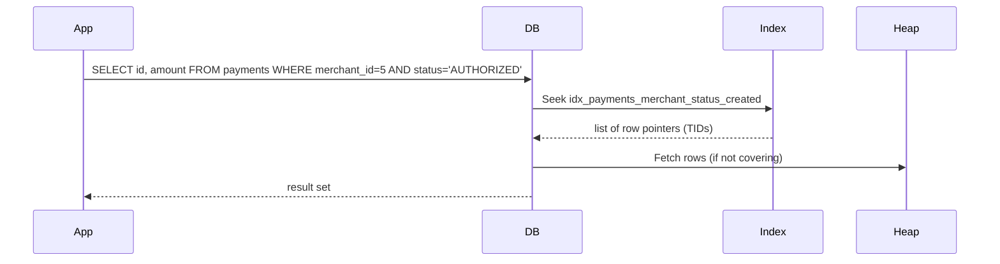

### 15. Common Mistakes
1. **Index on low-cardinality column alone** – e.g., `status` (5 values) on 10M rows may be slower due to random heap access.
2. **Implicit type casts** – `WHERE CAST(created_at AS DATE) = '2024-01-15'` prevents index use. Use range queries.
3. **Function on indexed column** – `WHERE LOWER(email) = ?` cannot use index. Use functional index.
4. **Stale statistics** – after bulk inserts, run `ANALYZE`.
5. **Too many indexes on write-heavy tables** – each INSERT must update all indexes. Limit to essential.
6. **Using `LIKE '%keyword'`** – leading wildcard prevents index use.

### 16. Decision Matrix: Index Types
| Index Type     | Use Case                                      | Pros                                      | Cons                                      |
|----------------|-----------------------------------------------|-------------------------------------------|-------------------------------------------|
| B-Tree         | Equality, range, sorting                      | Universal, supports many queries          | Can be large, not good for full-text      |
| Covering       | Query only needs few columns                  | Index-only scans, fastest                  | Increases index size, not for all queries |
| Partial        | Subset of rows (e.g., pending payments)       | Smaller index, faster writes               | Only useful for specific queries           |
| Functional     | Queries using functions (LOWER, date_trunc)   | Enables index usage on expressions         | Requires extra maintenance                 |

---

## Section 6: Concurrency Control: Locking, Lost Updates & Deadlocks

### 1. What
**Optimistic locking** assumes conflicts are rare; it checks at commit time that the data hasn't changed (using a version column).  
**Pessimistic locking** locks rows during the transaction (`SELECT FOR UPDATE`) to prevent others from modifying.  
**Lost updates** occur when two transactions read the same data, modify it, and the second overwrites the first.  
**Deadlocks** happen when two transactions hold locks the other needs, causing a cycle.

### 2. Why does it exist
Without concurrency control, concurrent transactions can corrupt data (e.g., double-spend). Locking strategies provide consistency while balancing throughput.

### 3. When to use it
- Use optimistic locking as default for most entities.
- Use pessimistic locking for high-contention resources (e.g., wallet balance updates) or when retries are unacceptable.
- Use ordered lock acquisition to prevent deadlocks.

### 4. Where to use it
- Entity level with `@Version`.
- Repository level with `@Lock` annotations.
- Service level with retry logic.

### 5. How to implement (High-level)
- Add `@Version` field (Long) to entities.
- For optimistic: handle `OptimisticLockException` with retry.
- For pessimistic: use `@Lock(LockModeType.PESSIMISTIC_WRITE)`.
- For deadlock prevention: acquire locks in consistent order.
- Use idempotency keys to prevent duplicate operations.

### 6. Architecture Diagram (Optimistic vs Pessimistic)
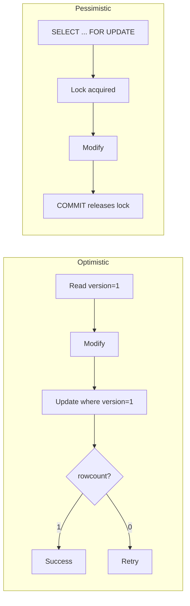

### 7. Scenario
Two mobile users simultaneously tap "Pay" for the same wallet. Balance is 1000. Both requests check balance, find it sufficient, and deduct 1000 – wallet ends at -1000 (double-spend). In another incident, settlement job locks wallet rows while a refund job locks payment rows, then each tries to acquire the other's lock – deadlock.

### 8. Goal
Prevent lost updates using `@Version`, handle deadlocks with retries, and implement idempotency.

### 9. What Can Go Wrong (with broken code)
```java
// BROKEN: Check-then-act – race condition
@Service
public class BrokenWalletDebitService {
    @Autowired private WalletRepository walletRepository;

    @Transactional
    public void debit(Long walletId, BigDecimal amount) {
        Wallet wallet = walletRepository.findById(walletId).orElseThrow();
        if (wallet.getBalance().compareTo(amount) < 0) {
            throw new InsufficientFundsException();
        }
        // Race window: another thread can pass check at same time
        wallet.setBalance(wallet.getBalance().subtract(amount)); // both commit – lost update
    }
}

// BROKEN: Incorrect lock ordering causing deadlock
@Service
public class BrokenTransferService {
    @Transactional
    public void transfer(Long fromId, Long toId, BigDecimal amount) {
        Wallet from = walletRepository.findById(fromId).orElseThrow();
        Wallet to = walletRepository.findById(toId).orElseThrow();
        from.setBalance(from.getBalance().subtract(amount));
        to.setBalance(to.getBalance().add(amount));
    }
}
```

### 10. Why It Fails
- Without `@Version`, Hibernate uses "last write wins" – the second commit overwrites the first.
- No locking: both transactions see balance=1000, both proceed.
- Deadlock arises from acquiring locks in different order (thread A locks from then to; thread B locks to then from).

### 11. Correct Approach
- Add `@Version` to entities for optimistic locking.
- Use `@Retryable` to retry on `OptimisticLockException`.
- For pessimistic locking, use `@Lock` and order acquisitions.
- Use idempotency keys with unique constraints to prevent duplicate processing.

### 12. Key Principles
- Optimistic locking is non-blocking; suitable for low-to-moderate contention.
- `@Version` field must be numeric (Long/Integer); Hibernate checks on update.
- Pessimistic locking (`SELECT FOR UPDATE`) blocks others; use sparingly.
- Always acquire locks in a consistent order to avoid deadlocks.
- Retry transient exceptions with exponential backoff.

### 13. Correct Implementation
```java
// Wallet entity with @Version
@Entity
public class Wallet {
    @Id @GeneratedValue(...) private Long id;
    private BigDecimal balance;
    @Version private Long version;
    // ...
}

// Service with optimistic locking and retry
@Service
@RequiredArgsConstructor
public class WalletDebitService {
    private final WalletRepository walletRepository;

    @Retryable(retryFor = ObjectOptimisticLockingFailureException.class,
               maxAttempts = 3,
               backoff = @Backoff(delay = 100, multiplier = 2))
    @Transactional
    public void debit(Long walletId, BigDecimal amount, String idempotencyKey) {
        // Check idempotency first (using separate table with unique constraint)
        if (idempotencyService.alreadyProcessed(idempotencyKey)) {
            return;
        }
        Wallet wallet = walletRepository.findById(walletId).orElseThrow();
        if (wallet.getBalance().compareTo(amount) < 0) {
            throw new InsufficientFundsException();
        }
        wallet.setBalance(wallet.getBalance().subtract(amount));
        // At commit, version check happens
        idempotencyService.record(idempotencyKey); // REQUIRES_NEW
    }
}

// Pessimistic locking repository method
@Repository
public interface WalletRepository extends JpaRepository<Wallet, Long> {
    @Lock(LockModeType.PESSIMISTIC_WRITE)
    @Query("SELECT w FROM Wallet w WHERE w.id = :id")
    Optional<Wallet> findByIdWithWriteLock(@Param("id") Long id);
}

// Deadlock prevention via ordered lock acquisition
@Service
public class FundTransferService {
    @Transactional
    public void transfer(Long fromId, Long toId, BigDecimal amount) {
        // Always lock in ascending ID order
        Long firstId = Math.min(fromId, toId);
        Long secondId = Math.max(fromId, toId);
        Wallet first = walletRepository.findByIdWithWriteLock(firstId).orElseThrow();
        Wallet second = walletRepository.findByIdWithWriteLock(secondId).orElseThrow();

        Wallet from = first.getId().equals(fromId) ? first : second;
        Wallet to = first.getId().equals(toId) ? first : second;

        from.setBalance(from.getBalance().subtract(amount));
        to.setBalance(to.getBalance().add(amount));
    }
}
```

### 14. Execution Flow (Optimistic Lock Retry)
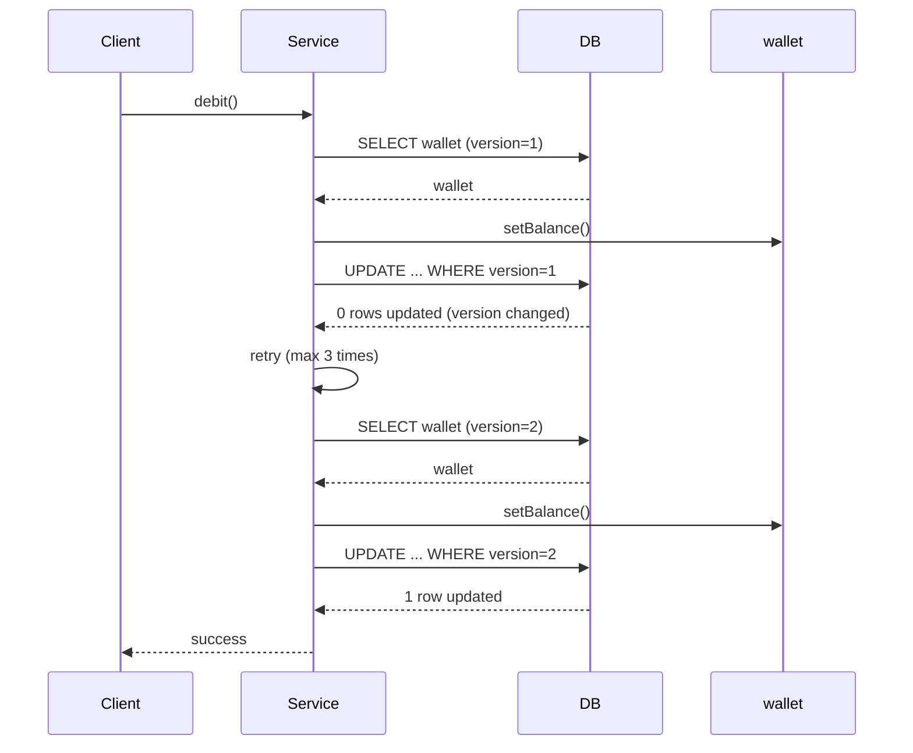

### 15. Common Mistakes
1. **`@Version` field not Long/Integer** – Timestamp may have resolution issues. Use Long.
2. **Retrying inside same transaction** – `@Retryable` must be on method that creates new transaction per attempt. Separate bean or use `REQUIRES_NEW`.
3. **Not handling `OptimisticLockException` at API boundary** – map to HTTP 409 Conflict.
4. **Pessimistic lock with long transactions** – holding lock while doing external calls blocks others. Move external calls outside.
5. **No idempotency key on debit operations** – network retries cause duplicate charges.
6. **Deadlock detection only at DB level** – application must catch and retry the killed transaction.

### 16. Decision Matrix: Locking Strategies
| Strategy        | Throughput | Complexity | Use Case                                      |
|-----------------|------------|------------|-----------------------------------------------|
| Optimistic      | High       | Low        | Low contention, version field                 |
| Pessimistic     | Low        | Medium     | High contention, zero tolerance for retries   |
| No locking      | Highest    | None       | Read-only or single-threaded (never in prod)  |
| Ordered locks   | Medium     | Medium     | Prevent deadlocks in transfers                |

---

## Section 7: JDBC vs JPA vs NoSQL: Persistence Strategy per Workload

### 1. What
**JDBC** is the low-level Java API for SQL databases.  
**JPA** is an ORM that maps objects to relational tables.  
**NoSQL** includes document stores (MongoDB), key-value stores (Redis), wide-column (Cassandra).  
**CAP theorem** states that a distributed data store can only provide two of: Consistency, Availability, Partition tolerance.

### 2. Why does it exist
Different workloads have different requirements: OLTP needs ACID, analytics needs scan throughput, caching needs low latency. No single persistence technology fits all.

### 3. When to use it
- Use JPA for standard CRUD with complex object graphs.
- Use JDBC for bulk operations, reporting, where ORM overhead is harmful.
- Use Redis for caching, rate limiting, session store.
- Use Cassandra for high-scale write-heavy workloads with eventual consistency.

### 4. Where to use it
- JPA in service layer for core business logic.
- JDBC in reporting/reconciliation services.
- Redis in edge/service layer for fast access.
- Document stores for audit logs (append-only).

### 5. How to implement (High-level)
- For JDBC: use `JdbcTemplate` with `RowMapper`.
- For Redis: use `StringRedisTemplate`.
- For MongoDB: use `MongoTemplate` or Spring Data MongoDB.
- Choose based on CAP requirements.

### 6. Architecture Diagram (Persistence Layer)
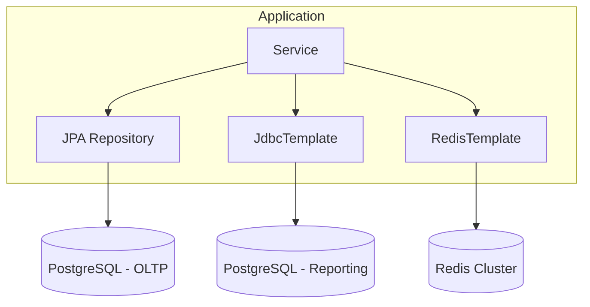

### 7. Scenario
The reconciliation service needs to read CSV dumps from banks, compare with internal records, and write discrepancies. Initially, the team uses Hibernate but finds ORM abstraction fights them: they need bulk reads, exact SQL control, and batch writes. Separate team evaluates Redis vs Cassandra for session tokens and rate limiting.

### 8. Goal
Understand when to use JDBC directly, build a reconciliation service with `JdbcTemplate`, understand CAP trade-offs, and select correct store per workload.

### 9. What Can Go Wrong (with broken code)
```java
// BROKEN: Using JPA for reconciliation – loads all entities into memory
@Service
public class BrokenReconciliationService {
    @Autowired private PaymentRepository paymentRepository;

    public ReconciliationReport reconcile(List<BankRecord> bankRecords) {
        List<Payment> allPayments = paymentRepository.findAll(); // OOM for millions
        // Linear search O(N^2)
        for (BankRecord bankRecord : bankRecords) {
            Optional<Payment> match = allPayments.stream()
                .filter(p -> p.getId().equals(bankRecord.getPaymentId()))
                .findFirst();
            // ...
        }
    }
}
```

### 10. Why It Fails
- `findAll()` loads all JPA entities into memory with full object overhead – huge memory consumption.
- ORM is designed for object lifecycle management, not bulk processing.
- Reconciliation is set-based and better expressed in SQL.

### 11. Correct Approach
- Use `JdbcTemplate` for bulk reads with streaming.
- Use `RowMapper` to map rows to simple DTOs.
- For writes, use batch updates.
- For cross-store consistency, consider Outbox pattern.

### 12. Key Principles
- Payment financial records require CP (Consistency + Partition tolerance) – use PostgreSQL with synchronous replication.
- Session state can tolerate AP (Availability) – use Redis.
- Audit logs are append-only – use immutable store.
- Use the right tool for the workload: ORM for object manipulation, JDBC for set operations.

### 13. Correct Implementation
```java
// Reconciliation service using JdbcTemplate
@Service
public class ReconciliationService {
    private final JdbcTemplate jdbcTemplate;

    public ReconciliationService(JdbcTemplate jdbcTemplate) {
        this.jdbcTemplate = jdbcTemplate;
    }

    private static final RowMapper<PaymentSummary> PAYMENT_SUMMARY_MAPPER = (rs, rowNum) ->
        new PaymentSummary(rs.getLong("id"), rs.getBigDecimal("amount"),
                           rs.getString("currency"), rs.getString("status"),
                           rs.getTimestamp("created_at").toInstant());

    @Transactional(readOnly = true)
    public ReconciliationReport reconcile(List<BankRecord> bankRecords, Instant from, Instant to) {
        String sql = """
            SELECT id, amount, currency, status, created_at
            FROM payments
            WHERE created_at BETWEEN ? AND ?
            AND status IN ('SETTLED', 'FAILED')
            ORDER BY id
            """;
        List<PaymentSummary> internalPayments = jdbcTemplate.query(sql, PAYMENT_SUMMARY_MAPPER,
                Timestamp.from(from), Timestamp.from(to));

        Map<Long, PaymentSummary> internalMap = internalPayments.stream()
                .collect(Collectors.toMap(PaymentSummary::getId, p -> p));

        ReconciliationReport report = new ReconciliationReport(from, to);
        for (BankRecord bankRecord : bankRecords) {
            PaymentSummary internal = internalMap.get(bankRecord.getPaymentId());
            // compare and add discrepancies
        }

        if (!report.getDiscrepancies().isEmpty()) {
            writeDiscrepancies(report.getDiscrepancies());
        }
        return report;
    }

    @Transactional
    public void writeDiscrepancies(List<Discrepancy> discrepancies) {
        String insertSql = "INSERT INTO reconciliation_discrepancies (...) VALUES (?, ?, ?, ?, ?)";
        jdbcTemplate.batchUpdate(insertSql, discrepancies, 50,
            (ps, discrepancy) -> {
                ps.setLong(1, discrepancy.getPaymentId());
                // ...
            });
    }

    // Streaming for very large datasets
    @Transactional(readOnly = true)
    public void streamPaymentsForExport(Instant from, Instant to,
                                        Consumer<PaymentSummary> consumer) {
        String sql = "SELECT id, amount, currency, status, created_at FROM payments WHERE created_at BETWEEN ? AND ?";
        jdbcTemplate.query(
            con -> {
                PreparedStatement ps = con.prepareStatement(sql,
                        ResultSet.TYPE_FORWARD_ONLY, ResultSet.CONCUR_READ_ONLY);
                ps.setFetchSize(1000);
                ps.setTimestamp(1, Timestamp.from(from));
                ps.setTimestamp(2, Timestamp.from(to));
                return ps;
            },
            rs -> {
                PaymentSummary summary = PAYMENT_SUMMARY_MAPPER.mapRow(rs, 0);
                consumer.accept(summary);
            }
        );
    }
}

// Redis for rate limiting
@Service
public class RateLimitService {
    private final StringRedisTemplate redis;

    public boolean isAllowed(String customerId) {
        String key = "rate_limit:" + customerId + ":" + (System.currentTimeMillis() / 60_000);
        Long count = redis.opsForValue().increment(key);
        if (count == 1) {
            redis.expire(key, Duration.ofMinutes(2));
        }
        return count <= 60;
    }
}
```

### 14. Execution Flow (JDBC Streaming)
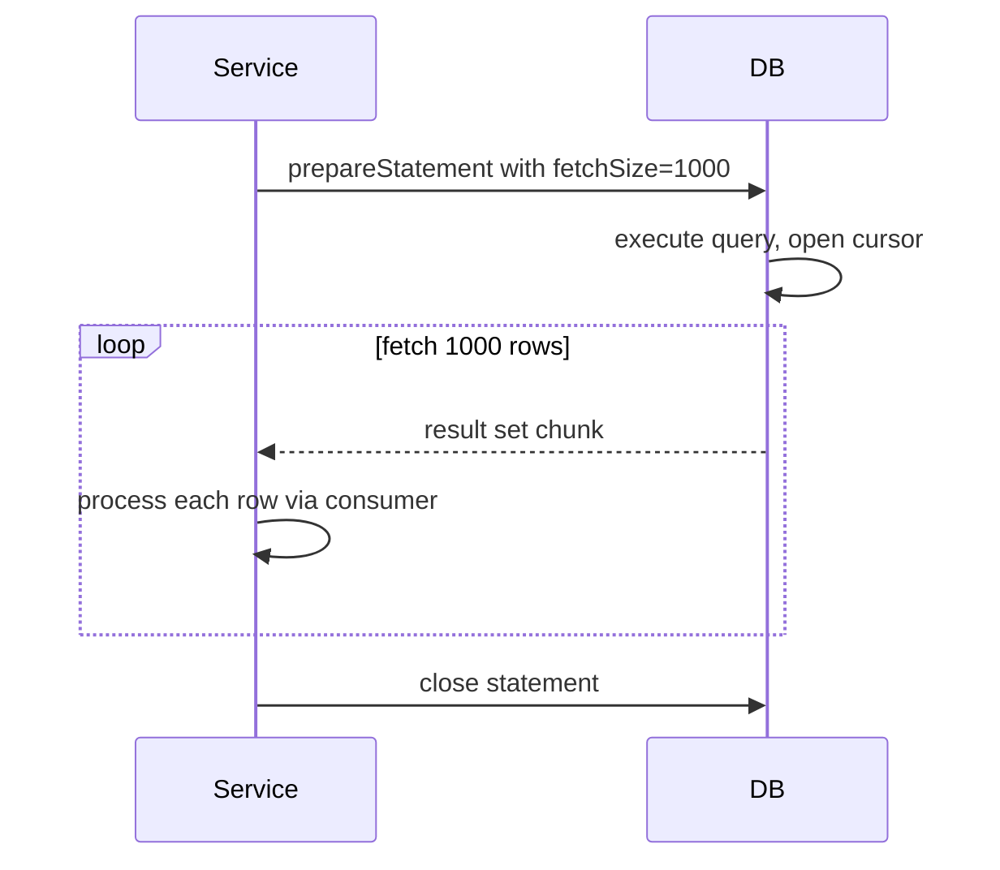

### 15. Common Mistakes
1. **Using JPA for bulk analytics** – loads entire result set into memory. Use JDBC or projections.
2. **Redis without TTL** – sessions accumulate indefinitely. Always set TTL.
3. **Cassandra with `ALLOW FILTERING`** – full table scan. Design tables around queries.
4. **Not using connection pool for JDBC** – every call should use pooled `DataSource`.
5. **Mixing JdbcTemplate and JPA in same transaction** – JPA PC doesn't see JDBC updates. Use one or call `em.clear()`.
6. **Relying on eventual consistency for financial records** – payment balances require strong consistency (CP).

### 16. Decision Matrix: Persistence Technologies
| Technology | Strengths                                  | Weaknesses                                 | Typical Workload                     |
|------------|--------------------------------------------|--------------------------------------------|--------------------------------------|
| JPA        | Object mapping, productivity                | Overhead for bulk, complex for reporting   | OLTP, CRUD with relationships        |
| JDBC       | Full control, fast bulk ops                  | Boilerplate, no automatic mapping           | Reporting, ETL, batch                |
| Redis      | Ultra-low latency, atomic ops                | Memory-bound, no complex queries            | Caching, rate limiting, sessions     |
| MongoDB    | Schema flexibility, horizontal scaling       | Eventual consistency (default), joins weak  | Audit logs, catalogs                  |
| Cassandra  | High write throughput, linear scalability    | Query rigidity, no ACID transactions        | Event logging, time-series            |

---

## Section 8: ETL & Data Integration: Payment Data Pipelines

### 1. What
**ETL (Extract, Transform, Load)** is a process that extracts data from source systems, transforms it (cleansing, enrichment), and loads it into a target system (e.g., data warehouse). **Spring Batch** is a framework for building robust batch applications.

### 2. Why does it exist
Payment systems need to move data from OLTP to reporting/analytics stores for settlement, fraud analysis, and reconciliation. Doing this manually is error-prone and non-restartable.

### 3. When to use it
- End-of-day settlement jobs.
- Data migration between systems.
- Reconciliation of bank files with internal records.
- Building aggregated reporting tables.

### 4. Where to use it
- Batch processing layer, often separate from OLTP.

### 5. How to implement (High-level)
1. Define `Job`, `Step`, `ItemReader`, `ItemProcessor`, `ItemWriter`.
2. Configure chunk size and fault tolerance.
3. Use `JdbcCursorItemReader` for streaming reads.
4. Use `JdbcBatchItemWriter` for efficient writes.
5. Add skip/retry policies.

### 6. Architecture Diagram (Spring Batch)
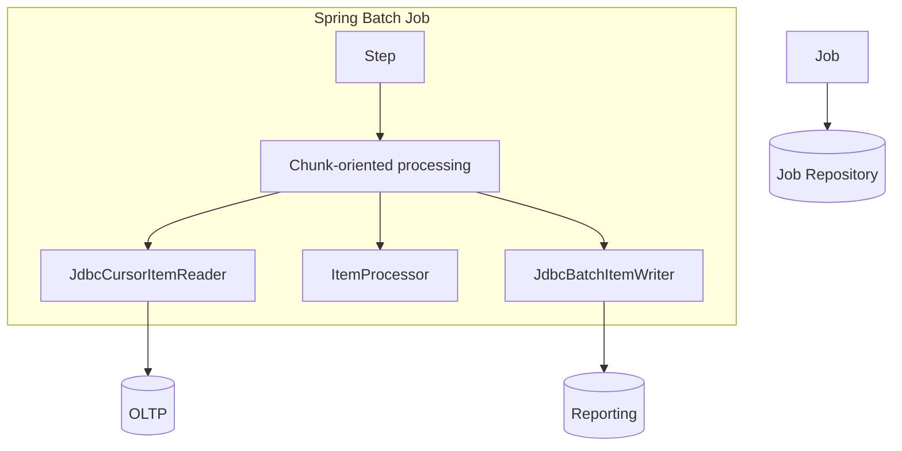

### 7. Scenario
At end-of-day, SecurePayment Gateway must move all SETTLED payments from OLTP to settlement reporting table, enrich with merchant metadata, cleanse data quality issues, and load into reporting schema. Batch must process 500,000 records nightly within 2 hours and be restartable if it fails.

### 8. Goal
Build a Spring Batch job for the settlement ETL pipeline with checkpointing, skip policies, and retry.

### 9. What Can Go Wrong (with broken code)
```java
// BROKEN: Hand-written ETL without fault tolerance
@Service
public class BrokenNightlyEtl {
    @Transactional
    public void run() {
        List<Payment> all = paymentRepo.findByStatus(PaymentStatus.SETTLED); // OOM
        for (Payment p : all) {
            ReportRow row = enrich(p); // may fail
            reportRepo.save(row); // no batch
        }
        // if crashes at record 250,000, all progress lost
    }
}
```

### 10. Why It Fails
- Loads all 500,000 entities into memory → OOM.
- No checkpointing: failure requires full restart.
- No skip policy: a single bad record stops entire job.
- Individual saves cause N round-trips.

### 11. Correct Approach
- Use Spring Batch with chunk-oriented processing.
- Use cursor reader to stream rows.
- Use batch writer.
- Configure skip limit and retry.

### 12. Key Principles
- Always use streaming readers for large datasets.
- Persist job state (JobRepository) for restartability.
- Define skip policies for data quality issues.
- Use `chunk size` that balances memory and transaction overhead.
- Idempotent loads: use upsert to avoid duplicates on restart.

### 13. Correct Implementation
```java
@Configuration
public class SettlementBatchConfig {
    private static final int CHUNK_SIZE = 200;

    @Bean
    public Job settlementEtlJob(JobRepository jobRepository, Step settlementStep) {
        return new JobBuilder("settlementEtlJob", jobRepository)
                .incrementer(new RunIdIncrementer())
                .start(settlementStep)
                .build();
    }

    @Bean
    public Step settlementStep(JobRepository jobRepository,
                               PlatformTransactionManager txManager,
                               JdbcCursorItemReader<PaymentRecord> reader,
                               PaymentEnrichmentProcessor processor,
                               JdbcBatchItemWriter<SettlementReportRow> writer) {
        return new StepBuilder("settlementStep", jobRepository)
                .<PaymentRecord, SettlementReportRow>chunk(CHUNK_SIZE, txManager)
                .reader(reader)
                .processor(processor)
                .writer(writer)
                .faultTolerant()
                .skip(DataQualityException.class)
                .skipLimit(500)
                .retry(TransientDataAccessException.class)
                .retryLimit(3)
                .build();
    }

    @Bean
    public JdbcCursorItemReader<PaymentRecord> settlementReader(DataSource dataSource) {
        return new JdbcCursorItemReaderBuilder<PaymentRecord>()
                .name("settlementReader")
                .dataSource(dataSource)
                .sql("""
                    SELECT p.id, p.amount, p.currency, p.merchant_id,
                           p.customer_id, p.created_at, p.settled_at
                    FROM payments p
                    WHERE p.status = 'SETTLED'
                      AND p.settled_at >= :settleDate
                      AND p.id NOT IN (SELECT payment_id FROM settlement_report)
                    ORDER BY p.id
                    """)
                .rowMapper(new BeanPropertyRowMapper<>(PaymentRecord.class))
                .fetchSize(CHUNK_SIZE)
                .build();
    }

    @Bean
    public JdbcBatchItemWriter<SettlementReportRow> settlementWriter(DataSource reportingDataSource) {
        return new JdbcBatchItemWriterBuilder<SettlementReportRow>()
                .dataSource(reportingDataSource)
                .sql("""
                    INSERT INTO settlement_report
                    (payment_id, merchant_id, merchant_name, merchant_category,
                     customer_id, amount, currency, settled_at)
                    VALUES (:paymentId, :merchantId, :merchantName, :merchantCategory,
                            :customerId, :amount, :currency, :settledAt)
                    ON CONFLICT (payment_id) DO UPDATE SET
                        merchant_name = EXCLUDED.merchant_name,
                        settled_at = EXCLUDED.settled_at
                    """)
                .beanMapped()
                .build();
    }
}

@Component
public class PaymentEnrichmentProcessor implements ItemProcessor<PaymentRecord, SettlementReportRow> {
    private final MerchantCacheService merchantCache;

    @Override
    public SettlementReportRow process(PaymentRecord payment) throws Exception {
        if (payment.getCurrency() == null || payment.getCurrency().isBlank()) {
            throw new DataQualityException("Missing currency for payment: " + payment.getId());
        }
        MerchantInfo merchant = merchantCache.get(payment.getMerchantId());
        if (merchant == null) {
            throw new DataQualityException("Unknown merchant: " + payment.getMerchantId());
        }
        return new SettlementReportRow(
            payment.getId(),
            payment.getMerchantId(),
            merchant.getName(),
            merchant.getCategory(),
            payment.getCustomerId(),
            payment.getAmount(),
            payment.getCurrency(),
            payment.getSettledAt()
        );
    }
}
```

### 14. Execution Flow (Spring Batch Chunk)
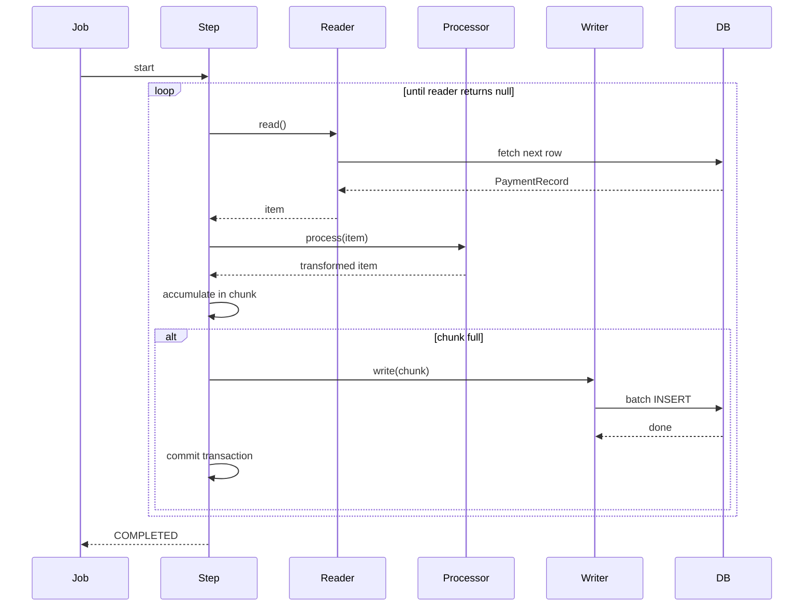

### 15. Common Mistakes
1. **Using `JdbcPagingItemReader` without stable sort** – pagination with OFFSET degrades. Use cursor reader or keyset pagination.
2. **Stateful `ItemProcessor`** – processors may be called concurrently; keep stateless.
3. **Not setting `fetchSize` on cursor reader** – some drivers fetch all rows at once.
4. **Skipping silently without logging** – implement `SkipListener` to record skipped records.
5. **Using same DataSource for reader and writer** – separate OLTP and reporting sources to avoid contention.
6. **Running batch jobs at peak OLTP time** – schedule during low-traffic window.

### 16. Decision Matrix: ETL Approaches
| Approach          | Fault Tolerance | Development Speed | Use Case                                   |
|-------------------|-----------------|-------------------|--------------------------------------------|
| Spring Batch      | High            | Medium            | Scheduled, restartable ETL                 |
| Hand-written SQL  | Low             | High              | One-off migrations                          |
| Apache Spark      | Very High       | Low (setup)       | Massive data volumes, distributed processing|
| Custom service    | Medium          | High (simple)     | Small, ad-hoc jobs                          |

---

## Section 9: Analytics & Read Optimization: OLTP vs OLAP for Payments

### 1. What
**OLTP (Online Transaction Processing)** databases are optimized for write-heavy, low-latency transactions.  
**OLAP (Online Analytical Processing)** schemas are denormalized, pre-aggregated, and optimized for complex queries.  
**Reporting tables** store pre-computed metrics to serve dashboards.

### 2. Why does it exist
Running analytical queries directly on OLTP tables causes performance degradation for live transactions. Separating the workload ensures both systems meet their SLAs.

### 3. When to use it
- When you need daily/weekly/monthly revenue reports.
- When you need fraud-to-approval ratios.
- When dashboard queries scan millions of rows.
- Use pre-aggregated tables for common metrics.

### 4. Where to use it
- Reporting database (often a replica or separate schema).
- Data warehouse for long-term analytics.

### 5. How to implement (High-level)
1. Create denormalized reporting tables (e.g., `merchant_daily_summary`).
2. Populate them via ETL (Spring Batch) after settlement.
3. Use window functions for trends.
4. Query reporting tables for dashboards.

### 6. Architecture Diagram
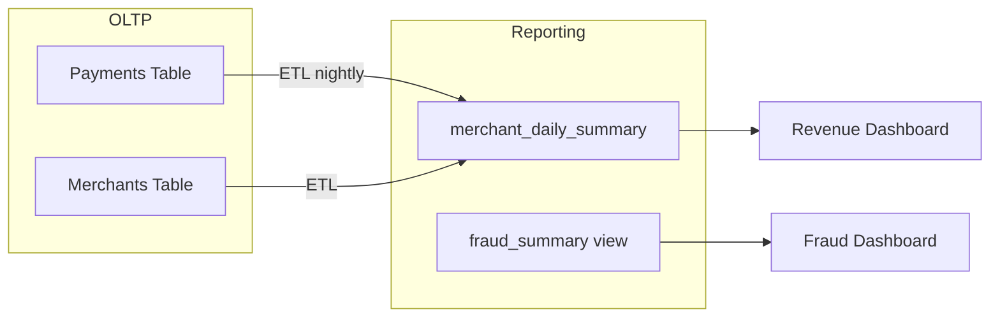

### 7. Scenario
Finance team needs daily, weekly, monthly revenue reports: total revenue by merchant, settlement aging, fraud ratio. Initially, reports run directly on payments OLTP table. During report generation at 9 AM, queries acquire shared locks, causing 3× slowdown in live transaction API.

### 8. Goal
Design reporting tables that serve analytics without impacting OLTP.

### 9. What Can Go Wrong (with broken code)
```sql
-- BROKEN: Heavy aggregation query on OLTP during peak
SELECT m.id, m.name, DATE_TRUNC('month', p.created_at) AS month,
       COUNT(*) AS tx_count, SUM(p.amount) AS total_amount
FROM payments p
JOIN merchants m ON m.id = p.merchant_id
WHERE p.created_at >= NOW() - INTERVAL '12 months'
GROUP BY m.id, m.name, month;
-- Execution: 18 seconds, holds shared locks, slows transactions
```

### 10. Why It Fails
- Full table scan on 18M rows competes with OLTP for buffer cache.
- `DATE_TRUNC()` prevents index use.
- Locks acquired for consistency (depending on isolation level) block writes.

### 11. Correct Approach
- Move reporting to a read replica or separate reporting tables.
- Pre-aggregate data at settlement time into summary tables.
- Use materialized views refreshed periodically.

### 12. Key Principles
- Never run analytical queries against OLTP primary.
- Use denormalized, pre-joined tables for reporting.
- Pre-aggregate metrics to reduce scan size.
- Use window functions for rolling calculations.
- Refresh statistics after loading.

### 13. Correct Implementation
```sql
-- Reporting table: merchant_daily_summary
CREATE TABLE merchant_daily_summary (
    merchant_id BIGINT NOT NULL,
    summary_date DATE NOT NULL,
    transaction_count INT NOT NULL DEFAULT 0,
    settled_amount DECIMAL(19,4) NOT NULL DEFAULT 0,
    failed_count INT NOT NULL DEFAULT 0,
    refunded_amount DECIMAL(19,4) NOT NULL DEFAULT 0,
    currency VARCHAR(3) NOT NULL,
    created_at TIMESTAMP NOT NULL DEFAULT NOW(),
    updated_at TIMESTAMP NOT NULL DEFAULT NOW(),
    PRIMARY KEY (merchant_id, summary_date, currency),
    FOREIGN KEY (merchant_id) REFERENCES merchants(id)
);
CREATE INDEX idx_merchant_daily_date ON merchant_daily_summary (summary_date DESC, merchant_id);

-- Upsert from settlement batch
INSERT INTO merchant_daily_summary (merchant_id, summary_date, transaction_count, settled_amount, currency)
SELECT merchant_id, DATE(settled_at) as summary_date, COUNT(*), SUM(amount), currency
FROM settlement_report
WHERE settled_at::DATE = :settledDate
GROUP BY merchant_id, DATE(settled_at), currency
ON CONFLICT (merchant_id, summary_date, currency) DO UPDATE
SET transaction_count = merchant_daily_summary.transaction_count + EXCLUDED.transaction_count,
    settled_amount = merchant_daily_summary.settled_amount + EXCLUDED.settled_amount,
    updated_at = NOW();

-- Fast revenue report using pre-aggregated table
SELECT m.name, mds.summary_date, mds.transaction_count, mds.settled_amount,
       SUM(mds.settled_amount) OVER (PARTITION BY mds.merchant_id ORDER BY mds.summary_date
                                     ROWS BETWEEN 6 PRECEDING AND CURRENT ROW) AS rolling_7day_revenue
FROM merchant_daily_summary mds
JOIN merchants m ON m.id = mds.merchant_id
WHERE mds.summary_date BETWEEN :fromDate AND :toDate
ORDER BY mds.summary_date DESC, mds.settled_amount DESC;
-- Execution: 12ms (reading 90 aggregated rows instead of 18M raw rows)

-- Fraud view
CREATE VIEW merchant_fraud_summary AS
SELECT m.category, DATE_TRUNC('week', mds.summary_date) AS week,
       SUM(mds.transaction_count) AS total_count,
       SUM(mds.failed_count) AS fraud_failed_count,
       ROUND(100.0 * SUM(mds.failed_count) / NULLIF(SUM(mds.transaction_count), 0), 2) AS fraud_rate_pct
FROM merchant_daily_summary mds
JOIN merchants m ON m.id = mds.merchant_id
GROUP BY m.category, DATE_TRUNC('week', mds.summary_date);
```

```java
// Spring Data repository for reporting
public interface MerchantDailySummaryRepository extends JpaRepository<MerchantDailySummary, MerchantDailySummaryId> {
    @Query(value = "SELECT m.name as merchantName, mds.summary_date as summaryDate, " +
           "mds.transaction_count as transactionCount, mds.settled_amount as settledAmount, " +
           "mds.failed_count as failedCount, " +
           "SUM(mds.settled_amount) OVER (PARTITION BY mds.merchant_id ORDER BY mds.summary_date " +
           "ROWS BETWEEN 6 PRECEDING AND CURRENT ROW) as rolling7DayRevenue " +
           "FROM merchant_daily_summary mds JOIN merchants m ON m.id = mds.merchant_id " +
           "WHERE mds.summary_date BETWEEN :from AND :to " +
           "ORDER BY mds.summary_date DESC, mds.settled_amount DESC", nativeQuery = true)
    List<MerchantRevenueSummary> getRevenueReport(@Param("from") LocalDate from, @Param("to") LocalDate to);
}
```

### 14. Execution Flow (Reporting Query)
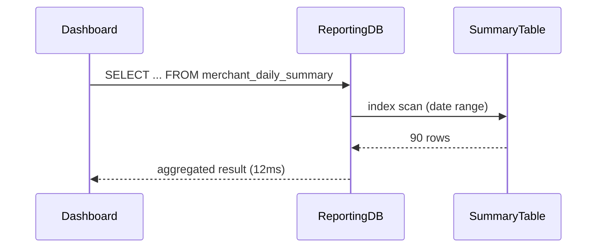

### 15. Common Mistakes
1. **Materialized view without refresh strategy** – stale data. Schedule refreshes.
2. **Running analytics on primary DB during peak** – use read replica or off-peak.
3. **Window functions without `PARTITION BY`** – accumulates across all merchants, wrong totals.
4. **`NULLIF` omission in ratio calculations** – division by zero.
5. **Not refreshing statistics after load** – query planner may choose bad plan.
6. **Denormalization without documentation** – developers forget to refresh reporting layer.

### 16. Decision Matrix: OLTP vs OLAP
| Aspect           | OLTP                          | OLAP                          |
|------------------|-------------------------------|-------------------------------|
| Purpose          | Handle live transactions      | Support analytical queries    |
| Data model       | Normalized                    | Denormalized, star schema     |
| Query types      | Point lookups, small writes   | Aggregations, scans           |
| Indexes          | Many on FK, point queries     | Few, covering for aggregations |
| Concurrency      | High write concurrency        | Read-only, low concurrency    |
| Latency target   | <100ms                        | Seconds to minutes            |

---

## Section 10: Security & Observability: Encryption, Masking & Audit Trails

### 1. What
**Column encryption** protects sensitive data at rest using techniques like AES. **Masking** hides sensitive data in logs and API responses. **Tokenization** replaces sensitive values with non-sensitive tokens. **Audit trails** record who accessed what and when. **Observability** includes metrics, slow query logs, and monitoring.

### 2. Why does it exist
Regulations (PCI-DSS, GDPR, RBI) require protection of cardholder data and PII. Audit trails are needed for compliance and forensics. Observability helps detect performance issues and security incidents.

### 3. When to use it
- Encrypt PII (email, national ID) and tokenized card numbers at rest.
- Mask PII in logs and error messages.
- Log all access to sensitive data (read/write).
- Monitor slow queries and connection pool metrics.

### 4. Where to use it
- Database columns: encrypted via JPA converters.
- Application logs: custom converters to mask.
- Service layer: audit interceptor.
- Observability: Micrometer, Prometheus.

### 5. How to implement (High-level)
- Create `AttributeConverter` for encryption/decryption.
- Use deterministic encryption for searchable fields (with hash).
- Implement log masking via Logback converter.
- Add audit logging with `REQUIRES_NEW` or JDBC.
- Expose metrics via Micrometer.

### 6. Architecture Diagram (Security Layers)
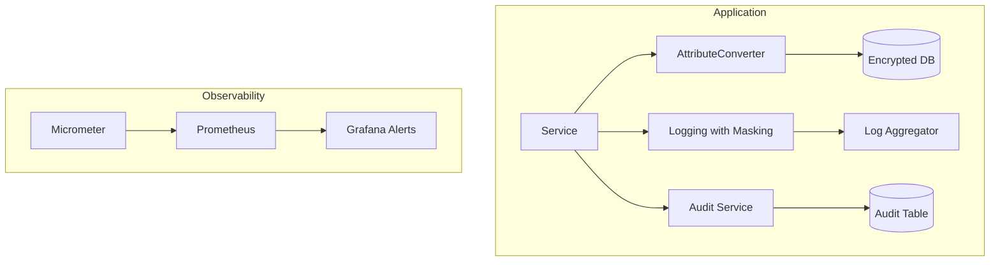

### 7. Scenario
A security audit finds that application logs print full customer email addresses, partial PAN numbers, and wallet balance changes. Also, sensitive fields are stored in plain text in the database, violating data classification policy.

### 8. Goal
Implement column encryption for sensitive fields, mask PII in logs, implement audit trail for sensitive data access, and expose database metrics.

### 9. What Can Go Wrong (with broken code)
```java
// BROKEN: Logging sensitive fields without masking
@Service
public class BrokenPaymentService {
    private static final Logger log = LoggerFactory.getLogger(BrokenPaymentService.class);

    public void processPayment(PaymentRequest req) {
        log.info("Processing payment for customer={} card={} amount={}",
                 req.getCustomerEmail(), req.getCardToken(), req.getAmount()); // PII in logs
    }
}

// BROKEN: No column encryption
@Entity
public class BrokenCustomer {
    @Column(nullable = false)
    private String nationalId; // plain text Aadhaar
    @Column(nullable = false)
    private String mobileNumber; // plain text
}
```

### 10. Why It Fails
- Plain text sensitive fields in logs are captured by log aggregation systems (ELK) and retained – a data breach vector.
- Unencrypted PII in database exposes all records if DB server or backup is compromised.
- Auto-generated `toString()` may expose all fields.

### 11. Correct Approach
- Use AES-256 encryption for sensitive columns via JPA converter.
- Mask logs using custom Logback converter.
- Audit all reads/writes to sensitive data.
- Use deterministic encryption (or hash) for searchable fields.
- Never store CVV; tokenize PAN.

### 12. Key Principles
- Never log raw PII – mask, hash, or omit.
- Encrypt sensitive DB columns at rest.
- Audit every access: who, when, IP.
- Use MDC to attach requestId (hashed) for traceability.
- Exclude sensitive fields from `toString()`, `equals()`, `hashCode()`.

### 13. Correct Implementation
```java
// AES-256 Attribute Converter
@Converter
public class EncryptedStringConverter implements AttributeConverter<String, String> {
    private static final String ALGORITHM = "AES/GCM/NoPadding";
    private static final int GCM_IV_LENGTH = 12;
    private static final int GCM_TAG_LENGTH = 128;
    private final SecretKey secretKey;

    public EncryptedStringConverter(EncryptionKeyProvider keyProvider) {
        this.secretKey = keyProvider.getActiveKey(); // from Vault/KMS
    }

    @Override
    public String convertToDatabaseColumn(String plainText) {
        if (plainText == null) return null;
        try {
            byte[] iv = new byte[GCM_IV_LENGTH];
            new SecureRandom().nextBytes(iv);
            Cipher cipher = Cipher.getInstance(ALGORITHM);
            cipher.init(Cipher.ENCRYPT_MODE, secretKey, new GCMParameterSpec(GCM_TAG_LENGTH, iv));
            byte[] encrypted = cipher.doFinal(plainText.getBytes(StandardCharsets.UTF_8));
            byte[] combined = new byte[iv.length + encrypted.length];
            System.arraycopy(iv, 0, combined, 0, iv.length);
            System.arraycopy(encrypted, 0, combined, iv.length, encrypted.length);
            return Base64.getEncoder().encodeToString(combined);
        } catch (Exception e) {
            throw new EncryptionException("Failed to encrypt", e);
        }
    }

    @Override
    public String convertToEntityAttribute(String encryptedBase64) {
        if (encryptedBase64 == null) return null;
        try {
            byte[] combined = Base64.getDecoder().decode(encryptedBase64);
            byte[] iv = new byte[GCM_IV_LENGTH];
            byte[] cipherText = new byte[combined.length - GCM_IV_LENGTH];
            System.arraycopy(combined, 0, iv, 0, GCM_IV_LENGTH);
            System.arraycopy(combined, GCM_IV_LENGTH, cipherText, 0, cipherText.length);
            Cipher cipher = Cipher.getInstance(ALGORITHM);
            cipher.init(Cipher.DECRYPT_MODE, secretKey, new GCMParameterSpec(GCM_TAG_LENGTH, iv));
            return new String(cipher.doFinal(cipherText), StandardCharsets.UTF_8);
        } catch (Exception e) {
            throw new EncryptionException("Failed to decrypt", e);
        }
    }
}

// Applying converter to sensitive fields
@Entity
public class Customer {
    @Id @GeneratedValue private Long id;
    @Convert(converter = EncryptedStringConverter.class)
    @Column(nullable = false, unique = true, length = 512)
    private String email;

    @Convert(converter = EncryptedStringConverter.class)
    @Column(length = 512)
    private String nationalId;

    @Column(nullable = false)
    private String fullName; // non-sensitive

    @Override
    public String toString() {
        return "Customer[id=" + id + ", name=" + fullName + "]"; // exclude email, nationalId
    }
}

// Logback PII Masking Converter
public class PiiMaskingConverter extends ClassicConverter {
    private static final Pattern EMAIL_PATTERN = Pattern.compile("([a-zA-Z0-9._%+-]+)@([a-zA-Z0-9.-]+\\.[a-zA-Z]{2,})");
    private static final Pattern CARD_TOKEN_PATTERN = Pattern.compile("(tok_[a-zA-Z0-9]{20,})");
    private static final Pattern AADHAAR_PATTERN = Pattern.compile("\\b(\\d{4})\\s?(\\d{4})\\s?(\\d{4})\\b");

    @Override
    public String convert(ILoggingEvent event) {
        String message = event.getFormattedMessage();
        message = EMAIL_PATTERN.matcher(message).replaceAll("***@$2");
        message = CARD_TOKEN_PATTERN.matcher(message).replaceAll("tok_***MASKED***");
        message = AADHAAR_PATTERN.matcher(message).replaceAll("XXXX-XXXX-$3");
        return message;
    }
}

// logback-spring.xml
<configuration>
    <conversionRule conversionWord="maskedMsg" converterClass="com.securepayment.logging.PiiMaskingConverter"/>
    <appender name="CONSOLE" class="ch.qos.logback.core.ConsoleAppender">
        <encoder>
            <pattern>%d{ISO8601} [%thread] %-5level %logger{36} [%X{requestId}] - %maskedMsg%n</pattern>
        </encoder>
    </appender>
</configuration>

// MDC filter for request tracing
public class RequestContextFilter extends OncePerRequestFilter {
    @Override
    protected void doFilterInternal(HttpServletRequest request, HttpServletResponse response,
                                    FilterChain filterChain) throws ServletException, IOException {
        String requestId = request.getHeader("X-Request-ID");
        if (requestId == null) requestId = UUID.randomUUID().toString();
        try {
            MDC.put("requestId", requestId);
            MDC.put("clientIp", request.getRemoteAddr());
            response.setHeader("X-Request-ID", requestId);
            filterChain.doFilter(request, response);
        } finally {
            MDC.clear();
        }
    }
}

// Audit service with REQUIRES_NEW
@Service
public class JdbcAuditService {
    private final JdbcTemplate jdbcTemplate;

    @Transactional(propagation = Propagation.REQUIRES_NEW)
    public void recordEvent(String eventType, Long entityId, String entityType,
                            String actorId, String details) {
        jdbcTemplate.update("INSERT INTO audit_events (event_type, entity_id, entity_type, actor_id, details, occurred_at) VALUES (?, ?, ?, ?, ?, ?)",
                eventType, entityId, entityType, actorId, details, Timestamp.from(Instant.now()));
    }
}

// Observability: Repository metrics via AOP
@Aspect
@Component
public class RepositoryMetricsAspect {
    private final MeterRegistry meterRegistry;

    @Around("execution(* org.springframework.data.repository.Repository+.*(..))")
    public Object measure(ProceedingJoinPoint pjp) throws Throwable {
        String methodName = pjp.getSignature().toShortString();
        Timer.Sample sample = Timer.start(meterRegistry);
        try {
            return pjp.proceed();
        } finally {
            sample.stop(Timer.builder("db.repository.call")
                    .tag("method", methodName)
                    .register(meterRegistry));
        }
    }
}

// application.yml metrics
management:
  endpoints:
    web:
      exposure:
        include: health,metrics,prometheus
spring:
  jpa:
    properties:
      hibernate:
        generate_statistics: true
        session.events.log.LOG_QUERIES_SLOWER_THAN_MS: 200
```

### 14. Execution Flow (Audit Trail)
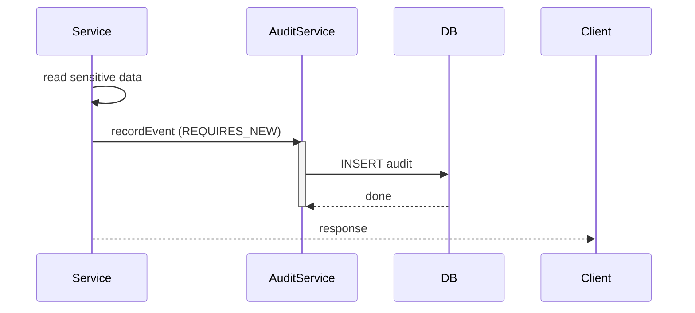

### 15. Common Mistakes
1. **Searchable fields that are encrypted** – AES-GCM with random IV can't be searched. Use deterministic encryption or store hash for lookups.
2. **Key hardcoded in `application.yml`** – use Vault/KMS.
3. **Not clearing MDC in finally block** – context leaks between requests.
4. **Logging before masking** – some filters log raw request before masking. Implement custom request logging with masking.
5. **No audit for read access** – reads of sensitive data also need audit.
6. **Encryption key rotation not planned** – store key version in column and support re-encryption.

### 16. Decision Matrix: Data Protection
| Technique       | Protects                           | Trade-offs                               |
|-----------------|------------------------------------|------------------------------------------|
| Column Encryption | Data at rest                      | Can't search (unless deterministic)      |
| Log Masking     | Logs                               | May hide legitimate debugging info       |
| Tokenization    | Reduces PCI scope                   | Requires token vault                      |
| Audit Trails    | Accountability                     | Storage overhead, performance impact     |
| TLS             | Data in transit                     | Requires certificate management           |

---

## Conclusion
This module has covered the critical aspects of building robust payment systems with JPA/Hibernate and Spring. Each section followed a rigorous 16-step framework to ensure you understand not just the "how" but the "why" and the trade-offs. Use this material as a reference when designing your own systems, and always question the defaults.

*— Principal Software Architect*
