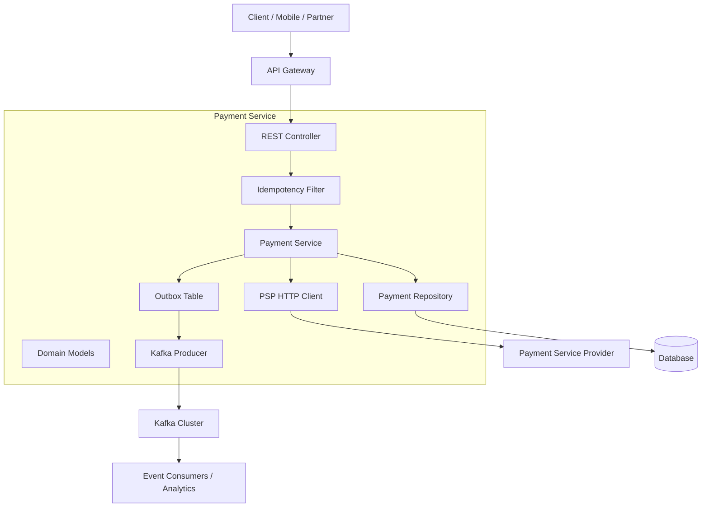
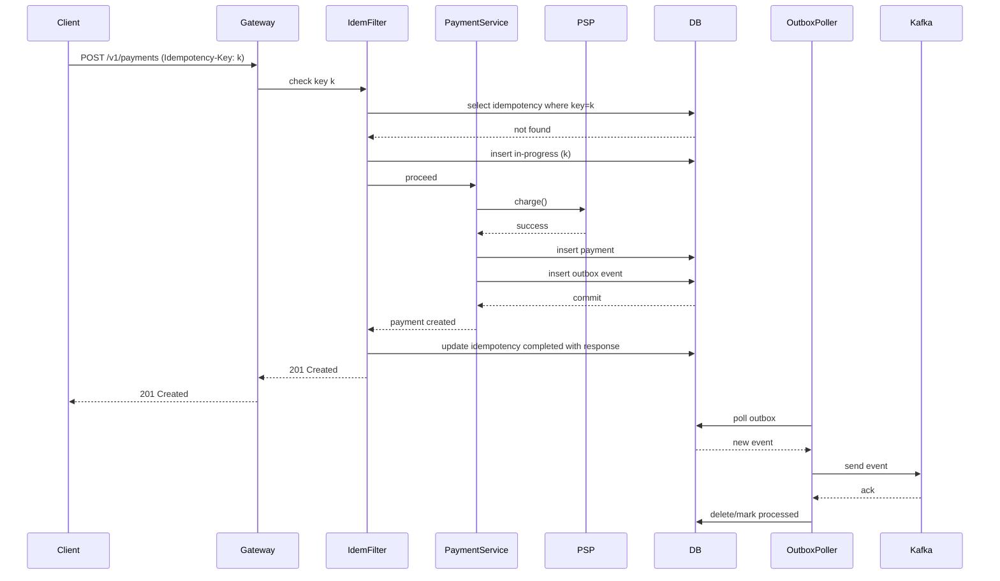

# RESTful Payment API Design: A Deep Dive for Senior Engineers

## Module Overview
This self-study module is designed for senior engineers (5–10+ years) who need to architect, implement, and evolve payment APIs in a microservices environment. You will explore the intricacies of resource modeling, pagination trade-offs, API versioning, contract management, modular builds, and resilience patterns (timeouts, idempotency, backoff). All content is stack-specific to **Java 17 / Spring Boot**, with emphasis on production-grade decisions, failure modes, and architectural reasoning.

---

## 1. What
**Concise technical definition:**  
A *RESTful payment API* is a set of HTTP endpoints that model financial transactions (e.g., charges, refunds, payouts) as resources. It defines:
- Resource representations (JSON) with hypermedia controls.
- Pagination strategies for listing transactions.
- Versioning mechanisms to evolve the contract without breaking clients.
- Idempotency guarantees to safely retry requests.
- Timeout and backoff policies for downstream PSP (Payment Service Provider) calls.
- Event-driven integration (via Kafka) for asynchronous processing and reporting.

The design is **contract-first** using OpenAPI, with **multi-module builds** enforcing dependency isolation and layering rules.

---

## 2. Why does it exist
**The problem statement:**  
Payment systems operate under strict correctness, consistency, and availability requirements. Direct integration with PSPs introduces network unreliability, variable latency, and duplicate risks. Mobile and partner clients demand long-lived API stability. Without careful design, you encounter:
- **Duplicate charges** due to client retries or network glitches.
- **Broken clients** after API changes (e.g., renaming fields, altering pagination).
- **Performance degradation** from naive offset pagination on large transaction sets.
- **Cascading failures** when PSP timeouts are not handled.
- **Tight coupling** between modules causing build and deployment nightmares.
- **Inconsistent state** between your system and PSP after failures.

Thus, this module exists to equip you with patterns that guarantee **idempotency, backward compatibility, scalability, and resilience** in payment APIs.

---

## 3. When to use it
Apply these patterns when:
- You are building a new payment service from scratch.
- You are refactoring a legacy monolithic payment system into microservices.
- Your API is consumed by external partners or mobile apps with slow update cycles.
- You expect high transaction volumes (100+ TPS) and need predictable pagination performance.
- You integrate with multiple PSPs, each with different latency and reliability characteristics.
- You need to emit business events (e.g., `PaymentSucceeded`, `PaymentFailed`) for downstream consumers.

---

## 4. Where to use it
**Architectural layers and components:**

| Layer          | Role in Payment API                                                                 |
|----------------|--------------------------------------------------------------------------------------|
| **Edge (API Gateway)**   | Rate limiting, authentication, global timeout, routing to versioned endpoints.     |
| **Presentation (Controller)** | REST endpoint handlers, request validation, OpenAPI annotations, version negotiation. |
| **Service (Business Logic)** | Orchestrates PSP calls, idempotency checks, transaction coordination.               |
| **Domain (Models)**       | Shared payment models (e.g., `Payment`, `Money`, `Status`) isolated in a module.   |
| **Integration (PSP Client)** | HTTP clients with configured timeouts, retries, and circuit breakers.              |
| **Persistence**           | Database for payment records, idempotency keys, outbox for events.                 |
| **Event Bus (Kafka)**     | Asynchronous event emission for audit, analytics, and downstream services.          |

---

## 5. How to implement: High-level steps
1. **Define resource model** – Identify core resources: `Payment`, `Refund`, `Payout`. Use consistent naming and hypermedia.
2. **Choose pagination strategy** – Prefer cursor-based pagination for lists that can grow large (e.g., transaction history). Understand trade-offs vs offset.
3. **Design versioning** – Decide on URI path versioning (`/v1/payments`) or content negotiation (`Accept: application/vnd.company.v2+json`). Plan backward-compatible evolution.
4. **Create OpenAPI contract** – Write contract-first YAML/JSON spec; generate server stubs using `openapi-generator-maven-plugin`.
5. **Structure multi-module build** – Separate modules: `api-contract`, `domain-models`, `application`, `psp-client`, `kafka-events`. Enforce layering with dependency rules.
6. **Implement idempotency** – Accept `Idempotency-Key` header, store keys with expiry, reject duplicates.
7. **Configure timeouts & retries** – Use `RestTemplate` or `WebClient` with connect/read timeouts; apply exponential backoff for PSP retries.
8. **Integrate Kafka** – Produce payment events after successful PSP interaction (using outbox pattern to ensure at-least-once delivery).
9. **Test backward compatibility** – Use consumer-driven contract tests (Pact) and OpenAPI diff tools.

---

## 6. Architecture Diagram (Mermaid)



*Note: The Outbox table ensures reliable event publishing; a scheduled poller or Debezium streams changes to Kafka.*

---

## 7. Scenario
**Real-world production use case:**  
You work at a fintech startup building a recurring billing platform. The system must:
- Handle 500 TPS during peak hours.
- Integrate with Stripe (PSP) for credit card charges.
- Provide a REST API for mobile apps (iOS, Android) and partner billing systems.
- Emit `payment.succeeded` and `payment.failed` events for internal analytics and invoicing.

**Challenge:** The mobile app team releases every two weeks, while partners update quarterly. API changes must not break existing clients. Transaction history can grow to millions per customer; offset pagination is too slow. Stripe occasionally returns 5xx errors; retries must be idempotent.

---

## 8. Goal
**Desired outcomes (KPIs):**
- **Throughput:** 500 TPS sustained, 1000 TPS burst.
- **Latency:** p95 < 300ms (including PSP round-trip).
- **Availability:** 99.99% uptime (excluding PSP outages).
- **Idempotency:** Zero duplicate charges despite client or network retries.
- **Backward compatibility:** No client breaks after 10+ API versions.
- **Event delivery:** At-least-once with exactly-once processing semantics downstream.

---

## 9. What Can Go Wrong
### Failure modes and edge cases (with wrong code examples)

#### 9.1. Duplicate payment due to missing idempotency
```java
// WRONG: No idempotency handling
@PostMapping("/charges")
public Payment charge(@RequestBody ChargeRequest req) {
    // Direct PSP call – if network timeout, client retries → double charge
    return pspClient.charge(req);
}
```
**Result:** Customer charged twice.

#### 9.2. Offset pagination causing slow queries and missing data
```java
// WRONG: Using offset for large transaction list
@GetMapping("/payments")
public List<Payment> getPayments(@RequestParam int page, @RequestParam int size) {
    return repository.findAll(PageRequest.of(page, size));
}
```
**Problem:** As offset grows, database scans become slower. New payments inserted before current page can cause duplicates or missed records.

#### 9.3. Breaking clients by changing response format
```java
// v1 returned { "transaction_id": "123" }
// v2 returns { "transactionId": "123" } without versioning
@GetMapping("/payments/{id}")
public PaymentV2 getPayment(@PathVariable String id) {
    return new PaymentV2(id); // field renamed
}
```
**Result:** Mobile app expecting `transaction_id` crashes.

#### 9.4. Synchronous PSP call without timeout
```java
// WRONG: No timeout, thread blocks forever
RestTemplate rest = new RestTemplate();
ResponseEntity<String> response = rest.postForEntity(pspUrl, request, String.class);
```
**Impact:** If PSP hangs, service threads exhaust, causing cascading failure.

#### 9.5. Cyclic dependencies in multi-module build
```xml
<!-- Module A depends on B, B depends on A -->
<dependency>
    <groupId>com.payment</groupId>
    <artifactId>psp-client</artifactId>
    <version>1.0</version>
</dependency>
```
**Problem:** Compilation errors, impossible to build independently, violation of layering.

#### 9.6. Kafka event lost if database commit fails
```java
// WRONG: Send Kafka event before DB commit
paymentRepo.save(payment);
kafkaTemplate.send("payment-events", event); // if DB rollback, event still sent
```
**Result:** Event indicates payment succeeded, but transaction actually failed.

---

## 10. Why It Fails
**Root cause analysis:**

- **Idempotency missing:** Developers assume exactly-once delivery from clients or network; they ignore HTTP semantics and retry logic.
- **Pagination mis-choice:** Using offset because it's easy, without considering data volume or consistency requirements.
- **Versioning neglect:** No API governance; changes are made ad-hoc without contract testing.
- **No timeouts:** Default HTTP client settings are infinite; developers forget to configure them.
- **Module entanglement:** Lack of architectural oversight; developers add dependencies to save time, breaking separation of concerns.
- **Eventual consistency mishandling:** Sending events before transaction commit violates atomicity; events become "ghost" notifications.

---

## 11. Correct Approach
### Architectural patterns to mitigate failures

1. **Idempotency Keys** – Mandate clients to send a unique key; store key with status; reject duplicates.
2. **Cursor-Based Pagination** – Use `created_at` or sequential ID as cursor; avoid offsets for large datasets.
3. **Semantic Versioning** – Evolve API with backward-compatible changes (add fields only); break only with new major version.
4. **Timeout & Circuit Breaker** – Set connect/read timeouts; use resilience4j with exponential backoff for PSP.
5. **Multi-module with strict layering** – Define dependency rules (e.g., `domain` → none, `application` → `domain`, `psp-client` → none). Use Maven enforcer plugin.
6. **Outbox Pattern** – Write event to outbox table in same DB transaction; poll or CDC to publish to Kafka.

---

## 12. Key Principles
- **CAP Theorem:** Payments are **CP** (consistency over availability). We must avoid double spending, even if it means rejecting requests during network splits.
- **Idempotency:** Operations should be repeatable without side effects. HTTP methods (PUT, DELETE) are naturally idempotent; POST needs explicit keys.
- **Eventually Consistent Reads:** Reporting and analytics can tolerate stale data; use events for eventual consistency.
- **Contract First:** API contract is the source of truth; code is generated from it.
- **Single Responsibility Principle:** Each module has one reason to change.
- **Fail Fast:** Timeouts and circuit breakers prevent resource exhaustion.

---

## 13. Correct Implementation (Production-grade code)

### 13.1. Multi-module Maven structure
```
payment-service/
├── api-contract/          (OpenAPI specs, generated stubs)
├── domain-models/         (Plain Java objects, no dependencies)
├── psp-client/            (HTTP client for Stripe, etc.)
├── kafka-events/          (Event definitions, producers)
├── application/           (Spring Boot app, controllers, services)
└── pom.xml (parent)
```

**Parent POM enforces dependency rules:**
```xml
<plugin>
    <groupId>org.apache.maven.plugins</groupId>
    <artifactId>maven-enforcer-plugin</artifactId>
    <configuration>
        <rules>
            <dependencyConvergence/>
            <banDuplicatePomDependencyVersions/>
            <requireUpperBoundDeps/>
            <customRule implementation="com.payment.EnforceLayeringRule">
                <domainAllowedDependencies>none</domainAllowedDependencies>
                <applicationAllowedDependencies>domain-models,psp-client,kafka-events</applicationAllowedDependencies>
                ...
            </customRule>
        </rules>
    </configuration>
</plugin>
```

### 13.2. OpenAPI contract (contract-first)
```yaml
openapi: 3.0.1
info:
  title: Payment API
  version: 1.0.0
paths:
  /v1/payments:
    post:
      parameters:
        - name: Idempotency-Key
          in: header
          required: true
          schema: { type: string }
      requestBody:
        content:
          application/json:
            schema:
              $ref: '#/components/schemas/CreatePaymentRequest'
      responses:
        201:
          description: Payment created
          headers:
            Location: { schema: { type: string } }
          content:
            application/json:
              schema: { $ref: '#/components/schemas/Payment' }
        409:
          description: Idempotency key already used with different request
  /v1/payments:
    get:
      parameters:
        - name: cursor
          in: query
          schema: { type: string, format: date-time }
        - name: limit
          in: query
          schema: { type: integer, default: 20 }
      responses:
        200:
          content:
            application/json:
              schema:
                type: array
                items: { $ref: '#/components/schemas/Payment' }
              headers:
                Next-Cursor: { schema: { type: string } }
```

### 13.3. Idempotency Filter (Spring)
```java
@Component
public class IdempotencyFilter implements Filter {
    @Autowired private IdempotencyService idempotencyService;

    @Override
    public void doFilter(ServletRequest request, ServletResponse response, FilterChain chain)
            throws IOException, ServletException {
        HttpServletRequest req = (HttpServletRequest) request;
        HttpServletResponse res = (HttpServletResponse) response;
        String key = req.getHeader("Idempotency-Key");
        if (key == null && isPostRequest(req)) {
            res.sendError(HttpStatus.BAD_REQUEST.value(), "Idempotency-Key required for POST");
            return;
        }
        if (key != null) {
            Optional<IdempotencyRecord> record = idempotencyService.findByIdempotencyKey(key);
            if (record.isPresent()) {
                // Return cached response if previous request had same key and payload matches?
                // This is simplified; real impl compares payload hash.
                writeCachedResponse(res, record.get());
                return;
            }
            // Mark key as in-progress (with expiration)
            idempotencyService.createInProgress(key, req.getRequestURI(), getBody(req));
        }
        chain.doFilter(request, response);
        // After processing, update record with response status and body
        if (key != null) {
            idempotencyService.complete(key, res.getStatus(), getResponseBody(res));
        }
    }
}
```

### 13.4. Cursor-based pagination repository
```java
public interface PaymentRepository extends JpaRepository<Payment, Long> {
    @Query("SELECT p FROM Payment p WHERE p.createdAt < :cursor ORDER BY p.createdAt DESC")
    List<Payment> findNext(@Param("cursor") Instant cursor, Pageable pageable);
}
```
Controller:
```java
@GetMapping("/v1/payments")
public ResponseEntity<List<PaymentDto>> listPayments(
        @RequestParam(required = false) Instant cursor,
        @RequestParam(defaultValue = "20") int limit) {
    Pageable pageable = PageRequest.of(0, limit + 1); // fetch one extra to detect next cursor
    List<Payment> payments = repository.findNext(cursor, pageable);
    boolean hasNext = payments.size() > limit;
    if (hasNext) payments.remove(payments.size() - 1);
    HttpHeaders headers = new HttpHeaders();
    if (hasNext) {
        headers.add("Next-Cursor", payments.get(payments.size()-1).getCreatedAt().toString());
    }
    return ResponseEntity.ok().headers(headers).body(mapToDto(payments));
}
```

### 13.5. PSP client with timeouts and exponential backoff
```java
@Configuration
public class PspClientConfig {
    @Bean
    public WebClient pspWebClient() {
        return WebClient.builder()
                .baseUrl("https://api.stripe.com")
                .clientConnector(new ReactorClientHttpConnector(
                        HttpClient.create()
                                .responseTimeout(Duration.ofSeconds(5))
                                .option(ChannelOption.CONNECT_TIMEOUT_MILLIS, 3000)
                ))
                .build();
    }
}

@Service
public class StripeClient {
    private final WebClient webClient;
    private final RetryTemplate retryTemplate;

    public StripeClient(WebClient pspWebClient) {
        this.webClient = pspWebClient;
        this.retryTemplate = RetryTemplate.builder()
                .maxAttempts(3)
                .exponentialBackoff(100, 2, 1000)
                .retryOn(TransientException.class)
                .build();
    }

    public PaymentResponse charge(ChargeRequest req) {
        return retryTemplate.execute(ctx -> {
            return webClient.post()
                    .uri("/v1/charges")
                    .bodyValue(req)
                    .retrieve()
                    .bodyToMono(PaymentResponse.class)
                    .block();
        });
    }
}
```

### 13.6. Kafka producer with outbox pattern
```java
@Component
public class PaymentEventProducer {
    @TransactionalEventListener(phase = TransactionPhase.AFTER_COMMIT)
    public void handlePaymentCompleted(PaymentCompletedEvent event) {
        kafkaTemplate.send("payment-events", event.getPaymentId(), event);
    }
}

// In service, write to outbox within transaction
@Service
public class PaymentService {
    @Transactional
    public Payment charge(ChargeRequest req, String idempotencyKey) {
        // ... PSP call ...
        Payment payment = new Payment(...);
        payment = paymentRepo.save(payment);
        // Write to outbox table (or use Hibernate event listener)
        OutboxEvent outbox = new OutboxEvent(payment.getId(), "PAYMENT_SUCCEEDED", json(payment));
        outboxRepo.save(outbox);
        return payment;
    }
}
// Separate poller publishes outbox records to Kafka
```

---

## 14. Execution Flow (Mermaid Sequence Diagram)


---

## 15. Common Mistakes (Anti-patterns seen in senior engineering)

1. **Using offset pagination for customer transaction lists** – Eventually leads to slow queries and inconsistent pages when new transactions arrive.
2. **Breaking backward compatibility in minor releases** – E.g., renaming fields, changing enum values, or making previously optional fields required.
3. **Forgetting to set timeouts on HTTP clients** – Defaults are often infinite; production outages occur when a downstream PSP hangs.
4. **Implementing retries without idempotency** – Duplicate payments, refunds, or account debits.
5. **Circular dependencies between modules** – Often introduced to avoid code duplication, but leads to tangled builds.
6. **Sending Kafka events before database commit** – Results in events for failed transactions (ghost events).
7. **Not handling idempotency key collisions** – If same key used with different request bodies, should return 409, not silently reuse response.
8. **Ignoring the `Idempotency-Key` header for read operations** – While not necessary, it can be used for caching; but main mistake is not requiring it for write operations.
9. **Using fixed backoff for retries** – Overwhelms the downstream system; exponential backoff with jitter is preferred.
10. **Not versioning the API from day one** – Makes future evolution painful and often forces a breaking change.

---

## 16. Decision Matrix
Compare alternatives across critical criteria.

| Concern                         | Offset Pagination                          | Cursor Pagination                         |
|----------------------------------|---------------------------------------------|--------------------------------------------|
| Performance with large offset    | Degrades (full table scan)                  | O(1) per page (index seek)                 |
| Consistency during writes        | May skip/duplicate if new records added     | Consistent view (cursor defines anchor)     |
| Implementation complexity        | Low (built-in Spring Data)                   | Medium (custom cursor handling)             |
| Use case                         | Small, static datasets, admin panels        | Large, dynamic datasets, customer-facing    |

| Versioning Strategy              | URI Path (/v1/…)                            | Accept Header (content negotiation)        |
|----------------------------------|----------------------------------------------|---------------------------------------------|
| Discoverability                  | High (visible in URL)                        | Low (hidden in headers)                     |
| Caching                          | Different URLs = separate cache              | Same URL, varies by header – cache-aware proxies needed |
| Tooling support                  | Universal                                    | Some clients may ignore headers             |
| Evolution ease                   | Simple to route                              | Requires parsing media type parameters      |
| Recommendation                   | Preferred for public APIs                    | Use for internal APIs or when URL must stay stable |

| Retry Backoff Strategy           | Fixed                                       | Exponential + Jitter                        |
|----------------------------------|----------------------------------------------|---------------------------------------------|
| Load on downstream               | Spikes at fixed intervals                    | Spreads out, reduces congestion              |
| Success rate                     | Lower if many clients retry simultaneously  | Higher due to backoff                        |
| Complexity                       | Trivial                                      | Moderate (need to configure backoff policy)  |
| Recommendation                   | Avoid                                        | Always use for external calls                |

| Idempotency Implementation       | Client-generated key (Idempotency-Key)      | Natural idempotency (PUT, conditional requests) |
|----------------------------------|----------------------------------------------|--------------------------------------------------|
| Scope                            | Any POST/PATCH operation                     | Limited to updates with known ID                |
| Complexity                       | Requires storage & expiration                 | Simpler, but not always applicable               |
| Safety                           | High – explicit                              | Medium – depends on client discipline            |
| Recommendation                   | Mandatory for payment writes                  | Use where appropriate, but not sufficient alone  |

| Module Dependency Management     | Loose (domain isolated)                      | Tight (cross-module cycles)                     |
|----------------------------------|----------------------------------------------|--------------------------------------------------|
| Build time                       | Fast, parallelizable                         | Slow, serialized                                 |
| Testability                      | High (mock dependencies)                     | Low (need whole context)                         |
| Maintainability                  | High                                         | Low – changes ripple                             |
| Recommendation                   | Enforce strict layering with enforcer plugin | Never allow cycles                               |

---

## Final Notes
This module provides a comprehensive blueprint for designing robust payment APIs. As a senior engineer, your role is to weigh trade-offs, anticipate failures, and implement patterns that ensure reliability and evolvability. Always validate your designs with load testing, chaos engineering, and consumer contract tests. The code examples are production-ready but must be adapted to your specific PSP and business logic.

**Next steps:** Implement a proof-of-concept using the patterns above, then gradually apply to your legacy system. Use OpenAPI diff tools (e.g., `openapi-diff`) to catch breaking changes in CI. Consider using a schema registry for Kafka to ensure event compatibility. And remember: **idempotency is your best friend in payments.**
