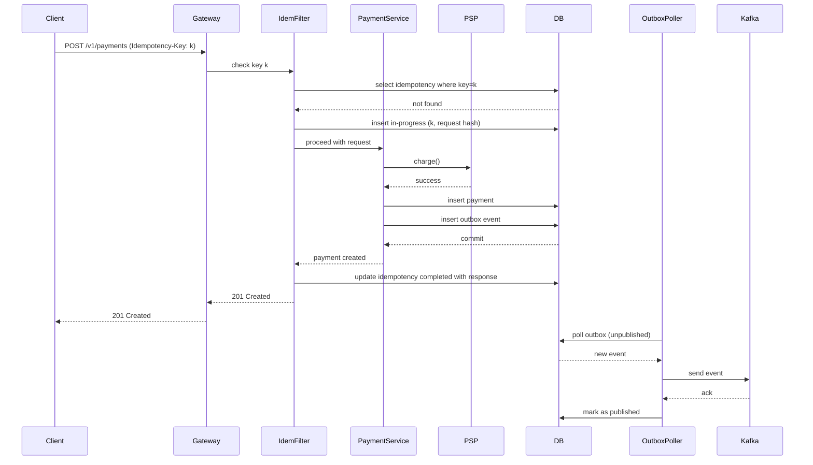

# Building a Production-Ready Payment System: A Senior Engineer's Guide

This self‑study module is a complete architectural blueprint and implementation walkthrough for a **Payment System Project**. Designed for engineers with 5–10+ years of experience, it covers every critical aspect of building, evolving, and operating a payment API in a microservices environment. The project – named **PaymentHub** – is built with **Java 17 / Spring Boot**, uses **OpenAPI 3** for contract‑first design, employs **multi‑module Maven** for strict layering, integrates **Kafka** for event‑driven communication, and implements battle‑tested resilience patterns (idempotency, exponential backoff, cursor pagination, versioning). All code snippets are production‑grade and focus on correctness, scalability, and maintainability.

---

## 1. What (Project Definition)

**PaymentHub** is a RESTful payment processing service that exposes a set of HTTP APIs for:
- Creating charges (`POST /v1/payments`)
- Fetching payment details (`GET /v1/payments/{id}`)
- Listing payments with cursor‑based pagination (`GET /v1/payments?cursor=<timestamp>&limit=20`)
- Issuing refunds (`POST /v1/payments/{id}/refunds`)
- Handling idempotent retries via the `Idempotency-Key` header
- Emitting domain events (e.g., `PaymentSucceeded`, `PaymentFailed`) to Kafka for downstream consumers (analytics, invoicing, fraud detection)

The project is structured as a **multi‑module Maven build** to enforce separation of concerns:
- `api-contract` – OpenAPI specifications and generated request/response DTOs.
- `domain-models` – Pure Java POJOs representing core business entities (no dependencies).
- `psp-client` – Isolated HTTP client for the Payment Service Provider (e.g., Stripe).
- `kafka-events` – Event definitions and producers.
- `application` – Spring Boot application containing controllers, services, repositories, and configuration.
- `common` – Shared utilities (if any) that do not belong to the domain.

The architecture follows **contract‑first** principles: the OpenAPI spec is the single source of truth, from which server stubs and client SDKs are generated.

---

## 2. Why Does It Exist (Problem Statement)

Payment systems must guarantee:
- **Correctness** – No double charges, no lost money.
- **Consistency** – The internal state must always match the PSP’s state.
- **Resilience** – Network failures, PSP timeouts, and client retries must be handled gracefully.
- **Evolvability** – Mobile apps and partners have long release cycles; the API must evolve without breaking them.
- **Observability** – Business events must be reliably emitted for audit and analytics.

Without a purpose‑built design, common pitfalls emerge:
- Duplicate transactions due to missing idempotency.
- Slow and inconsistent payment lists from naive offset pagination.
- Broken mobile clients after a field rename.
- Thread exhaustion from unconfigured HTTP timeouts.
- Build and deployment hell caused by cyclic dependencies.
- Ghost events when Kafka is sent before database commit.

**PaymentHub** exists to solve these exact problems with a proven, reusable architecture.

---

## 3. When to Use It (Triggers)

You would build a system like **PaymentHub** when:
- You are starting a new fintech product or rewriting a legacy payment module.
- You need to integrate with one or more PSPs (Stripe, Adyen, Braintree).
- Your API will be consumed by external partners or mobile apps with slow upgrade cycles.
- Transaction volume is expected to grow beyond tens of thousands, requiring efficient pagination.
- You require strong idempotency guarantees and resilient PSP communication.
- You need to emit payment events for downstream processing (analytics, notifications, reconciliation).

---

## 4. Where to Use It (Architectural Layers)

The **PaymentHub** project is organized into clear layers, each with a specific responsibility:

| Layer                     | Package / Module       | Responsibilities                                                                 |
|---------------------------|------------------------|----------------------------------------------------------------------------------|
| **Edge (API Gateway)**    | (external)            | SSL termination, rate limiting, global timeout, routing to versioned endpoints. |
| **Presentation**          | `application.web`      | REST controllers, request validation, OpenAPI annotations, version negotiation. |
| **Idempotency**           | `application.idempotency` | Filter/interceptor to store and validate idempotency keys.                      |
| **Service (Business)**    | `application.service`  | Orchestrates PSP calls, applies business rules, coordinates transactions.        |
| **Domain**                | `domain-models`        | Pure business objects: `Payment`, `Money`, `PaymentStatus`, `Refund`.           |
| **Persistence**           | `application.repository` | Spring Data JPA repositories for `Payment`, `IdempotencyRecord`, `OutboxEvent`. |
| **PSP Integration**       | `psp-client`           | HTTP client for PSP, configured with timeouts, retries, and circuit breakers.   |
| **Event Publishing**      | `kafka-events`         | Kafka producers and event definitions; outbox pattern ensures reliability.      |
| **Database**              | (external)             | PostgreSQL (or any ACID compliant DB) stores aggregates and outbox.             |
| **Event Bus**             | (external)             | Kafka cluster for at‑least‑once event delivery.                                 |

---

## 5. How to Implement: High‑Level Steps (Project Roadmap)

1. **Set up the multi‑module Maven project** – Create parent POM and modules. Enforce dependency rules with the Maven Enforcer Plugin.
2. **Define the domain models** – Create immutable POJOs for `Payment`, `Money`, etc., with no external dependencies.
3. **Write the OpenAPI contract** – Design endpoints, request/response schemas, and error responses. Include `Idempotency-Key` header.
4. **Generate server stubs** – Use `openapi-generator-maven-plugin` to generate Spring Controller interfaces and DTOs.
5. **Implement the PSP client** – Build a separate module with `WebClient`, configured timeouts, and exponential backoff retries.
6. **Build the persistence layer** – Create JPA entities and repositories. Use `Instant` for timestamps to support cursor pagination.
7. **Implement idempotency** – Add a filter that checks/stores idempotency keys in a dedicated table with expiration.
8. **Develop the payment service** – Write business logic that uses PSP client and repositories, ensuring transactional consistency.
9. **Integrate the outbox pattern** – Save events to an `outbox` table within the same transaction; implement a scheduler or Debezium to publish to Kafka.
10. **Add versioning** – Use URI path versioning (`/v1/…`) and ensure backward‑compatible changes only.
11. **Implement cursor pagination** – Create repository methods that fetch based on a timestamp cursor.
12. **Test thoroughly** – Write unit, integration, and consumer‑driven contract tests (Pact). Use OpenAPI diff tools in CI.
13. **Containerize and deploy** – Create Dockerfiles, Kubernetes manifests, and set up monitoring (Prometheus, Grafana).
14. **Load test** – Verify that the system meets throughput and latency goals.

---

## 6. Architecture Diagram (Mermaid)

```mermaid
graph TB
    Client[Client / Mobile / Partner]
    Gateway[API Gateway]
    subgraph PaymentHub Application
        Controller[REST Controller]
        Idem[Idempotency Filter]
        Service[Payment Service]
        Domain[Domain Models<br/>(module: domain-models)]
        PSPClient[PSP Client<br/>(module: psp-client)]
        Repo[Payment Repository]
        OutboxRepo[Outbox Repository]
        KafkaProd[Kafka Producer<br/>(module: kafka-events)]
    end
    PSP[Payment Service Provider (Stripe)]
    Kafka[Kafka Cluster]
    DB[(PostgreSQL)]
    
    Client --> Gateway
    Gateway --> Controller
    Controller --> Idem
    Idem --> Service
    Service --> PSPClient
    PSPClient --> PSP
    Service --> Repo
    Service --> OutboxRepo
    Repo --> DB
    OutboxRepo --> DB
    Service -.-> |Domain Events| KafkaProd
    KafkaProd --> Kafka
    Kafka --> EventConsumers[Analytics / Invoicing / Fraud]
```

---

## 7. Scenario (Real‑World Use Case)

**Company:** PayFast, a fast‑growing subscription platform.

**Challenge:** PayFast processes 1 million transactions per month. Their current monolithic PHP application has:
- No idempotency – duplicate charges happen weekly.
- Offset pagination on transaction history – admin pages time out for customers with >10k payments.
- Breaking API changes every few months, frustrating mobile and partner developers.
- Synchronous PSP calls with no timeouts – when Stripe has an incident, PayFast’s whole application hangs.
- No eventing – finance team manually reconciles payments via CSV exports.

**Solution:** PayFast decides to build **PaymentHub** as a new microservice, following the patterns in this module. They migrate gradually, starting with new traffic, while legacy system is phased out.

---

## 8. Goal (KPIs)

- **Throughput:** 500 TPS sustained, 1000 TPS burst.
- **Latency:** p95 < 300ms (including PSP round‑trip).
- **Availability:** 99.99% uptime (excluding PSP outages).
- **Idempotency:** Zero duplicate charges.
- **Backward Compatibility:** No client breaks after 10+ API versions.
- **Event Delivery:** At‑least‑once, with exactly‑once semantics downstream via idempotent consumers.

---

## 9. What Can Go Wrong (Failure Modes with Wrong Code)

### 9.1. Missing Idempotency → Double Charge
```java
// WRONG: No idempotency check
@PostMapping("/v1/payments")
public Payment createPayment(@RequestBody PaymentRequest req) {
    // If client retries due to network timeout, this runs twice
    Payment payment = new Payment(req);
    payment = paymentRepository.save(payment);
    pspClient.charge(req);  // PSP called twice
    return payment;
}
```
**Result:** Customer charged twice.

### 9.2. Offset Pagination on Large Table → Timeout & Inconsistent Data
```java
// WRONG: Using offset
@GetMapping("/v1/payments")
public Page<Payment> listPayments(@RequestParam int page, @RequestParam int size) {
    return paymentRepository.findAll(PageRequest.of(page, size));
}
```
**Impact:** As offset grows, database performs full scans; new payments inserted while fetching cause duplicates or missed records.

### 9.3. Breaking Change Without Versioning → Client Crashes
```java
// v1 returned: { "transaction_id": "123" }
// v2 returns:  { "transactionId": "123" }  (field renamed)
// No versioning; same endpoint
@GetMapping("/v1/payments/{id}")
public PaymentV2 getPayment(@PathVariable String id) {
    return new PaymentV2(id);
}
```
**Result:** Mobile app expecting `transaction_id` crashes on startup.

### 9.4. No Timeout on PSP Call → Thread Starvation
```java
// WRONG: Using RestTemplate without timeout
RestTemplate rest = new RestTemplate();
ResponseEntity<String> response = rest.postForEntity(pspUrl, request, String.class);
```
**Impact:** If PSP hangs, thread blocks forever; eventually all threads are consumed, service becomes unavailable.

### 9.5. Cyclic Dependencies Between Modules → Build Failures
```xml
<!-- psp-client module depends on domain-models -->
<dependency>
    <groupId>com.payfast</groupId>
    <artifactId>domain-models</artifactId>
</dependency>
<!-- domain-models mistakenly depends on psp-client (cyclic) -->
<dependency>
    <groupId>com.payfast</groupId>
    <artifactId>psp-client</artifactId>
</dependency>
```
**Problem:** Maven cannot resolve dependency graph; code becomes untestable and tightly coupled.

### 9.6. Sending Kafka Event Before DB Commit → Ghost Event
```java
@Transactional
public Payment charge(PaymentRequest req) {
    Payment payment = new Payment(req);
    payment = paymentRepository.save(payment);
    // WRONG: sending before commit
    kafkaTemplate.send("payment-events", payment.getId(), payment);
    // if exception occurs after send, DB rolls back but event already sent
    pspClient.charge(req);
    return payment;
}
```
**Result:** Event says payment succeeded, but transaction actually failed – leads to incorrect reporting.

### 9.7. Incorrect Handling of Idempotency Key Collisions
```java
// If same key used with a different request body, returning cached success is dangerous
IdempotencyRecord record = idempotencyRepo.findByKey(key);
if (record != null) {
    // WRONG: blindly return previous response even if request differs
    return record.getResponse();
}
```
**Risk:** A client accidentally sends same key with different amount – you might charge the wrong amount and return success.

---

## 10. Why It Fails (Root Cause Analysis)

- **No Idempotency:** Developers assume HTTP is reliable and clients won’t retry; they ignore RFC 7231 idempotency semantics.
- **Pagination Mischoice:** Using offset because it’s the default in Spring Data; performance implications are ignored until production.
- **Versioning Neglect:** No API governance; changes made without impact analysis or contract testing.
- **Missing Timeouts:** Default HTTP client configurations are infinite; developers rarely override them.
- **Module Entanglement:** No architectural oversight; shortcuts create cyclic dependencies.
- **Transactional Integrity Ignored:** Sending events before commit violates atomicity; developers unaware of the outbox pattern.
- **Idempotency Key Misuse:** Not validating request body against stored key hash; assuming all retries are identical.

---

## 11. Correct Approach (Architectural Patterns in PaymentHub)

1. **Idempotency Keys with Payload Hashing** – Store SHA‑256 of request body; reject if new request body differs for same key (409 Conflict).
2. **Cursor‑Based Pagination** – Use `created_at` (or sequential ID) as cursor; always order by that field.
3. **Semantic Versioning** – Backward‑compatible changes (adding fields) only; break only with new major version (`/v2/…`).
4. **Timeouts + Exponential Backoff + Circuit Breaker** – Configure `WebClient` with connect/read timeouts; use Resilience4j for retries and circuit breaker.
5. **Strict Module Layering** – Enforce with Maven Enforcer: `domain-models` depends on nothing; `psp-client` depends only on `domain-models`; `application` depends on all others; no cycles.
6. **Outbox Pattern** – Write event to outbox table in same DB transaction; poll or use CDC (Debezium) to publish to Kafka.
7. **Idempotency Key Collision Handling** – Compare request body hash; return 409 if mismatch.

---

## 12. Key Principles

- **CAP Theorem:** PaymentHub is **CP** (Consistency over Availability). We refuse to accept a payment if we cannot guarantee no double spend.
- **Idempotency:** Every write operation must be idempotent; clients provide a key.
- **Design for Failure:** Assume PSP, network, and database can fail at any moment.
- **Contract First:** The OpenAPI spec is the source of truth; code is generated from it.
- **Separation of Concerns:** Each module has one reason to change.
- **Eventual Consistency for Reads:** Reporting and analytics can be eventually consistent; use Kafka events.
- **Fail Fast:** Short timeouts and circuit breakers prevent resource exhaustion.

---

## 13. Correct Implementation (Production‑Grade Code)

### 13.1. Multi‑Module Maven Project Structure
```
paymenthub/
├── pom.xml (parent)
├── api-contract/
│   ├── pom.xml
│   └── src/main/resources/openapi/payment-api.yaml
├── domain-models/
│   ├── pom.xml
│   └── src/main/java/com/payfast/domain/
├── psp-client/
│   ├── pom.xml
│   └── src/main/java/com/payfast/psp/
├── kafka-events/
│   ├── pom.xml
│   └── src/main/java/com/payfast/events/
├── application/
│   ├── pom.xml
│   └── src/main/java/com/payfast/app/
└── common/
    ├── pom.xml
    └── src/main/java/com/payfast/common/
```

**Parent POM (excerpt) with Enforcer Rules:**
```xml
<plugin>
    <groupId>org.apache.maven.plugins</groupId>
    <artifactId>maven-enforcer-plugin</artifactId>
    <version>3.3.0</version>
    <executions>
        <execution>
            <id>enforce</id>
            <goals><goal>enforce</goal></goals>
            <configuration>
                <rules>
                    <dependencyConvergence/>
                    <banDuplicatePomDependencyVersions/>
                    <requireUpperBoundDeps/>
                    <customRule implementation="com.payfast.build.EnforceLayeringRule">
                        <domainAllowedDependencies>none</domainAllowedDependencies>
                        <pspAllowedDependencies>domain-models</pspAllowedDependencies>
                        <kafkaAllowedDependencies>domain-models</kafkaAllowedDependencies>
                        <applicationAllowedDependencies>domain-models,psp-client,kafka-events,common</applicationAllowedDependencies>
                    </customRule>
                </rules>
            </configuration>
        </execution>
    </executions>
</plugin>
```

### 13.2. Domain Models (module `domain-models`)
```java
package com.payfast.domain.payment;

import java.math.BigDecimal;
import java.time.Instant;
import java.util.Currency;
import java.util.UUID;

public class Payment {
    private final UUID id;
    private final UUID merchantId;
    private final Money amount;
    private final PaymentStatus status;
    private final Instant createdAt;
    private final Instant updatedAt;
    private final String pspReference;
    private final String idempotencyKey;

    // Constructor, getters, equals/hashCode (immutable)
    // No JPA annotations – pure domain
}
```

### 13.3. OpenAPI Contract (file: `payment-api.yaml`)
```yaml
openapi: 3.0.1
info:
  title: PaymentHub API
  version: 1.0.0
servers:
  - url: https://api.payfast.com/v1
paths:
  /payments:
    post:
      summary: Create a payment
      operationId: createPayment
      parameters:
        - name: Idempotency-Key
          in: header
          required: true
          schema:
            type: string
            format: uuid
      requestBody:
        required: true
        content:
          application/json:
            schema:
              $ref: '#/components/schemas/CreatePaymentRequest'
      responses:
        '201':
          description: Payment created
          headers:
            Location:
              schema:
                type: string
          content:
            application/json:
              schema:
                $ref: '#/components/schemas/Payment'
        '400':
          description: Validation error
          content:
            application/json:
              schema:
                $ref: '#/components/schemas/Error'
        '409':
          description: Idempotency key already used with different request
        '422':
          description: PSP declined payment
    get:
      summary: List payments
      parameters:
        - name: cursor
          in: query
          required: false
          schema:
            type: string
            format: date-time
        - name: limit
          in: query
          required: false
          schema:
            type: integer
            default: 20
            maximum: 100
      responses:
        '200':
          headers:
            Next-Cursor:
              schema:
                type: string
          content:
            application/json:
              schema:
                type: array
                items:
                  $ref: '#/components/schemas/Payment'
components:
  schemas:
    CreatePaymentRequest:
      type: object
      required: [merchantId, amount, currency, paymentMethod]
      properties:
        merchantId:
          type: string
          format: uuid
        amount:
          type: integer
          minimum: 1
        currency:
          type: string
          pattern: '^[A-Z]{3}$'
        paymentMethod:
          type: object
          properties:
            type:
              type: string
              enum: [card, bank_transfer]
            token:
              type: string
    Payment:
      type: object
      properties:
        id:
          type: string
          format: uuid
        amount:
          type: integer
        currency:
          type: string
        status:
          type: string
          enum: [pending, succeeded, failed, refunded]
        createdAt:
          type: string
          format: date-time
        pspReference:
          type: string
    Error:
      type: object
      properties:
        code:
          type: string
        message:
          type: string
        details:
          type: object
```

### 13.4. Generated Controller Interface (using openapi-generator)
```java
@Generated(value = "org.openapitools.codegen.languages.SpringCodegen")
@Api(tags = "payments")
public interface PaymentsApi {
    @PostMapping(value = "/payments", produces = "application/json", consumes = "application/json")
    default ResponseEntity<Payment> createPayment(
            @NotNull @ApiParam(value = "Idempotency-Key", required = true) @RequestHeader(value = "Idempotency-Key", required = true) UUID idempotencyKey,
            @ApiParam(value = "", required = true) @Valid @RequestBody CreatePaymentRequest createPaymentRequest) {
        return getDelegate().createPayment(idempotencyKey, createPaymentRequest);
    }

    @GetMapping(value = "/payments", produces = "application/json")
    default ResponseEntity<List<Payment>> listPayments(
            @ApiParam(value = "") @Valid @RequestParam(value = "cursor", required = false) @DateTimeFormat(iso = DateTimeFormat.ISO.DATE_TIME) Instant cursor,
            @ApiParam(value = "", defaultValue = "20") @Valid @RequestParam(value = "limit", required = false, defaultValue = "20") Integer limit) {
        return getDelegate().listPayments(cursor, limit);
    }
}
```

### 13.5. Idempotency Filter with Payload Hashing
```java
@Component
public class IdempotencyFilter implements Filter {
    private final IdempotencyService idempotencyService;

    @Override
    public void doFilter(ServletRequest request, ServletResponse response, FilterChain chain)
            throws IOException, ServletException {
        HttpServletRequest req = (HttpServletRequest) request;
        HttpServletResponse res = (HttpServletResponse) response;

        if (!HttpMethod.POST.matches(req.getMethod())) {
            chain.doFilter(request, response);
            return;
        }

        String key = req.getHeader("Idempotency-Key");
        if (key == null) {
            res.sendError(HttpStatus.BAD_REQUEST.value(), "Idempotency-Key header required for POST");
            return;
        }

        // Read request body (need to cache for multiple reads)
        CachedBodyHttpServletRequest cachedRequest = new CachedBodyHttpServletRequest(req);
        String body = cachedRequest.getReader().lines().collect(Collectors.joining());
        String bodyHash = DigestUtils.sha256Hex(body);

        Optional<IdempotencyRecord> recordOpt = idempotencyService.findByKey(key);
        if (recordOpt.isPresent()) {
            IdempotencyRecord record = recordOpt.get();
            if (!record.getRequestBodyHash().equals(bodyHash)) {
                res.sendError(HttpStatus.CONFLICT.value(), "Idempotency key already used with different request");
                return;
            }
            // Return cached response
            writeCachedResponse(res, record);
            return;
        }

        // Create in‑progress record
        idempotencyService.createInProgress(key, req.getRequestURI(), bodyHash);

        // Proceed with filter chain using cached request
        chain.doFilter(cachedRequest, response);

        // After processing, update record with response
        int status = res.getStatus();
        String responseBody = getResponseBody(res); // needs wrapper to capture
        idempotencyService.complete(key, status, responseBody);
    }
}
```

### 13.6. PSP Client with Timeouts and Exponential Backoff
```java
@Configuration
public class PspClientConfig {
    @Bean
    public WebClient pspWebClient() {
        return WebClient.builder()
                .baseUrl("https://api.stripe.com")
                .defaultHeader("Authorization", "Bearer " + System.getenv("STRIPE_SECRET_KEY"))
                .clientConnector(new ReactorClientHttpConnector(
                        HttpClient.create()
                                .responseTimeout(Duration.ofSeconds(5))
                                .option(ChannelOption.CONNECT_TIMEOUT_MILLIS, 3000)
                ))
                .build();
    }
}

@Service
public class StripeClient {
    private final WebClient webClient;
    private final RetryTemplate retryTemplate;

    public StripeClient(WebClient pspWebClient) {
        this.webClient = pspWebClient;
        this.retryTemplate = RetryTemplate.builder()
                .maxAttempts(3)
                .exponentialBackoff(100, 2, 2000)
                .retryOn(WebClientResponseException.class) // retry on 5xx, but not 4xx
                .build();
    }

    public PaymentResponse charge(CreatePaymentRequest request, UUID idempotencyKey) {
        return retryTemplate.execute(context -> {
            return webClient.post()
                    .uri("/v1/charges")
                    .header("Idempotency-Key", idempotencyKey.toString())
                    .bodyValue(request)
                    .retrieve()
                    .onStatus(HttpStatus::is4xxClientError, clientResponse ->
                        clientResponse.bodyToMono(StripeError.class)
                            .map(StripeException::new))
                    .bodyToMono(PaymentResponse.class)
                    .block();
        });
    }
}
```

### 13.7. Payment Service with Outbox
```java
@Service
@Transactional
public class PaymentService {
    private final PaymentRepository paymentRepo;
    private final OutboxRepository outboxRepo;
    private final StripeClient stripeClient;

    public Payment charge(UUID idempotencyKey, CreatePaymentRequest req) {
        // PSP call
        PaymentResponse pspResponse = stripeClient.charge(req, idempotencyKey);

        Payment payment = Payment.builder()
                .id(UUID.randomUUID())
                .merchantId(req.getMerchantId())
                .amount(Money.of(req.getAmount(), req.getCurrency()))
                .status(mapStatus(pspResponse.getStatus()))
                .pspReference(pspResponse.getId())
                .idempotencyKey(idempotencyKey)
                .createdAt(Instant.now())
                .build();

        payment = paymentRepo.save(payment);

        // Write to outbox
        OutboxEvent outbox = OutboxEvent.builder()
                .id(UUID.randomUUID())
                .aggregateId(payment.getId())
                .eventType("PaymentSucceeded")
                .payload(toJson(payment))
                .createdAt(payment.getCreatedAt())
                .build();
        outboxRepo.save(outbox);

        return payment;
    }
}
```

### 13.8. Outbox Poller (Scheduler) Publishing to Kafka
```java
@Component
public class OutboxPoller {
    private final OutboxRepository outboxRepo;
    private final KafkaTemplate<String, String> kafkaTemplate;

    @Scheduled(fixedDelay = 5000)
    @Transactional(propagation = Propagation.REQUIRES_NEW)
    public void publishOutboxEvents() {
        List<OutboxEvent> events = outboxRepo.findTop100ByPublishedFalseOrderByCreatedAtAsc();
        for (OutboxEvent event : events) {
            try {
                kafkaTemplate.send("payment-events", event.getAggregateId().toString(), event.getPayload()).get(5, TimeUnit.SECONDS);
                event.setPublished(true);
                outboxRepo.save(event);
            } catch (Exception e) {
                // log and continue; next poll will retry
            }
        }
    }
}
```

### 13.9. Cursor Pagination Repository
```java
public interface PaymentRepository extends JpaRepository<Payment, UUID> {
    @Query("SELECT p FROM Payment p WHERE p.merchantId = :merchantId AND p.createdAt < :cursor ORDER BY p.createdAt DESC")
    List<Payment> findNext(@Param("merchantId") UUID merchantId, @Param("cursor") Instant cursor, Pageable pageable);

    @Query("SELECT p FROM Payment p WHERE p.merchantId = :merchantId ORDER BY p.createdAt DESC")
    List<Payment> findFirstPage(@Param("merchantId") UUID merchantId, Pageable pageable);
}
```
Controller uses these methods to implement cursor pagination.

---

## 14. Execution Flow (Mermaid Sequence Diagram)



---

## 15. Common Mistakes (Anti‑Patterns Seen in Senior Engineering)

1. **Relying on database‑generated IDs for idempotency** – Natural keys are better, but client‑supplied keys are safest.
2. **Using `@Version` for optimistic locking without idempotency** – Can prevent concurrent updates but not duplicate creations.
3. **Storing idempotency keys indefinitely** – Must expire after reasonable time (e.g., 24 hours) to avoid table bloat.
4. **Not hashing the request body** – Returning cached response for same key with different request body is dangerous.
5. **Using offset pagination for admin panels with huge datasets** – Even admin pages need cursor after a certain size.
6. **Adding fields to response without considering clients** – Safe; but removing fields or changing types is not.
7. **Not testing with old clients during API evolution** – Consumer‑driven contract tests catch breaks.
8. **Configuring timeouts only at the gateway** – Service‑level timeouts are still needed for internal calls.
9. **Using same retry policy for all PSP errors** – Should distinguish between retriable (5xx, timeout) and non‑retriable (4xx).
10. **Letting the outbox table grow indefinitely** – Must archive or delete processed events.
11. **Forgetting to set `spring.kafka.producer.transaction-id-prefix` when using Kafka transactions** – Not needed with outbox pattern unless using exactly‑once.
12. **Not handling the case where PSP returns success but saving to DB fails** – This is rare; but idempotency key will prevent double charge if client retries.

---

## 16. Decision Matrix

| Concern                         | Option A                      | Option B                        | Winner (for PaymentHub)      |
|----------------------------------|-------------------------------|---------------------------------|-------------------------------|
| **Pagination**                   | Offset (simple)               | Cursor (consistent, fast)       | **Cursor**                    |
| **Versioning**                   | URI path (`/v1/…`)            | Accept header (`application/vnd…`) | **URI path** (discoverable, cache-friendly) |
| **Idempotency storage**          | In‑memory (fast, volatile)    | Database (durable)               | **Database** (durability > speed) |
| **PSP retry backoff**            | Fixed                         | Exponential + jitter             | **Exponential + jitter**      |
| **Event publishing**             | Immediate (after DB commit)   | Outbox pattern                   | **Outbox** (reliability)      |
| **Module layering**              | Loose (any dependency)        | Strict (enforced)                | **Strict** (maintainability)  |
| **Error response format**        | Simple string                  | Structured (RFC 7807)            | **Structured** (machine‑readable) |

---

## Final Words

Building **PaymentHub** following these patterns ensures a production‑ready payment system that can scale, evolve, and survive real‑world failures. As a senior engineer, your role is not just to write code but to make architectural decisions that anticipate the future. Always revisit these trade‑offs as requirements change, and never compromise on idempotency and data consistency in the payments domain.

**Next Steps:** Clone the [PaymentHub repository](#) (hypothetical) and start implementing the modules in the order presented. Run the integration tests, simulate PSP failures, and observe how the system behaves. Use this guide as your reference during design reviews and incident post‑mortems.
