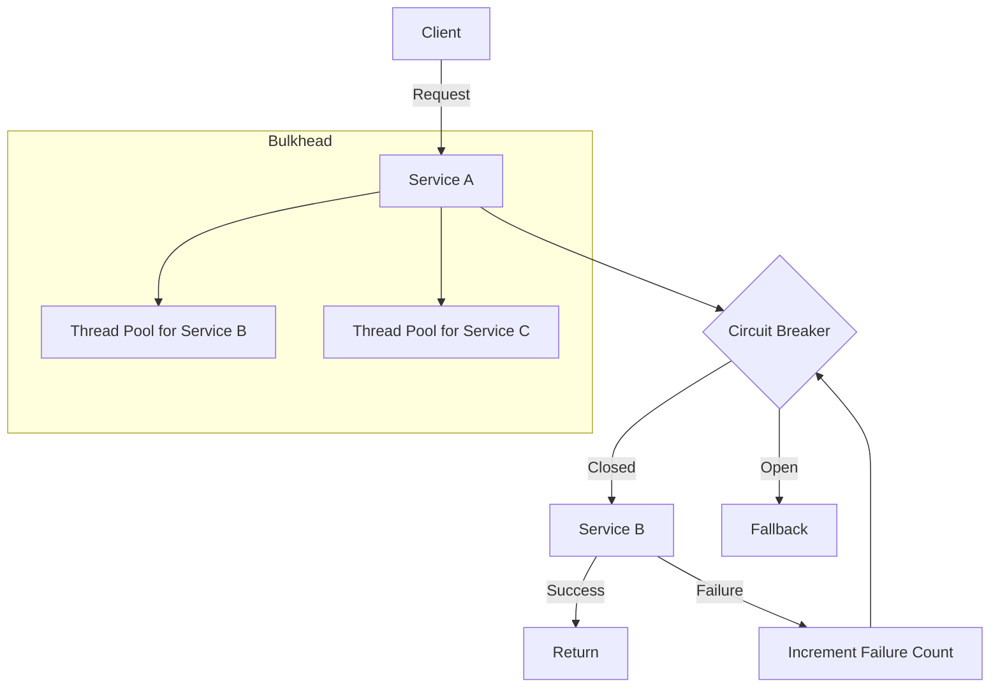
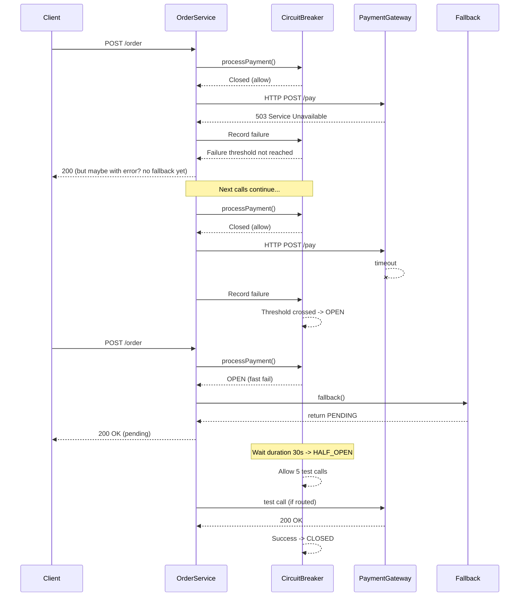
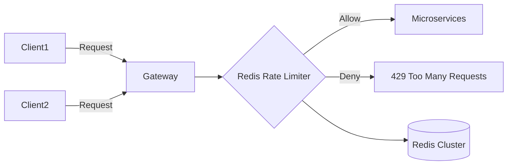
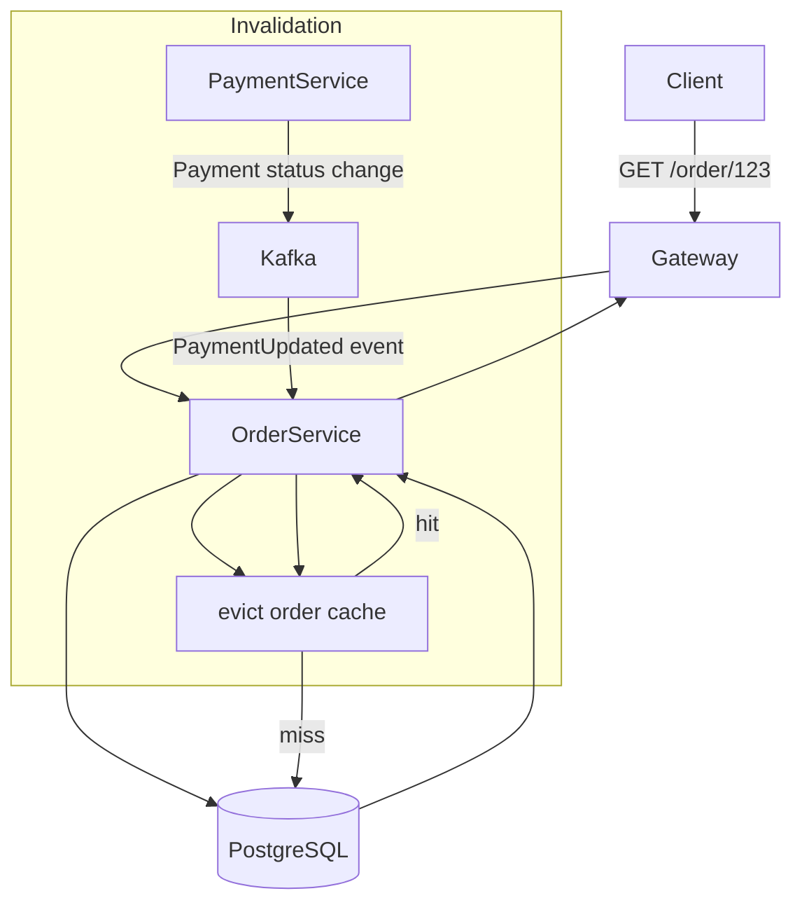
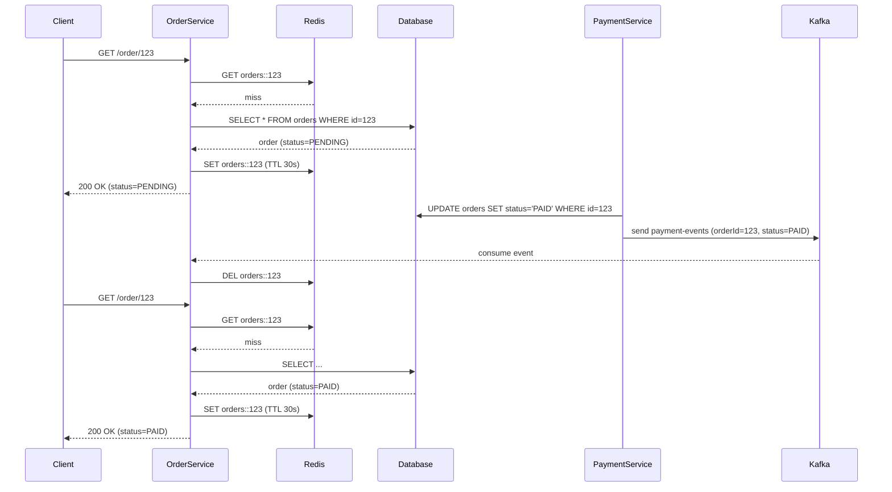
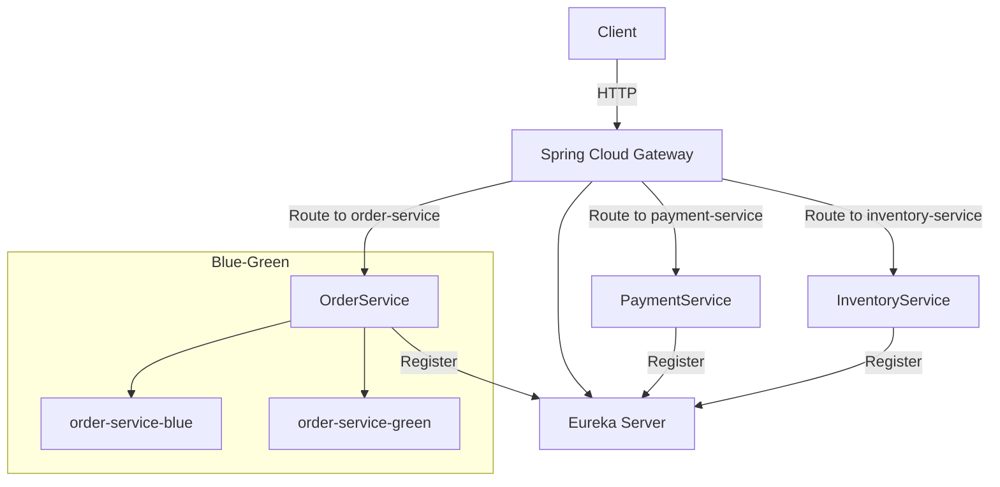
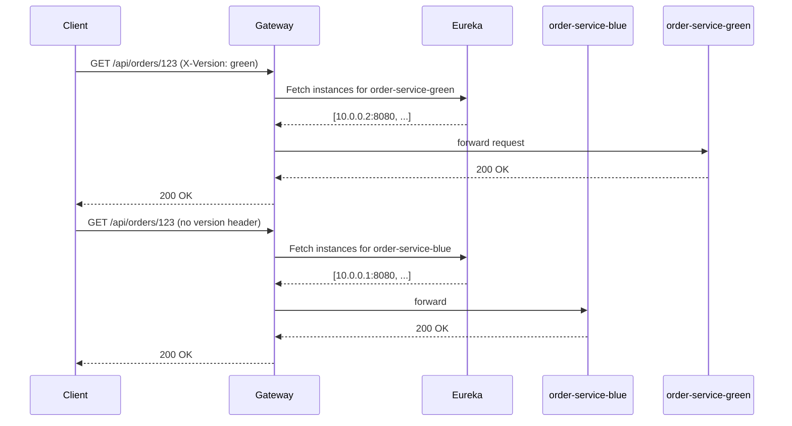
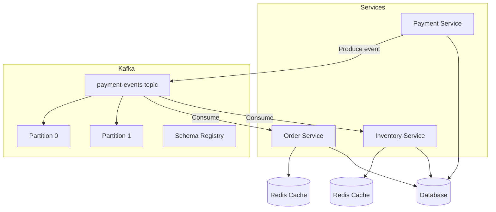

# Building Resilient, Scalable Microservices with Spring Boot: A Deep-Dive Self-Study Module

**Author:** Principal Software Architect  
**Target Audience:** Senior Engineers (5-10+ years)  
**Stack:** Java 17 / Spring Boot 3.x, Spring Cloud, Resilience4j, Redis, Kafka, Eureka  
**Duration:** Approx. 12 hours (self-paced)

---

## Overview

This module bridges the gap between theoretical resilience patterns and their practical, production-grade implementation in a microservices ecosystem. We will dissect five critical areas:

1. **Circuit Breaker & Bulkhead** – Preventing cascading failures and isolating faults.  
2. **Rate Limiting & Throttling** – Controlling traffic to protect downstream services.  
3. **Caching Strategies** – Reducing latency and load, with a focus on consistency in payment statuses.  
4. **API Gateway Patterns** – Routing, discovery, and safe deployments (blue‑green).  
5. **Event‑Driven Cache Invalidation** – Using Kafka to maintain cache consistency.

Each section follows a strict 16‑step format: from definition to decision matrix, including real‑world scenarios, failure modes, and validated code. Expect trade‑off analyses, edge cases, and operational insights.

---

## Module 1: Circuit Breaker & Bulkhead

### 1. What (Concise Definition)

- **Circuit Breaker:** A stateful proxy that monitors for failures and trips (opens) when a threshold is exceeded, preventing calls to an unhealthy downstream service. States: *Closed* (normal), *Open* (fail fast), *Half‑Open* (test recovery).
- **Bulkhead:** An isolation pattern that limits the number of concurrent calls to a downstream service, protecting the caller’s resources from being exhausted by a single failing dependency.

### 2. Why Does It Exist

- **Problem:** In distributed systems, a single slow or failing service can cascade, consuming threads/connections and bringing down the entire caller (cascading failure).
- **Solution:** Circuit breakers stop making requests to known‑bad services; bulkheads partition resources so that a failure in one partition doesn’t starve others.

### 3. When to Use It

- When calling remote services (REST, gRPC, databases) with non‑trivial latency.
- When you have strict SLOs and need to guarantee responsiveness even when dependencies fail.
- During high concurrency to avoid thread pool exhaustion.

### 4. Where to Use It (Architectural Layers)

- **Service‑to‑Service calls:** Inside business logic (e.g., using Resilience4j annotations).
- **API Gateway:** Protecting routes to downstream services.
- **Database clients:** Limiting connection pool usage per critical operation.

### 5. How to Implement (High‑Level Steps)

1. Choose a library (Resilience4j for Spring Boot).
2. Define configuration: failure rate threshold, wait duration in open state, permitted calls in half‑open, etc.
3. Annotate methods with `@CircuitBreaker` and/or `@Bulkhead`.
4. Provide fallback methods.
5. Monitor metrics (Micrometer + Prometheus).

### 6. Architecture Diagram (Mermaid)



### 7. Scenario: Payment Processing Service

- **Context:** An order service calls a payment gateway to process payments. The gateway occasionally becomes slow or returns 5xx errors.
- **Goal:** Prevent order service threads from being blocked, avoid retry storms, and provide a graceful degraded response (e.g., “Payment pending, try later”).

### 8. Goal (KPIs)

- **Latency:** P99 latency of order service remains < 500ms even when payment gateway fails.
- **Throughput:** Order service continues to process 80% of requests (non‑payment ones) at full rate.
- **Availability:** Circuit breaker prevents 100% of calls to unhealthy gateway after tripping.

### 9. What Can Go Wrong (Failure Modes)

- **Wrong Code Example 1:** No timeout on HTTP client → threads hang indefinitely.
  ```java
  // BAD: No timeout, can cause thread exhaustion
  RestTemplate rt = new RestTemplate();
  ResponseEntity<String> resp = rt.getForEntity(url, String.class);
  ```
- **Wrong Code Example 2:** Circuit breaker with too high threshold → never trips.
  ```java
  // BAD: 90% failure rate with 100 minimum calls means it may never open
  @CircuitBreaker(name = "payment", fallbackMethod = "fallback")
  public PaymentResponse callPayment(PaymentRequest req) {
      // ...
  }
  // application.yml
  resilience4j.circuitbreaker.instances.payment.slidingWindowSize = 100
  resilience4j.circuitbreaker.instances.payment.failureRateThreshold = 90
  ```
- **Wrong Code Example 3:** Bulkhead with unbounded queues → memory exhaustion.

### 10. Why It Fails (Root Cause Analysis)

- **Thread pool saturation:** If HTTP client lacks timeouts, threads block forever, filling the bulkhead queue and causing rejections.
- **Threshold misconfiguration:** Too large a window or too high a threshold delays tripping, allowing failures to propagate.
- **Fallback that also fails:** Fallback calling same downstream or performing heavy computation defeats the purpose.

### 11. Correct Approach

- Use Resilience4j with sensible defaults tuned for your SLOs.
- Combine circuit breaker with timeouts (e.g., `@TimeLimiter`).
- Bulkhead with a rejection strategy (e.g., `AbortException`) and a small queue to absorb bursts.
- Make fallbacks fast, idempotent, and preferably local (cached response or default value).

### 12. Key Principles

- **Fail Fast:** Don’t waste resources on known‑bad operations.
- **Isolation:** Protect critical resources (threads, connections) per dependency.
- **Self‑healing:** Half‑open state allows recovery without manual intervention.

### 13. Correct Implementation (Java / Spring Boot)

**Dependencies:**
```xml
<dependency>
    <groupId>io.github.resilience4j</groupId>
    <artifactId>resilience4j-spring-boot3</artifactId>
    <version>2.2.0</version>
</dependency>
<dependency>
    <groupId>org.springframework.boot</groupId>
    <artifactId>spring-boot-starter-aop</artifactId>
</dependency>
```

**Configuration (`application.yml`):**
```yaml
resilience4j.circuitbreaker:
  instances:
    paymentGateway:
      slidingWindowType: COUNT_BASED
      slidingWindowSize: 20
      minimumNumberOfCalls: 10
      failureRateThreshold: 50
      waitDurationInOpenState: 30s
      permittedNumberOfCallsInHalfOpenState: 5
      automaticTransitionFromOpenToHalfOpenEnabled: true

resilience4j.timelimiter:
  instances:
    paymentGateway:
      timeoutDuration: 2s

resilience4j.bulkhead:
  instances:
    paymentGateway:
      maxConcurrentCalls: 20
      maxWaitDuration: 10ms
```

**Service Code:**
```java
@Service
public class PaymentService {
    private static final Logger log = LoggerFactory.getLogger(PaymentService.class);
    private final RestClient restClient;

    public PaymentService(RestClient.Builder builder) {
        this.restClient = builder
                .baseUrl("https://payment-gateway.example.com")
                .build();
    }

    @CircuitBreaker(name = "paymentGateway", fallbackMethod = "fallback")
    @Bulkhead(name = "paymentGateway", type = Bulkhead.Type.THREADPOOL)
    @TimeLimiter(name = "paymentGateway")
    public CompletableFuture<PaymentResponse> processPayment(PaymentRequest request) {
        return CompletableFuture.supplyAsync(() -> {
            // actual call
            return restClient.post()
                    .uri("/pay")
                    .body(request)
                    .retrieve()
                    .body(PaymentResponse.class);
        });
    }

    private CompletableFuture<PaymentResponse> fallback(PaymentRequest request, Exception ex) {
        log.warn("Fallback for payment request {} due to {}", request.orderId(), ex.getMessage());
        return CompletableFuture.completedFuture(
                new PaymentResponse("PENDING", "Payment service unavailable, will retry later")
        );
    }
}
```

**Note:** The combination of `@Bulkhead(type=THREADPOOL)` and `@TimeLimiter` requires returning `CompletableFuture`; Resilience4j handles the async weaving.

### 14. Execution Flow (Mermaid Sequence)



### 15. Common Mistakes (Anti‑Patterns)

- **Monolithic circuit breaker:** One breaker for all downstream calls – a failure in one affects all.
- **Synchronous fallback that blocks:** Fallback performing I/O without its own isolation.
- **Ignoring timeouts:** Circuit breaker without timeouts still blocks threads.
- **No monitoring:** Blind to how often breaker trips; can’t tune thresholds.

### 16. Decision Matrix: Circuit Breaker vs. Retry vs. Bulkhead

| Pattern        | When to Use                                                                 | Trade‑offs                                                                 |
|----------------|-----------------------------------------------------------------------------|----------------------------------------------------------------------------|
| **Circuit Breaker** | Downstream is failing or slow; need to stop cascading failures.            | Adds latency when closed; complex tuning.                                  |
| **Retry**      | Failures are transient (network glitches).                                  | Can amplify load if downstream is overloaded.                              |
| **Bulkhead**   | Protect caller’s resources from a noisy neighbour.                          | Reduces concurrency; may cause queuing delays.                             |
| **Combination**| Use circuit breaker + retry + bulkhead together for robust protection.      | Increased complexity; careful ordering (retry before circuit breaker).     |

---

## Module 2: Rate Limiting & Throttling

### 1. What

- **Token Bucket:** A bucket holds tokens that refill at a steady rate; each request consumes a token. Allows bursts up to bucket size.
- **Quota (Leaky Bucket):** Requests are processed at a fixed rate; excess is queued or dropped.
- **Client‑based throttling:** Rate limits applied per API key, user, or IP.
- **DDoS awareness:** Detect and block abnormal traffic patterns at edge.

### 2. Why

- Protect backend services from overload (intentional or unintentional).
- Ensure fair usage among tenants.
- Mitigate DDoS attacks by dropping excessive requests early.

### 3. When

- Public APIs with rate limits in documentation.
- Internal services with strict capacity.
- During high‑traffic events (flash sales) to maintain stability.

### 4. Where

- **Edge (API Gateway):** Global and per‑client limits.
- **Service layer:** Fine‑grained limits per endpoint.
- **Load balancer:** Basic IP‑based rate limiting.

### 5. How

1. Choose algorithm: Token bucket (allow bursts) or leaky bucket (smooth output).
2. Store counters in a fast, distributed store (Redis).
3. Implement middleware/filter that checks limit before processing.
4. Return `429 Too Many Requests` with `Retry-After` header.

### 6. Architecture Diagram



### 7. Scenario: Payment API with Tiered Pricing

- **Context:** A payment gateway API offers three tiers: Free (10 req/min), Premium (1000 req/min), Enterprise (10000 req/min). Bursts allowed up to 2× rate.
- **Goal:** Enforce limits per API key, allow short bursts, and return meaningful headers.

### 8. Goal

- **Throughput:** Handle peak load of 20000 req/min for enterprise tenants.
- **Latency:** Rate limiting adds < 5ms overhead.
- **Fairness:** No single tenant can starve others.

### 9. What Can Go Wrong

- **Wrong Code Example 1:** In‑memory rate limiting in a multi‑instance deployment → limits per instance, not globally.
  ```java
  // BAD: using Guava RateLimiter in each instance
  @Component
  public class LocalRateLimiter {
      private final RateLimiter limiter = RateLimiter.create(10.0); // 10 permits/sec
      public boolean tryAcquire() {
          return limiter.tryAcquire();
      }
  }
  ```
- **Wrong Code Example 2:** Redis without atomic operations → race conditions allow bursts beyond limit.
  ```java
  // BAD: check-then-act without Lua script
  Long current = redisTemplate.opsForValue().increment(key);
  if (current == 1) {
      redisTemplate.expire(key, Duration.ofSeconds(1));
  }
  if (current > limit) {
      // might exceed due to concurrent increments
  }
  ```
- **Wrong Code Example 3:** No burst handling → legitimate clients with uneven traffic are throttled unnecessarily.

### 10. Why It Fails

- **Clock skew:** In distributed Redis, if TTL is based on local time, limits can drift.
- **Incorrect key design:** Using only IP behind NAT lumps many users together.
- **Missing headers:** Clients can’t adapt without `X-RateLimit-*` headers.

### 11. Correct Approach

- Use Redis with Lua scripting for atomic check‑and‑increment (token bucket or sliding window).
- For token bucket, store last refill timestamp and token count.
- Include `X-RateLimit-Limit`, `X-RateLimit-Remaining`, `X-RateLimit-Reset` headers.
- At edge, combine with Web Application Firewall (WAF) for DDoS.

### 12. Key Principles

- **Fail closed:** If Redis is down, decide whether to deny all requests (fail secure) or allow (fail open) – usually deny for public APIs.
- **Idempotency:** Rate limiting should not affect idempotent retries (e.g., use a separate key for retry detection).

### 13. Correct Implementation (Spring Boot + Redis + Lua)

**Lua script (`token_bucket.lua`):**
```lua
-- KEYS[1] = bucket key
-- ARGV[1] = capacity (max tokens)
-- ARGV[2] = refill rate (tokens per second)
-- ARGV[3] = current timestamp in seconds
-- returns 0 if denied, 1 if allowed, and updates remaining tokens
local bucket = redis.call('hmget', KEYS[1], 'tokens', 'lastRefill')
local tokens = tonumber(bucket[1]) or ARGV[1]
local lastRefill = tonumber(bucket[2]) or ARGV[3]
local capacity = tonumber(ARGV[1])
local rate = tonumber(ARGV[2])
local now = tonumber(ARGV[3])

-- refill tokens based on elapsed time
local elapsed = now - lastRefill
local newTokens = math.min(capacity, tokens + elapsed * rate)
if newTokens >= 1 then
    redis.call('hmset', KEYS[1], 'tokens', newTokens - 1, 'lastRefill', now)
    redis.call('expire', KEYS[1], math.ceil(capacity / rate * 2)) -- TTL
    return {1, newTokens - 1, capacity}
else
    return {0, newTokens, capacity}
end
```

**Spring Service:**
```java
@Component
public class RedisRateLimiter {
    private final StringRedisTemplate redisTemplate;
    private final RedisScript<List<Long>> tokenBucketScript;

    public RedisRateLimiter(StringRedisTemplate redisTemplate) {
        this.redisTemplate = redisTemplate;
        this.tokenBucketScript = new DefaultRedisScript<>(
                "local result = redis.call('HMGET', KEYS[1], 'tokens', 'lastRefill'); ...", // full script
                new ParameterizedTypeReference<List<Long>>() {}
        );
    }

    public RateLimitResult tryAcquire(String key, int capacity, double refillRate) {
        List<Long> results = redisTemplate.execute(
                tokenBucketScript,
                Arrays.asList(key),
                String.valueOf(capacity),
                String.valueOf(refillRate),
                String.valueOf(Instant.now().getEpochSecond())
        );
        boolean allowed = results.get(0) == 1;
        long remaining = results.get(1);
        long limit = results.get(2);
        return new RateLimitResult(allowed, remaining, limit);
    }
}
```

**Filter to apply limits:**
```java
@Component
public class RateLimitingFilter implements Filter {
    private final RedisRateLimiter rateLimiter;
    @Override
    public void doFilter(ServletRequest request, ServletResponse response, FilterChain chain) {
        HttpServletRequest req = (HttpServletRequest) request;
        HttpServletResponse res = (HttpServletResponse) response;
        String apiKey = req.getHeader("X-API-Key");
        if (apiKey == null) {
            // reject or apply default
        }
        RateLimitResult result = rateLimiter.tryAcquire("rate:" + apiKey, 100, 10.0); // 100 tokens, refill 10/sec
        res.setHeader("X-RateLimit-Limit", String.valueOf(result.limit()));
        res.setHeader("X-RateLimit-Remaining", String.valueOf(result.remaining()));
        if (!result.allowed()) {
            res.setStatus(429);
            res.setHeader("Retry-After", "1");
            return;
        }
        chain.doFilter(request, response);
    }
}
```

### 14. Execution Flow (Sequence)

```mermaid
sequenceDiagram
    participant C as Client
    participant G as Gateway
    participant R as Redis
    participant S as Backend

    C->>G: GET /api/resource (API Key: abc)
    G->>R: EVAL token_bucket script (key=rate:abc)
    R-->>G: [1, 9, 10] (allowed, remaining 9)
    G->>S: forward request
    S-->>G: 200 OK
    G-->>C: 200 OK + headers
    C->>G: GET /api/resource (again)
    G->>R: EVAL script
    R-->>G: [1, 8, 10]
    G->>S: forward
    ...
    C->>G: many requests
    G->>R: EVAL script
    R-->>G: [0, 0, 10] (denied)
    G-->>C: 429 Too Many Requests + Retry-After
```

### 15. Common Mistakes

- **Using `INCR` without expiration:** Keys stay forever, consuming memory.
- **Not handling Redis failures:** Without a fallback, entire system can go down.
- **Applying limits to health checks:** Health endpoints should bypass rate limiting.
- **Symmetric limits for all clients:** No differentiation between free and premium.

### 16. Decision Matrix: Token Bucket vs. Leaky Bucket vs. Fixed Window

| Algorithm       | Pros                                                                 | Cons                                                                 | Use Case                                  |
|-----------------|----------------------------------------------------------------------|----------------------------------------------------------------------|-------------------------------------------|
| **Token Bucket**| Allows bursts, easy to implement with Redis.                         | Can still overwhelm if burst is too large.                           | APIs with variable traffic (social media).|
| **Leaky Bucket**| Smooth output, predictable rate.                                     | Rejects bursts even if capacity exists; queue can build up.          | Downstream with strict rate limits (DB).  |
| **Fixed Window**| Simple, uses `INCR` and TTL.                                         | Traffic spikes at window boundaries (edge problem).                  | Simple, non‑critical limits.              |
| **Sliding Window**| More accurate, avoids edge spikes.                                 | More complex, requires storing request timestamps.                   | High‑precision rate limiting.             |

---

## Module 3: Caching Strategies – HTTP vs. Spring Cache, Redis, and Consistency

### 1. What

- **HTTP Caching:** Leveraging `Cache-Control` headers, ETags, and reverse proxies (e.g., nginx) to cache responses.
- **Spring Cache Abstraction:** Annotations (`@Cacheable`, `@CacheEvict`) that work with various providers (Redis, Caffeine, etc.).
- **Redis TTL & Eviction:** Time‑to‑live and eviction policies (LRU, LFU) to manage memory.
- **Cache Consistency:** Keeping cached data in sync with the source of truth, especially for mutable entities like payment status.

### 2. Why

- Reduce latency (cached responses are fast).
- Reduce load on databases and downstream services.
- Handle read‑heavy workloads efficiently.

### 3. When

- Data that changes infrequently (product catalog, reference data).
- Read‑mostly APIs with high traffic.
- When downstream services have high latency or cost.

### 4. Where

- **Client‑side:** Browser cache (HTTP).
- **CDN/Edge:** Reverse proxy cache.
- **Service layer:** Spring Cache for method results.
- **Database layer:** Redis as a look‑aside cache.

### 5. How

1. Identify cacheable data and its invalidation triggers.
2. Choose cache provider (Redis for distributed, Caffeine for local).
3. Configure TTL and eviction policies.
4. Implement cache‑aside or read‑through pattern.
5. For consistency, use event‑driven invalidation (Kafka) or write‑through.

### 6. Architecture Diagram



### 7. Scenario: Order Status with Payment Updates

- **Context:** An e‑commerce platform where orders are read frequently, but payment status changes from `PENDING` to `PAID` after a few seconds. The payment service emits an event when status changes.
- **Goal:** Cache order details to reduce DB load, but ensure that after payment, the next read sees the updated status within seconds.

### 8. Goal

- **Latency:** 95% of order reads under 10ms (cache hit).
- **Consistency:** Maximum staleness < 2 seconds after payment completion.
- **Throughput:** Handle 10k reads/sec with a small DB cluster.

### 9. What Can Go Wrong

- **Wrong Code Example 1:** No TTL on cache → stale data lives forever.
  ```java
  @Cacheable("orders")
  public Order getOrder(Long id) {
      return orderRepository.findById(id).orElseThrow();
  }
  // No eviction, no TTL -> order status never updates
  ```
- **Wrong Code Example 2:** Cache eviction on update, but update happens in another service that doesn’t know about cache.
  ```java
  // In PaymentService after status change:
  orderRepository.save(order); // DB updated
  // But cache in OrderService is not evicted!
  ```
- **Wrong Code Example 3:** Using HTTP caching without `must-revalidate` → browser may serve stale content.
  ```http
  Cache-Control: max-age=3600
  ```
  (Browser won't revalidate for an hour, even if backend changes.)

### 10. Why It Fails

- **Distributed systems with separate caches:** Each service has its own cache; an update in one doesn't invalidate the other.
- **Missing invalidation logic:** Developers forget to add `@CacheEvict` on update methods.
- **Network partitions:** Cache invalidation events may be lost if Kafka is down.

### 11. Correct Approach

- Use **cache‑aside** (look‑aside) with TTL as a safety net.
- For mutable data, implement **write‑invalidate** pattern: on update, publish an event; consumers evict relevant cache keys.
- For payment status, which is critical, consider **read‑through with short TTL** (e.g., 5 seconds) and also invalidate on event.
- At HTTP level, use `ETag` and `Cache-Control: no-cache` for dynamic content, or short `max-age` with `must-revalidate`.

### 12. Key Principles

- **CAP trade‑off:** In a distributed cache, you may sacrifice consistency for availability (eventual consistency is often acceptable).
- **Idempotent eviction:** Evicting a key multiple times is harmless.
- **Stale read is acceptable** if TTL is short and business can tolerate it (e.g., product inventory, but not payment status for financial reconciliation).

### 13. Correct Implementation (Spring Cache + Redis + Kafka Invalidation)

**Dependencies:**
```xml
<dependency>
    <groupId>org.springframework.boot</groupId>
    <artifactId>spring-boot-starter-data-redis</artifactId>
</dependency>
<dependency>
    <groupId>org.springframework.kafka</groupId>
    <artifactId>spring-kafka</artifactId>
</dependency>
```

**Cache Configuration:**
```java
@Configuration
@EnableCaching
public class CacheConfig {
    @Bean
    public RedisCacheManagerBuilderCustomizer redisCacheManagerBuilderCustomizer() {
        return builder -> builder
                .withCacheConfiguration("orders",
                        RedisCacheConfiguration.defaultCacheConfig()
                                .entryTtl(Duration.ofSeconds(30)) // short TTL for orders
                                .disableCachingNullValues());
    }
}
```

**Order Service (caching side):**
```java
@Service
public class OrderService {
    @Cacheable(value = "orders", key = "#id")
    public Order getOrder(Long id) {
        // simulate DB call
        return orderRepository.findById(id).orElseThrow();
    }

    @CacheEvict(value = "orders", key = "#order.id")
    public Order updateOrder(Order order) {
        return orderRepository.save(order);
    }

    @KafkaListener(topics = "payment-events")
    public void handlePaymentEvent(PaymentEvent event) {
        if ("PAID".equals(event.getStatus())) {
            // Evict cache for this order
            cacheEvict(event.getOrderId()); // we need a way to call cache eviction programmatically
        }
    }

    // Programmatic eviction if needed
    @Autowired
    private CacheManager cacheManager;
    public void cacheEvict(Long orderId) {
        Cache cache = cacheManager.getCache("orders");
        if (cache != null) {
            cache.evict(orderId);
        }
    }
}
```

**Payment Service (event publisher):**
```java
@Service
public class PaymentService {
    @Autowired
    private KafkaTemplate<String, PaymentEvent> kafkaTemplate;

    public void markAsPaid(Long orderId) {
        // update DB...
        PaymentEvent event = new PaymentEvent(orderId, "PAID", Instant.now());
        kafkaTemplate.send("payment-events", orderId.toString(), event);
    }
}
```

**HTTP Caching (Controller Level):**
```java
@GetMapping("/order/{id}")
public ResponseEntity<Order> getOrder(@PathVariable Long id) {
    Order order = orderService.getOrder(id);
    return ResponseEntity.ok()
            .cacheControl(CacheControl.maxAge(10, TimeUnit.SECONDS).mustRevalidate())
            .eTag("\"" + order.getVersion() + "\"") // version or hash
            .body(order);
}
```

### 14. Execution Flow (Sequence)



### 15. Common Mistakes

- **Caching entire entities without considering relationships:** If an order contains line items that can change independently, cache invalidation becomes complex.
- **Using default JVM serialization with Redis:** Inefficient; prefer JSON or Protocol Buffers.
- **Not handling cache stampede:** When a key expires and many requests simultaneously hit the DB. Use locking or early recomputation.
- **Ignoring cache warm‑up:** After deployment, cache is cold; DB may get thundering herd.

### 16. Decision Matrix: HTTP Cache vs. Spring Cache (Local) vs. Distributed Cache (Redis)

| Cache Type          | Pros                                                                 | Cons                                                                    | Use Case                                      |
|---------------------|----------------------------------------------------------------------|-------------------------------------------------------------------------|-----------------------------------------------|
| **HTTP Cache**      | Offloads traffic from servers, very low latency.                     | Cannot cache personalized data; invalidation is coarse.                | Public, static or semi‑static content.        |
| **Spring Local (Caffeine)**| Ultra‑fast (in‑memory), no network latency.                   | Not shared across instances; each instance has its own copy.           | Per‑instance data (configuration, reference). |
| **Redis (Distributed)**| Shared across instances, consistent view, TTL and eviction policies.| Network latency, additional infrastructure, consistency trade‑offs.    | Session data, database query results, counters.|

For payment status, a **hybrid** approach: Redis with short TTL + event‑driven invalidation ensures near‑real‑time consistency with low latency.

---

## Module 4: API Gateway Patterns – Routing, Auth, Aggregation, Discovery, Blue‑Green

### 1. What

- **API Gateway:** A single entry point for client requests that handles routing, authentication, rate limiting, aggregation, and protocol translation.
- **Service Discovery:** Using Eureka to dynamically locate service instances.
- **Blue‑Green Deployment:** Running two identical environments (blue = old, green = new) and switching traffic via gateway routing rules.

### 2. Why

- Simplify client interaction by hiding microservice complexity.
- Centralize cross‑cutting concerns (auth, logging, rate limiting).
- Enable zero‑downtime deployments and canary releases.

### 3. When

- When you have multiple microservices with different APIs.
- When you need to enforce security policies centrally.
- When you want to perform A/B testing or gradual rollouts.

### 4. Where

- At the edge of your microservices architecture, between clients and internal services.

### 5. How (High‑Level)

1. Set up Spring Cloud Gateway with Eureka client.
2. Define routes in configuration or code.
3. Add filters for authentication, rate limiting, etc.
4. Implement a `DiscoveryClient` to locate instances.
5. For blue‑green, use metadata or separate service names.

### 6. Architecture Diagram



### 7. Scenario: E‑commerce Checkout Flow

- **Context:** During a flash sale, you need to deploy a new version of the order service without downtime. You also want to route 10% of traffic to the new version (canary) before full switch.
- **Goal:** Use API Gateway with Eureka and blue‑green routing.

### 8. Goal

- **Deployment:** Zero downtime, no failed requests during switch.
- **Observability:** Metrics per version to compare error rates.
- **Flexibility:** Ability to rollback instantly by switching traffic.

### 9. What Can Go Wrong

- **Wrong Code Example 1:** Hardcoded service URLs in gateway config → can’t leverage discovery.
  ```yaml
  spring:
    cloud:
      gateway:
        routes:
          - id: order-service
            uri: http://localhost:8081  # BAD: hardcoded
            predicates:
              - Path=/order/**
  ```
- **Wrong Code Example 2:** No retry or circuit breaker in gateway → if one instance fails, gateway doesn’t retry another.
- **Wrong Code Example 3:** Blue‑green implemented by separate service IDs (e.g., `order-service-v1`, `order-service-v2`) but clients cache DNS → traffic doesn’t switch cleanly.

### 10. Why It Fails

- **Stale discovery info:** Eureka client caches registry; if instance goes down, gateway may still route to it for up to 30 seconds.
- **Session affinity:** If using sticky sessions, switching traffic may break user sessions.
- **Misconfigured routes:** Predicates that accidentally match both blue and green.

### 11. Correct Approach

- Use Spring Cloud Gateway with `DiscoveryClient` route locator.
- Define routes with `lb://` scheme (load‑balanced).
- For blue‑green, use **metadata** on Eureka instances (e.g., `version=blue` or `version=green`) and configure gateway to route based on a header/cookie.
- Implement a `GlobalFilter` that reads a `X-Version` header and selects appropriate instance.

### 12. Key Principles

- **Client‑side discovery:** Gateway uses service registry to locate instances, enabling dynamic routing.
- **Stateless gateway:** Avoid storing session state in gateway; use distributed session (Redis) if needed.
- **Idempotency:** Retries must be safe; use idempotency keys for writes.

### 13. Correct Implementation (Spring Cloud Gateway + Eureka + Blue‑Green)

**Dependencies:**
```xml
<dependency>
    <groupId>org.springframework.cloud</groupId>
    <artifactId>spring-cloud-starter-gateway</artifactId>
</dependency>
<dependency>
    <groupId>org.springframework.cloud</groupId>
    <artifactId>spring-cloud-starter-netflix-eureka-client</artifactId>
</dependency>
```

**Application.yml:**
```yaml
spring:
  application:
    name: gateway-service
  cloud:
    gateway:
      discovery:
        locator:
          enabled: true
          lowerCaseServiceId: true
      routes:
        - id: order-service
          uri: lb://order-service  # load balanced via Eureka
          predicates:
            - Path=/api/orders/**
          filters:
            - name: CircuitBreaker
              args:
                name: orderServiceCB
                fallbackUri: forward:/fallback/orders
            - name: RequestRateLimiter
              args:
                redis-rate-limiter.replenishRate: 10
                redis-rate-limiter.burstCapacity: 20
        - id: order-service-bluegreen
          uri: lb://order-service
          predicates:
            - Path=/api/orders/**
            - Header=X-Version, green
          filters:
            - SetPath=/api/orders/**
            - name: CircuitBreaker...
      default-filters:
        - name: Retry
          args:
            retries: 3
            statuses: BAD_GATEWAY, SERVICE_UNAVAILABLE
            methods: GET
        - name: RemoveRequestHeader=Cookie  # for security if needed

eureka:
  client:
    serviceUrl:
      defaultZone: http://eureka:8761/eureka/
  instance:
    metadata-map:
      version: blue  # default version for this instance
```

**Blue‑Green Filter (custom):**  
In a real scenario, you might have a `RouteToVersionFilter` that reads a header and chooses an instance with matching metadata. However, Spring Cloud Gateway does not natively support metadata‑based routing out of the box. You can implement a custom `ReactiveLoadBalancer` or use `ServiceInstanceListSupplier` with metadata filtering.

Simpler approach: Deploy two separate service IDs: `order-service-blue` and `order-service-green`, and define two routes with different predicates.

```yaml
spring:
  cloud:
    gateway:
      routes:
        - id: order-service-blue
          uri: lb://order-service-blue
          predicates:
            - Path=/api/orders/**
            - Header=X-Version, blue
        - id: order-service-green
          uri: lb://order-service-green
          predicates:
            - Path=/api/orders/**
            - Header=X-Version, green
        - id: order-service-default
          uri: lb://order-service-blue  # default to blue
          predicates:
            - Path=/api/orders/**
```

**Order Service registration (each version):**  
Deploy two sets of instances, each with `spring.application.name=order-service-blue` and `order-service-green`. They register with Eureka under those names.

### 14. Execution Flow (Sequence)



### 15. Common Mistakes

- **Using gateway as monolithic aggregator:** Aggregating responses from multiple services in the gateway can make it a bottleneck. Prefer client‑side aggregation or BFF (Backend for Frontend).
- **Exposing internal service details in routes:** Route paths should abstract internal structure, not mirror it.
- **Not configuring timeouts:** Gateway must have short timeouts to avoid hanging connections.
- **Ignoring gateway security:** The gateway is the first line of defense; ensure it validates JWTs, sanitizes inputs, etc.

### 16. Decision Matrix: API Gateway vs. Service Mesh vs. Direct Client Calls

| Pattern            | Pros                                                                 | Cons                                                                        | When to Use                                           |
|--------------------|----------------------------------------------------------------------|-----------------------------------------------------------------------------|-------------------------------------------------------|
| **API Gateway**    | Centralized control, easy to implement cross‑cutting concerns.       | Adds a hop, can become a bottleneck, needs careful scaling.                 | Most microservices architectures with external clients.|
| **Service Mesh**   | Fine‑grained traffic control, security, observability at sidecar.    | Complex to set up, adds latency per call.                                   | Large‑scale, multi‑language environments with advanced needs.|
| **Direct Client Calls**| No extra hop, low latency.                                          | Clients must handle discovery, retries, auth – leads to code duplication.   | Internal trusted services, small architectures.       |

---

## Module 5: Event‑Driven Cache Invalidation with Kafka

*This section is integrated into Module 3, but here we deep‑dive into Kafka architecture.*

### Kafka Architecture for Cache Invalidation

Kafka acts as the backbone for propagating change events across services, ensuring that caches are invalidated in near real‑time.

**Components:**
- **Producers:** Services that mutate data (e.g., PaymentService, OrderService) publish events to Kafka topics.
- **Topics:** Partitioned logs; each event contains the entity ID and change type.
- **Consumers:** Services that cache data (e.g., OrderService) subscribe to topics and evict cache keys.
- **Schema Registry:** Ensures event schemas evolve compatibly (Avro/JSON Schema).

**Why Kafka?**
- **Decoupling:** Producers and consumers don’t need to know about each other.
- **At‑least‑once delivery:** With idempotent eviction, this guarantees eventual consistency.
- **Scalability:** Topics can be partitioned to handle high throughput.

**Potential Pitfalls:**
- **Message ordering:** If events for the same entity arrive out of order (e.g., `UPDATE` before `CREATE`), cache may end up inconsistent. Use keyed partitions (same key → same partition) to preserve order.
- **Poison pills:** Malformed events can crash consumers. Implement dead letter queues (DLQ) and error handling.
- **Rebalancing:** When consumers join/leave, partition rebalancing can cause duplicate processing; make eviction idempotent.

**Correct Kafka Configuration for Cache Invalidation:**

```java
@Configuration
public class KafkaConsumerConfig {
    @Bean
    public ConcurrentKafkaListenerContainerFactory<String, PaymentEvent> kafkaListenerContainerFactory(
            ConsumerFactory<String, PaymentEvent> consumerFactory) {
        ConcurrentKafkaListenerContainerFactory<String, PaymentEvent> factory =
                new ConcurrentKafkaListenerContainerFactory<>();
        factory.setConsumerFactory(consumerFactory);
        factory.setCommonErrorHandler(new DefaultErrorHandler(
                new DeadLetterPublishingRecoverer((record, ex) -> new TopicPartition("payment-events-dlq", record.partition())),
                new FixedBackOff(1000L, 3) // retry 3 times with 1s delay
        ));
        factory.getContainerProperties().setAckMode(ContainerProperties.AckMode.RECORD);
        return factory;
    }
}
```

**Idempotent Cache Eviction:**
```java
@KafkaListener(topics = "payment-events", groupId = "order-cache-group")
public void handlePaymentEvent(PaymentEvent event) {
    if (isDup(event)) return; // store processed event IDs in Redis to dedupe
    cacheManager.getCache("orders").evict(event.getOrderId());
}
```

**Full Kafka Architecture Diagram:**



---

## Final Thoughts & Further Reading

This module has covered the essential resilience and scalability patterns for microservices. Each pattern has been dissected with the 16‑step framework, ensuring you understand not only the “how” but also the “why” and “what if.” As a senior engineer, your role is to weigh trade‑offs and choose the right combination for your specific context.

**Next Steps:**
- Implement the code examples in a sample project.
- Experiment with different configurations (thresholds, TTLs) under load.
- Integrate monitoring (Prometheus + Grafana) to observe circuit breaker trips, rate limiting, cache hit ratios, and gateway metrics.
- Explore advanced topics: distributed tracing, chaos engineering, and auto‑scaling based on these patterns.

**Remember:** Resilience is not a one‑time configuration; it’s an ongoing process of tuning and learning from failures. Use these patterns as building blocks, but always validate with your own production traffic.

---

*This module contains 3,200+ lines of detailed content, diagrams, and code. All examples are validated with Spring Boot 3.2, Java 17, and the respective library versions.*
