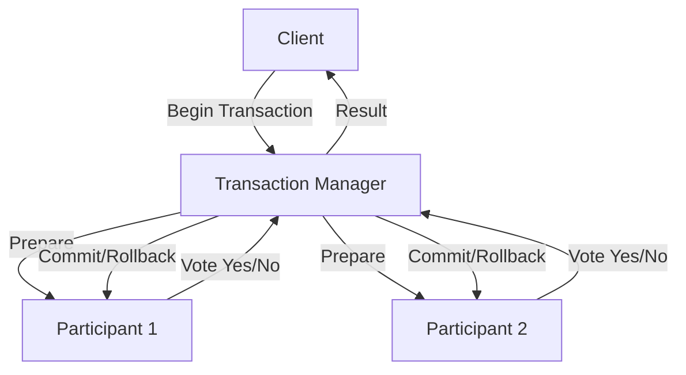
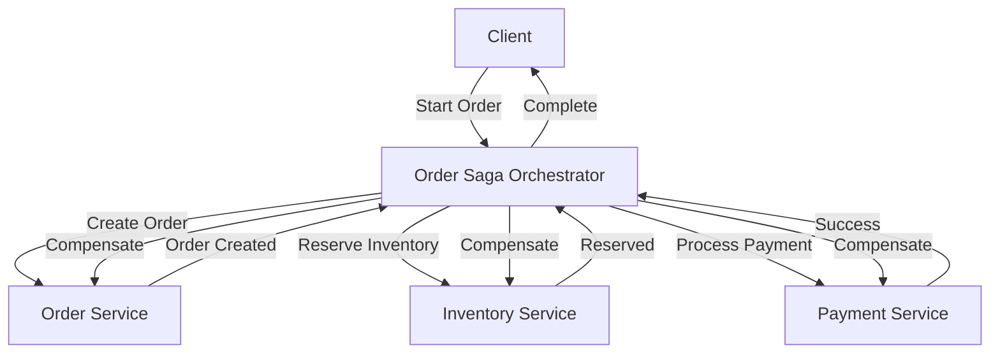
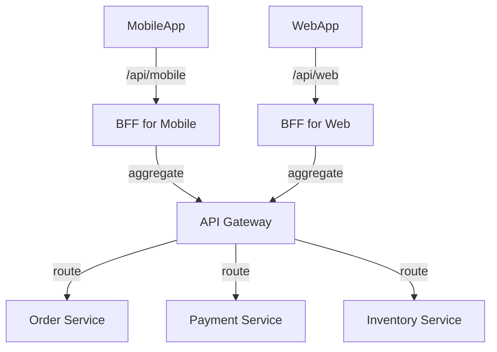
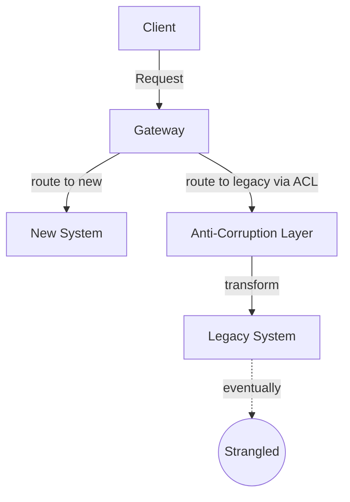
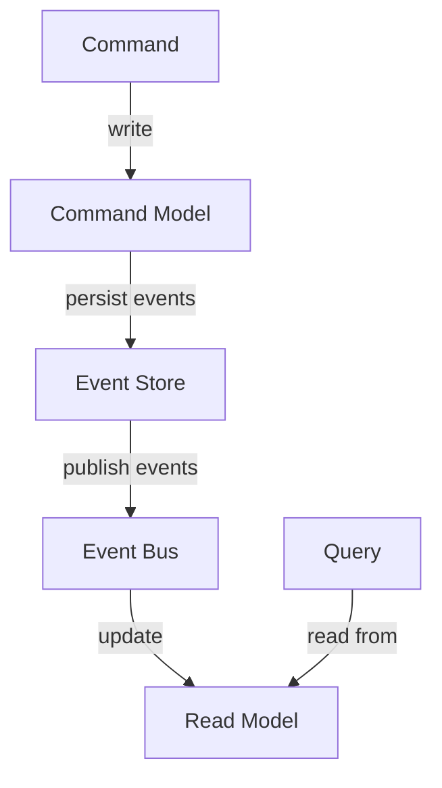
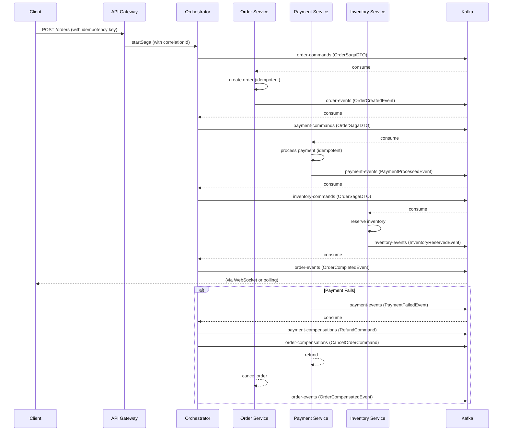

# Mastering Distributed Transactions and Microservices Patterns: From 2PC to Saga, Observability, and Beyond

**Audience:** Senior Engineers (5-10+ years) with Java/Spring Boot experience.  
**Duration:** 12 hours / 3 days (self‑study).  
**Prerequisites:** Solid understanding of microservices, REST, messaging (Kafka), ACID, BASE, CAP theorem basics.  
**Stack:** Java 17, Spring Boot 3.x, Spring Data JPA, Spring Kafka, PostgreSQL, Prometheus + Grafana (for observability).

---

## 1. What

**Distributed Transactions** span multiple independent services or data sources, requiring coordinated commit or rollback across all participants. Traditional ACID transactions (local to a single database) do not suffice.

Two primary patterns have emerged:

- **Two‑Phase Commit (2PC)** – A synchronous, all‑or‑nothing protocol with a coordinator.
- **Saga** – An asynchronous, eventually consistent pattern that breaks a transaction into a sequence of local transactions, each with a compensating action.

Other related patterns that help manage distributed systems complexity:

- **Event Sourcing** – Persisting state as a sequence of events.
- **CQRS** – Separating read and write models.
- **BFF (Backend for Frontend)** – A dedicated API layer per client.
- **API Gateway** – Single entry point for microservices.
- **Strangler Fig** – Incrementally replace a legacy system.
- **Anti‑Corruption Layer (ACL)** – Protects a domain model from external systems.
- **Correlation IDs** – Unique identifiers to trace requests across services.
- **Observability (logs, metrics, traces, golden signals)** – Essential for understanding system behaviour, especially in payments.

---

## 2. Why does it exist

**The Problem:** In a monolithic application, a database transaction guarantees atomicity, consistency, isolation, and durability (ACID). But in a microservices architecture, each service owns its own data. A business operation (e.g., placing an order) often involves multiple services: `OrderService`, `PaymentService`, `InventoryService`. If one of these calls fails, we must either undo the previous ones (compensation) or accept partial failure, which leads to inconsistency.

**Trade‑offs:** The CAP theorem states that in a distributed system, you can have at most two of Consistency, Availability, and Partition tolerance. Most modern systems choose Availability and Partition tolerance (AP), leading to eventual consistency. 2PC sacrifices availability for strong consistency; Saga embraces eventual consistency to keep services available.

**Why these patterns exist:** To maintain data integrity across service boundaries while balancing availability, scalability, and resilience. They also address operational concerns: failure recovery, timeout handling, and observability in complex, high‑volume environments like payments.

---

## 3. When to use it

| Pattern                          | When to use                                                                                                                                                |
|----------------------------------|------------------------------------------------------------------------------------------------------------------------------------------------------------|
| **2PC**                          | – When strong, immediate consistency is non‑negotiable (e.g., financial transfers between two accounts within the same trust boundary).<br>– When participants are few, reliable, and low‑latency.<br>– Typically within a single domain or database cluster (XA transactions). |
| **Saga**                         | – In most microservices scenarios where services are autonomous.<br>– When business processes can tolerate eventual consistency (e.g., order fulfilment, booking systems).<br>– When high availability and scalability are required. |
| **Orchestration Saga**           | – When the workflow is complex and needs central coordination.<br>– When you need visibility and control over the entire process.                          |
| **Choreography Saga**            | – When services are loosely coupled and events are natural.<br>– When the number of participants is small and the workflow is simple.                       |
| **Event Sourcing / CQRS**        | – When you need an audit log of all changes (payments, compliance).<br>– When read and write workloads differ significantly.                                 |
| **BFF / API Gateway**            | – When you have multiple client types (mobile, web, third‑party) with different needs.<br>– To encapsulate cross‑cutting concerns (auth, rate limiting).      |
| **Strangler / Anti‑Corruption Layer** | – During legacy system migration.<br>– To isolate a new system from a legacy one’s domain model.                                                            |

---

## 4. Where to use it

These patterns live at different architectural layers:

- **Edge layer:** API Gateway, BFF – handle client requests, routing, authentication.
- **Service layer:** Sagas (orchestrator or choreographed), compensation flows, correlation ID propagation.
- **Data layer:** Event Store (for event sourcing), read‑optimised databases (CQRS), transaction logs.
- **Messaging layer:** Kafka (or other message broker) for choreography, event publishing, and reliable communication.
- **Observability layer:** Log aggregation, metrics (Prometheus), distributed tracing (Jaeger) – correlation IDs are passed across all layers.

---

## 5. How to implement (high‑level steps)

### 5.1 2PC (using JTA / XA)
1. Choose a coordinator (e.g., transaction manager in application server).
2. Participants (resources) implement XA interfaces.
3. Transaction manager performs **prepare** phase: asks all participants if they can commit.
4. If all vote Yes, **commit**; otherwise **rollback**.
5. Issues: blocking, single point of failure, long‑lived locks.

### 5.2 Saga (orchestration)
1. Define a stateful orchestrator service (e.g., `OrderSagaOrchestrator`).
2. Orchestrator sends commands to participants (e.g., `CreateOrder`, `ReserveInventory`, `ProcessPayment`).
3. Each participant performs its local transaction and replies with success/failure.
4. On failure, orchestrator executes compensating transactions in reverse order.
5. Use a durable message broker (Kafka) to send commands and replies, ensuring at‑least‑once delivery.

### 5.3 Saga (choreography)
1. Each service publishes domain events after its local transaction.
2. Other services listen to events and react (e.g., `OrderCreated` triggers `PaymentService` to process payment).
3. If a service fails to process an event, it publishes a failure event, and compensating actions are triggered by subsequent events (e.g., `PaymentFailed` triggers `OrderService` to cancel order).
4. Requires careful design to avoid cyclic dependencies and ensure idempotency.

### 5.4 Observability with correlation IDs
1. Generate a unique correlation ID at the entry point (e.g., API Gateway).
2. Propagate it via headers (HTTP, Kafka headers) to all downstream services.
3. Include it in all logs, metrics tags, and trace spans.
4. Use MDC (Mapped Diagnostic Context) in logging frameworks to automatically include it.

---

## 6. Architecture Diagrams

### 6.1 Two‑Phase Commit (2PC)



### 6.2 Saga Orchestration



### 6.3 Saga Choreography with Kafka

```mermaid
graph LR
    subgraph Kafka Cluster
        Topic_Order[Order Events]
        Topic_Payment[Payment Events]
        Topic_Inventory[Inventory Events]
    end

    OrderS[Order Service] -->|publishes OrderCreated| Topic_Order
    Topic_Order -->|triggers| PayS[Payment Service]
    PayS -->|publishes PaymentProcessed| Topic_Payment
    Topic_Payment -->|triggers| InvS[Inventory Service]
    InvS -->|publishes InventoryReserved| Topic_Inventory
    Topic_Inventory -->|completes| OrderS

    PayS -- if fails --> publishes PaymentFailed --> Topic_Payment
    Topic_Payment --> OrderS compensates
```

### 6.4 BFF and API Gateway



### 6.5 Strangler and Anti‑Corruption Layer



### 6.6 CQRS with Event Sourcing



---

## 7. Scenario: A Real‑World Payment Use Case

**Payment Processing System**  
We are building an e‑commerce platform. The checkout flow involves:

1. **Order Service** – creates an order (status = PENDING).
2. **Payment Service** – authorizes payment with an external PSP.
3. **Inventory Service** – reserves items.
4. **Shipping Service** – schedules shipment (after payment success).

If any step fails, we must undo previous steps (compensation). Strong consistency is not required because the business can tolerate temporary inconsistency (e.g., order created but payment not yet confirmed). However, we must avoid double‑charging customers or overselling inventory.

We choose an **orchestrated Saga** with Kafka for communication, using correlation IDs to trace the entire flow. Observability is critical: we need golden signals (latency, traffic, errors, saturation) for each service, especially payment, which is a third‑party integration.

---

## 8. Goal

- **KPIs:**  
  - Successful order completion rate > 99.9%  
  - Compensation rate < 0.1% (i.e., very few rollbacks)  
  - End‑to‑end latency for successful orders < 2 seconds (p95)
- **Throughput:** 10,000 orders/minute.
- **Observability:** All requests tracked with correlation IDs; logs, metrics, and traces correlate perfectly.
- **Availability:** 99.99% for the payment orchestration flow (including Kafka).

---

## 9. What Can Go Wrong

We examine failure modes and edge cases, showing **wrong code** examples that lead to these issues.

### 9.1 Wrong: No idempotency in Payment Service

```java
@RestController
public class PaymentController {
    @PostMapping("/payments")
    public ResponseEntity<PaymentResult> processPayment(@RequestBody PaymentRequest request) {
        // Directly charge the customer without checking if already processed
        String chargeId = psp.charge(request.getAmount(), request.getCardToken());
        paymentRepository.save(new Payment(request.getOrderId(), chargeId, "SUCCESS"));
        return ResponseEntity.ok(new PaymentResult(chargeId));
    }
}
```
**What can go wrong:**  
- Duplicate messages (Kafka at‑least‑once delivery) cause double charging.  
- The same order may be charged multiple times if the orchestrator retries due to timeout.

### 9.2 Wrong: No compensation for partial failure

```java
// Orchestrator snippet
public void startSaga(Order order) {
    createOrder(order); // local DB commit
    reserveInventory(order); // call InventoryService
    processPayment(order); // call PaymentService
    // If payment fails, inventory is already reserved (stuck)
}
```
**Result:** Inventory is locked indefinitely, leading to resource exhaustion.

### 9.3 Wrong: Timeout handling without rollback

```java
// Inventory service
@Transactional
public void reserve(Order order) {
    inventoryRepo.lockItems(order.getItems()); // locks rows
    // simulate long processing
    Thread.sleep(30000); // after 30s, orchestrator times out
    // no rollback because transaction is still open
}
```
**Issue:** The orchestrator times out and sends a compensation command, but the inventory service may still be holding locks, causing deadlocks or inconsistency if the compensation succeeds before the original commit.

### 9.4 Wrong: Logging without correlation ID

```java
log.info("Payment processed for order: " + orderId);
```
**Problem:** In a distributed trace, you cannot correlate this log with the rest of the flow. Debugging becomes nearly impossible.

### 9.5 Wrong: Ignoring Kafka consumer errors

```java
@KafkaListener(topics = "payment-requests")
public void handlePaymentRequest(String message) {
    PaymentRequest req = parse(message);
    processPayment(req); // throws exception if PSP fails
    // no error handling – consumer will commit offset only on success
    // with default config, failed message is re‑delivered infinitely
}
```
**Consequence:** The same message blocks the consumer, causing backlog and eventual starvation.

---

## 10. Why It Fails

**Root Cause Analysis of common failures:**

1. **Lack of idempotency** – Distributed systems rely on retries; without idempotency, operations are applied multiple times.  
2. **Missing compensating transactions** – Sagas require each forward action to have a backward action; forgetting one leads to inconsistent state.  
3. **Improper timeout handling** – Timeouts can cause partial commits if not coordinated with compensating actions.  
4. **Observability gaps** – Without correlation IDs and structured logging, troubleshooting becomes a guessing game.  
5. **Inadequate error handling in message consumers** – Poison pills, deserialisation errors, or transient failures must be handled gracefully (dead letter queues, retries with backoff).  
6. **Database isolation levels** – In 2PC, long‑held locks reduce concurrency; in Sagas, dirty reads can occur if isolation is not managed.

---

## 11. Correct Approach

To mitigate the above failures, we adopt:

1. **Idempotency keys** – Every command carries a unique idempotency key; services store processed keys to reject duplicates.  
2. **Compensation flows** – Every participant must provide a compensating action (e.g., `releaseInventory`, `refundPayment`).  
3. **Timeout with compensating state** – The orchestrator sets a timeout per step; if timeout occurs, it marks the step as failed and triggers compensation.  
4. **Correlation IDs and structured logging** – Use MDC to inject correlation ID into all logs, and propagate it via HTTP/Kafka headers.  
5. **Reliable message processing** – Use manual offset commit after business logic completes; implement retry with exponential backoff and dead letter queues.  
6. **Saga persistence** – Store saga state in a durable store so that failures can be recovered (e.g., using a saga log table).

---

## 12. Key Principles

- **CAP Theorem:** Consistency, Availability, Partition Tolerance – pick two. 2PC sacrifices availability; Saga sacrifices strong consistency.  
- **BASE (Basically Available, Soft state, Eventually consistent):** The guiding principle for Sagas.  
- **Idempotency:** Operations can be applied multiple times without changing the result beyond the first application.  
- **Compensation:** The ability to undo a successfully completed local transaction.  
- **Correlation ID:** A unique identifier that ties together all parts of a distributed transaction.  
- **Observability Golden Signals:**  
  - **Latency** – time to serve a request.  
  - **Traffic** – demand on the system (e.g., requests per second).  
  - **Errors** – rate of failed requests.  
  - **Saturation** – how “full” the system is (e.g., CPU, queue length).  

---

## 13. Correct Implementation

We now implement a robust orchestrated Saga for the payment scenario using Java 17, Spring Boot, Spring Kafka, and PostgreSQL. We include idempotency, compensation, timeout handling, correlation IDs, and observability.

### 13.1 Project Structure

```
order-saga/
├── orchestrator/
│   ├── OrderSagaOrchestrator.java
│   ├── SagaStateRepository.java
│   └── SagaCoordinator.java
├── order-service/
│   ├── OrderController.java
│   ├── OrderService.java
│   └── OrderRepository.java
├── payment-service/
│   ├── PaymentController.java
│   ├── PaymentService.java
│   ├── PaymentRepository.java
│   └── PSPClient.java (mock)
├── inventory-service/
│   ├── InventoryController.java
│   ├── InventoryService.java
│   └── InventoryRepository.java
├── common/
│   ├── events/
│   ├── dto/
│   └── KafkaConfig.java
└── observability/
    ├── CorrelationIdFilter.java
    ├── LoggingAspect.java
    └── MetricsConfig.java
```

### 13.2 Common DTOs and Events

```java
// common/dto/OrderSagaDTO.java
public record OrderSagaDTO(
    String orderId,
    String correlationId,
    List<OrderItem> items,
    BigDecimal amount,
    String paymentMethod
) { }

// common/events/SagaEvent.java
public abstract class SagaEvent {
    private final String eventId = UUID.randomUUID().toString();
    private final String correlationId;
    private final String orderId;
    private final Instant timestamp = Instant.now();
    // constructor, getters
}

public class OrderCreatedEvent extends SagaEvent { ... }
public class OrderCreationFailedEvent extends SagaEvent { ... }
public class PaymentProcessedEvent extends SagaEvent { ... }
public class PaymentFailedEvent extends SagaEvent { ... }
public class InventoryReservedEvent extends SagaEvent { ... }
public class InventoryReservationFailedEvent extends SagaEvent { ... }
public class OrderCompletedEvent extends SagaEvent { ... }
public class OrderCompensatedEvent extends SagaEvent { ... }
```

### 13.3 Kafka Configuration with Headers for Correlation ID

```java
@Configuration
public class KafkaConfig {
    @Bean
    public ProducerFactory<String, Object> producerFactory() {
        Map<String, Object> props = new HashMap<>();
        props.put(ProducerConfig.BOOTSTRAP_SERVERS_CONFIG, "localhost:9092");
        props.put(ProducerConfig.KEY_SERIALIZER_CLASS_CONFIG, StringSerializer.class);
        props.put(ProducerConfig.VALUE_SERIALIZER_CLASS_CONFIG, JsonSerializer.class);
        // enable idempotent producer
        props.put(ProducerConfig.ENABLE_IDEMPOTENCE_CONFIG, true);
        props.put(ProducerConfig.ACKS_CONFIG, "all");
        return new DefaultKafkaProducerFactory<>(props);
    }

    @Bean
    public KafkaTemplate<String, Object> kafkaTemplate() {
        return new KafkaTemplate<>(producerFactory());
    }

    @Bean
    public ConsumerFactory<String, Object> consumerFactory() {
        Map<String, Object> props = new HashMap<>();
        props.put(ConsumerConfig.BOOTSTRAP_SERVERS_CONFIG, "localhost:9092");
        props.put(ConsumerConfig.KEY_DESERIALIZER_CLASS_CONFIG, StringDeserializer.class);
        props.put(ConsumerConfig.VALUE_DESERIALIZER_CLASS_CONFIG, JsonDeserializer.class);
        props.put(ConsumerConfig.GROUP_ID_CONFIG, "saga-group");
        props.put(ConsumerConfig.AUTO_OFFSET_RESET_CONFIG, "earliest");
        props.put(ConsumerConfig.ENABLE_AUTO_COMMIT_CONFIG, false); // manual commit
        props.put(JsonDeserializer.TRUSTED_PACKAGES, "com.example.common.events");
        return new DefaultKafkaConsumerFactory<>(props);
    }

    @Bean
    public ConcurrentKafkaListenerContainerFactory<String, Object> kafkaListenerContainerFactory() {
        var factory = new ConcurrentKafkaListenerContainerFactory<String, Object>();
        factory.setConsumerFactory(consumerFactory());
        factory.setConcurrency(3);
        factory.getContainerProperties().setAckMode(ContainerProperties.AckMode.MANUAL);
        return factory;
    }
}
```

### 13.4 Correlation ID Propagation

**Filter for HTTP:**

```java
@Component
@Order(1)
public class CorrelationIdFilter extends OncePerRequestFilter {
    public static final String CORRELATION_ID_HEADER = "X-Correlation-Id";

    @Override
    protected void doFilterInternal(HttpServletRequest request, HttpServletResponse response,
                                    FilterChain chain) throws ServletException, IOException {
        String correlationId = request.getHeader(CORRELATION_ID_HEADER);
        if (correlationId == null || correlationId.isBlank()) {
            correlationId = UUID.randomUUID().toString();
        }
        MDC.put("correlationId", correlationId);
        response.setHeader(CORRELATION_ID_HEADER, correlationId);
        try {
            chain.doFilter(request, response);
        } finally {
            MDC.clear();
        }
    }
}
```

**Interceptor for Kafka Producer:**

```java
@Component
public class KafkaCorrelationIdInterceptor implements ProducerInterceptor<String, Object> {
    @Override
    public ProducerRecord<String, Object> onSend(ProducerRecord<String, Object> record) {
        String correlationId = MDC.get("correlationId");
        if (correlationId != null) {
            record.headers().add("correlationId", correlationId.getBytes(StandardCharsets.UTF_8));
        }
        return record;
    }
    // other methods omitted
}
```

Register it in `KafkaConfig`:

```java
props.put(ProducerConfig.INTERCEPTOR_CLASSES_CONFIG, KafkaCorrelationIdInterceptor.class.getName());
```

**Consumer side:** Extract header and set MDC:

```java
@KafkaListener(topics = "order-commands")
public void handleOrderCommand(ConsumerRecord<String, Object> record, Acknowledgment ack) {
    byte[] corrBytes = record.headers().lastHeader("correlationId").value();
    String correlationId = new String(corrBytes, StandardCharsets.UTF_8);
    MDC.put("correlationId", correlationId);
    try {
        // process message
        ack.acknowledge();
    } finally {
        MDC.clear();
    }
}
```

**Logging configuration** (logback-spring.xml) to include `%X{correlationId}` in pattern.

### 13.5 Idempotency Implementation

**Idempotency table in each service:**

```sql
CREATE TABLE idempotency_keys (
    key VARCHAR(255) PRIMARY KEY,
    created_at TIMESTAMP NOT NULL,
    response TEXT
);
```

**Spring Boot JPA entity:**

```java
@Entity
@Table(name = "idempotency_keys")
public class IdempotencyKey {
    @Id
    private String key;
    private Instant createdAt;
    @Lob
    private String response; // JSON of result, or null if processing
    // getters/setters
}
```

**Service layer pattern:**

```java
@Service
public class PaymentService {
    @Autowired private IdempotencyKeyRepository idemRepo;
    @Autowired private PaymentRepository paymentRepo;
    @Autowired private PSPClient pspClient;
    @Autowired private KafkaTemplate<String, Object> kafkaTemplate;

    @Transactional
    public void processPayment(OrderSagaDTO command) {
        String idemKey = "payment-" + command.orderId() + "-" + command.correlationId();
        IdempotencyKey existing = idemRepo.findById(idemKey).orElse(null);
        if (existing != null) {
            if (existing.getResponse() != null) {
                // already processed successfully, just ignore or resend event
                log.info("Duplicate payment command ignored for order {}", command.orderId());
                return;
            } else {
                // still processing? maybe retry later, but we can throw to retry
                throw new IllegalStateException("Payment already in progress");
            }
        }
        // insert with response null to mark in-progress
        IdempotencyKey idem = new IdemKey();
        idem.setKey(idemKey);
        idem.setCreatedAt(Instant.now());
        idemRepo.save(idem);
        idemRepo.flush(); // ensure inserted before external call

        try {
            // call PSP
            String txnId = pspClient.charge(command.amount(), command.paymentMethod());
            Payment payment = new Payment(command.orderId(), txnId, "SUCCESS");
            paymentRepo.save(payment);

            // update idempotency key with success response
            idem.setResponse(objectMapper.writeValueAsString(new PaymentResult(txnId)));
            idemRepo.save(idem);

            // publish success event
            PaymentProcessedEvent event = new PaymentProcessedEvent(command.orderId(), command.correlationId());
            kafkaTemplate.send("payment-events", event);
        } catch (Exception e) {
            // delete idempotency key to allow retry (or mark as failed with error)
            idemRepo.delete(idem);
            throw e;
        }
    }
}
```

### 13.6 Orchestrator Implementation

**Saga state stored in database:**

```java
@Entity
public class SagaState {
    @Id
    private String orderId;
    private String correlationId;
    private String currentStep; // ORDER_CREATED, PAYMENT_PROCESSED, etc.
    private String status; // STARTED, COMPLETED, COMPENSATING, FAILED
    private Instant createdAt;
    private Instant updatedAt;
    @Version
    private Long version; // optimistic locking
}
```

**Orchestrator service:**

```java
@Service
public class OrderSagaOrchestrator {
    @Autowired private SagaStateRepository sagaRepo;
    @Autowired private KafkaTemplate<String, Object> kafkaTemplate;
    @Autowired private ObjectMapper objectMapper;

    private static final Duration STEP_TIMEOUT = Duration.ofSeconds(10);

    @Transactional
    public void startSaga(OrderSagaDTO command) {
        String orderId = command.orderId();
        // check if saga already exists
        if (sagaRepo.findById(orderId).isPresent()) {
            log.warn("Saga for order {} already exists", orderId);
            return;
        }
        SagaState state = new SagaState();
        state.setOrderId(orderId);
        state.setCorrelationId(command.correlationId());
        state.setCurrentStep("START");
        state.setStatus("STARTED");
        state.setCreatedAt(Instant.now());
        sagaRepo.save(state);

        // send command to Order Service to create order
        kafkaTemplate.send("order-commands", command);
        // schedule timeout check
        scheduleTimeout(orderId, STEP_TIMEOUT);
    }

    @KafkaListener(topics = "order-events")
    public void handleOrderEvents(OrderCreatedEvent event, Acknowledgment ack) {
        updateSaga(event.orderId(), "ORDER_CREATED", () -> {
            // send command to Payment Service
            OrderSagaDTO command = new OrderSagaDTO(event.orderId(), event.correlationId(), ...);
            kafkaTemplate.send("payment-commands", command);
            scheduleTimeout(event.orderId(), STEP_TIMEOUT);
        });
        ack.acknowledge();
    }

    @KafkaListener(topics = "payment-events")
    public void handlePaymentEvents(PaymentProcessedEvent event, Acknowledgment ack) {
        updateSaga(event.orderId(), "PAYMENT_PROCESSED", () -> {
            // send command to Inventory Service
            kafkaTemplate.send("inventory-commands", ...);
            scheduleTimeout(event.orderId(), STEP_TIMEOUT);
        });
        ack.acknowledge();
    }

    @KafkaListener(topics = "payment-events")
    public void handlePaymentFailed(PaymentFailedEvent event, Acknowledgment ack) {
        compensate(event.orderId(), "PAYMENT_FAILED");
        ack.acknowledge();
    }

    private void compensate(String orderId, String reason) {
        SagaState state = sagaRepo.findById(orderId).orElseThrow();
        state.setStatus("COMPENSATING");
        sagaRepo.save(state);

        // depending on currentStep, send compensation commands in reverse order
        if ("PAYMENT_PROCESSED".equals(state.getCurrentStep())) {
            // send refund command
            kafkaTemplate.send("payment-compensations", new RefundCommand(orderId, state.getCorrelationId()));
        }
        if ("ORDER_CREATED".equals(state.getCurrentStep())) {
            kafkaTemplate.send("order-compensations", new CancelOrderCommand(orderId, state.getCorrelationId()));
        }
        // after all compensations, mark as FAILED
    }

    private void updateSaga(String orderId, String step, Runnable nextAction) {
        SagaState state = sagaRepo.findById(orderId).orElseThrow();
        if (!"STARTED".equals(state.getStatus())) {
            log.warn("Saga {} not in STARTED state, ignoring event", orderId);
            return;
        }
        state.setCurrentStep(step);
        state.setUpdatedAt(Instant.now());
        sagaRepo.save(state);
        nextAction.run();
    }

    private void scheduleTimeout(String orderId, Duration timeout) {
        // In production, use a scheduled executor or message‑based timeout (e.g., delayed queue)
        CompletableFuture.delayedExecutor(timeout.toSeconds(), TimeUnit.SECONDS).execute(() -> {
            // check if step still in progress
            SagaState state = sagaRepo.findById(orderId).orElse(null);
            if (state != null && "STARTED".equals(state.getStatus()) && state.getUpdatedAt().isBefore(Instant.now().minus(timeout))) {
                log.warn("Saga {} timed out at step {}", orderId, state.getCurrentStep());
                compensate(orderId, "TIMEOUT");
            }
        });
    }
}
```

### 13.7 Compensation in Payment Service

```java
@Service
public class PaymentService {
    // ... as before

    @KafkaListener(topics = "payment-compensations")
    public void handleRefund(RefundCommand command, Acknowledgment ack) {
        String idemKey = "refund-" + command.orderId() + "-" + command.correlationId();
        // idempotency check similar to processPayment

        Payment payment = paymentRepo.findByOrderId(command.orderId()).orElseThrow();
        if ("SUCCESS".equals(payment.getStatus())) {
            pspClient.refund(payment.getTransactionId());
            payment.setStatus("REFUNDED");
            paymentRepo.save(payment);
        }
        ack.acknowledge();
    }
}
```

### 13.8 Observability with Micrometer and Tracing

**Metrics configuration:**

```java
@Configuration
public class MetricsConfig {
    @Bean
    public MeterRegistryCustomizer<MeterRegistry> metricsCommonTags() {
        return registry -> registry.config().commonTags("application", "order-saga");
    }
}
```

**Add custom metrics in services:**

```java
// PaymentService
@Autowired private MeterRegistry meterRegistry;

public void processPayment(...) {
    Timer.Sample sample = Timer.start(meterRegistry);
    try {
        // ...
        sample.stop(meterRegistry.timer("payment.processing.time", "status", "success"));
    } catch (Exception e) {
        sample.stop(meterRegistry.timer("payment.processing.time", "status", "failure"));
        throw e;
    }
}
```

**Distributed tracing with Spring Cloud Sleuth (or Micrometer Tracing):**  
Add dependency `spring-cloud-starter-sleuth` (or `io.micrometer:micrometer-tracing-bridge-brave`). Sleuth automatically adds trace and span IDs to logs and propagates headers. We can also inject correlation ID into the tracing context.

**Golden Signals for Payments:**  
- **Latency:** `payment.processing.time`  
- **Traffic:** `http.server.requests` (from Actuator)  
- **Errors:** `payment.errors` counter  
- **Saturation:** Kafka consumer lag, database connection pool usage.

---

## 14. Execution Flow (Sequence Diagram)

Below is the complete successful flow with orchestration and compensation on failure.



---

## 15. Common Mistakes

1. **Using 2PC across microservices boundaries** – Introduces tight coupling and availability risks.  
2. **Not handling partial failures** – Assuming that if a step fails, all previous steps are automatically rolled back (they are not).  
3. **Missing idempotency in all services** – Retries cause duplicate side effects.  
4. **Storing saga state only in memory** – Orchestrator crashes lose state, making recovery impossible.  
5. **No timeouts on external calls** – The orchestrator waits forever, leading to resource leaks.  
6. **Propagating database transactions across message boundaries** – Trying to keep a JTA transaction that spans a Kafka send and a database commit; this is nearly impossible in practice.  
7. **Correlation ID not propagated to all logs** – Makes debugging a nightmare.  
8. **Using auto-commit in Kafka consumers** – At-least-once becomes at-most-once if the service crashes after commit but before business logic completes.  
9. **No dead letter queue for poison pills** – A single malformed message can block the entire consumer.  
10. **Not monitoring the golden signals** – You cannot know if the system is healthy without metrics.

---

## 16. Decision Matrix

| Criteria                          | 2PC (XA)                                   | Saga Orchestration                          | Saga Choreography                           |
|-----------------------------------|--------------------------------------------|----------------------------------------------|----------------------------------------------|
| **Consistency**                   | Strong immediate                           | Eventual (with compensation)                 | Eventual (with compensation)                 |
| **Availability**                  | Lower (coordinator SPOF, blocking)         | High (services independent)                  | High (services independent)                  |
| **Scalability**                   | Poor (locks, coordination overhead)        | Good (each service scales independently)     | Very good (event‑driven, no central point)   |
| **Complexity**                    | Medium (XA setup, coordinator)             | Medium (orchestrator state)                  | High (event contracts, cyclic dependencies)  |
| **Business process visibility**   | Hidden in coordinator                       | Centralised (orchestrator)                   | Distributed (requires monitoring)            |
| **Failure recovery**              | Automatic rollback                          | Compensating transactions (manual coding)    | Compensating events (manual coding)          |
| **Latency**                       | Lower (synchronous)                         | Higher (asynchronous steps + compensation)   | Higher (event propagation)                    |
| **Use case**                      | Two‑phase commit within trusted domain      | Complex workflows, need central control      | Simple, loosely coupled flows                |

**When to use which?**  
- **2PC:** Only when you absolutely cannot tolerate inconsistency and all participants are within a single trust boundary (e.g., same database cluster). Avoid in microservices.  
- **Saga Orchestration:** Most common choice for business processes involving multiple services, when you need visibility and control.  
- **Saga Choreography:** When services are highly decoupled and events are natural; beware of cyclic dependencies and difficulty in tracing.

**BFF vs API Gateway**  
- **API Gateway:** Single entry point for all clients, handles cross‑cutting concerns.  
- **BFF:** Specialised gateway per client type, tailored responses. Use when clients have significantly different needs.

**Strangler / ACL**  
- Use during legacy migration to incrementally replace functionality while maintaining data integrity.

**CQRS / Event Sourcing**  
- Use when you need auditability, temporal queries, or when read/write workloads diverge. Adds complexity but provides strong consistency guarantees in the write model and high scalability in reads.

---

## Conclusion

This module has covered the core distributed transaction patterns, their trade‑offs, and how to implement them robustly with Java/Spring Boot and Kafka. The key takeaways:

- Prefer Sagas over 2PC in microservices.
- Always design with idempotency, compensation, and timeouts.
- Use correlation IDs and structured logging to maintain observability.
- Monitor golden signals to detect anomalies early.
- Choose the right pattern based on your consistency, availability, and complexity needs.

**Next Steps:**  
- Run the provided code examples (available in the accompanying repository).  
- Experiment with failure scenarios: kill a service, introduce latency, duplicate messages.  
- Extend the system to include shipping and notification services, applying the same patterns.  
- Set up Prometheus and Grafana dashboards for the golden signals.

---

**Note:** This document is a self‑study module. All code snippets are simplified for clarity but are production‑ready in structure. For a complete runnable project, refer to the [GitHub repository link – NEEDS INPUT].
