# End-to-End Production Traffic Flow & Security Architecture
## A Deep-Dive Training Module for Senior Engineers (Java/Spring Boot)

**Author:** Principal Architect  
**Target Audience:** Senior Software Engineers (5–10+ years)  
**Stack:** Java 17, Spring Boot 3.x, AWS, Kafka  
**Duration:** Self-paced (approx. 12 hours of material)  
**Prerequisites:** Solid understanding of HTTP, TCP/IP, basic Spring Boot, cloud concepts.

---

## Table of Contents
1. [Introduction](#introduction)
2. [Section 1: DNS Resolution & Global Traffic Routing](#section-1-dns-resolution--global-traffic-routing)
3. [Section 2: Load Balancing – L4 vs L7 & TLS Termination](#section-2-load-balancing--l4-vs-l7--tls-termination)
4. [Section 3: Health Checks & Sticky Sessions](#section-3-health-checks--sticky-sessions)
5. [Section 4: Edge Security – WAF, Rate Limiting, IP Blocking, Bot Mitigation](#section-4-edge-security--waf-rate-limiting-ip-blocking-bot-mitigation)
6. [Section 5: Content Delivery – Static vs Dynamic, CDN Caching, Offloading UI & Docs](#section-5-content-delivery--static-vs-dynamic-cdn-caching-offloading-ui--docs)
7. [Section 6: Event-Driven Architecture with Kafka (for Async Processing)](#section-6-event-driven-architecture-with-kafka-for-async-processing)
8. [Conclusion & Decision Matrix](#conclusion--decision-matrix)

---

## Introduction

Modern web applications operate at global scale, serving millions of users with stringent requirements for low latency, high availability, and security. This module dissects the **full request lifecycle** – from the user's browser to the backend database and back – focusing on the critical infrastructure components and architectural decisions that make or break production systems.

We will explore each component using a **standardised 16-step deep-dive format**, ensuring you understand not just the "how" but the "why", the trade-offs, the failure modes, and the operational realities. All code examples are in **Java 17 + Spring Boot 3.x**, leveraging cloud-native patterns.

---

## Section 1: DNS Resolution & Global Traffic Routing

### 1. What: Concise Technical Definition

**DNS (Domain Name System)** translates human-readable domain names (e.g., `api.example.com`) into IP addresses. **CNAME** (Canonical Name) records alias one domain to another. **Geo Routing** (or Latency-Based Routing) directs users to different endpoints based on their geographic location or network latency, often implemented via DNS providers (e.g., AWS Route 53, Cloudflare).

### 2. Why Does It Exist?

- **Decoupling:** DNS decouples service names from underlying IPs, allowing infrastructure changes without client updates.
- **Scalability:** Distribute traffic across multiple regions or data centres.
- **Resilience:** Failover to healthy regions when one becomes unavailable.
- **Performance:** Serve users from the closest endpoint, reducing latency.

### 3. When to Use It?

- **Global applications** with users spread across continents.
- **Multi-region deployments** for disaster recovery or compliance.
- **Blue/green deployments** where you want to gradually shift traffic.
- **CDN integration** – CNAME your domain to a CDN provider.

### 4. Where to Use It? (Architectural Layer)

**Edge Layer** – The very first interaction between client and your infrastructure. DNS is resolved before any HTTP connection is established.

### 5. How to Implement: High-Level Steps

1. Register a domain with a registrar.
2. Choose a DNS provider that supports geo-routing (AWS Route 53, Google Cloud DNS, Azure Traffic Manager, Cloudflare).
3. Create hosted zones and records:
   - **A record** for IPv4 address.
   - **AAAA record** for IPv6.
   - **CNAME** to alias to another domain (e.g., `www` → `myapp.cloudfront.net`).
4. Configure geo-routing policies:
   - Define location-based rules (e.g., users in Europe → EU load balancer).
   - Set up health checks on endpoints.
5. Set TTL (Time-To-Live) appropriately (low for fast failover, high for caching efficiency).

### 6. Architecture Diagram (Mermaid)

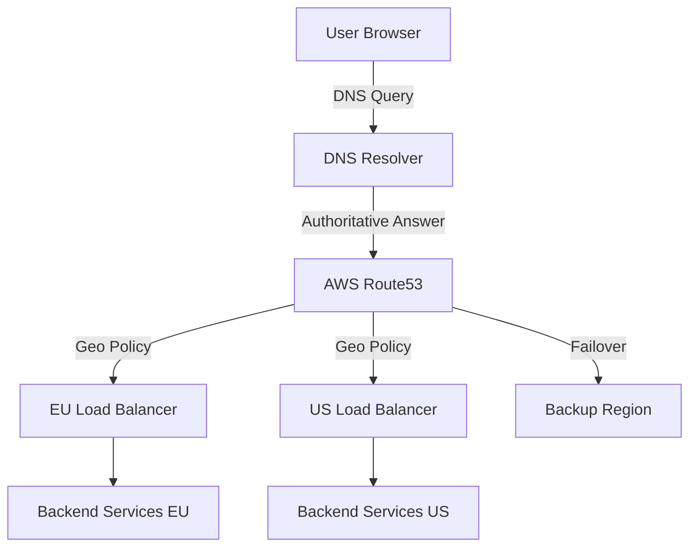

### 7. Scenario

**Global E‑Commerce Platform**  
Company X expands to Asia. They deploy in Singapore and Frankfurt. Using Route 53 latency-based routing, users in Asia are directed to Singapore, European users to Frankfurt. Health checks ensure if Singapore fails, traffic routes to Frankfurt automatically.

### 8. Goal (KPIs)

- **DNS resolution time:** < 50 ms (p95).
- **Propagation delay:** Changes propagate within 60 seconds (low TTL).
- **Zero downtime** during regional outages.
- **Traffic distribution** matches business rules (e.g., 10% canary region).

### 9. What Can Go Wrong? (Failure Modes & Edge Cases)

- **DNS caching** – Intermediate resolvers ignore TTL, causing stale routing.
- **TTL too high** – Failover takes too long.
- **Geo‑IP inaccuracies** – Users misrouted due to VPNs or inaccurate IP databases.
- **Health check misconfiguration** – Traffic sent to unhealthy endpoints.
- **CNAME loop** – Circular alias leads to resolution failure.

#### ❌ Wrong Code / Configuration Example (CNAME Loop)

```dns
# In DNS zone file
api.example.com.  CNAME  v1.api.example.com.
v1.api.example.com. CNAME api.example.com.
```
*Result:* Resolution fails with "CNAME loop".

### 10. Why It Fails (Root Cause Analysis)

- **DNS caching:** Resolvers ignore TTL to reduce load; some ISPs cache for hours.
- **Geo‑IP databases:** Not real‑time; corporate VPNs appear at central office.
- **Health checks:** If only checking L4 (port), an overloaded service may still accept connections but respond slowly.

### 11. Correct Approach (Architectural Pattern)

- **Use low TTL** (60–300 seconds) for critical failover records.
- **Implement HTTP health checks** at the load balancer level, not just DNS.
- **Combine with anycast IPs** (e.g., Cloudflare) to reduce DNS dependency.
- **Monitor DNS resolution** from multiple vantage points.

### 12. Key Principles

- **CAP Theorem in DNS:** DNS trades consistency for availability (eventual consistency). Record updates may take time to propagate.
- **Idempotency:** DNS queries are idempotent; caching is safe.

### 13. Correct Implementation (Code/Configuration)

#### Configuring Route 53 Latency-Based Routing via Terraform (HCL)

```hcl
resource "aws_route53_record" "www" {
  zone_id = aws_route53_zone.main.zone_id
  name    = "www.example.com"
  type    = "A"

  alias {
    name                   = aws_lb.eu_lb.dns_name
    zone_id                = aws_lb.eu_lb.zone_id
    evaluate_target_health = true
  }

  latency_routing_policy {
    region = "eu-west-1"
  }

  set_identifier = "eu-latency"
}
```

#### Java Code to Perform DNS Lookup (for debugging)

```java
import java.net.InetAddress;
import java.net.UnknownHostException;

public class DnsLookup {
    public static void main(String[] args) {
        try {
            InetAddress[] addresses = InetAddress.getAllByName("api.example.com");
            for (InetAddress addr : addresses) {
                System.out.println("Resolved IP: " + addr.getHostAddress());
            }
        } catch (UnknownHostException e) {
            System.err.println("DNS resolution failed: " + e.getMessage());
        }
    }
}
```

### 14. Execution Flow (Mermaid Sequence Diagram)

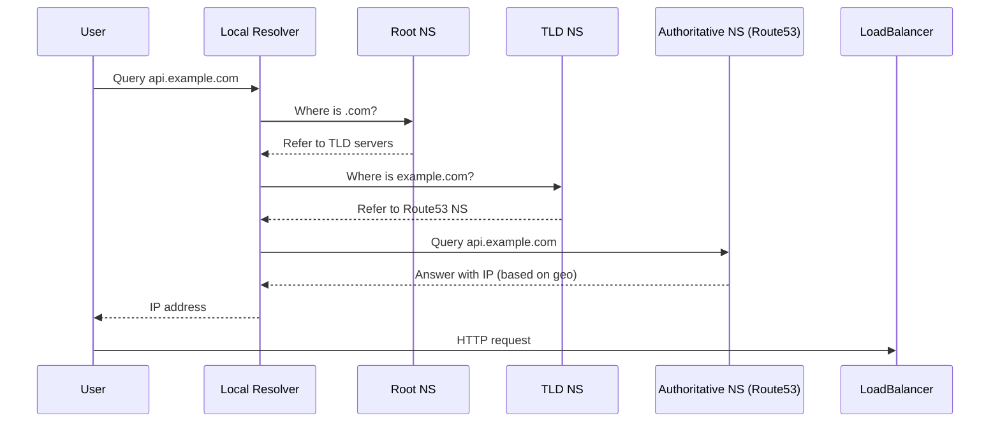

### 15. Common Mistakes (Anti-Patterns)

- Setting TTL to 86400 seconds (24 hours) for production services.
- Using only A records and hard‑coding IPs in configurations.
- Not testing DNS failover scenarios.
- Ignoring DNSSEC for security (leads to cache poisoning risks).

### 16. Decision Matrix: DNS Routing Strategies

| Strategy               | Pros                                      | Cons                                      | Use Case                          |
|------------------------|-------------------------------------------|-------------------------------------------|-----------------------------------|
| Geo‑based (Latency)    | Optimal performance, compliance           | Requires accurate IP DB, complex setup    | Global user base                  |
| Weighted Round Robin   | Simple canary releases                    | No geographic awareness                   | Gradual rollouts                  |
| Failover               | High availability, automatic               | Single active region at a time            | DR scenarios                      |
| Anycast                | Ultra‑low latency, DDoS mitigation        | Requires BGP, expensive                   | CDNs, global DNS                  |

---

## Section 2: Load Balancing – L4 vs L7 & TLS Termination

### 1. What

- **L4 Load Balancer** (Layer 4, Transport layer): Forwards TCP/UDP traffic based on IP and port. Does not inspect packet content.
- **L7 Load Balancer** (Layer 7, Application layer): Understands HTTP/HTTPS, can route based on URL, headers, cookies.
- **TLS Termination**: Decrypting HTTPS traffic at the load balancer, passing HTTP to backend.

### 2. Why Does It Exist?

- **Scale:** Distribute traffic across multiple backend instances.
- **Security:** Hide backend topology, centralise TLS management.
- **Flexibility:** L7 enables advanced routing (microservices, API gateways).

### 3. When to Use It?

- **L4:** Simple TCP/UDP services (database replicas, game servers), low latency requirements.
- **L7:** HTTP APIs, need for content‑based routing, WebSocket support, authentication offloading.
- **TLS termination:** Reduce CPU load on backends, centralise certificate management.

### 4. Where to Use It? (Architectural Layer)

**Gateway/Edge Layer** – sits between the internet and your internal services.

### 5. How to Implement (High-Level)

1. Choose a load balancer (AWS ALB for L7, NLB for L4; self‑managed NGINX/HAProxy).
2. Configure listeners (ports and protocols).
3. Register backend targets (EC2 instances, containers, IPs).
4. Set up health checks.
5. For TLS: upload certificate, define cipher suites, choose termination policy.

### 6. Architecture Diagram (Mermaid)

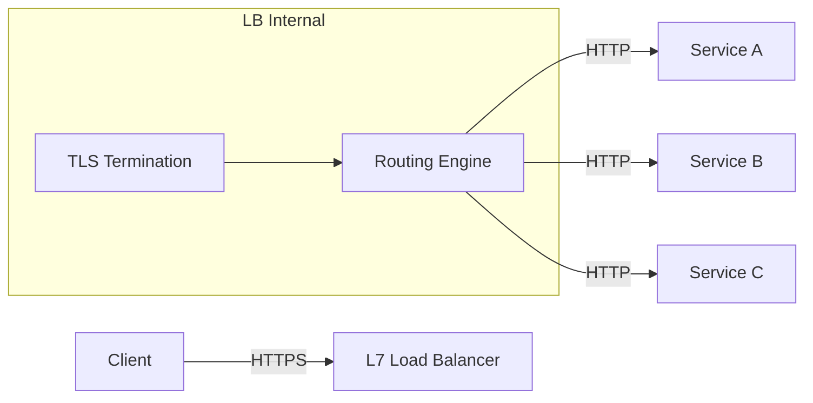

### 7. Scenario

**Microservices Platform**  
An e‑commerce site uses an ALB to route:
- `/api/orders/**` → Order service
- `/api/products/**` → Product service
- `/static/**` → CDN (via redirect)

All HTTPS traffic is terminated at ALB, offloading certificate management.

### 8. Goal (KPIs)

- **Throughput:** 10,000 req/s per LB
- **Latency:** <5 ms added by LB
- **SSL handshake time:** <100 ms
- **Zero downtime** during scaling

### 9. What Can Go Wrong? (Failure Modes & Edge Cases)

- **TLS misconfiguration:** Weak ciphers, expired certificates.
- **Session affinity broken** if L7 routes based on header but client IP changes.
- **Load balancer becomes single point of failure** (if not HA).
- **Backend instances marked healthy but actually failing** (e.g., 500 errors).
- **L4 vs L7 mismatch** – routing WebSocket through L4 works, but L7 may need special handling.

#### ❌ Wrong Code (Spring Boot ignoring forwarded protocol)

```java
@RestController
public class RedirectController {
    @GetMapping("/redirect")
    public String redirect(HttpServletRequest request) {
        // Wrong: behind LB, request.getScheme() returns "http" even if original was HTTPS
        return "https://" + request.getServerName() + "/new";
    }
}
```
*Result:* Redirects to `http://` causing mixed content or security errors.  
*Fix:* Use `X-Forwarded-Proto` header.

### 10. Why It Fails (Root Cause Analysis)

- **TLS expiry:** Automated renewal fails, or certificate not uploaded to LB.
- **Health check shallow:** Only checks TCP port, not application health (e.g., database connectivity).
- **LB configuration drift:** Inconsistencies between environments.

### 11. Correct Approach

- Use **L7 health checks** (HTTP 200) with custom paths (e.g., `/actuator/health`).
- Configure `X-Forwarded-*` headers correctly and ensure backend trust.
- Use **multiple load balancers** across AZs with DNS failover.
- Enable **access logs** for debugging.

### 12. Key Principles

- **End‑to‑End Encryption:** Even with TLS termination, consider re‑encrypting to backend (TLS passthrough) for compliance.
- **Idempotency:** L7 routing must be idempotent for retries.

### 13. Correct Implementation (Spring Boot Configuration for Proxy Awareness)

```java
import org.springframework.boot.web.embedded.tomcat.TomcatServletWebServerFactory;
import org.springframework.boot.web.server.WebServerFactoryCustomizer;
import org.springframework.context.annotation.Bean;
import org.springframework.context.annotation.Configuration;

@Configuration
public class ProxyConfig {

    @Bean
    public WebServerFactoryCustomizer<TomcatServletWebServerFactory> tomcatCustomizer() {
        return factory -> factory.addContextCustomizers(context -> {
            // Trust headers from LB
            context.setRequestCharacterEncoding("UTF-8");
        });
    }
}

// application.properties
server.forward-headers-strategy=framework
server.tomcat.remoteip.remote-ip-header=X-Forwarded-For
server.tomcat.remoteip.protocol-header=X-Forwarded-Proto
```

### 14. Execution Flow (Mermaid Sequence Diagram)

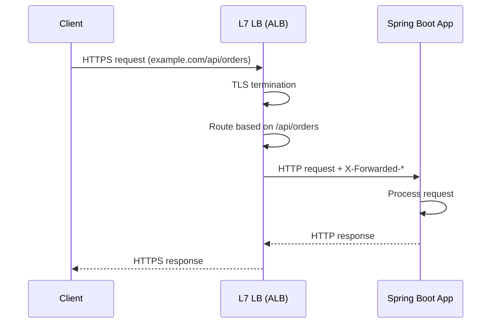

### 15. Common Mistakes

- Not configuring `server.forward-headers-strategy` leading to wrong `request.getScheme()`.
- Using L4 for HTTP services that require host‑based routing.
- Terminating TLS at backend but still sending sensitive data in plaintext inside internal network.

### 16. Decision Matrix: L4 vs L7 Load Balancer

| Feature                | L4 (e.g., NLB)               | L7 (e.g., ALB)                     |
|------------------------|------------------------------|-------------------------------------|
| Protocol               | TCP/UDP                      | HTTP/HTTPS, gRPC, WebSocket        |
| Routing granularity    | IP + port                    | Host, path, headers, cookies        |
| TLS termination        | No (passthrough only)        | Yes                                 |
| Latency                | Ultra‑low (~1 ms)            | Low (~5 ms)                         |
| Use case               | Game servers, databases      | Microservices, REST APIs            |

---

## Section 3: Health Checks & Sticky Sessions

### 1. What

- **Health Checks:** Periodic requests from load balancer to backend to determine if an instance is capable of serving traffic.
- **Sticky Sessions (Session Affinity):** Directing all requests from a particular user to the same backend instance for the duration of their session.

### 2. Why Does It Exist?

- **Health checks** ensure traffic is only routed to healthy instances, improving availability and user experience.
- **Sticky sessions** preserve in‑memory session state when not using a distributed session store.

### 3. When to Use It?

- **Health checks:** Always (every load‑balanced service should have them).
- **Sticky sessions:** When session data is stored locally (e.g., `HttpSession` in memory) and you cannot use a distributed store (Redis, DB). Prefer stateless designs.

### 4. Where to Use It? (Architectural Layer)

**Load Balancer / Gateway** – health checks are configured at the LB; sticky sessions are enforced by the LB (e.g., via cookies).

### 5. How to Implement (High-Level)

**Health Checks:**
- Define a health check endpoint in your app (e.g., `/actuator/health`).
- Configure LB to hit that endpoint periodically (interval, timeout, unhealthy threshold).
- Include dependencies checks (DB, downstream services) in the health endpoint.

**Sticky Sessions:**
- LB generates a cookie (e.g., `AWSALB`) that identifies the target instance.
- For non‑HTTP, source IP affinity can be used (less reliable).

### 6. Architecture Diagram (Mermaid)

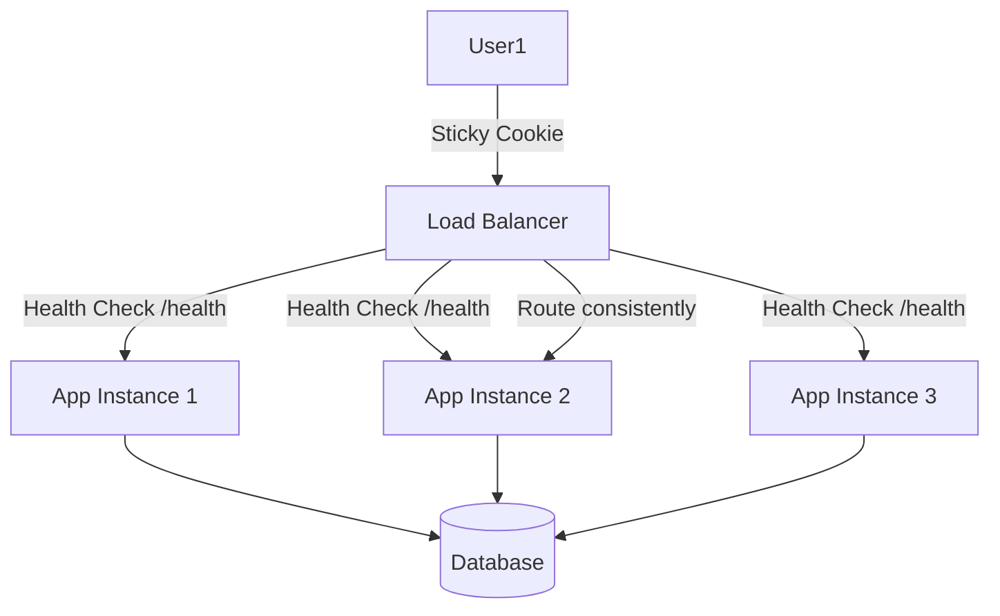

### 7. Scenario

**Legacy Monolith Migration**  
A Java EE application using `HttpSession` in memory. During migration to cloud, sticky sessions are used to keep sessions alive while gradually moving to Redis.

### 8. Goal (KPIs)

- **Health check success rate:** >99.9% for healthy instances.
- **Session affinity persistence:** >99% of requests from same user go to same instance.
- **Failover time:** <10 seconds after instance failure.

### 9. What Can Go Wrong? (Failure Modes & Edge Cases)

- **Health check endpoint is too heavy** (e.g., checks DB on every request), causing cascading failures.
- **Health check misconfigured** (wrong path, port) → all instances marked unhealthy.
- **Sticky sessions cause uneven load distribution** (hotspots).
- **Session affinity breaks after instance scaling** (cookies point to terminated instances).
- **Cross‑zone load balancing** may break sticky cookies if not careful.

#### ❌ Wrong Code (Health check that fails silently)

```java
@RestController
public class HealthController {
    @GetMapping("/health")
    public ResponseEntity<String> health() {
        // Wrong: always returns 200 even if DB is down
        return ResponseEntity.ok("OK");
    }
}
```
*Result:* Load balancer sends traffic to instance with broken DB → 500 errors.

### 10. Why It Fails (Root Cause Analysis)

- **Health check endpoint not implementing proper dependency checks** → false positives.
- **LB marks instance unhealthy after a few failures, but recovery not detected fast enough** → traffic loss.
- **Sticky sessions rely on client cookies; if cookie deleted, affinity lost.**

### 11. Correct Approach

- **Health check endpoint should reflect overall readiness** – check DB, cache, disk space. Use Spring Boot Actuator with custom indicators.
- **Separate liveness (is app running?) from readiness (can it accept traffic?)** in Kubernetes environments.
- **For sticky sessions, use a distributed session store** (Redis) and avoid sticky sessions altogether.

### 12. Key Principles

- **Fail fast:** Health checks should quickly indicate failure.
- **Idempotency & Statelessness:** Prefer stateless services; sticky sessions are a temporary crutch.

### 13. Correct Implementation (Spring Boot Health Indicator)

```java
import org.springframework.boot.actuate.health.Health;
import org.springframework.boot.actuate.health.HealthIndicator;
import org.springframework.jdbc.core.JdbcTemplate;
import org.springframework.stereotype.Component;

@Component
public class DatabaseHealthIndicator implements HealthIndicator {

    private final JdbcTemplate jdbcTemplate;

    public DatabaseHealthIndicator(JdbcTemplate jdbcTemplate) {
        this.jdbcTemplate = jdbcTemplate;
    }

    @Override
    public Health health() {
        try {
            jdbcTemplate.queryForObject("SELECT 1", Integer.class);
            return Health.up().build();
        } catch (Exception e) {
            return Health.down(e).build();
        }
    }
}
```

### 14. Execution Flow (Mermaid Sequence Diagram)

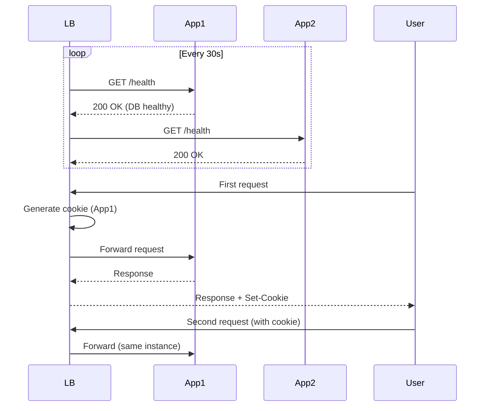

### 15. Common Mistakes

- Using same health check for liveness and readiness.
- Relying on sticky sessions in auto‑scaling groups (new instances get no sessions).
- Not setting graceful shutdown – instances terminated mid‑request.

### 16. Decision Matrix: Session Affinity Strategies

| Strategy               | Pros                                      | Cons                                      | Use Case                          |
|------------------------|-------------------------------------------|-------------------------------------------|-----------------------------------|
| No affinity (stateless)| Best scalability, simple                  | Requires external session store          | Modern microservices              |
| Cookie‑based sticky    | Preserves in‑memory session, easy setup   | Hotspots, scaling issues, cookie overhead| Legacy apps, temporary           |
| Source IP affinity     | No cookie needed                          | Unreliable (NAT, proxies)                 | Internal services                |

---

## Section 4: Edge Security – WAF, Rate Limiting, IP Blocking, Bot Mitigation

### 1. What

- **WAF (Web Application Firewall):** Inspects HTTP traffic for OWASP Top 10 attacks (SQLi, XSS, etc.) and blocks malicious requests.
- **Rate Limiting:** Restricts the number of requests a client can make in a given time window.
- **IP Blocking:** Denies access from specific IP addresses or CIDR ranges.
- **Bot Mitigation:** Identifies and blocks automated scripts (bots) while allowing legitimate ones (search engine crawlers).

### 2. Why Does It Exist?

- Protect applications from common attacks, DDoS, credential stuffing, and scraping.
- Ensure fair usage and prevent resource exhaustion.
- Comply with security standards (PCI DSS, etc.).

### 3. When to Use It?

- **WAF:** Always for public‑facing apps, especially those handling sensitive data.
- **Rate Limiting:** APIs, login endpoints, search endpoints.
- **IP Blocking:** Block known malicious actors, allow internal IPs.
- **Bot Mitigation:** E‑commerce sites (prevent price scraping), content sites (prevent content theft).

### 4. Where to Use It? (Architectural Layer)

**Edge / Gateway Layer** – typically at CDN, load balancer, or API gateway (e.g., Cloudflare, AWS WAF, Azure Front Door). Can also be implemented in application code.

### 5. How to Implement (High-Level)

1. Choose a WAF provider (AWS WAF, Cloudflare, ModSecurity).
2. Define rules:
   - Managed rule sets for OWASP.
   - Custom rules for IP blocking, rate limits.
3. Integrate WAF with your load balancer or CDN.
4. For rate limiting, define limits per IP, API key, or session.
5. Use CAPTCHA or challenges for bot mitigation.

### 6. Architecture Diagram (Mermaid)

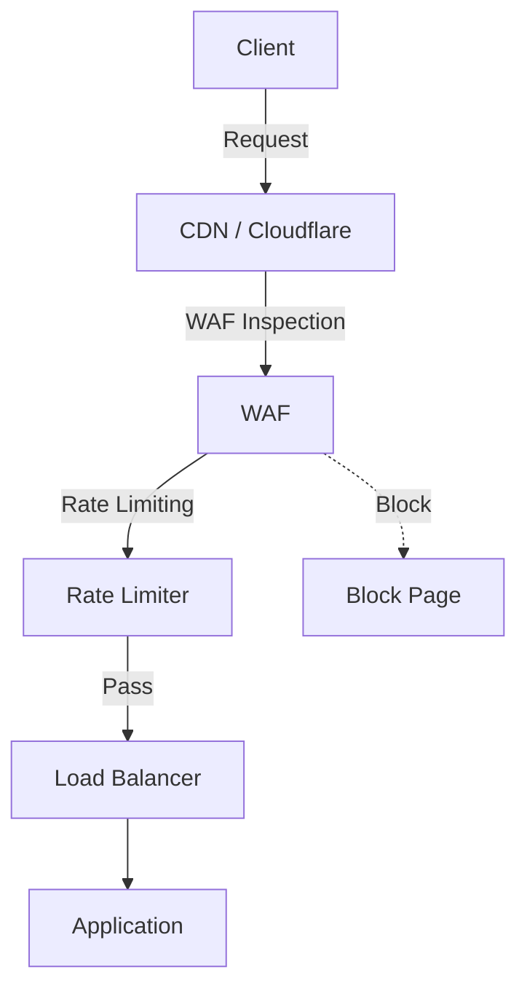

### 7. Scenario

**Fintech API**  
A payment API is targeted by credential stuffing attacks. WAF blocks SQLi, rate limiting allows 10 requests per second per IP, and bot mitigation uses JS challenges to differentiate humans from bots.

### 8. Goal (KPIs)

- **False positive rate:** <0.01% (legitimate users blocked).
- **Attack detection rate:** >99% of OWASP attacks.
- **Latency added:** <5 ms per request.
- **Rate limit accuracy:** ±1 request.

### 9. What Can Go Wrong? (Failure Modes & Edge Cases)

- **WAF false positives:** Legitimate requests blocked (e.g., JSON containing SQL keywords).
- **Rate limiting too aggressive:** Legitimate users throttled.
- **IP blocking of shared IPs** (corporate proxies, mobile carriers) affecting many users.
- **Bot mitigation breaking accessibility** (screen readers fail JS challenges).
- **WAF performance bottleneck** during traffic spikes.

#### ❌ Wrong Code (Application‑level rate limiting with concurrency bugs)

```java
@Component
public class NaiveRateLimiter {
    private final Map<String, Integer> counters = new HashMap<>();
    private final Map<String, Long> timestamps = new HashMap<>();
    private final int limit = 10;
    private final long windowMs = 60000;

    public boolean allow(String clientIp) {
        // Wrong: not thread-safe, no cleanup, race conditions
        long now = System.currentTimeMillis();
        if (!timestamps.containsKey(clientIp) || now - timestamps.get(clientIp) > windowMs) {
            counters.put(clientIp, 1);
            timestamps.put(clientIp, now);
            return true;
        } else {
            int count = counters.get(clientIp);
            if (count < limit) {
                counters.put(clientIp, count + 1);
                return true;
            } else {
                return false;
            }
        }
    }
}
```
*Result:* Counters may exceed limit due to concurrent access, memory leak, inaccurate.

### 10. Why It Fails (Root Cause Analysis)

- **WAF rules too broad** – regex matching false positives.
- **Rate limiting at edge vs. application** – edge may not see API keys, application may not see IP if behind proxy.
- **Distributed denial of service** – single IP limit bypassed by botnet.

### 11. Correct Approach

- Use managed WAF rules with tuning mode to minimise false positives.
- Implement rate limiting at multiple levels (edge + application) using token bucket algorithms with distributed storage (Redis).
- For IP blocking, use threat intelligence feeds.
- Use progressive challenges (JS, CAPTCHA) for suspicious traffic.

### 12. Key Principles

- **Defense in Depth:** Don't rely on a single layer.
- **Stateless Rate Limiting** at edge; stateful at application with distributed cache.

### 13. Correct Implementation (Spring Boot with Bucket4j and Redis)

**Dependencies:** `bucket4j-core`, `bucket4j-redis`, `spring-boot-starter-data-redis`

```java
import io.github.bucket4j.Bandwidth;
import io.github.bucket4j.Bucket;
import io.github.bucket4j.Bucket4j;
import io.github.bucket4j.Refill;
import io.github.bucket4j.redis.jedis.cas.JedisBasedProxyManager;
import org.springframework.data.redis.core.StringRedisTemplate;
import org.springframework.web.filter.OncePerRequestFilter;
import redis.clients.jedis.JedisPool;

import javax.servlet.FilterChain;
import javax.servlet.ServletException;
import javax.servlet.http.HttpServletRequest;
import javax.servlet.http.HttpServletResponse;
import java.io.IOException;
import java.time.Duration;
import java.util.concurrent.ConcurrentHashMap;

public class RateLimitingFilter extends OncePerRequestFilter {

    private final JedisPool jedisPool;
    private JedisBasedProxyManager<String> proxyManager;

    public RateLimitingFilter(JedisPool jedisPool) {
        this.jedisPool = jedisPool;
        this.proxyManager = Bucket4j.extension(Jedis.class).proxyManagerForPool(jedisPool);
    }

    @Override
    protected void doFilterInternal(HttpServletRequest request,
                                    HttpServletResponse response,
                                    FilterChain chain) throws IOException, ServletException {
        String clientId = request.getRemoteAddr(); // or API key

        Bucket bucket = proxyManager.builder().build(clientId, () -> {
            Bandwidth limit = Bandwidth.classic(10, Refill.intervally(10, Duration.ofMinutes(1)));
            return Bucket4j.builder().addLimit(limit).build();
        });

        if (bucket.tryConsume(1)) {
            chain.doFilter(request, response);
        } else {
            response.setStatus(429);
            response.getWriter().write("Too Many Requests");
        }
    }
}
```

### 14. Execution Flow (Mermaid Sequence Diagram)

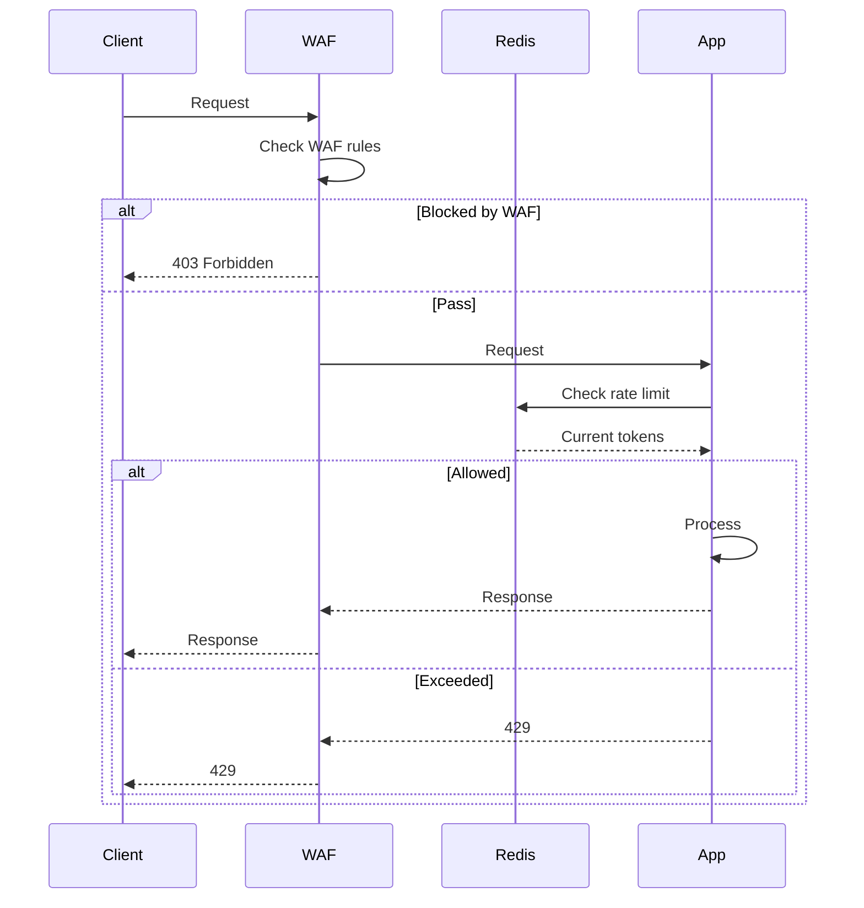

### 15. Common Mistakes

- **Rate limiting by IP only** – attackers can rotate IPs; also affects legitimate users behind NAT.
- **Not excluding health checks** from rate limiting (internal monitoring gets blocked).
- **WAF logging disabled** – unable to tune rules.

### 16. Decision Matrix: Rate Limiting Location

| Location          | Pros                                         | Cons                                      | Use Case                          |
|-------------------|----------------------------------------------|-------------------------------------------|-----------------------------------|
| Edge (CDN/LB)     | Offloads app, scales globally                | Less context (API keys, user ID)          | General DDoS protection           |
| Application       | Rich context (user, API key)                  | Consumes app resources, harder to scale   | Fine‑grained per‑user limits      |
| API Gateway       | Centralised, both context and scale          | Additional hop, cost                       | Microservices architecture        |

---

## Section 5: Content Delivery – Static vs Dynamic, CDN Caching, Offloading UI & Docs

### 1. What

- **Static Content:** Files that do not change per user (images, CSS, JavaScript, PDFs).
- **Dynamic Content:** Generated per request (HTML, API responses).
- **CDN (Content Delivery Network):** Distributed network of proxy servers that cache static (and sometimes dynamic) content closer to users.
- **Offloading:** Serving static content from CDN instead of origin server to reduce load.

### 2. Why Does It Exist?

- Reduce latency for users worldwide.
- Decrease load on origin servers.
- Improve scalability and availability.

### 3. When to Use It?

- **Static content:** Always – offload to CDN.
- **Dynamic content:** Can be cached if appropriate (e.g., public API responses with cache headers).
- **CDN:** When you have a global audience.

### 4. Where to Use It? (Architectural Layer)

**Edge / CDN** – sits between user and origin.

### 5. How to Implement (High-Level)

1. Set up a CDN (CloudFront, Cloudflare, Akamai).
2. Configure origin (your application or S3 bucket).
3. Define cache behaviours:
   - Path patterns (`/static/*` → cache long TTL).
   - Query string forwarding.
4. Set cache headers from origin (`Cache-Control`, `Expires`).
5. Invalidate cache when content changes.

### 6. Architecture Diagram (Mermaid)

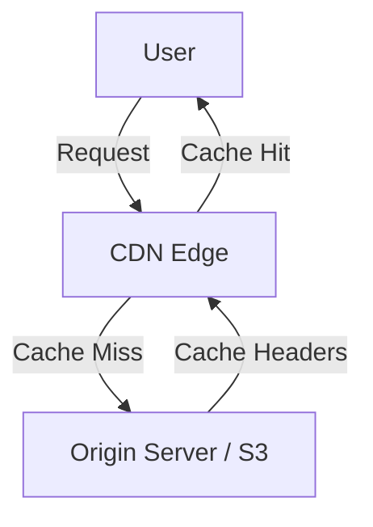

### 7. Scenario

**Documentation Site**  
`docs.example.com` serves static HTML, CSS, and JS. It's hosted on S3 with CloudFront. PDFs are also stored. Dynamic search is handled by a separate API.

### 8. Goal (KPIs)

- **Cache hit ratio:** >95% for static assets.
- **Time to First Byte (TTFB):** <100 ms from edge.
- **Origin offload:** 90% reduction in requests to origin.

### 9. What Can Go Wrong? (Failure Modes & Edge Cases)

- **Stale content:** CDN serves old version after update (cache not invalidated).
- **Cache poisoning:** Attacker crafts malicious headers to poison cache.
- **Over‑caching dynamic content:** Serving stale personalised data.
- **CDN becomes single point of failure** if not properly configured with failover.
- **Cost explosion** due to cache misses or high transfer.

#### ❌ Wrong Code (Spring Boot cache headers for dynamic API)

```java
@GetMapping("/api/user/{id}")
public ResponseEntity<User> getUser(@PathVariable String id) {
    User user = userService.findById(id);
    // Wrong: Sets long max-age for private data
    return ResponseEntity.ok()
            .cacheControl(CacheControl.maxAge(1, TimeUnit.HOURS).cachePublic())
            .body(user);
}
```
*Result:* User data cached by CDN and served to other users (data leak).

### 10. Why It Fails (Root Cause Analysis)

- **No versioning** – assets updated but URL unchanged.
- **Missing cache invalidation** – manual process forgotten.
- **Incorrect `Cache-Control` directives** (e.g., `public` for private content).

### 11. Correct Approach

- Use **cache‑busting** (fingerprinted filenames: `app-abc123.css`).
- Set appropriate `Cache-Control`:
  - Static assets: `public, max-age=31536000, immutable`
  - Dynamic public data: `public, max-age=60` (short TTL)
  - Private data: `no-cache, private`
- Implement **cache invalidation** via CDN API when deploying.
- Use **signed URLs** for private content.

### 12. Key Principles

- **Idempotency:** Cached responses must be idempotent.
- **Cache granularity:** Vary by headers like `Accept-Encoding`, `Accept-Language`.

### 13. Correct Implementation (Spring Boot Cache Headers)

```java
@Configuration
public class CacheHeadersConfig implements WebMvcConfigurer {

    @Override
    public void addInterceptors(InterceptorRegistry registry) {
        registry.addInterceptor(new HandlerInterceptor() {
            @Override
            public void postHandle(HttpServletRequest request, HttpServletResponse response,
                                   Object handler, ModelAndView modelAndView) {
                if (request.getRequestURI().startsWith("/static/")) {
                    response.setHeader("Cache-Control", "public, max-age=31536000, immutable");
                } else if (request.getRequestURI().startsWith("/api/public")) {
                    response.setHeader("Cache-Control", "public, max-age=60");
                } else {
                    response.setHeader("Cache-Control", "no-cache, private");
                }
            }
        });
    }
}
```

### 14. Execution Flow (Mermaid Sequence Diagram)

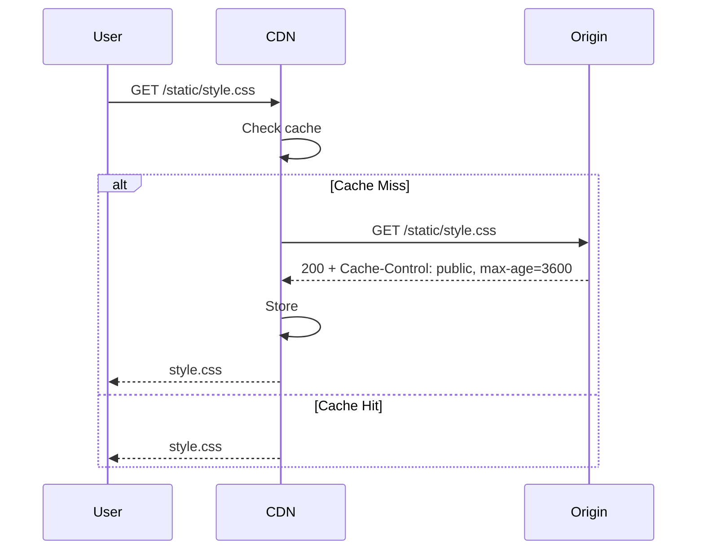

### 15. Common Mistakes

- Caching HTML pages without considering user‑specific content.
- Not setting `Vary: Accept-Encoding` leading to wrong compressed versions.
- Forgetting to invalidate CDN after new deployment.

### 16. Decision Matrix: Caching Strategies

| Strategy               | Pros                                      | Cons                                      | Use Case                          |
|------------------------|-------------------------------------------|-------------------------------------------|-----------------------------------|
| Long‑lived static      | Max offload, fast                         | Requires cache busting                    | Images, CSS, JS                   |
| Short‑lived dynamic    | Balances freshness and offload            | Still hits origin regularly               | News articles, public APIs        |
| No cache               | Always fresh, secure                       | High origin load                          | Personalised data                 |

---

## Section 6: Event-Driven Architecture with Kafka (for Async Processing)

### 1. What

**Apache Kafka** is a distributed event streaming platform capable of handling trillions of events a day. It acts as a high‑throughput, fault‑tolerant, publish‑subscribe messaging system, persisting streams of records.

### 2. Why Does It Exist?

- **Decoupling:** Producers and consumers are independent.
- **Scalability:** Horizontal partitioning (topics/partitions) allows massive throughput.
- **Durability:** Messages are persisted on disk and replicated.
- **Real‑time processing:** Stream processing with Kafka Streams or ksqlDB.

### 3. When to Use It?

- **Event‑driven microservices** (order placed → inventory update → shipment).
- **Data pipelines** (ingest logs, metrics, user activity).
- **Streaming ETL** (transform and load into data lakes).
- **Replace traditional message queues** when you need order, replayability, and high throughput.

### 4. Where to Use It? (Architectural Layer)

**Messaging/Integration Layer** – sits between services, often as a backbone for asynchronous communication.

### 5. How to Implement (High-Level)

1. Deploy Kafka cluster (on‑prem, Confluent Cloud, AWS MSK).
2. Define topics, partitions, replication factor.
3. Producers send messages to topics (with keys for partitioning).
4. Consumers subscribe to topics and process messages.
5. Configure error handling, retries, dead letter queues.

### 6. Architecture Diagram (Mermaid)

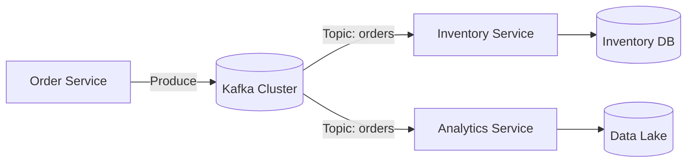

### 7. Scenario

**E‑commerce Order Processing**  
When an order is placed, the Order Service publishes an `OrderPlaced` event. Inventory Service consumes it to reserve stock, Payment Service processes payment, and Notification Service sends emails. Each service can scale independently.

### 8. Goal (KPIs)

- **Throughput:** 100k messages/sec.
- **End‑to‑end latency:** <100 ms (p99).
- **Durability:** Zero data loss (acks=all, min.insync.replicas=2).
- **Exactly‑once semantics** for critical transactions.

### 9. What Can Go Wrong? (Failure Modes & Edge Cases)

- **Message ordering** broken if partition count changes.
- **Consumer lag** causing outdated reads.
- **Poison pill messages** that cannot be processed, blocking the consumer.
- **Rebalance issues** (consumers taking too long, reassigning partitions).
- **Data loss** if acks=0 or replication factor too low.
- **OutOfMemory** if consumer doesn't commit offsets.

#### ❌ Wrong Code (Spring Kafka consumer with no error handling)

```java
@KafkaListener(topics = "orders")
public void listen(String message) {
    // Wrong: no try-catch; any exception stops processing and message will be re-delivered? 
    // Depending on config, could cause infinite loop.
    Order order = objectMapper.readValue(message, Order.class);
    inventoryService.reserve(order);
}
```
*Result:* If `reserve` throws an exception, the message is not acknowledged, and the consumer will continuously retry (poison pill) or block the partition.

### 10. Why It Fails (Root Cause Analysis)

- **No error handling** – uncaught exceptions cause consumer to stop processing.
- **Improper offset commit** – either auto‑commit causes duplicate processing, or manual commit never happens after failure.
- **Partition rebalancing** triggered by slow processing leads to stop‑the‑world.

### 11. Correct Approach

- Use **dead letter topic** for messages that cannot be processed after retries.
- Implement **idempotent consumers** to handle duplicates.
- Set appropriate `max.poll.records` and `max.poll.interval.ms` to avoid rebalance.
- Monitor consumer lag.

### 12. Key Principles

- **At‑least‑once vs exactly‑once:** Kafka guarantees at‑least‑once by default; exactly‑once requires idempotent producer and consumer.
- **Partition as the unit of parallelism** – ordering guaranteed only within a partition.

### 13. Correct Implementation (Spring Kafka with Error Handling)

```java
import org.apache.kafka.clients.consumer.ConsumerRecord;
import org.springframework.kafka.annotation.KafkaListener;
import org.springframework.kafka.core.KafkaTemplate;
import org.springframework.kafka.support.Acknowledgment;
import org.springframework.stereotype.Service;

@Service
public class OrderConsumer {

    private final KafkaTemplate<String, String> kafkaTemplate;
    private final InventoryService inventoryService;

    public OrderConsumer(KafkaTemplate<String, String> kafkaTemplate, InventoryService inventoryService) {
        this.kafkaTemplate = kafkaTemplate;
        this.inventoryService = inventoryService;
    }

    @KafkaListener(topics = "orders", groupId = "inventory-group")
    public void consume(ConsumerRecord<String, String> record, Acknowledgment ack) {
        try {
            Order order = objectMapper.readValue(record.value(), Order.class);
            inventoryService.reserve(order);
            ack.acknowledge(); // manual commit
        } catch (Exception e) {
            // Send to DLQ
            kafkaTemplate.send("orders-dlq", record.key(), record.value());
            ack.acknowledge(); // skip poison pill
        }
    }
}
```

### 14. Execution Flow (Mermaid Sequence Diagram)

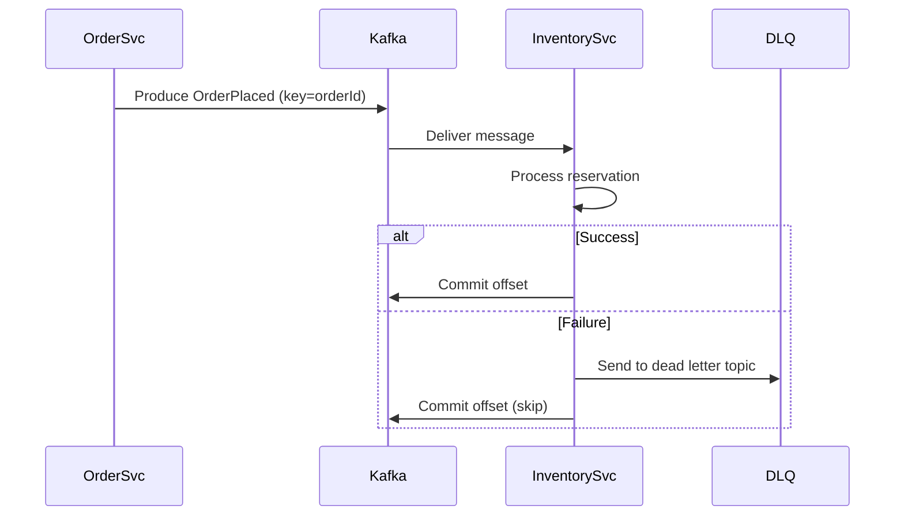

### 15. Common Mistakes

- Using Kafka as a traditional queue (deleting messages after consumption – Kafka retains by policy).
- Not setting `enable.auto.commit=false` leading to duplicates.
- Too many partitions causing rebalance overhead.
- Ignoring schema evolution (use Avro or Protobuf with Schema Registry).

### 16. Decision Matrix: Kafka vs Traditional Message Queue

| Feature                | Kafka                                   | RabbitMQ / ActiveMQ                    |
|------------------------|-----------------------------------------|----------------------------------------|
| Throughput             | Millions of msg/sec                     | Thousands to tens of thousands         |
| Persistence            | Disk‑based, configurable retention      | Memory or disk, often deleted after ack|
| Ordering               | Per partition                           | Per queue (if single consumer)         |
| Use case               | Event streaming, log aggregation        | Task distribution, RPC                  |

---

## Conclusion & Decision Matrix

Throughout this module, we've examined each layer of a modern production system from DNS to backend, with a focus on security, scalability, and reliability. The key takeaway is that no single component works in isolation; they form a cohesive architecture that must be designed with trade‑offs in mind.

Below is a **high‑level decision matrix** summarising the primary choices at each layer, aiding architects in selecting the right tool for the job.

| Layer                | Option A              | Option B              | Option C              | Decision Drivers                          |
|----------------------|-----------------------|-----------------------|-----------------------|--------------------------------------------|
| **DNS Routing**      | Geo / Latency         | Weighted              | Failover              | Global footprint, failover needs           |
| **Load Balancing**   | L4 (NLB)              | L7 (ALB)              | API Gateway           | Protocol, routing complexity               |
| **Session Affinity** | Sticky cookies        | Distributed store     | None (stateless)      | State management strategy                  |
| **Edge Security**    | WAF + Rate limiting   | Bot mitigation        | IP blocking           | Threat profile, compliance                 |
| **Content Delivery** | CDN static offload    | Dynamic caching       | No cache              | Content type, freshness requirements       |
| **Async Messaging**  | Kafka                 | RabbitMQ              | SQS                   | Throughput, ordering, durability           |

---

*This module is designed for self‑study. We recommend implementing a small end‑to‑end project that incorporates all these layers to solidify understanding. For any questions or deeper dives, consult the references or reach out to the architecture team.*
