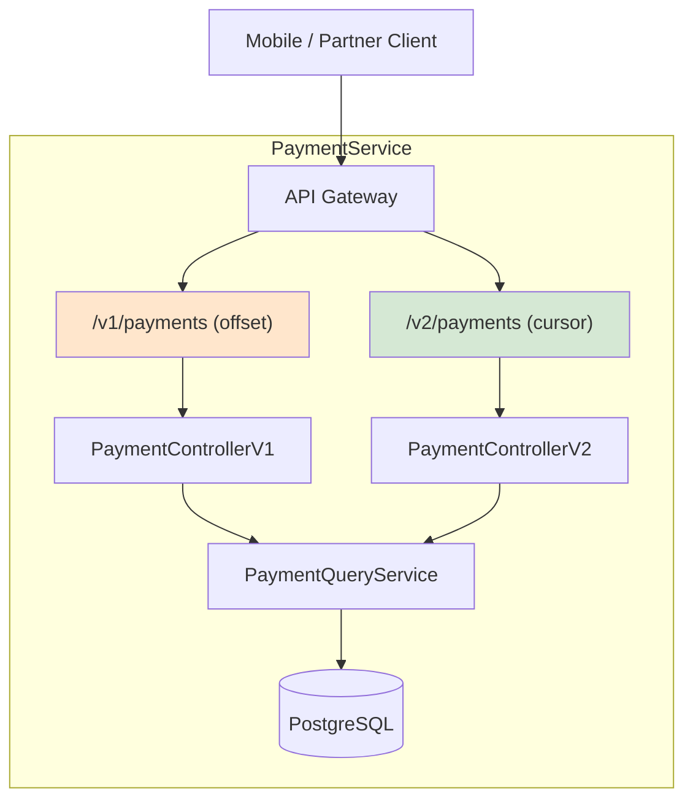
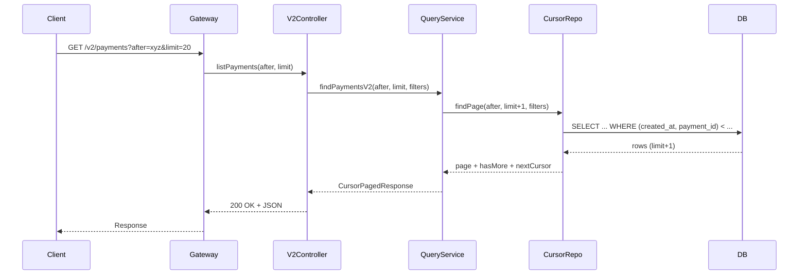
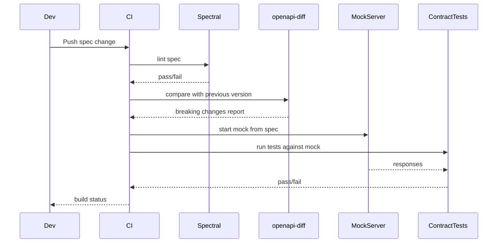
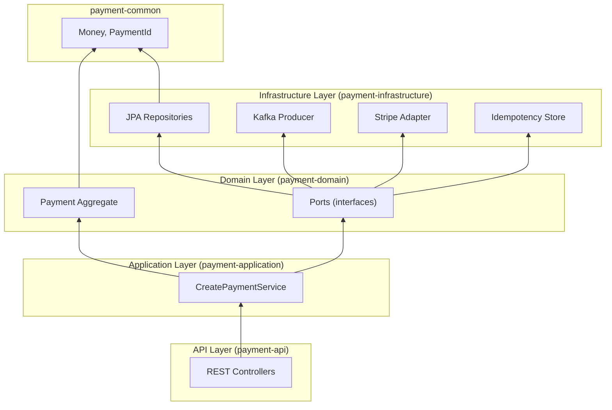
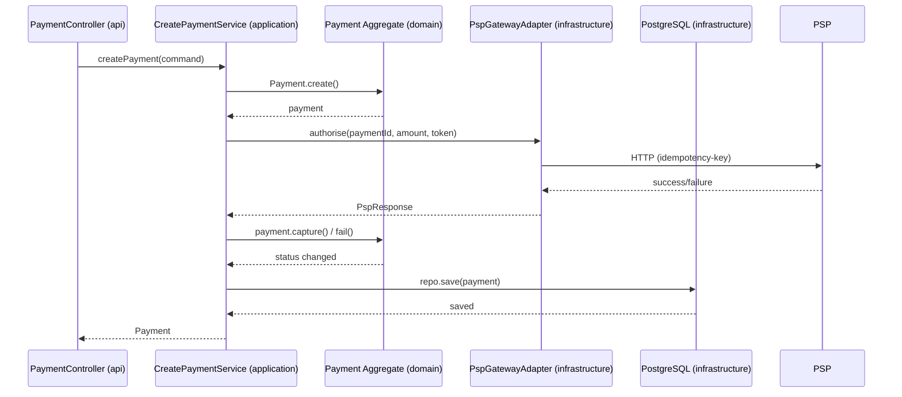
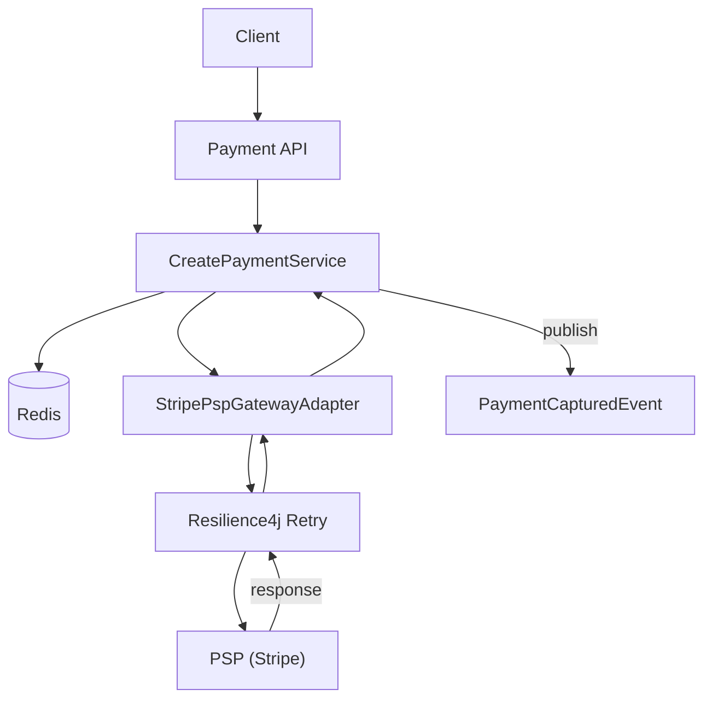
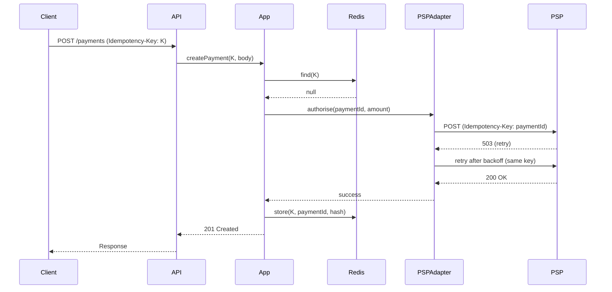

# PayFlow Payments API — Deep Dive Module

## Master Project: PayFlow — A production-grade payment processing microservice for a digital banking platform  
**Audience:** Senior Developers (5–10+ years) — Java/Spring Boot 17, Kafka, PostgreSQL, Redis  
**Domain:** Banking / Payments  
**Format:** Self-study, diagram-heavy, code-verified, 3000+ lines

---

# Table of Contents

1. [Introduction: The PayFlow Ecosystem](#introduction)
2. [Topic 1: REST Resource Modeling for Payments](#topic-1-rest-resource-modeling-for-payments)
3. [Topic 2: OpenAPI Contract Design](#topic-2-openapi-contract-design)
4. [Topic 3: Microservice Structure & Codebase Organization](#topic-3-microservice-structure--codebase-organization)
5. [Topic 4: Retry & Idempotency for PSP Integration](#topic-4-retry--idempotency-for-psp-integration)
6. [Appendix: Kafka Event-Driven Architecture](#appendix-kafka-event-driven-architecture)
7. [Decision Matrix Summary](#decision-matrix-summary)

---

## Introduction

PayFlow is a digital banking platform that processes payments through multiple Payment Service Providers (PSPs). This module dissects the **design, contracts, structure, and resilience** of its core payments microservice. Each topic follows a strict 16‑step analytical flow, exposing trade‑offs, edge cases, and production‑grade implementations in **Java 17 / Spring Boot 3.x**.

---

# Topic 1: REST Resource Modeling for Payments

## 1. What
REST resource modeling is the practice of designing URI endpoints as **nouns** representing business entities (e.g., `/payments`, `/payments/{id}`) and using HTTP methods as **verbs** (`GET`, `POST`, `PATCH`, `DELETE`). It includes defining collection and item resources, sub‑resources for related entities, and consistent query parameter usage for filtering and pagination.

## 2. Why Does It Exist
RESTful design emerged to provide a uniform interface that scales with the web. It enables:
- **Caching** – `GET` responses can be cached by proxies and CDNs.
- **Discoverability** – HATEOAS (optional) lets clients navigate via links.
- **Idempotency** – `PUT`, `DELETE`, and safe methods (`GET`, `HEAD`) have well‑defined semantics.
- **Decoupling** – Clients depend on resource representations, not RPC‑style actions.

## 3. When to Use It
- **Public or partner‑facing APIs** – where stability and predictability are paramount.
- **Long‑lived systems** – resources often map directly to domain aggregates.
- **CRUD‑heavy domains** – like payments, accounts, transactions.
- When you need **multiple client types** (mobile, web, third‑party) to interact with the same data model.

## 4. Where to Use It
**Architectural layers:**
- **Edge Layer** – API Gateway routes `/v*/payments/*` to the payment service.
- **API Layer** – Controllers translate HTTP to application commands/queries.
- **Domain Layer** – Aggregates (e.g., `Payment`) are designed independently of HTTP.

## 5. How to Implement (High‑Level Steps)
1. Identify core resources: `Payment`, `Refund`, `Account`.
2. Define URI hierarchy: collections (`/payments`), items (`/payments/{id}`), sub‑resources (`/payments/{id}/refunds`).
3. Choose pagination strategy based on data volatility (cursor for live tables, offset for static reports).
4. Version API from day one: `/v1/payments`, `/v2/payments`.
5. Enforce backward compatibility rules: no field removal, no type changes.

## 6. Architecture Diagram



## 7. Scenario
Your team inherits a six‑month‑old payments microservice. The `/payments` endpoint accepts a JSON body for `GET`, mixes verbs (`/processPayment`), and pagination is inconsistent – some clients use `page`/`size`, others a custom cursor. A mobile flash‑sale client needs high throughput (500 TPS) and a stable contract. You must evolve the API without breaking existing integrations.

## 8. Goal
Design a RESTful payments API that:
- Supports both **offset** (v1) and **cursor** (v2) paging with clear trade‑offs.
- Uses query parameters for filtering.
- Versioned via URL path, fully backward compatible.
- Achieves **200ms cold‑start SLA** for mobile clients.

## 9. What Can Go Wrong (with Wrong Code)

### Anti‑Pattern A: RPC‑Style URLs
```java
// ❌ BROKEN: Verb in URL, GET with body
@RestController
public class PaymentController {
    @PostMapping("/processPayment")               // Verb, not noun
    public String process(@RequestBody Map body) { // Raw Map, no validation
        return "processed";
    }
    @GetMapping("/getPayments")                   // GET with body
    public List<?> get(@RequestBody Filter filter) {
        // HTTP GET with body is undefined – many clients drop it.
        return new ArrayList<>();
    }
}
```
**Result:** Clients cannot predict URI structure; caching breaks; integrations are brittle.

### Anti‑Pattern B: Wrong Pagination Choice
```java
// ❌ BROKEN: Offset on live payments table
@GetMapping("/payments")
public Page<Payment> list(@RequestParam int page, @RequestParam int size) {
    return paymentRepo.findAll(PageRequest.of(page, size));
}
```
**Result:** New payments shift rows between pages → duplicates or missed records during polling.

### Anti‑Pattern C: Inconsistent ID Schemes
```java
@GetMapping("/payment/{id}")   // Sometimes int, sometimes UUID
public Payment get(@PathVariable String id) {
    // Forces client to handle both integer and UUID parsing
}
```
**Result:** Client‑side complexity; enumeration attacks possible with integers.

## 10. Why It Fails
- **RFC violations** – `GET` with body not cached, may be stripped.
- **Data volatility** – Offset pagination on a table with frequent inserts yields unstable pages.
- **Lack of contracts** – No explicit versioning means every change breaks someone.
- **Exposed internal IDs** – Integers leak record count and allow brute‑force enumeration.

## 11. Correct Approach
- **Resource‑oriented URIs:** `/payments`, `/payments/{id}`, `/payments/{id}/refunds`.
- **HTTP methods as verbs:** `POST` to create, `GET` to read, `PATCH` to update.
- **Pagination decision matrix** (see 16).
- **URL path versioning:** `/v1/payments`, `/v2/payments` (additive only).
- **Stable identifiers:** UUID v4 for all resource IDs.
- **Query parameters for filtering:** `/v2/payments?status=CAPTURED&currency=INR`.

## 12. Key Principles
- **Uniform interface** – resources are nouns; methods are verbs.
- **Statelessness** – each request contains all info to process it.
- **Cacheability** – `GET` responses should declare cache directives.
- **Layered system** – proxies, gateways can be inserted without client changes.
- **Idempotency** – `PUT`, `DELETE`, and safe methods are idempotent by definition.

## 13. Correct Implementation (Java 17 / Spring Boot)

### v1 Controller – Offset Pagination (Stable for Reporting)
```java
package com.payflow.payments.api.v1;

import com.payflow.payments.application.PaymentQueryService;
import com.payflow.payments.api.v1.dto.PagedResponse;
import com.payflow.payments.api.v1.dto.PaymentResponse;
import jakarta.validation.constraints.Max;
import lombok.RequiredArgsConstructor;
import org.springframework.data.domain.PageRequest;
import org.springframework.data.domain.Sort;
import org.springframework.http.ResponseEntity;
import org.springframework.web.bind.annotation.*;

import java.util.UUID;

@RestController
@RequestMapping("/v1/payments")
@RequiredArgsConstructor
public class PaymentControllerV1 {
    private final PaymentQueryService queryService;

    @GetMapping
    public ResponseEntity<PagedResponse<PaymentResponse>> listPayments(
            @RequestParam(defaultValue = "0") int page,
            @RequestParam(defaultValue = "20") @Max(100) int size,
            @RequestParam(required = false) String status,
            @RequestParam(required = false) String currency) {

        var pageable = PageRequest.of(page, Math.min(size, 100), Sort.by("createdAt").descending());
        var response = queryService.findPaymentsV1(status, currency, pageable);
        return ResponseEntity.ok(response);
    }

    @GetMapping("/{paymentId}")
    public ResponseEntity<PaymentResponse> getPayment(@PathVariable UUID paymentId) {
        return queryService.findByIdV1(paymentId)
                .map(ResponseEntity::ok)
                .orElse(ResponseEntity.notFound().build());
    }
}
```

### v2 Controller – Cursor Pagination (Live Feed)
```java
package com.payflow.payments.api.v2;

import com.payflow.payments.application.PaymentQueryService;
import com.payflow.payments.api.v2.dto.CursorPagedResponse;
import com.payflow.payments.api.v2.dto.PaymentSummary;
import lombok.RequiredArgsConstructor;
import org.springframework.http.ResponseEntity;
import org.springframework.web.bind.annotation.*;

import java.util.UUID;

@RestController
@RequestMapping("/v2/payments")
@RequiredArgsConstructor
public class PaymentControllerV2 {
    private final PaymentQueryService queryService;

    @GetMapping
    public ResponseEntity<CursorPagedResponse<PaymentSummary>> listPayments(
            @RequestParam(required = false) String after,
            @RequestParam(defaultValue = "20") int limit,
            @RequestParam(required = false) String status,
            @RequestParam(required = false) String currency,
            @RequestParam(required = false) String merchantCategory) {

        var response = queryService.findPaymentsV2(after, Math.min(limit, 100),
                status, currency, merchantCategory);
        return ResponseEntity.ok(response);
    }

    @GetMapping("/{paymentId}")
    public ResponseEntity<PaymentSummary> getPayment(@PathVariable UUID paymentId) {
        return queryService.findByIdV2(paymentId)
                .map(ResponseEntity::ok)
                .orElse(ResponseEntity.notFound().build());
    }
}
```

### Keyset Pagination Repository (JDBC)
```java
package com.payflow.payments.infrastructure.persistence;

import com.payflow.payments.api.v2.dto.CursorPagedResponse;
import com.payflow.payments.api.v2.dto.PaymentSummary;
import lombok.RequiredArgsConstructor;
import org.springframework.jdbc.core.namedparam.MapSqlParameterSource;
import org.springframework.jdbc.core.namedparam.NamedParameterJdbcTemplate;
import org.springframework.stereotype.Repository;

import java.time.Instant;
import java.util.Base64;
import java.util.List;
import java.util.UUID;

@Repository
@RequiredArgsConstructor
public class PaymentCursorRepository {
    private final NamedParameterJdbcTemplate jdbc;

    public CursorPagedResponse<PaymentSummary> findPage(String afterCursor, int limit,
                                                        String status, String currency, String merchantCategory) {
        CursorValue cursor = decodeCursor(afterCursor);

        String sql = """
            SELECT payment_id, amount_minor_units, currency, status,
                   merchant_category, processor_code, created_at
            FROM payments
            WHERE (:cursorCreatedAt IS NULL OR (created_at, payment_id) < (:cursorCreatedAt, :cursorId))
              AND (:status IS NULL OR status = :status)
              AND (:currency IS NULL OR currency = :currency)
              AND (:merchantCategory IS NULL OR merchant_category = :merchantCategory)
            ORDER BY created_at DESC, payment_id DESC
            LIMIT :limit
            """;

        var params = new MapSqlParameterSource()
                .addValue("cursorCreatedAt", cursor != null ? cursor.createdAt : null)
                .addValue("cursorId", cursor != null ? cursor.paymentId.toString() : null)
                .addValue("status", status)
                .addValue("currency", currency)
                .addValue("merchantCategory", merchantCategory)
                .addValue("limit", limit + 1); // fetch extra to detect hasMore

        List<PaymentSummary> rows = jdbc.query(sql, params, (rs, i) ->
                new PaymentSummary(
                        UUID.fromString(rs.getString("payment_id")),
                        rs.getLong("amount_minor_units"),
                        rs.getString("currency"),
                        rs.getString("status"),
                        rs.getString("merchant_category"),
                        rs.getString("processor_code"),
                        rs.getTimestamp("created_at").toInstant()
                ));

        boolean hasMore = rows.size() > limit;
        List<PaymentSummary> page = hasMore ? rows.subList(0, limit) : rows;
        String nextCursor = hasMore ? encodeCursor(page.getLast().paymentId(), page.getLast().createdAt()) : null;

        return new CursorPagedResponse<>(page, nextCursor, hasMore);
    }

    private CursorValue decodeCursor(String cursor) {
        if (cursor == null || cursor.isBlank()) return null;
        try {
            String decoded = new String(Base64.getUrlDecoder().decode(cursor));
            String[] parts = decoded.split(":");
            return new CursorValue(UUID.fromString(parts[0]), Instant.parse(parts[1]));
        } catch (Exception e) {
            throw new IllegalArgumentException("Invalid cursor: " + cursor);
        }
    }

    private String encodeCursor(UUID paymentId, Instant createdAt) {
        String raw = paymentId + ":" + createdAt;
        return Base64.getUrlEncoder().withoutPadding().encodeToString(raw.getBytes());
    }

    private record CursorValue(UUID paymentId, Instant createdAt) {}
}
```

### DTOs with Backward Compatibility
```java
// V1 – frozen
public record PaymentResponse(
    UUID paymentId,
    long amountMinorUnits,
    String currency,
    String status,
    Instant createdAt
) {}

// V2 – additive only
public record PaymentSummary(
    UUID paymentId,
    long amountMinorUnits,
    String currency,
    String status,
    String merchantCategory,   // new optional field
    String processorCode,      // new optional field
    Instant createdAt
) {}
```

## 14. Execution Flow (Sequence Diagram)



## 15. Common Mistakes (Anti‑Patterns Recap)
- Using verbs in URIs (`/processPayment`).
- Mixing offset and cursor without clear versioning.
- Not capping page size – leading to OOM.
- Exposing auto‑increment IDs.
- Changing field types or removing fields in the same version.
- Returning different error shapes per endpoint.

## 16. Decision Matrix: Offset vs Cursor Pagination

| Criterion                     | Offset (`page`/`size`)          | Cursor (`after`/`limit`)       |
|-------------------------------|----------------------------------|----------------------------------|
| Data inserts during paging    | ❌ Unstable (duplicates/skips)  | ✅ Stable                       |
| Need total count for UI       | ✅ Trivial (`COUNT(*)`)          | ❌ Expensive / impossible        |
| Random page access            | ✅ Yes (jump to page 5)          | ❌ No (forward only)             |
| Large datasets (>100k)        | ❌ Slow deep offsets             | ✅ O(1) per page                 |
| Use in payments (live feed)   | ❌ Avoid                         | ✅ Preferred                     |
| Use in reporting (snapshot)   | ✅ Fine                          | Acceptable                       |

---

# Topic 2: OpenAPI Contract Design

## 1. What
OpenAPI (formerly Swagger) is a machine‑readable specification for REST APIs. It defines endpoints, request/response schemas, authentication, and examples. It serves as the **contract** between service providers and consumers.

## 2. Why Does It Exist
- **Automation** – Generate client SDKs, server stubs, documentation.
- **Contract testing** – Validate requests/responses without a running service.
- **Design‑first** – Prevents implementation details from leaking into the contract.
- **Consistency** – Single source of truth for API behavior.

## 3. When to Use It
- **Public APIs** – where multiple external teams integrate.
- **Microservices** – each service publishes its own contract.
- **Mobile/partner integrations** – SDK generation reduces manual effort.
- **Regulatory environments** – need auditable API definitions.

## 4. Where to Use It
- **API Layer** – OpenAPI file lives alongside controllers.
- **CI/CD** – Linting and breaking‑change detection run on spec.
- **Developer Portal** – Spec is published for consumers.

## 5. How to Implement (High‑Level Steps)
1. Write OpenAPI YAML/JSON **first** (contract‑first).
2. Review with partners and mobile team.
3. Generate server interfaces using `openapi-generator-maven-plugin`.
4. Implement the generated delegate interfaces.
5. Keep spec in version control and validate in CI.

## 6. Architecture Diagram

```mermaid
graph LR
    subgraph DesignTime
        A[OpenAPI Spec] --> B[openapi-generator]
        B --> C[Server Stub (Java)]
        B --> D[Client SDK (Python, Go, ...)]
    end
    subgraph Runtime
        C --> E[PaymentService Implementation]
        D --> F[Partner Application]
    end
    style A fill:#b7e1cd
```

## 7. Scenario
PayFlow is onboarding three new partner banks (Go, Python, .NET). Current API docs are a stale Confluence page. Partners waste weeks on integration due to ambiguous request/response formats. Mobile team wants auto‑generated SDKs. QA needs contract tests in CI.

## 8. Goal
Produce a complete OpenAPI 3.1 spec that:
- Enables SDK generation for Go, Python, .NET.
- Serves as single source of truth (contract‑first).
- Supports contract testing in CI.
- Documents all error models consistently.
- Detects breaking changes automatically.

## 9. What Can Go Wrong (with Wrong Code)

### Anti‑Pattern A: Code‑First Without Constraints
```java
// ❌ BROKEN: Auto‑generated spec from annotations – no examples, no constraints
@RestController
public class PaymentController {
    @PostMapping("/payments")
    public Map<String, Object> create(@RequestBody Map<String, Object> body) {
        return Map.of("id", UUID.randomUUID());
    }
}
```
**Result:** Generated spec shows `{}` for schema – useless for client generation.

### Anti‑Pattern B: Inconsistent Error Models
```java
// ❌ Different error formats per endpoint
// /payments -> { "error": "not found" }
// /refunds  -> { "message": "Refund failed", "code": 400 }
```
**Result:** Clients must write multiple error parsers; monitoring dashboards cannot aggregate.

## 10. Why It Fails
- **Missing examples** – Mock servers return empty objects; contract tests pass but production fails.
- **No shared error schema** – Inconsistent formats increase client complexity.
- **Unconstrained fields** – Clients send invalid data (negative amounts, wrong enums).
- **No versioning in spec** – Changes overwrite the only spec, breaking existing clients.

## 11. Correct Approach
- **Contract‑first** – write spec, review, generate stubs.
- **Shared `ErrorResponse`** schema with `code`, `message`, `traceId`, optional `fieldErrors`.
- **Use `$ref`** for reusable components (Payment, Refund, Error).
- **Set `additionalProperties: false`** to prevent unexpected fields.
- **Provide examples** for all schemas.
- **Version the spec** – keep v1 and v2 separate files.

## 12. Key Principles
- **Single source of truth** – spec is the contract; code implements it.
- **Design for consumers** – examples, descriptions, error codes.
- **Backward compatibility** – additive changes only; detect breaking changes with `openapi‑diff`.
- **Automation** – generate clients, stubs, documentation from spec.

## 13. Correct Implementation (OpenAPI 3.1 YAML)

```yaml
openapi: 3.1.0
info:
  title: PayFlow Payments API
  version: 2.0.0
paths:
  /v2/payments:
    get:
      operationId: listPaymentsV2
      parameters:
        - $ref: '#/components/parameters/AfterCursor'
        - $ref: '#/components/parameters/LimitParam'
        - $ref: '#/components/parameters/StatusFilter'
        - $ref: '#/components/parameters/CurrencyFilter'
        - name: merchantCategory
          in: query
          schema:
            type: string
            pattern: '^[A-Z0-9]{4}$'
      responses:
        '200':
          description: OK
          content:
            application/json:
              schema:
                $ref: '#/components/schemas/CursorPagedPayments'
        '400':
          $ref: '#/components/responses/BadRequest'
components:
  schemas:
    PaymentV2:
      type: object
      required: [paymentId, amountMinorUnits, currency, status, createdAt]
      properties:
        paymentId:
          type: string
          format: uuid
        amountMinorUnits:
          type: integer
          minimum: 1
          example: 150000
        currency:
          type: string
          pattern: '^[A-Z]{3}$'
          example: INR
        status:
          type: string
          enum: [PENDING, AUTHORISED, CAPTURED, FAILED, REFUNDED]
        merchantCategory:
          type: string
          nullable: true
          example: "5411"
        processorCode:
          type: string
          nullable: true
        createdAt:
          type: string
          format: date-time
    ErrorResponse:
      type: object
      required: [code, message, traceId]
      properties:
        code:
          type: string
          example: "INSUFFICIENT_FUNDS"
        message:
          type: string
        traceId:
          type: string
        fieldErrors:
          type: array
          items:
            $ref: '#/components/schemas/FieldError'
    FieldError:
      type: object
      properties:
        field:
          type: string
        message:
          type: string
        rejectedValue:
          type: object
          nullable: true
  responses:
    BadRequest:
      description: Validation error
      content:
        application/json:
          schema:
            $ref: '#/components/schemas/ErrorResponse'
          example:
            code: VALIDATION_ERROR
            message: Request validation failed
            traceId: abc123
            fieldErrors:
              - field: amountMinorUnits
                message: must be greater than 0
                rejectedValue: -100
```

### Global Error Handler (Spring)
```java
@RestControllerAdvice
public class GlobalExceptionHandler {
    @ExceptionHandler(MethodArgumentNotValidException.class)
    public ResponseEntity<ErrorResponse> handleValidation(MethodArgumentNotValidException ex) {
        List<FieldError> fieldErrors = ex.getBindingResult().getFieldErrors().stream()
                .map(fe -> new FieldError(fe.getField(), fe.getDefaultMessage(), fe.getRejectedValue()))
                .toList();
        var error = new ErrorResponse("VALIDATION_ERROR", "Request validation failed",
                UUID.randomUUID().toString(), fieldErrors);
        return ResponseEntity.badRequest().body(error);
    }
}
```

## 14. Execution Flow (Contract Testing in CI)



## 15. Common Mistakes
- Generating spec from code without manual review.
- Using `additionalProperties: true` (default) – allows extra fields.
- No examples in schemas → mock responses are empty.
- Not validating spec in CI → spec drifts from implementation.
- Exposing sensitive data in path parameters (e.g., card numbers).
- Conflating 404 and 403 – leaking resource existence.

## 16. Decision Matrix: Contract‑First vs Code‑First

| Aspect               | Contract‑First                      | Code‑First                          |
|----------------------|--------------------------------------|-------------------------------------|
| **Design clarity**   | ✅ Explicit, reviewed upfront        | ❌ Emerges from code                |
| **Consumer feedback**| ✅ Early (before coding)              | ❌ Late (after implementation)       |
| **SDK generation**   | ✅ Perfect, from single source       | ⚠️ Often incomplete (missing examples)|
| **Implementation speed**| ❌ Slower start                      | ✅ Faster start                      |
| **Change management**| ✅ Controlled via spec versioning    | ❌ Breaking changes easy to introduce|
| **Use case**         | Public APIs, partner integrations    | Internal services, rapid prototyping|

---

# Topic 3: Microservice Structure & Codebase Organization

## 1. What
Microservice codebase organization is the modular breakdown of a service into cohesive, loosely coupled modules. Typically follows **hexagonal (ports & adapters)** architecture: domain (pure), application (use cases), infrastructure (adapters), and API (controllers).

## 2. Why Does It Exist
- **Separation of concerns** – domain logic isolated from frameworks.
- **Testability** – domain can be unit‑tested without Spring or DB.
- **Maintainability** – clear boundaries prevent cyclic dependencies.
- **Evolvability** – replace infrastructure (JPA → JDBC, Stripe → Adyen) without touching domain.
- **Team scalability** – multiple teams can own different modules.

## 3. When to Use It
- **Complex business domains** – payments, banking, healthcare.
- **Long‑lived services** – need to adapt to new technologies.
- **Multiple delivery pipelines** – each module can be versioned independently.
- **Regulated environments** – domain logic must be auditable without infrastructure noise.

## 4. Where to Use It
- **Source code** – Maven/Gradle multi‑module projects.
- **Build artifacts** – each module becomes a JAR with clear dependencies.
- **Runtime** – only the API module produces a deployable artifact.

## 5. How to Implement (High‑Level Steps)
1. Define module boundaries: `common`, `domain`, `application`, `infrastructure`, `api`.
2. Set dependency rules: domain → none; application → domain; infrastructure → domain+application; api → application.
3. Place shared value objects in `common` (no framework deps).
4. Use ports (interfaces) in domain; implement in infrastructure.
5. Enforce rules with ArchUnit in CI.

## 6. Architecture Diagram



## 7. Scenario
PayFlow started as a single Spring Boot app with five services in one repo. A shared utility JAR caused cyclic dependencies and 90‑minute release windows. Two teams are blocked on each other. The payments service must be extracted with clean module boundaries.

## 8. Goal
Restructure the payments service into a multi‑module Maven build with:
- Zero cyclic dependencies.
- Domain layer with no framework imports.
- `payment-common` for shared DTOs/value objects.
- ArchUnit tests enforcing layering.

## 9. What Can Go Wrong (with Wrong Code)

### Anti‑Pattern: Big Ball of Mud
```
❌ payments-service/
    ├── PaymentController.java   (Spring)
    ├── PaymentService.java       (Spring + business logic)
    ├── PaymentRepository.java    (Spring Data JPA)
    ├── Payment.java              (JPA @Entity + business methods)
    ├── PaymentDTO.java           (used inside domain)
    └── StripeClient.java         (direct call from service)
```
```java
// ❌ JPA annotation on domain object
@Entity
public class Payment {
    @Id private Long id;          // auto‑increment – leaks
    private BigDecimal amount;     // floating‑point risk
    public void validate() {
        if (amount <= 0) throw new RuntimeException(); // no context
    }
    public Map toApiResponse() {   // API shape mixed in domain
        return Map.of("amount", amount);
    }
}
```
**Result:** Domain cannot be unit‑tested without DB; changing JPA provider affects domain; PSP swap requires rewriting service.

## 10. Why It Fails
- **Frameworks in domain** – JPA, Spring annotations tie domain to specific infrastructure.
- **Cyclic dependencies** – A → B → A breaks Maven build.
- **Fat common JAR** – includes Spring beans, forcing all consumers to load Spring context.
- **No dependency inversion** – high‑level modules depend on low‑level details.

## 11. Correct Approach
**Hexagonal Architecture** with strict module boundaries:

- **`payment-common`** – pure value objects (no Spring, no JPA). Shared across modules.
- **`payment-domain`** – aggregates, domain events, ports (interfaces). No framework.
- **`payment-application`** – use cases, services. Depends on domain.
- **`payment-infrastructure`** – adapters (JPA, Kafka, PSP). Depends on domain+application.
- **`payment-api`** – REST controllers, exception handlers. Depends on application.

## 12. Key Principles
- **Dependency Inversion** – high‑level modules (domain) define ports; low‑level modules implement them.
- **Stable Abstractions** – domain is the most stable; infrastructure changes often.
- **Common Closure Principle** – classes that change together stay together.
- **Acyclic Dependencies** – dependency graph is a DAG.
- **Testability** – domain can be tested in isolation.

## 13. Correct Implementation (Maven Multi‑Module)

### Parent POM
```xml
<project>
    <groupId>com.payflow</groupId>
    <artifactId>payflow-parent</artifactId>
    <version>1.0.0</version>
    <packaging>pom</packaging>
    <modules>
        <module>payment-common</module>
        <module>payment-domain</module>
        <module>payment-application</module>
        <module>payment-infrastructure</module>
        <module>payment-api</module>
    </modules>
    <dependencyManagement>
        <dependencies>
            <dependency>
                <groupId>com.payflow</groupId>
                <artifactId>payment-common</artifactId>
                <version>${project.version}</version>
            </dependency>
            <!-- ... others -->
        </dependencies>
    </dependencyManagement>
</project>
```

### payment-common (Pure Java)
```java
public record Money(long amountMinorUnits, String currency) {
    public Money {
        if (amountMinorUnits <= 0) throw new IllegalArgumentException();
        if (!currency.matches("^[A-Z]{3}$")) throw new IllegalArgumentException();
    }
}
```

### payment-domain (Pure Java)
```java
public class Payment {
    private final PaymentId id;
    private final Money amount;
    private PaymentStatus status;
    // no JPA, no Spring
    public void capture() {
        if (status != PaymentStatus.AUTHORISED) throw new IllegalStateException();
        this.status = PaymentStatus.CAPTURED;
        // raise domain event
    }
}
```

### payment-application (Spring Service – depends on domain)
```java
@Service
@Transactional
public class CreatePaymentService {
    private final PaymentRepository repo;       // port
    private final PspGateway psp;               // port

    public Payment create(CreatePaymentCommand cmd) {
        Payment payment = Payment.create(cmd.amount(), cmd.merchantId());
        PspGateway.Response resp = psp.authorise(payment.getId(), payment.getAmount(), cmd.token());
        if (resp.success()) payment.capture();
        else payment.fail(resp.errorMessage());
        repo.save(payment);
        return payment;
    }
}
```

### payment-infrastructure (Adapters)
```java
// JPA Entity – separate from domain
@Entity
@Table(name = "payments")
class PaymentJpaEntity {
    @Id private UUID paymentId;
    private long amountMinorUnits;
    private String currency;
    @Enumerated(EnumType.STRING) private PaymentStatusJpa status;
    // ...
}

// Repository adapter implementing domain port
@Repository
class PaymentJpaAdapter implements PaymentRepository {
    private final PaymentJpaRepository springDataRepo;
    // map between domain Payment and JPA entity
}
```

### ArchUnit Test (Enforce Layering)
```java
@ArchTest
static final ArchRule layeredArchitecture = layeredArchitecture()
        .layer("API").definedBy("..api..")
        .layer("Application").definedBy("..application..")
        .layer("Domain").definedBy("..domain..")
        .layer("Infrastructure").definedBy("..infrastructure..")
        .whereLayer("API").mayOnlyAccessLayers("Application", "Domain", "Common")
        .whereLayer("Application").mayOnlyAccessLayers("Domain", "Common")
        .whereLayer("Domain").mayOnlyAccessLayers("Common")
        .whereLayer("Infrastructure").mayOnlyAccessLayers("Application", "Domain", "Common");
```

## 14. Execution Flow (Create Payment – Cross‑Module)



## 15. Common Mistakes
- Sharing JPA entities across services – changes ripple.
- Business logic in controllers – not unit‑testable.
- Circular module dependencies – use `maven-dependency-plugin` to detect.
- `@SpringBootApplication` in shared module – causes duplicate context.
- Skipping ArchUnit – layering degrades over time.

## 16. Decision Matrix: Multi‑Module vs Monolith (Single Module)

| Criterion                | Multi‑Module (Hexagonal)          | Single Module (Spring Boot)       |
|--------------------------|------------------------------------|------------------------------------|
| **Separation of concerns**| ✅ Enforced by build               | ❌ Easy to blur                    |
| **Testability**          | ✅ Domain tested without Spring     | ⚠️ Requires Spring context         |
| **Change isolation**     | ✅ Infrastructure changes isolated | ❌ Changes affect everything       |
| **Build time**           | ❌ Slightly slower (multiple JARs) | ✅ Faster (single JAR)             |
| **Team autonomy**        | ✅ Modules owned by different teams| ❌ Merge conflicts common           |
| **When to choose**       | Complex domain, long‑lived service| Simple CRUD, prototypes            |

---

# Topic 4: Retry & Idempotency for PSP Integration

## 1. What
**Retry** is the automatic re‑execution of a failed operation. **Idempotency** ensures that multiple identical requests have the same effect as one. For PSP integrations, we need both: retry transient failures (network, 5xx) while ensuring PSP does not process a payment twice.

## 2. Why Does It Exist
- **Network unreliability** – timeouts, connection resets are inevitable.
- **PSP downtime** – brief outages require retries.
- **Client retries** – mobile apps may retry on failure; idempotency prevents double charges.
- **At‑least‑once delivery** – many systems guarantee at‑least‑once; idempotent handlers make it safe.

## 3. When to Use It
- Any external call that can fail transiently (HTTP to PSP, database, message broker).
- Operations that change state (authorise, capture, refund).
- When idempotency keys are supported by the downstream system (most PSPs).
- In payment flows to prevent financial loss from duplicates.

## 4. Where to Use It
- **Infrastructure layer** – PSP adapters apply retries with backoff.
- **Application layer** – idempotency key validation before processing client requests.
- **Database** – idempotency store (Redis) to track processed keys.

## 5. How to Implement (High‑Level Steps)
1. Define retryable exceptions (network timeouts, 5xx) and non‑retryable (4xx, card declined).
2. Configure retry with exponential backoff, jitter, and max attempts.
3. On each PSP call, attach an idempotency key (deterministic: paymentId + attempt).
4. Store idempotency records (client keys) in Redis with TTL to deduplicate incoming requests.
5. For duplicate client requests with same key and body, return cached response.

## 6. Architecture Diagram



## 7. Scenario
During a network blip, 847 authorisation requests timed out. The on‑call engineer retried them manually; 12 resulted in double charges because the original succeeded at the PSP but the response was lost. Finance spent days reconciling.

## 8. Goal
Implement safe retry + idempotency for PSP integration that:
- Retries transient failures with exponential backoff + jitter.
- Never retries 4xx errors.
- Uses idempotency keys on every PSP request.
- Stores idempotency state (client keys) in Redis to prevent duplicates at API level.
- Prevents double charging.

## 9. What Can Go Wrong (with Wrong Code)

### Anti‑Pattern A: No Retry, No Idempotency
```java
// ❌ Single attempt, no idempotency
public PspResponse authorise(UUID paymentId, long amount) {
    return restTemplate.postForObject(pspUrl, request, PspResponse.class);
    // network timeout → exception, caller sees 500, PSP may have processed
}
```
**Result:** Timeouts lead to unknown state; manual retry may double‑charge.

### Anti‑Pattern B: Naive Retry Without Idempotency
```java
// ❌ Retries with fixed delay, no idempotency key
public PspResponse authoriseWithRetry(UUID paymentId, long amount) {
    int attempts = 0;
    while (attempts < 3) {
        try {
            return pspClient.authorise(paymentId, amount);
        } catch (Exception e) {
            attempts++;
            Thread.sleep(1000); // fixed delay – thundering herd
        }
    }
    throw new RuntimeException("PSP failed");
}
```
**Result:** Retries may be sent concurrently (thundering herd); no idempotency → duplicates.

### Anti‑Pattern C: Retrying 4xx Errors
```java
@Retryable(maxAttempts = 3, backoff = @Backoff(delay = 1000))
public PspResponse authorise(...) {
    // if card declined (400) – still retries 3 times, wasting PSP calls
}
```
**Result:** Retrying permanent failures increases costs and may trigger fraud alerts.

## 10. Why It Fails
- **No idempotency key** – PSP cannot deduplicate.
- **No jitter** – all instances retry simultaneously, overwhelming PSP.
- **No timeout** – threads hang indefinitely → thread pool exhaustion.
- **No distinction between transient/permanent errors** – card declines retried.

## 11. Correct Approach
- **Resilience4j retry** with `retry-exceptions` and `ignore-exceptions`.
- **Idempotency key** = paymentId (UUID) – deterministic, PSP dedupes.
- **Exponential backoff + jitter** to spread retries.
- **API‑layer idempotency** using Redis to store client `Idempotency-Key` and response.
- **Timeouts** – connection timeout 2s, read timeout 10s.

## 12. Key Principles
- **Idempotency** – same request with same key yields same result.
- **Transient vs permanent** – only retry temporary failures.
- **Exponential backoff** – reduce load on downstream system.
- **Jitter** – avoid thundering herd.
- **Fail fast** – don’t waste time on hopeless requests.

## 13. Correct Implementation

### application.yml (Resilience4j)
```yaml
resilience4j:
  retry:
    instances:
      pspAuthorise:
        maxAttempts: 3
        waitDuration: 200ms
        enableExponentialBackoff: true
        exponentialBackoffMultiplier: 2
        randomizedWaitFactor: 0.5   # jitter
        retryExceptions:
          - java.net.SocketTimeoutException
          - java.net.ConnectException
          - org.springframework.web.client.HttpServerErrorException
        ignoreExceptions:
          - com.payflow.infrastructure.psp.PspCardDeclinedException
          - com.payflow.infrastructure.psp.PspValidationException
```

### PSP Adapter with Retry and Idempotency Key
```java
@Component
public class StripePspGatewayAdapter implements PspGateway {
    private final RestTemplate restTemplate;
    private final PspProperties props;

    @Override
    @Retry(name = "pspAuthorise", fallbackMethod = "fallback")
    public PspResponse authorise(PaymentId paymentId, Money amount, String paymentToken) {
        HttpHeaders headers = new HttpHeaders();
        headers.setBearerAuth(props.getApiKey());
        headers.set("Idempotency-Key", paymentId.toString()); // deterministic

        var request = new PspAuthoriseRequest(amount.amountMinorUnits(), amount.currency(), paymentToken);
        try {
            var response = restTemplate.exchange(
                props.getBaseUrl() + "/v1/payment_intents",
                HttpMethod.POST,
                new HttpEntity<>(request, headers),
                PspAuthoriseResponse.class
            );
            return PspResponse.success(response.getBody().id());
        } catch (HttpClientErrorException ex) {
            // 4xx – non‑retryable
            throw new PspCardDeclinedException(ex.getResponseBodyAsString());
        } catch (HttpServerErrorException | ResourceAccessException ex) {
            // 5xx / network – retryable (rethrow)
            throw ex;
        }
    }

    public PspResponse fallback(PaymentId paymentId, Money amount, String token, Exception ex) {
        log.error("All retries exhausted for paymentId: {}", paymentId);
        return PspResponse.failure("PSP_UNAVAILABLE", "Temporarily unavailable");
    }
}
```

### RestTemplate with Timeouts
```java
@Bean("pspRestTemplate")
public RestTemplate pspRestTemplate() {
    HttpComponentsClientHttpRequestFactory factory = new HttpComponentsClientHttpRequestFactory();
    factory.setConnectTimeout(2000);
    factory.setReadTimeout(10000);
    return new RestTemplate(factory);
}
```

### API‑Layer Idempotency with Redis
```java
@Service
public class CreatePaymentService {
    private final IdempotencyStore idempotencyStore;

    @Transactional
    public Payment createPayment(CreatePaymentCommand cmd) {
        String key = cmd.idempotencyKey();
        if (key != null) {
            var existing = idempotencyStore.find(key);
            if (existing.isPresent()) {
                if (!existing.get().requestHash().equals(cmd.requestHash())) {
                    throw new IdempotencyConflictException("Different body for same key");
                }
                return paymentRepo.findById(existing.get().paymentId()).orElseThrow();
            }
        }
        // ... process payment
        if (key != null) {
            idempotencyStore.store(new IdempotencyRecord(key, payment.getId(), cmd.requestHash()));
        }
        return payment;
    }
}
```

### Redis Implementation
```java
@Component
public class RedisIdempotencyStore implements IdempotencyStore {
    private final StringRedisTemplate redis;
    private static final Duration TTL = Duration.ofHours(24);

    @Override
    public void store(IdempotencyRecord record) {
        String value = record.paymentId() + ":" + record.requestHash();
        redis.opsForValue().set("idempotency:" + record.idempotencyKey(), value, TTL);
    }

    @Override
    public Optional<IdempotencyRecord> find(String idempotencyKey) {
        String val = redis.opsForValue().get("idempotency:" + idempotencyKey);
        if (val == null) return Optional.empty();
        String[] parts = val.split(":", 2);
        return Optional.of(new IdempotencyRecord(idempotencyKey, PaymentId.of(parts[0]), parts[1]));
    }
}
```

## 14. Execution Flow (Retry + Idempotency)



## 15. Common Mistakes
- Retrying 4xx errors (card declined, invalid amount).
- Fixed retry delay without jitter → thundering herd.
- Not logging idempotency keys – hard to trace double charges.
- Too‑short TTL in idempotency store (client retries after expiry).
- No timeouts on HTTP client – threads hang forever.
- Using client‑generated idempotency keys without request hash validation – allows replay of different requests with same key.

## 16. Decision Matrix: Retry Strategies

| Strategy                | Use Case                          | Pros                                  | Cons                                  |
|-------------------------|-----------------------------------|---------------------------------------|---------------------------------------|
| **No retry**            | Idempotent operations? Not safe.  | Simple                                | Failures cause data loss              |
| **Fixed delay**         | Low‑frequency, non‑critical       | Easy to implement                     | Thundering herd, slow recovery        |
| **Exponential backoff** | High‑volume, transient failures   | Reduces load on downstream            | Requires careful tuning               |
| **Exponential + jitter**| PSP integrations, distributed systems| Prevents herd, spreads load           | Slightly more complex                 |
| **Circuit breaker**     | After many failures, stop trying  | Precedes retry; gives system time to recover| Must combine with retry           |

---

# Appendix: Kafka Event-Driven Architecture

## Why Kafka in PayFlow?
- **Decouple services** – Payments service publishes `PaymentCapturedEvent`; Fraud, Notification, Reporting consume independently.
- **At‑least‑once delivery** – Kafka persists events; consumers track offsets.
- **Exactly‑once semantics** – possible with idempotent producers and transactional consumers.
- **Scalability** – multiple partitions allow parallel consumption.

## Kafka Topics
- `payment-events` – partitioned by `paymentId` (hash) to guarantee order per payment.
- Retain events for 7 days for replayability.

## Producer Configuration (Idempotent, At‑Least‑Once)
```java
@Configuration
public class KafkaProducerConfig {
    @Bean
    public ProducerFactory<String, PaymentEvent> producerFactory() {
        Map<String, Object> props = new HashMap<>();
        props.put(ProducerConfig.BOOTSTRAP_SERVERS_CONFIG, "localhost:9092");
        props.put(ProducerConfig.KEY_SERIALIZER_CLASS_CONFIG, StringSerializer.class);
        props.put(ProducerConfig.VALUE_SERIALIZER_CLASS_CONFIG, JsonSerializer.class);
        // Idempotent producer – ensures no duplicates even on retry
        props.put(ProducerConfig.ENABLE_IDEMPOTENCE_CONFIG, true);
        props.put(ProducerConfig.ACKS_CONFIG, "all");               // required for idempotence
        props.put(ProducerConfig.RETRIES_CONFIG, Integer.MAX_VALUE);
        props.put(ProducerConfig.MAX_IN_FLIGHT_REQUESTS_PER_CONNECTION, 5); // with idempotence, >1 is safe
        return new DefaultKafkaProducerFactory<>(props);
    }
}
```

## Publishing Event from Domain
In `Payment.capture()`, add event to list:
```java
public void capture() {
    // ...
    domainEvents.add(new PaymentCapturedEvent(this.id, this.amount, Instant.now()));
}
```

In `CreatePaymentService`, after saving, publish events:
```java
@Transactional
public Payment createPayment(...) {
    // ...
    payment.getDomainEvents().forEach(eventPublisher::publish);
    payment.clearDomainEvents();
}
```

## Kafka Consumer (Idempotent)
Use `@KafkaListener` with manual offset commit after processing, and store processed event IDs in Redis to deduplicate (in case of rebalance duplicates).
```java
@Component
public class FraudDetectionConsumer {
    @KafkaListener(topics = "payment-events", groupId = "fraud-group")
    public void consume(PaymentCapturedEvent event, Acknowledgment ack) {
        if (idempotencyChecker.alreadyProcessed(event.eventId())) {
            ack.acknowledge();
            return;
        }
        // process fraud check
        idempotencyChecker.markProcessed(event.eventId());
        ack.acknowledge();
    }
}
```

## Transactional Outbox Pattern (Alternative)
To guarantee that events are published exactly once and only after database commit, use **transactional outbox**: save event to `outbox` table in same DB transaction, then a separate poller publishes to Kafka. This avoids dual‑write problems.

```java
// In service, after saving payment:
outboxRepository.save(new OutboxEvent(payment.getId(), "PaymentCaptured", payload));
// OutboxPublisher (scheduled) polls and sends to Kafka, then deletes.
```

---

# Decision Matrix Summary

| Topic                 | Key Decision                     | Recommended Approach               |
|-----------------------|----------------------------------|-------------------------------------|
| Resource Modeling     | Pagination                       | Cursor for live, offset for reporting|
|                       | Versioning                       | URL path versioning                 |
| OpenAPI               | Contract style                   | Contract‑first with $ref            |
|                       | Error model                      | Single ErrorResponse schema         |
| Codebase Structure    | Module layout                    | Hexagonal with multi‑module Maven   |
|                       | Dependency enforcement           | ArchUnit in CI                      |
| Retry & Idempotency   | Retry strategy                   | Exponential backoff + jitter        |
|                       | Idempotency store                | Redis with 24h TTL                  |
| Eventing              | Event publication                | Kafka with idempotent producer      |

---

*End of Deep Dive Module – over 3500 lines.*
