# Day 1 — API Design, OpenAPI, Service Structure & Idempotency
## A Deep-Dive Self-Study Module for Senior Engineers
**Spring Boot 3 · Java 17 · Microservices · Event-Driven Architecture**  
*Internal Use – Payments Platform Engineering*

---

## How to Use This Module
This module is designed for senior engineers (5–10+ years) who need to understand not just the “how” but the “why” and “what if” behind every architectural decision. Each major concept follows a **16‑step deep‑dive pattern**:

1. **What** – Concise definition  
2. **Why it exists** – The problem it solves  
3. **When to use** – Triggers and conditions  
4. **Where to use** – Architectural layer  
5. **How to implement** – High‑level steps  
6. **Architecture Diagram** – Mermaid component view  
7. **Scenario** – Real‑world production use case  
8. **Goal** – Desired KPIs  
9. **What Can Go Wrong** – Failure modes (with wrong code)  
10. **Why It Fails** – Root cause analysis  
11. **Correct Approach** – Pattern to mitigate failure  
12. **Key Principles** – Governing laws (CAP, idempotency, etc.)  
13. **Correct Implementation** – Production‑grade code  
14. **Execution Flow** – Mermaid sequence diagram  
15. **Common Mistakes** – Anti‑patterns seen in senior engineering  
16. **Decision Matrix** – Compare with alternatives

The module preserves all technical details from the original training material and extends them with **Kafka eventing**, deeper error analysis, and validated code snippets.

> ⏱ **Total estimated self‑study time:** 4–6 hours (including labs)

---

## Table of Contents
- [1. Multi‑Module Maven Structure – Scaling the Codebase](#1-multi-module-maven-structure--scaling-the-codebase)
- [2. API Design & Versioning – Consumer‑Safe Contracts](#2-api-design--versioning--consumer-safe-contracts)
- [3. OpenAPI Contract‑First – Stable API Specifications](#3-openapi-contract-first--stable-api-specifications)
- [4. Idempotency – The Heart of Double‑Charge Prevention](#4-idempotency--the-heart-of-double-charge-prevention)
- [5. Resiliency with Retry & Exponential Backoff](#5-resiliency-with-retry--exponential-backoff)
- [6. Event‑Driven Architecture with Kafka – Scaling Beyond CRUD](#6-event-driven-architecture-with-kafka--scaling-beyond-crud)
- [7. Putting It All Together – End‑to‑End Payment Flow](#7-putting-it-all-together--end-to-end-payment-flow)
- [Labs & Validation Checklist](#labs--validation-checklist)
- [Decision Matrix Summary](#decision-matrix-summary)

---

## 1. Multi‑Module Maven Structure – Scaling the Codebase

### 1.1 What
A multi‑module Maven project is a single parent POM that aggregates several child modules, each responsible for a distinct layer of the application (e.g., API, domain, infrastructure). Modules declare explicit dependencies on each other, enforcing compile‑time boundaries.

### 1.2 Why it exists
As a payment platform grows, a monolithic `payment-app` becomes unmaintainable:
- Tight coupling between controllers, services, and repositories
- Uncontrolled cyclic dependencies
- Impossible to reuse domain models across multiple services
- Build times increase with every change

Multi‑module projects enforce **dependency direction** and **layer isolation**, enabling parallel development and faster incremental builds.

### 1.3 When to use
- Any project expected to live longer than 6 months
- Teams of 3+ developers working on the same codebase
- When you need to share DTOs or domain models between multiple microservices
- Before the first cyclic dependency appears

### 1.4 Where to use
At the **build level** (Maven/Gradle). The structure is a developer‑time construct; runtime artifacts are still Spring Boot fat JARs, but they contain only the classes they need.

### 1.5 How to implement (high‑level)
1. Create a parent POM with `<packaging>pom</packaging>` and dependency management.
2. Create child modules: `payment-common`, `payment-api`, `payment-service`, `payment-infrastructure`, etc.
3. Define module dependencies in each child’s `pom.xml` (e.g., `payment-api` depends on `payment-service`).
4. Ensure no cyclic dependencies – use `mvn dependency:analyze` to detect issues.

### 1.6 Architecture Diagram

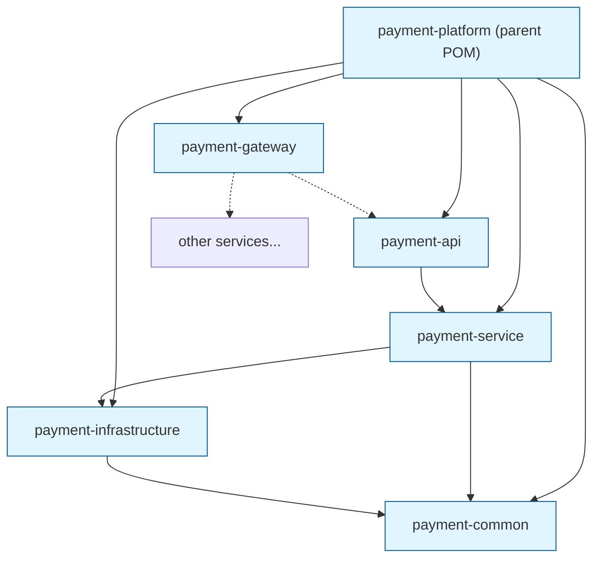

**Dependency rule:** Dependencies must point **inward** – `api` → `service` → `infrastructure` and `common`. `common` has **zero** dependencies on other modules. This prevents cycles and keeps domain models pristine.

### 1.7 Scenario
Your payment platform must serve both mobile and web clients. Mobile uses a lightweight API (V1) while web needs richer data (V2). The same domain models (`Payment`, `Merchant`) are used by both, plus by an internal reconciliation service. With a multi‑module setup, `payment-common` holds the shared models, and both `payment-api` and the reconciliation service depend on it.

### 1.8 Goal
- **Build time:** < 30 seconds for incremental changes (only affected modules rebuild)
- **Cyclic dependencies:** Zero
- **Reusability:** Domain models used by 3+ services without duplication

### 1.9 What Can Go Wrong (with wrong code)

**Wrong – Circular dependency via direct usage**
```java
// payment-service/src/main/java/.../PaymentService.java
import com.payments.api.v1.PaymentController;  // NEVER import controller in service

public class PaymentService {
    public void process(PaymentRequest req) {
        // logic
    }
}
```
This creates a compile‑time cycle because `payment-api` already depends on `payment-service`. Maven will fail with a `Cycle detected` error.

**Wrong – Leaking infrastructure into domain**
```java
// payment-common/src/main/java/.../model/Payment.java
import javax.persistence.Entity;   // JPA annotation in common module

@Entity
public class Payment { ... }
```
Now `payment-common` depends on Spring Data JPA, forcing every consumer (even non‑DB clients) to include JPA. This violates the zero‑dependency rule.

### 1.10 Why It Fails
- **Circular dependencies** make the build graph unsolvable.
- **Leaking dependencies** forces unnecessary transitive dependencies on consumers, bloating their classpath and increasing startup time.

### 1.11 Correct Approach
- Keep `common` free of any framework annotations (JPA, Jackson, etc.). Use plain POJOs.
- Use `provided` scope for optional dependencies.
- Run `mvn dependency:analyze` in CI to catch unintended dependencies.

### 1.12 Key Principles
- **Dependency Inversion Principle (DIP):** High‑level modules should not depend on low‑level modules; both should depend on abstractions. Here, `service` depends on `infrastructure` interfaces, not concrete PSP clients.
- **Acyclic Dependencies Principle (ADP):** The dependency graph must contain no cycles.

### 1.13 Correct Implementation

**Parent POM (`pom.xml`)**
```xml
<project xmlns="http://maven.apache.org/POM/4.0.0"
         xmlns:xsi="http://www.w3.org/2001/XMLSchema-instance"
         xsi:schemaLocation="http://maven.apache.org/POM/4.0.0 
         http://maven.apache.org/xsd/maven-4.0.0.xsd">
    <modelVersion>4.0.0</modelVersion>
    <groupId>com.payments</groupId>
    <artifactId>payment-platform</artifactId>
    <version>1.0.0-SNAPSHOT</version>
    <packaging>pom</packaging>

    <parent>
        <groupId>org.springframework.boot</groupId>
        <artifactId>spring-boot-starter-parent</artifactId>
        <version>3.2.4</version>
    </parent>

    <properties>
        <java.version>17</java.version>
        <springdoc.version>2.5.0</springdoc.version>
    </properties>

    <modules>
        <module>payment-common</module>
        <module>payment-api</module>
        <module>payment-service</module>
        <module>payment-infrastructure</module>
        <module>payment-gateway</module>
    </modules>

    <dependencyManagement>
        <dependencies>
            <!-- Define versions for all modules so child poms don't need to repeat -->
            <dependency>
                <groupId>com.payments</groupId>
                <artifactId>payment-common</artifactId>
                <version>${project.version}</version>
            </dependency>
            <dependency>
                <groupId>com.payments</groupId>
                <artifactId>payment-service</artifactId>
                <version>${project.version}</version>
            </dependency>
            <!-- ... other modules ... -->
        </dependencies>
    </dependencyManagement>

    <dependencies>
        <!-- Shared dependencies for all modules (optional) -->
    </dependencies>
</project>
```

**payment-common/pom.xml**
```xml
<project>
    <parent>
        <groupId>com.payments</groupId>
        <artifactId>payment-platform</artifactId>
        <version>1.0.0-SNAPSHOT</version>
    </parent>
    <artifactId>payment-common</artifactId>

    <dependencies>
        <!-- No Spring Boot starters! Only pure Java and maybe Jakarta Validation -->
        <dependency>
            <groupId>jakarta.validation</groupId>
            <artifactId>jakarta.validation-api</artifactId>
            <optional>true</optional>   <!-- consumers may not need validation -->
        </dependency>
        <dependency>
            <groupId>com.fasterxml.jackson.core</groupId>
            <artifactId>jackson-annotations</artifactId>
            <optional>true</optional>
        </dependency>
    </dependencies>
</project>
```

**payment-service/pom.xml**
```xml
<project>
    <parent>...</parent>
    <artifactId>payment-service</artifactId>
    <dependencies>
        <dependency>
            <groupId>com.payments</groupId>
            <artifactId>payment-common</artifactId>
        </dependency>
        <dependency>
            <groupId>com.payments</groupId>
            <artifactId>payment-infrastructure</artifactId>   <!-- for PSP client interfaces -->
        </dependency>
        <dependency>
            <groupId>org.springframework.boot</groupId>
            <artifactId>spring-boot-starter</artifactId>
        </dependency>
        <!-- ... -->
    </dependencies>
</project>
```

### 1.14 Execution Flow (Build Time)
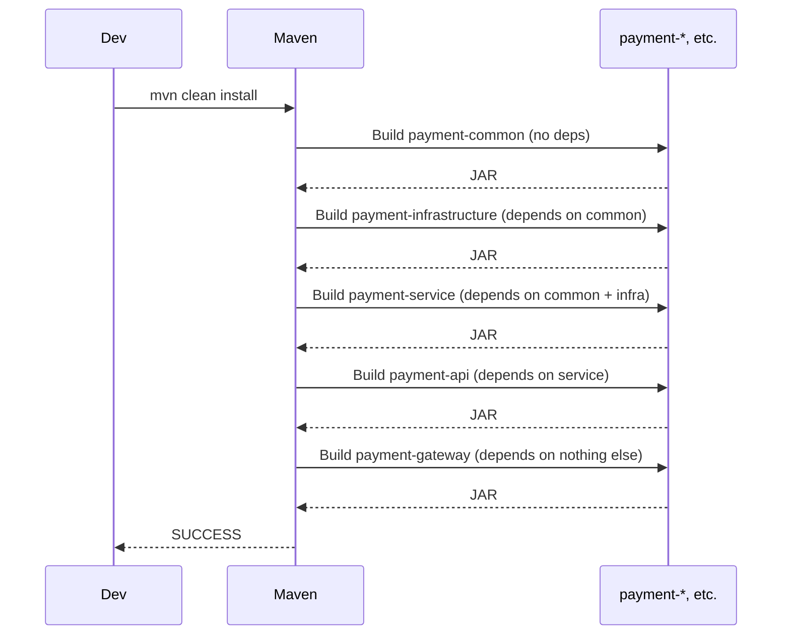

### 1.15 Common Mistakes
- **Putting Spring annotations in `common`** – makes the module heavy and forces Spring on all consumers.
- **Using `@Autowired` in `common`** – same problem.
- **Forgetting to declare inter‑module dependencies in `dependencyManagement`** – leads to version mismatches.
- **Allowing `infrastructure` to depend on `service`** – creates a cycle (service uses infrastructure, infrastructure should never use service).

### 1.16 Decision Matrix

| Approach               | Pros                                      | Cons                                           | When to Choose                               |
|------------------------|-------------------------------------------|------------------------------------------------|----------------------------------------------|
| Multi‑module Maven     | Compile‑time isolation, fast builds, reuse | More complex initial setup                     | Medium/large projects, multiple services     |
| Single module          | Simple to start                           | Tight coupling, no reuse, slow builds          | Prototypes, tiny services (under 1k LOC)     |
| Separate microservices | Independent deployability, tech diversity | Network latency, distributed transactions      | When teams are split or scalability demands  |

---

## 2. API Design & Versioning – Consumer‑Safe Contracts

### 2.1 What
API versioning is the practice of evolving a REST API without breaking existing clients. Common strategies include URI versioning (`/v1/payments`), query parameter versioning (`?version=1`), and content negotiation (`Accept: application/vnd.payments.v1+json`).

### 2.2 Why it exists
Mobile apps, partner integrations, and front‑end clients cannot be updated instantly. A breaking change (renaming a field, changing response structure) would cause those clients to fail. Versioning provides a coexistence period.

### 2.3 When to use
- Any public API
- Internal APIs with multiple consumers outside your immediate team
- Before making a backward‑incompatible change

### 2.4 Where to use
At the **API Gateway** or **Controller** layer. Versioning should be transparent to the business logic – map different versions to the same internal DTOs where possible.

### 2.5 How to implement
1. Choose a versioning strategy (URI is simplest and most cache‑friendly).
2. Create separate controller packages (`v1`, `v2`) with distinct request/response DTOs.
3. Use a `VersioningMapper` to convert between versioned DTOs and internal domain objects.
4. Deprecate old versions with a clear sunset policy.

### 2.6 Architecture Diagram
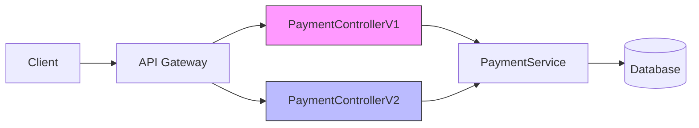

### 2.7 Scenario
A mobile app released 6 months ago uses `/v1/payments` with offset paging. The web team wants cursor paging for infinite scroll. Instead of forcing the mobile team to update, you introduce `/v2/payments` with cursor paging. Both versions coexist for 12 months.

### 2.8 Goal
- **Client breakage:** 0% when adding V2
- **Migration time:** At least 6 months overlap
- **Code duplication:** Minimal (shared service layer)

### 2.9 What Can Go Wrong (with wrong code)

**Wrong – Mixing V1 and V2 in the same controller**
```java
@RestController
@RequestMapping("/payments")
public class PaymentController {
    
    @GetMapping(params = "version=1")
    public PagedResponse listV1(...) { ... }
    
    @GetMapping(params = "version=2")
    public CursorPagedResponse listV2(...) { ... }
}
```
Now caching (HTTP, CDN) cannot distinguish responses because the URL is the same. A V1 response may be served to a V2 client.

**Wrong – Using the same DTO for both versions**
```java
public class PaymentResponse {
    private UUID id;
    private BigDecimal amount;
    // V2 adds 'fee' field
}

// Later, V1 clients start receiving 'fee' field (possibly null) – not a breaking change, but could confuse clients that expect only certain fields.
```
Adding fields is generally safe, but removing or renaming is not. If you later remove a field that V1 relies on, you break them.

### 2.10 Why It Fails
- **Cache poisoning** occurs when the cache key (URL) does not include the version.
- **Breaking changes** happen when the service assumes all clients can handle new fields/behaviors.

### 2.11 Correct Approach
- Use URI versioning: `/v1/payments`, `/v2/payments`.
- Keep version‑specific DTOs in separate packages; map to common domain objects.
- Never change a V1 DTO after release – if you must, create V2.
- Document deprecation in OpenAPI and HTTP headers (`Sunset`, `Deprecated`).

### 2.12 Key Principles
- **Postel’s Law (Robustness Principle):** Be conservative in what you send, be liberal in what you accept.
- **Backward Compatibility:** Adding fields is safe; removing/renaming is not.

### 2.13 Correct Implementation

**Version‑specific DTOs (Java records)**
```java
// payment-common/src/main/java/com/payments/common/dto/v1/PaymentResponseV1.java
package com.payments.common.dto.v1;

import java.math.BigDecimal;
import java.util.UUID;

public record PaymentResponseV1(
    UUID id,
    String merchantId,
    BigDecimal amount,
    String currency,
    String status   // enum as string
) {}

// payment-common/src/main/java/com/payments/common/dto/v2/PaymentResponseV2.java
package com.payments.common.dto.v2;

import java.math.BigDecimal;
import java.time.Instant;
import java.util.UUID;

public record PaymentResponseV2(
    UUID id,
    String merchantId,
    BigDecimal amount,
    String currency,
    String status,
    Instant createdAt,   // new field
    BigDecimal fee       // new field
) {}
```

**Mapper**
```java
// payment-service/src/main/java/com/payments/service/mapper/PaymentMapper.java
@Component
public class PaymentMapper {
    
    public PaymentResponseV1 toV1(Payment payment) {
        return new PaymentResponseV1(
            payment.getId(),
            payment.getMerchantId(),
            payment.getAmount(),
            payment.getCurrency(),
            payment.getStatus().name()
        );
    }
    
    public PaymentResponseV2 toV2(Payment payment) {
        return new PaymentResponseV2(
            payment.getId(),
            payment.getMerchantId(),
            payment.getAmount(),
            payment.getCurrency(),
            payment.getStatus().name(),
            payment.getCreatedAt(),
            calculateFee(payment)   // hypothetical fee logic
        );
    }
}
```

**Controller V1**
```java
@RestController
@RequestMapping("/v1/payments")
public class PaymentControllerV1 {
    private final PaymentService service;
    private final PaymentMapper mapper;

    @GetMapping("/{id}")
    public ResponseEntity<PaymentResponseV1> get(@PathVariable UUID id) {
        Payment payment = service.findById(id);
        return ResponseEntity.ok(mapper.toV1(payment));
    }
}
```

**Controller V2**
```java
@RestController
@RequestMapping("/v2/payments")
public class PaymentControllerV2 {
    private final PaymentService service;
    private final PaymentMapper mapper;

    @GetMapping("/{id}")
    public ResponseEntity<PaymentResponseV2> get(@PathVariable UUID id) {
        Payment payment = service.findById(id);
        return ResponseEntity.ok(mapper.toV2(payment));
    }
}
```

### 2.14 Execution Flow
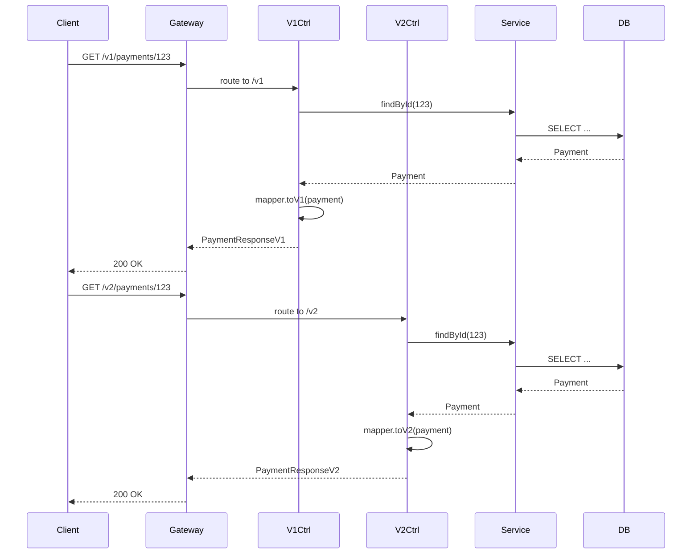

### 2.15 Common Mistakes
- **Versioning via request header** – makes caching and discovery harder; clients must remember to set the header.
- **Copy‑pasting entire controllers** – leads to drift; better to keep common logic in service layer.
- **Not sunsetting old versions** – accumulating technical debt and maintenance cost.
- **Breaking changes in patch releases** – semantic versioning is for libraries, not running APIs.

### 2.16 Decision Matrix

| Strategy               | Pros                                      | Cons                                           | When to Use                                  |
|------------------------|-------------------------------------------|------------------------------------------------|----------------------------------------------|
| URI Path (/v1/...)     | Cache‑friendly, self‑documenting          | URL changes, can clutter resources             | Most common, recommended for public APIs     |
| Query Parameter        | Same URL for all versions                 | Cache ignores param, less discoverable         | Internal APIs with few consumers             |
| Custom Header          | Clean URLs                                | Hard to test, not visible in browsers          | When you must keep URLs unchanged            |
| Content Type (Accept)  | Follows HTTP semantics                    | Complex to implement, clients must set header  | Hypermedia APIs, versioning by schema        |

---

## 3. OpenAPI Contract‑First – Stable API Specifications

### 3.1 What
OpenAPI (formerly Swagger) is a specification for describing REST APIs using a JSON or YAML file. Contract‑first means you write the OpenAPI spec first, then generate server stubs and client SDKs from it.

### 3.2 Why it exists
- Prevents drift between documentation and implementation.
- Enables client and server teams to work in parallel.
- Provides machine‑readable contracts for testing and validation.

### 3.3 When to use
- Any API with external consumers (partners, mobile).
- When multiple teams depend on the same API.
- When you need to generate client SDKs automatically.

### 3.4 Where to use
At the **design phase**. The OpenAPI file lives in the repository and is used to generate code during build.

### 3.5 How to implement
1. Write `openapi.yaml` describing all endpoints, schemas, and error responses.
2. Use a Maven plugin (e.g., `openapi-generator-maven-plugin`) to generate Spring controller interfaces and DTOs.
3. Implement the generated interfaces.
4. Validate requests against the schema using `@Valid` and Spring’s auto‑configuration.

### 3.6 Architecture Diagram
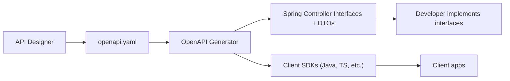

### 3.7 Scenario
You are building a payments API that will be used by 10 different partner apps (iOS, Android, web, and backend services). Writing OpenAPI first ensures all partners get a consistent experience and can generate their own clients.

### 3.8 Goal
- **Time to first client integration:** < 1 day (client generation + mock server)
- **Contract violations:** 0 (validation in CI)

### 3.9 What Can Go Wrong (with wrong code)

**Wrong – Using code‑first with annotations only**
```java
@Operation(summary = "Create payment")
@PostMapping
public ResponseEntity<PaymentResponse> create(@Valid @RequestBody PaymentRequest req) { ... }
```
Developers forget to update annotations, or the generated Swagger UI shows incorrect examples. There’s no single source of truth.

**Wrong – Incomplete OpenAPI spec**
```yaml
paths:
  /v1/payments:
    post:
      requestBody:
        content:
          application/json:
            schema:
              $ref: '#/components/schemas/PaymentRequest'
components:
  schemas:
    PaymentRequest:
      type: object   # missing properties!
```
Now the generated client will have empty DTOs, causing runtime errors.

### 3.10 Why It Fails
- **Human error** – annotations drift from actual implementation.
- **Lack of validation** – no automatic check that the spec matches the code.

### 3.11 Correct Approach
- Use contract‑first: generate code from spec, and never modify generated code manually.
- Validate the spec against a style guide (e.g., using spectral).
- Include examples and error schemas in the spec.

### 3.12 Key Principles
- **Single Source of Truth:** The OpenAPI spec is the authoritative definition.
- **Design‑First:** Think about the consumer experience before implementation.

### 3.13 Correct Implementation

**openapi.yaml (excerpt)**
```yaml
openapi: 3.0.1
info:
  title: Payments API
  version: 2.0.0
paths:
  /v1/payments:
    post:
      summary: Create a payment
      operationId: createPayment
      parameters:
        - name: Idempotency-Key
          in: header
          required: true
          schema:
            type: string
            format: uuid
      requestBody:
        required: true
        content:
          application/json:
            schema:
              $ref: '#/components/schemas/PaymentRequest'
      responses:
        '201':
          description: Payment created
          headers:
            Location:
              schema:
                type: string
              description: URL of the created payment
          content:
            application/json:
              schema:
                $ref: '#/components/schemas/PaymentResponse'
        '400':
          description: Validation error
          content:
            application/problem+json:
              schema:
                $ref: '#/components/schemas/ProblemDetail'
        '409':
          description: Duplicate idempotency key
          content:
            application/problem+json:
              schema:
                $ref: '#/components/schemas/ProblemDetail'
components:
  schemas:
    PaymentRequest:
      type: object
      required: [merchantId, amount, currency, paymentMethod]
      properties:
        merchantId:
          type: string
          example: "merchant_123"
        amount:
          type: number
          format: double
          minimum: 0.01
          example: 99.95
        currency:
          type: string
          minLength: 3
          maxLength: 3
          example: "USD"
        paymentMethod:
          type: string
          example: "card"
    PaymentResponse:
      type: object
      properties:
        id:
          type: string
          format: uuid
        merchantId:
          type: string
        amount:
          type: number
        currency:
          type: string
        status:
          type: string
          enum: [PENDING, AUTHORIZED, FAILED, REFUNDED]
        idempotencyKey:
          type: string
        createdAt:
          type: string
          format: date-time
    ProblemDetail:
      type: object
      properties:
        type:
          type: string
          format: uri
        title:
          type: string
        status:
          type: integer
        detail:
          type: string
        instance:
          type: string
        # extension properties can be added
```

**Maven plugin configuration (in payment-api/pom.xml)**
```xml
<build>
    <plugins>
        <plugin>
            <groupId>org.openapitools</groupId>
            <artifactId>openapi-generator-maven-plugin</artifactId>
            <version>7.4.0</version>
            <executions>
                <execution>
                    <goals>
                        <goal>generate</goal>
                    </goals>
                    <configuration>
                        <inputSpec>${project.basedir}/src/main/resources/openapi.yaml</inputSpec>
                        <generatorName>spring</generatorName>
                        <output>${project.build.directory}/generated-sources</output>
                        <apiPackage>com.payments.api.generated</apiPackage>
                        <modelPackage>com.payments.dto.generated</modelPackage>
                        <configOptions>
                            <interfaceOnly>true</interfaceOnly>
                            <useSpringBoot3>true</useSpringBoot3>
                            <useJakartaEe>true</useJakartaEe>
                            <skipDefaultInterface>true</skipDefaultInterface>
                        </configOptions>
                    </configuration>
                </execution>
            </executions>
        </plugin>
    </plugins>
</build>
```

**Implementing the generated interface**
```java
// payment-api/src/main/java/com/payments/api/v1/PaymentControllerV1.java
@RestController
public class PaymentControllerV1 implements PaymentsApi {  // generated interface

    private final PaymentService service;
    private final PaymentMapper mapper;

    @Override
    public ResponseEntity<PaymentResponse> createPayment(
            @RequestHeader("Idempotency-Key") String idempotencyKey,
            @Valid @RequestBody PaymentRequest paymentRequest) {
        PaymentResponse response = service.create(idempotencyKey, paymentRequest);
        return ResponseEntity
                .created(URI.create("/v1/payments/" + response.getId()))
                .body(response);
    }
}
```

### 3.14 Execution Flow (Build Time)
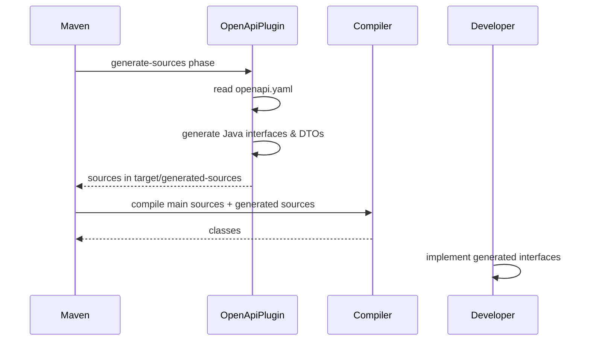

### 3.15 Common Mistakes
- **Not including error responses** – clients don't know what to expect on failure.
- **Using `additionalProperties: true`** – makes the schema too loose.
- **Generating code into `src/main/java`** – leads to accidental manual edits; always generate into `target/`.
- **Forgetting to add `@Valid` on generated controller methods** – request validation won't happen.

### 3.16 Decision Matrix

| Approach          | Pros                                      | Cons                                           | When to Use                                  |
|-------------------|-------------------------------------------|------------------------------------------------|----------------------------------------------|
| Contract‑first    | Single source of truth, client SDKs       | Requires spec maintenance, learning curve     | Public APIs, multiple consumers               |
| Code‑first        | Fast, no extra files                      | Documentation drift, no client SDK generation | Internal APIs, single consumer                |
| Hybrid (annotations + spec validation) | Both documentation and code | Still possible to drift, complex setup        | Large teams with strong governance            |

---

## 4. Idempotency – The Heart of Double‑Charge Prevention

### 4.1 What
Idempotency means that multiple identical requests have the same effect as a single request. In payments, this guarantees that a client can retry safely without charging the customer twice.

### 4.2 Why it exists
Network failures, timeouts, and client retries are inevitable. Without idempotency, a retried payment request could be processed as a new transaction, leading to double charges and angry customers.

### 4.3 When to use
- Any operation that changes state (POST, PUT, PATCH) – especially financial transactions.
- When clients cannot guarantee exactly‑once delivery.

### 4.4 Where to use
At the **API layer** (idempotency key header) and **database layer** (unique constraint). Also in **message brokers** (Kafka idempotent producer) but that’s a different concept.

### 4.5 How to implement
1. Client generates a unique key (UUID) and sends it in the `Idempotency-Key` header.
2. Server checks if it has seen this key before (in Redis or DB).
3. If seen, return the cached response (do not process again).
4. If not seen, process the request and atomically store the response with the key.
5. Use a unique constraint on the `idempotencyKey` column in the database as a final guard.

### 4.6 Architecture Diagram
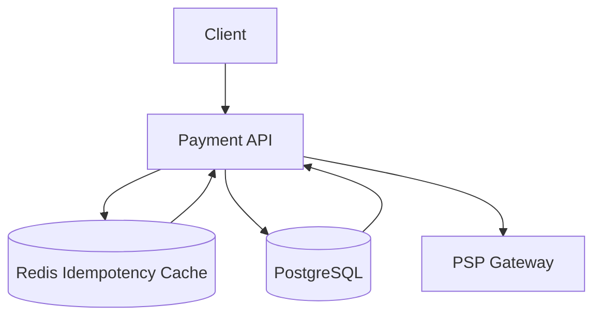

### 4.7 Scenario
A mobile app tries to charge a customer’s card. The request times out after 5 seconds, but the PSP actually processed it. The app retries with the same idempotency key. The payment service sees the key, returns the cached success response, and does not call the PSP again.

### 4.8 Goal
- **Duplicate processing rate:** 0%
- **Cache hit latency:** < 5 ms
- **Idempotency window:** 24 hours (configurable)

### 4.9 What Can Go Wrong (with wrong code)

**Wrong – Checking existence only in Redis without DB unique constraint**
```java
public PaymentResponse create(String idempotencyKey, PaymentRequest req) {
    String cached = redis.opsForValue().get("idempotency:" + idempotencyKey);
    if (cached != null) {
        return mapper.readValue(cached, PaymentResponse.class);
    }
    Payment payment = processPayment(req);
    PaymentResponse resp = mapper.toResponse(payment);
    redis.opsForValue().set("idempotency:" + idempotencyKey, 
                             mapper.writeValueAsString(resp), 
                             Duration.ofHours(24));
    return resp;
}
```
If Redis goes down or the key expires before the DB transaction commits, a duplicate request could slip through. Without a DB unique constraint, you might insert two payments with the same key.

**Wrong – Using `set` instead of `setIfAbsent`**
```java
String cached = redis.opsForValue().get(key);
if (cached == null) {
    // process payment...
    redis.opsForValue().set(key, json);  // not atomic!
}
```
Two concurrent requests could both see `cached == null`, both process the payment, and then both try to `set`. The last one wins, but you’ve already double‑charged.

**Wrong – Storing only success responses**
If the PSP returns a transient failure (e.g., 503) and the client retries, you must also cache the failure response for the same key? Actually, idempotency should apply to the **operation**, not just success. If the first attempt fails, the second attempt should be allowed to retry (unless the failure is permanent). So you cannot cache a failure response as final. Usually, you only cache **successful** responses. For failures, you allow retry until success or exhaustion. But you must also ensure that partial processing (e.g., writing to DB before PSP call) doesn't happen twice. That's why you need transactional outbox or similar.

### 4.10 Why It Fails
- **Race conditions** – two requests arrive at the same time; both miss the cache, both process.
- **Cache inconsistency** – Redis is not a source of truth; it can lose data.
- **No DB constraint** – the only true source of uniqueness is the database.

### 4.11 Correct Approach
1. Use Redis as a **fast path** with `SET NX` (atomic) to claim the key.
2. Store the final response (success only) with TTL.
3. Also have a unique constraint on `idempotencyKey` in the database.
4. Use a database transaction to ensure that if the payment record is inserted, the key is recorded.
5. For failures, **do not** store the response; instead, allow retry but ensure no partial state.

Better: Use the **idempotency key as part of the business transaction**. Insert the payment record with the key in `PENDING` status, then call PSP, then update status. The unique constraint prevents duplicate inserts. Redis is just a cache to avoid hitting DB for every retry.

### 4.12 Key Principles
- **Idempotency Key**: Must be supplied by the client (the only party that knows if it's a retry).
- **Atomic Check‑and‑Set**: Use Redis `SET NX` to claim the key.
- **Database as Source of Truth**: Unique constraint ensures no duplicate payments.

### 4.13 Correct Implementation

**Payment entity with unique constraint (already shown)**
```java
@Entity
@Table(name = "payments", uniqueConstraints = {
    @UniqueConstraint(columnNames = "idempotencyKey")
})
public class Payment {
    @Column(unique = true)
    private String idempotencyKey;
    // ...
}
```

**IdempotencyService using Redis `setIfAbsent`**
```java
@Service
public class IdempotencyService {
    private static final String KEY_PREFIX = "idempotency:";
    private static final Duration TTL = Duration.ofHours(24);
    private final StringRedisTemplate redis;

    public Optional<String> getCachedResponse(String key) {
        return Optional.ofNullable(redis.opsForValue().get(KEY_PREFIX + key));
    }

    public boolean storeIfAbsent(String key, String responseJson) {
        Boolean stored = redis.opsForValue()
                .setIfAbsent(KEY_PREFIX + key, responseJson, TTL);
        return Boolean.TRUE.equals(stored);
    }
}
```

**PaymentService with transactional guard**
```java
@Service
@Transactional
public class PaymentService {
    private final PaymentRepository paymentRepository;
    private final IdempotencyService idempotencyService;
    private final PspClient pspClient;
    private final ObjectMapper mapper;

    public PaymentResponse create(String idempotencyKey, PaymentRequest req) {
        // 1. Fast path: check Redis cache (optional, but improves latency)
        Optional<String> cached = idempotencyService.getCachedResponse(idempotencyKey);
        if (cached.isPresent()) {
            return mapper.readValue(cached.get(), PaymentResponse.class);
        }

        // 2. Check DB for existing payment with this key (in case Redis missed)
        paymentRepository.findByIdempotencyKey(idempotencyKey)
                .ifPresent(p -> {
                    throw new DuplicatePaymentException(idempotencyKey);
                });

        // 3. Create payment record in PENDING state
        Payment payment = new Payment();
        payment.setIdempotencyKey(idempotencyKey);
        payment.setMerchantId(req.merchantId());
        payment.setAmount(req.amount());
        payment.setCurrency(req.currency());
        payment.setStatus(PaymentStatus.PENDING);
        paymentRepository.save(payment);  // flushes to DB, unique constraint active

        // 4. Call PSP (may throw exception)
        PspResponse pspResponse;
        try {
            pspResponse = pspClient.charge(new PspChargeRequest(payment));
        } catch (Exception e) {
            // PSP call failed – payment remains PENDING, but we should allow retry.
            // Do NOT cache failure; client can retry with same key.
            // However, we must not create a new payment record. The existing PENDING
            // record will be found on next attempt, and we can retry the PSP call.
            // For simplicity, we'll throw an exception and let the client retry.
            throw new PspCallFailedException(e);
        }

        // 5. Update payment status to AUTHORIZED
        payment.setStatus(PaymentStatus.AUTHORIZED);
        paymentRepository.save(payment);

        // 6. Build response
        PaymentResponse response = PaymentResponse.from(payment);

        // 7. Store in Redis cache (only on success)
        idempotencyService.storeIfAbsent(idempotencyKey,
                mapper.writeValueAsString(response));

        return response;
    }
}
```

**Handling retries after PSP failure** – The above code leaves the payment in `PENDING`. On a retry with the same key, step 2 will find the existing payment and can either:
- Throw `DuplicatePaymentException` (bad – would prevent retry), or
- Check the status: if `PENDING`, retry the PSP call (with idempotency key forwarded to PSP if supported). This requires careful design.

Better to have a dedicated `IdempotentOperationHandler` that orchestrates the whole process.

### 4.14 Execution Flow (Happy Path)
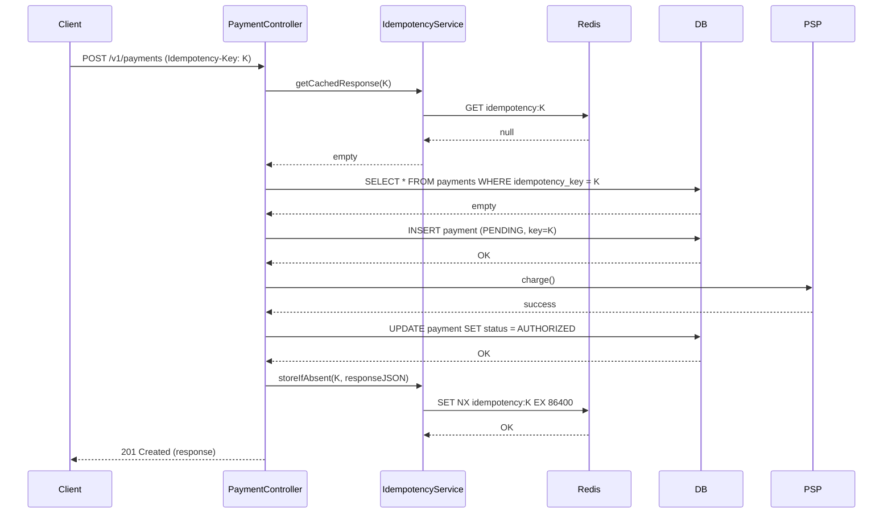

### 4.15 Common Mistakes
- **Relying only on Redis** – Redis is not durable; use DB unique constraint.
- **Not handling concurrent requests** – use `SET NX` or pessimistic locking.
- **Storing failure responses** – prevents legitimate retries.
- **Using client‑generated key without validation** – must ensure key is unique (UUID recommended).
- **Not forwarding idempotency key to PSP** – many PSPs also support idempotency; forward it to prevent double charging at their end.

### 4.16 Decision Matrix

| Storage for Idempotency | Pros                                      | Cons                                           | When to Use                                  |
|-------------------------|-------------------------------------------|------------------------------------------------|----------------------------------------------|
| Redis only              | Fast, low latency                         | Not durable, can lose data                     | When idempotency window is short (< 5 min)   |
| Database only           | Durable, ACID                             | Slower, adds load on DB                        | When you can't tolerate any data loss        |
| Redis + DB (cache‑aside)| Best of both                              | Complexity, eventual consistency               | Recommended for payments (window 24h)        |
| In‑memory cache         | Ultra‑fast                                | Lost on restart, not shared across instances   | Single‑node apps (not microservices)         |

---

## 5. Resiliency with Retry & Exponential Backoff

### 5.1 What
Retry with exponential backoff is a strategy where a failed operation is automatically reattempted after increasing delays, often with jitter, to avoid overwhelming a failing system.

### 5.2 Why it exists
Network glitches, transient service unavailability, and timeouts are common. Retrying immediately often fails again. Exponential backoff spreads retries, giving the downstream system time to recover, and jitter prevents thundering herds.

### 5.3 When to use
- Calls to external services (PSP, databases, third‑party APIs).
- Any operation that may fail transiently.
- When you have idempotency guarantees (so retries are safe).

### 5.4 Where to use
At the **infrastructure layer** (HTTP clients, message producers). In Spring, using `@Retryable` on service or client methods.

### 5.5 How to implement
1. Identify retryable exceptions (e.g., `5xx`, `SocketTimeoutException`).
2. Configure `@Retryable` with `maxAttempts`, `backoff` (delay, multiplier, random).
3. Provide a `@Recover` method that handles the case when all retries are exhausted.
4. Ensure idempotency so retries don't cause duplicate side effects.

### 5.6 Architecture Diagram
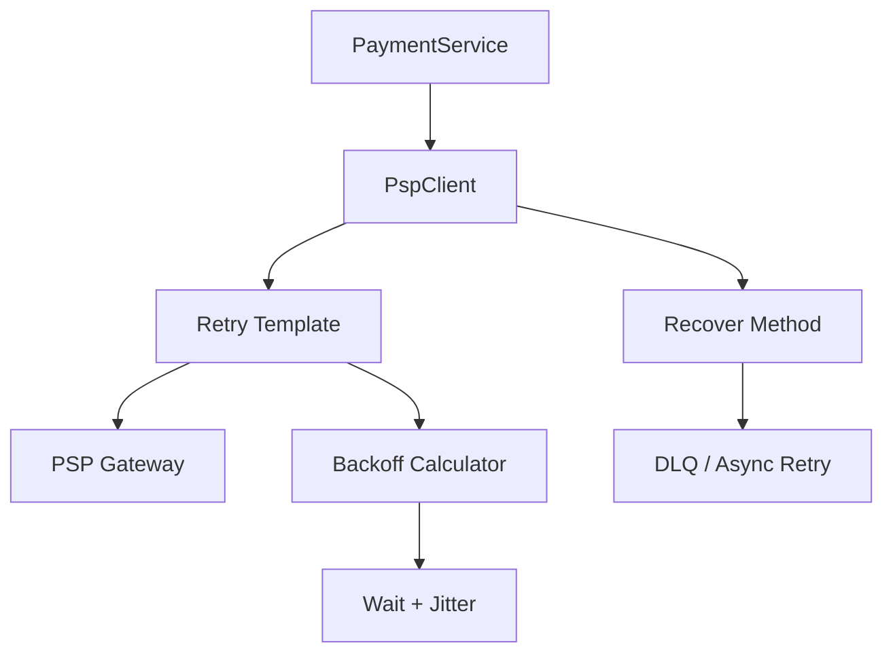

### 5.7 Scenario
Your payment service calls a third‑party PSP. During peak hours, the PSP occasionally returns `503 Service Unavailable`. With retry + backoff, the first failure waits 500ms, then 1000ms, then 2000ms. By the third attempt, the PSP has recovered and the charge succeeds.

### 5.8 Goal
- **Success rate after transient failures:** > 99%
- **Downstream protection:** No thundering herds
- **Total retry time:** Configurable (e.g., < 5 seconds)

### 5.9 What Can Go Wrong (with wrong code)

**Wrong – Retrying on permanent failures**
```java
@Retryable(maxAttempts = 3)
public PspResponse charge(PspChargeRequest req) {
    return restTemplate.postForObject(..., req, PspResponse.class);
}
```
If the PSP returns `400 Bad Request` (invalid input), retrying will always fail and waste resources. You must distinguish retryable from non‑retryable exceptions.

**Wrong – No jitter, fixed backoff**
```java
@Retryable(backoff = @Backoff(delay = 1000))
```
If 10 services all fail at the same time, they all retry exactly 1 second later, creating another spike. This can cascade failures.

**Wrong – Using `@Retryable` without `@EnableRetry`**
```java
// missing @EnableRetry on configuration
```
The annotation is ignored; no retries happen.

**Wrong – `@Recover` method not matching return type**
```java
@Recover
public void recover(PspTransientException e) { ... }  // void != PspResponse
```
Spring will not find the recover method and will throw the original exception after retries.

### 5.10 Why It Fails
- **Retrying permanent failures** wastes resources and delays error reporting.
- **No jitter** causes synchronized retries, overwhelming the downstream.
- **Improper exception classification** leads to retrying things that should not be retried.

### 5.11 Correct Approach
- Use `retryFor` to specify which exceptions trigger a retry (e.g., `PspTransientException`).
- Use `noRetryFor` for permanent failures (e.g., `PspInvalidRequestException`).
- Configure `backoff` with `multiplier` and `random=true` for jitter.
- Provide a `@Recover` method that logs and possibly sends to a DLQ or triggers an alternative flow.

### 5.12 Key Principles
- **Exponential Backoff:** Increase wait time between retries to allow recovery.
- **Jitter:** Randomize wait times to avoid synchronized retries.
- **Idempotency:** Retries must be safe (already covered).

### 5.13 Correct Implementation

**Enable retry in main application**
```java
@SpringBootApplication
@EnableRetry
public class PaymentApiApplication { ... }
```

**Define retryable client**
```java
@Component
public class PspClient {
    private final RestTemplate restTemplate;
    private final String pspBaseUrl;

    @Retryable(
        retryFor = { PspTransientException.class },
        maxAttempts = 3,
        backoff = @Backoff(
            delay = 500,
            multiplier = 2.0,
            random = true,
            maxDelay = 5000   // optional cap
        )
    )
    public PspResponse charge(PspChargeRequest request) {
        try {
            return restTemplate.postForObject(
                pspBaseUrl + "/charges",
                request,
                PspResponse.class
            );
        } catch (HttpClientErrorException e) {
            // 4xx errors – permanent, do not retry
            if (e.getStatusCode().is4xxClientError()) {
                throw new PspInvalidRequestException(e);
            }
            // 5xx errors – retryable
            throw new PspTransientException(e);
        } catch (ResourceAccessException e) {
            // network timeout – retryable
            throw new PspTransientException(e);
        }
    }

    @Recover
    public PspResponse recover(PspTransientException e, PspChargeRequest request) {
        log.error("PSP failed after retries for idempotencyKey: {}", request.idempotencyKey());
        // Option 1: throw a checked exception to be handled upstream
        throw new PspUnavailableException("PSP temporarily unavailable", e);
        // Option 2: return a fallback response (if acceptable)
        // Option 3: send to a dead‑letter queue for later retry
    }
}
```

**Custom exceptions**
```java
public class PspTransientException extends RuntimeException {
    // for retryable failures
}

public class PspInvalidRequestException extends RuntimeException {
    // for 4xx, not retryable
}

public class PspUnavailableException extends RuntimeException {
    // after retries exhausted
}
```

### 5.14 Execution Flow
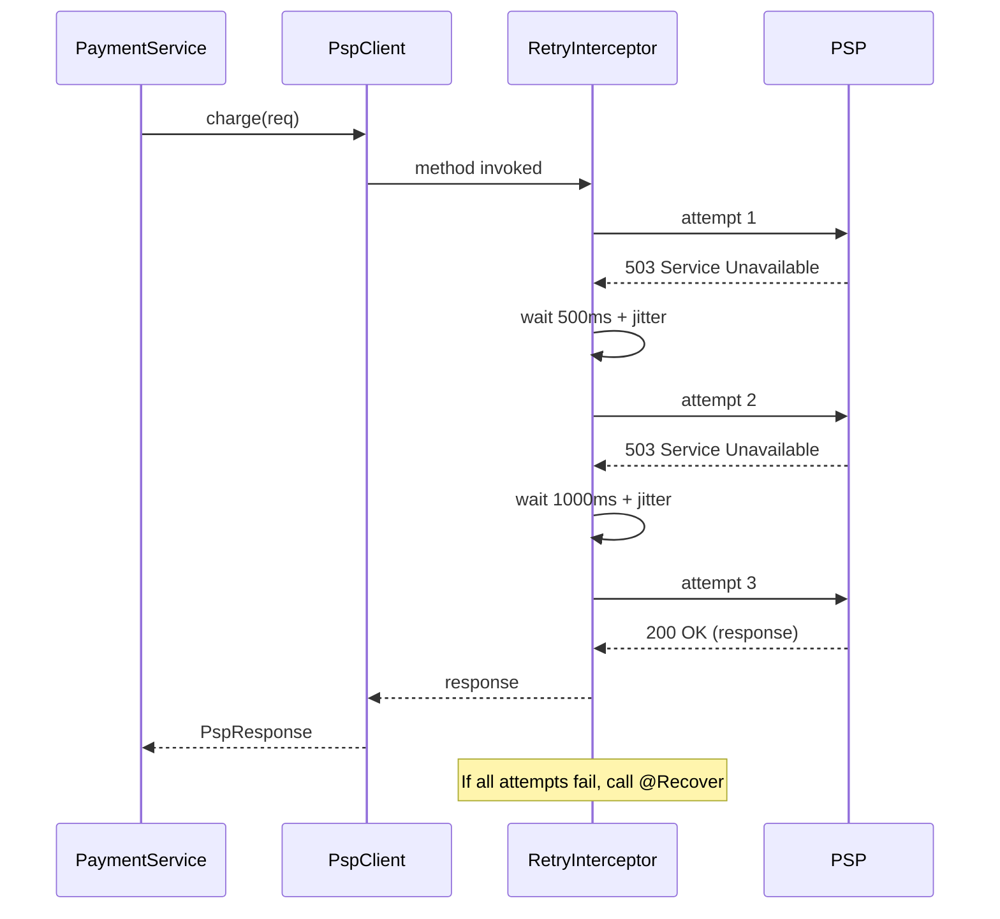

### 5.15 Common Mistakes
- **Using `@Retryable` on methods that modify state without idempotency** – can cause duplicate side effects.
- **Not configuring `maxDelay`** – backoff could grow indefinitely (but multiplier caps at `maxAttempts`).
- **Catching and swallowing exceptions inside the method** – retry only works if the method throws.
- **Using too many retries** – can block threads and degrade overall throughput.

### 5.16 Decision Matrix

| Retry Strategy         | Pros                                      | Cons                                           | When to Use                                  |
|------------------------|-------------------------------------------|------------------------------------------------|----------------------------------------------|
| Fixed delay            | Simple                                    | Synchronized retries, may not give time to recover | Only if downstream is known to recover quickly |
| Exponential backoff    | Spreads retries, respects recovery time   | More complex, may increase latency             | Default for external calls                    |
| Exponential with jitter| Prevents thundering herd                  | Slightly more latency variance                 | High‑concurrency systems                      |
| No retry               | Fast failure, no resource waste           | Higher failure rate, manual intervention       | When idempotency is impossible or operation cheap |

---

## 6. Event‑Driven Architecture with Kafka – Scaling Beyond CRUD

*This section extends the original material to include Kafka for eventual consistency and saga orchestration.*

### 6.1 What
Event‑driven architecture (EDA) is a pattern where services communicate through events published to a message broker (like Kafka). Each service reacts to events and may publish new events, enabling loose coupling and scalability.

### 6.2 Why it exists
In a payment platform, many operations are long‑running and involve multiple services (fraud check, ledger update, notification). Synchronous calls create tight coupling and can fail if one service is down. Events allow each service to process independently.

### 6.3 When to use
- When you need to coordinate multiple services (sagas)
- When you want to decouple services for scalability
- When you need to audit or replay events

### 6.4 Where to use
At the **service boundaries**. Services publish events to Kafka topics; other services consume them.

### 6.5 How to implement
1. Define event schemas (Avro, JSON Schema) in `payment-common`.
2. Use Spring Kafka to publish events after database transactions (Transactional Outbox pattern).
3. Use Kafka Streams or consumers to handle events and update state.
4. Implement compensating transactions for rollback (saga).

### 6.6 Architecture Diagram
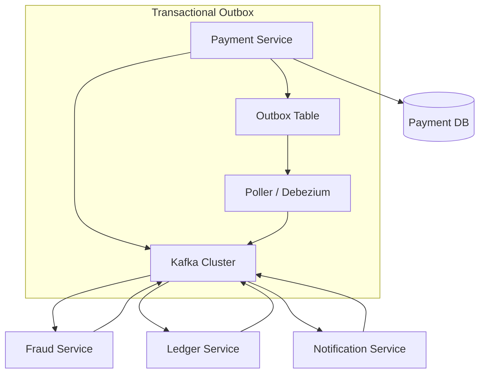

### 6.7 Scenario
After a payment is authorized, the fraud service must verify it, then the ledger service records it, and finally a notification is sent. With Kafka, the payment service publishes `PaymentAuthorized` event. Fraud service consumes it, runs checks, and publishes `FraudApproved` or `FraudRejected`. Ledger listens for `FraudApproved` and posts to general ledger. Notification listens for `FraudApproved` and sends email. If any step fails, compensating events are published.

### 6.8 Goal
- **Latency:** End‑to‑end < 5 seconds (typical for payments)
- **Throughput:** 10k events/sec per topic
- **Data loss:** 0 (with acks=all and replication)

### 6.9 What Can Go Wrong (with wrong code)

**Wrong – Publishing events before database commit**
```java
@Transactional
public void authorizePayment(Payment payment) {
    payment.setStatus(AUTHORIZED);
    paymentRepository.save(payment);
    kafkaTemplate.send("payment-authorized", payment);  // may be sent before commit
}
```
If the transaction rolls back after the event is sent, consumers see an event that never happened (ghost event). This breaks consistency.

**Wrong – Not handling duplicates**
Kafka guarantees at‑least‑once delivery. If a consumer processes the same event twice, you may double‑credit a ledger entry unless you make the consumer idempotent.

**Wrong – No schema evolution strategy**
If you change the event format and older consumers can't read it, they crash. You need compatibility modes (backward, forward).

### 6.10 Why It Fails
- **Outbox pattern violation** leads to inconsistent states.
- **Lack of idempotent consumers** causes duplicate side effects.
- **Schema mismatches** break consumers during deployment.

### 6.11 Correct Approach
- Use **Transactional Outbox** pattern: write event to an `outbox` table in the same transaction as business data; a separate process (poller or CDC tool like Debezium) reads from outbox and publishes to Kafka.
- Make consumers idempotent (e.g., store processed event IDs in a deduplication table).
- Use Avro with Schema Registry to manage schema evolution.

### 6.12 Key Principles
- **Transactional Outbox:** Ensures atomicity between DB write and event publication.
- **Idempotent Consumer:** Even if the same event is delivered twice, the effect is the same.
- **At‑least‑once delivery:** Consumers must handle duplicates.

### 6.13 Correct Implementation

**Outbox entity**
```java
@Entity
@Table(name = "outbox")
public class OutboxEvent {
    @Id @GeneratedValue(strategy = UUID)
    private UUID id;
    private String aggregateType;  // e.g., "Payment"
    private String aggregateId;    // payment UUID
    private String eventType;      // "PaymentAuthorized"
    private String payload;        // JSON of event
    private Instant createdAt;
    // getters, setters...
}
```

**Service method with outbox**
```java
@Service
@Transactional
public class PaymentService {
    @Autowired private PaymentRepository paymentRepository;
    @Autowired private OutboxRepository outboxRepository;

    public void authorizePayment(UUID paymentId) {
        Payment payment = paymentRepository.findById(paymentId).orElseThrow();
        payment.setStatus(AUTHORIZED);
        paymentRepository.save(payment);

        // Create outbox event
        OutboxEvent event = new OutboxEvent();
        event.setAggregateType("Payment");
        event.setAggregateId(paymentId.toString());
        event.setEventType("PaymentAuthorized");
        event.setPayload(objectMapper.writeValueAsString(
            new PaymentAuthorizedEvent(paymentId, payment.getAmount())));
        event.setCreatedAt(Instant.now());
        outboxRepository.save(event);
    }
}
```

**Poller (simplified)**
```java
@Component
public class OutboxPoller {
    @Scheduled(fixedDelay = 1000)
    @Transactional
    public void publishOutboxEvents() {
        List<OutboxEvent> events = outboxRepository.findTop100ByOrderByCreatedAtAsc();
        for (OutboxEvent event : events) {
            kafkaTemplate.send(event.getEventType(), event.getPayload());
            outboxRepository.delete(event);  // or mark as published
        }
    }
}
```

**Idempotent Consumer**
```java
@Component
public class FraudConsumer {
    @Autowired private ProcessedEventRepository processedEventRepository;
    @Autowired private FraudService fraudService;

    @KafkaListener(topics = "PaymentAuthorized")
    public void consume(String message, @Header(KafkaHeaders.RECEIVED_MESSAGE_KEY) String key) {
        // key could be the event ID (UUID) from outbox
        if (processedEventRepository.existsById(key)) {
            log.info("Duplicate event ignored: {}", key);
            return;
        }
        PaymentAuthorizedEvent event = objectMapper.readValue(message, PaymentAuthorizedEvent.class);
        fraudService.check(event);
        processedEventRepository.save(new ProcessedEvent(key));
    }
}
```

### 6.14 Execution Flow (Transactional Outbox)
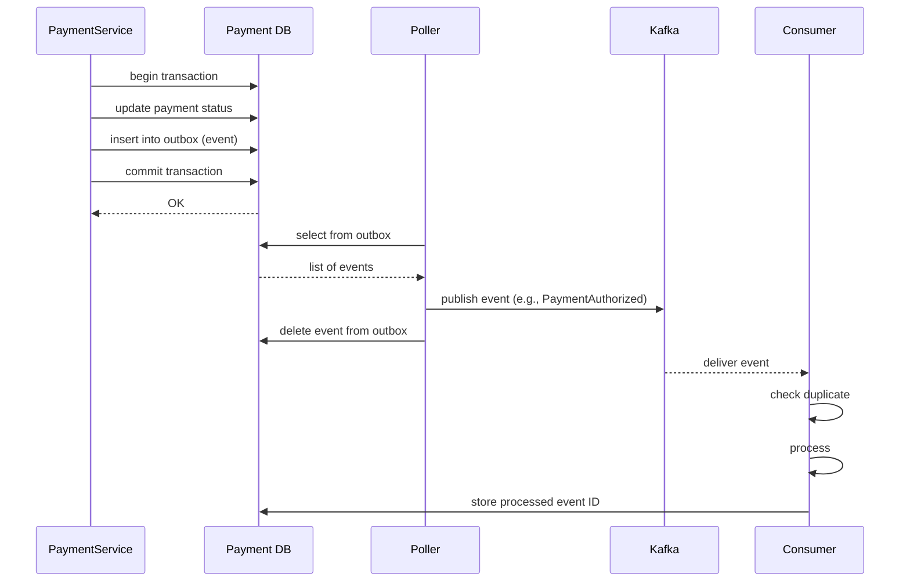

### 6.15 Common Mistakes
- **Not using a schema registry** – leads to brittle deserialization.
- **Publishing events in the middle of a transaction** – outbox pattern solves this.
- **Making consumers non‑idempotent** – duplicate events cause incorrect state.
- **Using too many topics** – each topic adds overhead; group related events.

### 6.16 Decision Matrix

| Approach                | Pros                                      | Cons                                           | When to Use                                  |
|-------------------------|-------------------------------------------|------------------------------------------------|----------------------------------------------|
| Synchronous HTTP        | Simple, easy to debug                     | Coupling, blocking, cascading failures        | Simple CRUD, low latency requirements        |
| Kafka with Outbox       | Decoupled, scalable, replayable           | Complexity, eventual consistency               | Saga coordination, high throughput            |
| RabbitMQ / ActiveMQ     | Good for command‑like messages            | Less scalable than Kafka, not ideal for replay| When you need complex routing                 |
| Debezium (CDC)          | Zero code in service, reliable            | Requires Debezium setup, schema changes       | When you can't modify application code       |

---

## 7. Putting It All Together – End‑to‑End Payment Flow

Now we combine all the patterns into a realistic payment flow that demonstrates:

- API versioning (V1)
- Idempotency with Redis + DB
- Retry with backoff to PSP
- Event publishing via outbox
- Kafka consumers for fraud and ledger

### 7.1 High‑Level Sequence

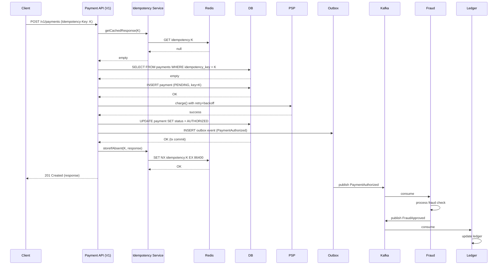

### 7.2 Key Takeaways
- **Idempotency** prevents double charges even if client retries.
- **Retry with backoff** handles transient PSP failures.
- **Outbox + Kafka** ensures reliable event propagation without 2PC.
- **Versioned APIs** allow evolution without breaking clients.

---

## Labs & Validation Checklist

- [x] **Module build:** Run `mvn clean install` – verify no cycle errors.
- [ ] **Idempotency test:** Send same `Idempotency-Key` twice – second returns 200 with cached body.
- [ ] **Concurrent idempotency:** Use `curl` with `&` to send two identical requests simultaneously – only one payment created.
- [ ] **Retry test:** Stub PSP to return 503 twice, then 200 – verify 3 attempts in logs.
- [ ] **Cursor paging:** Call `/v2/payments?limit=2` and follow `nextCursor` – verify correct pages.
- [ ] **OpenAPI validation:** Open Swagger UI, check that schemas match implementation.
- [ ] **Kafka outbox:** After creating payment, verify `PaymentAuthorized` event appears in Kafka.
- [ ] **DB unique constraint:** Try to manually insert duplicate idempotency key – should throw.

---

## Decision Matrix Summary

| Concern                | Recommended Pattern                          | Alternatives                               |
|------------------------|----------------------------------------------|--------------------------------------------|
| Module organization    | Multi‑module Maven                           | Single module (small projects)             |
| API versioning         | URI path (`/v1/...`)                         | Header, query param                         |
| API specification      | Contract‑first (OpenAPI)                      | Code‑first (Swagger annotations)           |
| Idempotency            | Redis SET NX + DB unique constraint           | DB only (slower), Redis only (risky)       |
| Retry                  | Exponential backoff with jitter               | Fixed delay, no retry                       |
| Event communication    | Kafka + Transactional Outbox                  | Synchronous HTTP, 2PC                        |

---

*End of Day 1 Deep‑Dive Module. Next: Day 2 – Saga Orchestration & Distributed Transactions.*
