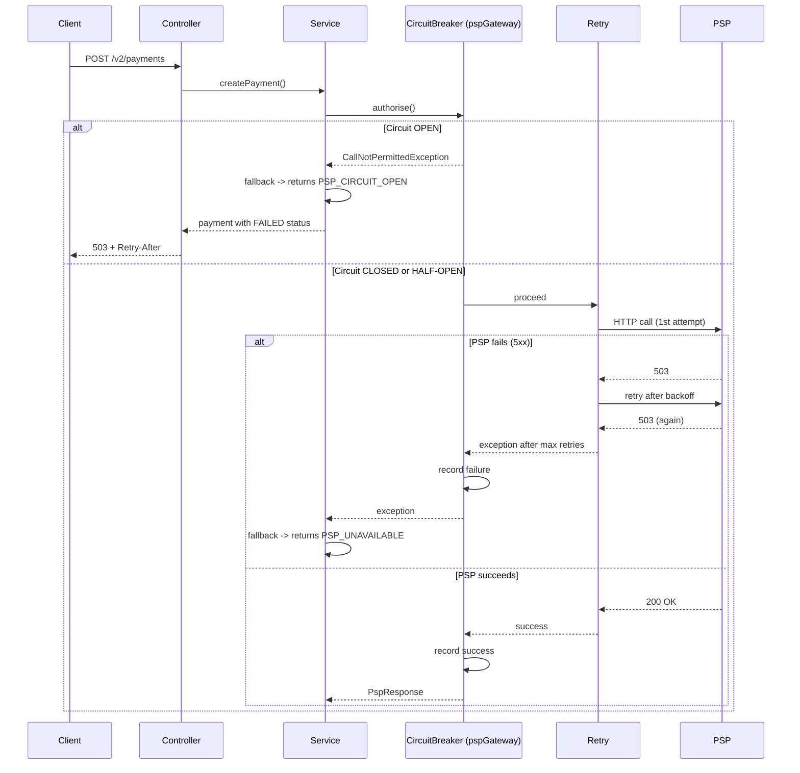
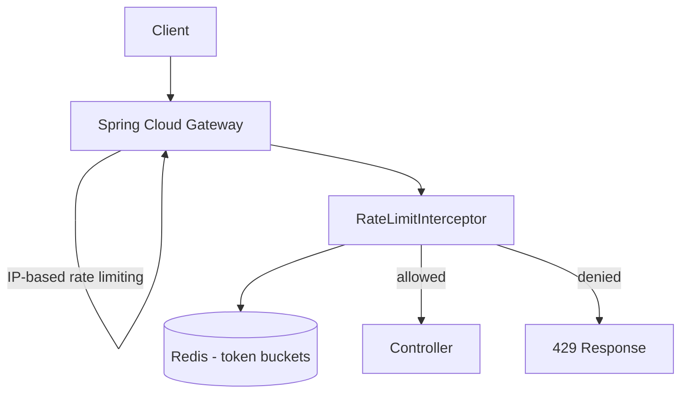
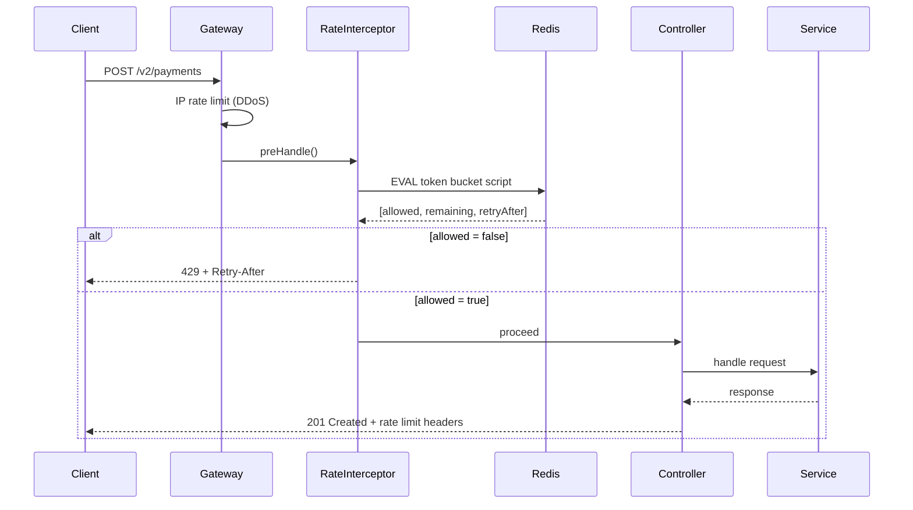
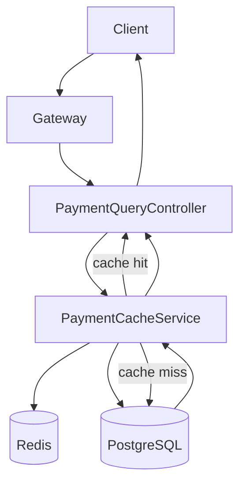
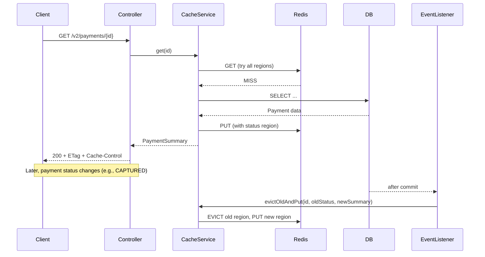
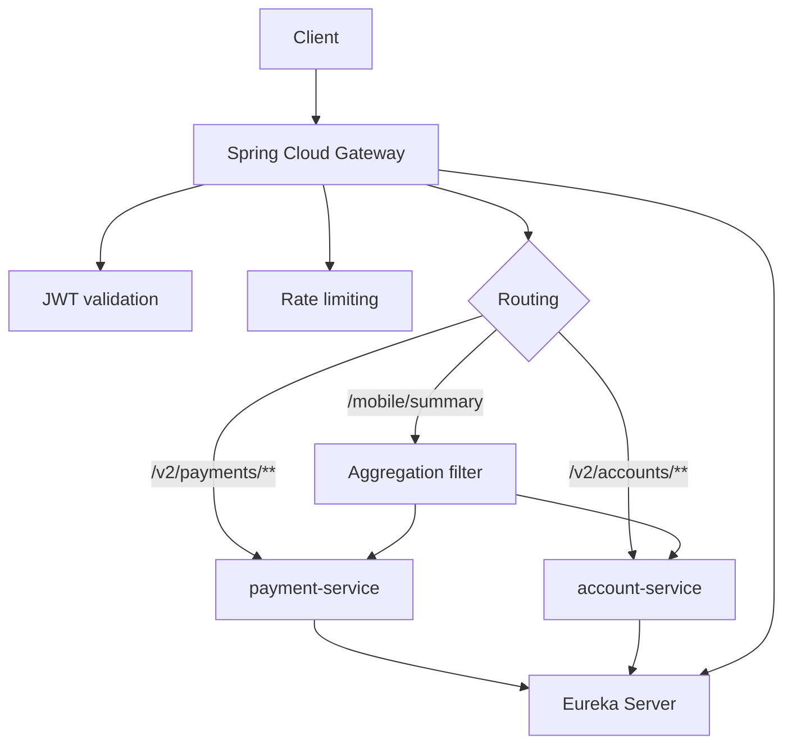
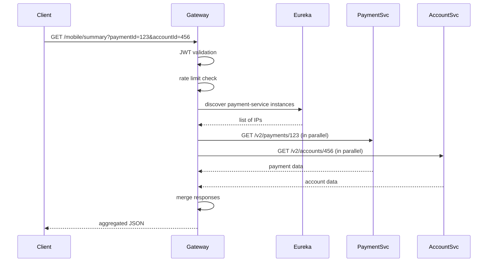
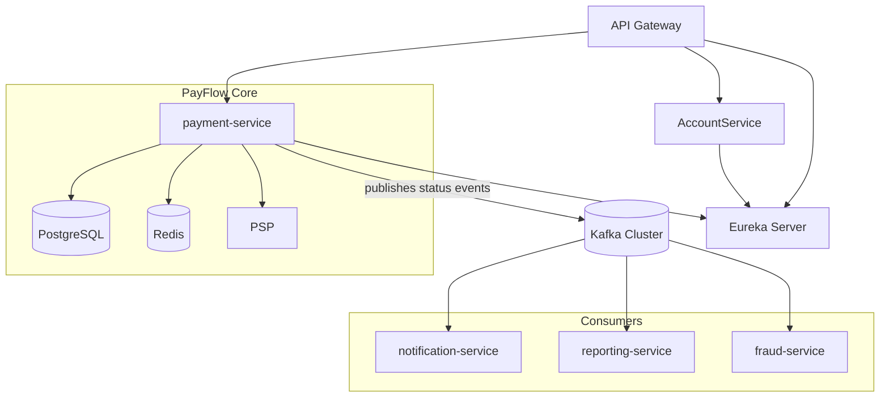

# Payments API — Day 2: Deep‑Dive into Resiliency, Protection, Performance & Gateway

> **Master Project:** PayFlow — Production‑grade payment processing microservice  
> **Audience:** Senior Developers (5‑10+ years) — no beginner fluff, only architectural depth  
> **Stack:** Java 17, Spring Boot 3.x, Resilience4j, Redis, Spring Cloud Gateway, Eureka, PostgreSQL, (optional Kafka for event streaming)  
> **Duration:** 12‑hour self‑study module

---

## Table of Contents

1. [Circuit Breaker — Protecting PayFlow from PSP Cascading Failures](#1-circuit-breaker)
2. [Rate Limiting — Protecting the Payments API from Abuse](#2-rate-limiting)
3. [Caching — Low‑Latency Payment Status and History](#3-caching)
4. [API Gateway & Service Discovery](#4-api-gateway--service-discovery)
5. [Overall Architecture (with Kafka)](#5-overall-architecture)

---

## 1) Circuit Breaker — Protecting PayFlow from PSP Cascading Failures

### 1.1 What

A **circuit breaker** is a stateful pattern that monitors for failures and short‑circuits requests to a failing dependency when a predefined threshold is exceeded. It transitions between three states:

- **CLOSED** – normal operation, calls pass through.
- **OPEN** – failure threshold exceeded; calls fail immediately without attempting the call.
- **HALF‑OPEN** – after a wait period, a limited number of probe calls are allowed to test if the dependency has recovered.

### 1.2 Why does it exist

To prevent **cascading failures**. When an external dependency (e.g., a PSP) becomes slow or unavailable, naive retries can amplify the load, exhaust thread pools, and bring down the entire service – including endpoints that do not depend on that dependency.

### 1.3 When to use it

- Any call to an external service over the network (PSP, fraud detection, notification).
- When the dependency has a known Service Level Agreement (SLA) and can fail.
- In critical paths where a dependency failure should not block the whole application.

### 1.4 Where to use it

**Infrastructure layer** – wrap the actual HTTP client (or any remote call) inside a circuit breaker. In a clean architecture, the circuit breaker belongs in the adapter that implements the outbound port (e.g., `PspGateway`). It should never leak into the domain or application services.

### 1.5 How to implement (high‑level)

1. Choose a circuit breaker library (Resilience4j, Spring Cloud Circuit Breaker).
2. Configure thresholds: failure rate, sliding window size, slow call threshold, wait duration in OPEN state, number of probe calls in HALF‑OPEN.
3. Annotate the method that performs the remote call with `@CircuitBreaker`.
4. Provide a fallback method that returns a sane default or a domain‑specific failure.
5. Integrate with a bulkhead to limit concurrent calls.
6. Expose metrics and state transitions for monitoring and alerting.

### 1.6 Architecture Diagram

```mermaid
graph TD
    A[PaymentController] --> B[CreatePaymentService]
    B --> C[PspGateway (interface)]
    C --> D[StripePspGatewayAdapter]
    D --> E{CircuitBreaker}
    E -->|CLOSED / HALF-OPEN| F[Retry mechanism]
    F --> G[RestTemplate call to PSP]
    E -->|OPEN| H[Fallback method]
    H --> I[Return PSP_CIRCUIT_OPEN error]
    G --> J{PSP response}
    J -->|5xx / timeout| K[Record failure -> possibly open circuit]
    J -->|4xx (card decline)| L[Ignore for circuit breaker]
```

### 1.7 Scenario

**Month‑end settlement night**  
PayFlow processes 800 payments/minute. The PSP starts returning `503 Service Unavailable` due to an unannounced maintenance window. Without a circuit breaker:

- Retry logic (3 attempts per payment) fires → 2400 requests/minute hammer the struggling PSP.
- All Tomcat threads block on 10s read timeouts → threads exhausted.
- Read endpoints (`GET /v2/payments`) also hang because no threads are available.
- The entire service is down because of one external dependency.

### 1.8 Goal

- PSP outage must **not** degrade read endpoints (zero impact).
- Payment creation should degrade gracefully: return `503 Service Unavailable` with `Retry-After` header, not block threads.
- Circuit trips when failure rate >50% over a 10‑call sliding window.
- After 30s, probe with 3 requests; if they succeed, close the circuit.
- Emit metrics on state transitions for immediate alerting.

### 1.9 What Can Go Wrong (with wrong code examples)

#### Anti‑Pattern A: Retry without circuit breaker (amplified load)

```java
// BROKEN: Only retry, no circuit breaker
@Retry(name = "pspAuthorise")   // 3 retries on every failure
public PspResponse authorise(PaymentId id, Money amount, String token) {
    // When PSP is down for 5 minutes:
    // - 800 payments/min * 3 retries * 10s timeout = all threads blocked
    // - Read endpoints starved
    // - Retry storm on recovery
    return callPsp(id, amount, token);
}
```

#### Anti‑Pattern B: Hand‑rolled circuit breaker (race conditions, no half‑open)

```java
// BROKEN: Not thread-safe, no half-open probing, no metrics
public class NaiveCircuitBreaker {
    private boolean open = false;          // ❌ not thread-safe
    private int failureCount = 0;          // ❌ not atomic
    private long openedAt = 0;

    public PspResponse call(Supplier<PspResponse> pspCall) {
        if (open) {
            if (System.currentTimeMillis() - openedAt > 30_000) {
                open = false;               // ❌ immediately floods PSP
            }
            return PspResponse.failure("CIRCUIT_OPEN");
        }
        try {
            PspResponse r = pspCall.get();
            failureCount = 0;                // ❌ race condition
            return r;
        } catch (Exception e) {
            failureCount++;                   // ❌ not atomic
            if (failureCount >= 5) {
                open = true;
                openedAt = System.currentTimeMillis();
            }
            throw e;
        }
    }
}
```

**Why it fails:**
- `failureCount++` is not atomic – under high concurrency, multiple threads can see `failureCount=4` and all set `open=true`.
- No half‑open state: goes directly from OPEN to CLOSED, flooding the PSP with full traffic on recovery.
- Counts raw failures, not failure **rate** – 1 failure in 1000 requests should not trip.
- No metrics, no alerting, no integration with bulkhead.

### 1.10 Why It Fails (root cause)

- **Thread exhaustion** – blocking I/O without fast‑fail consumes precious worker threads.
- **Retry storms** – retries assume transient failure; they amplify load during prolonged outages.
- **Lack of failure isolation** – a single dependency’s failure affects unrelated functionality.
- **State management complexity** – hand‑rolled implementations invariably introduce concurrency bugs and miss crucial states (half‑open).

### 1.11 Correct Approach

Use **Resilience4j CircuitBreaker** – a production‑grade, thread‑safe library with sliding windows, half‑open probing, and Micrometer integration. Pair it with a **Bulkhead** to limit concurrent calls to the PSP.

**Key configuration:**

| Parameter | Value | Meaning |
|-----------|-------|---------|
| `sliding-window-type` | `COUNT_BASED` | Evaluate last N calls |
| `sliding-window-size` | `10` | Window size |
| `failure-rate-threshold` | `50` | Trip when ≥50% of calls fail |
| `slow-call-duration-threshold` | `5s` | Calls >5s count as slow |
| `slow-call-rate-threshold` | `80` | Trip when ≥80% slow |
| `wait-duration-in-open-state` | `30s` | Stay OPEN for 30s before probing |
| `permitted-calls-in-half-open-state` | `3` | Number of probe calls |
| `automatic-transition-from-open-to-half-open-enabled` | `true` | Auto‑transition after wait |

**Ignore card declines** – they are business outcomes, not PSP health signals.

### 1.12 Key Principles

- **Fail fast** – do not block threads on known‑to‑be‑failing dependencies.
- **Isolation** – a failure in one dependency must not cascade.
- **Self‑healing** – the system must automatically probe and recover when the dependency becomes healthy.
- **Observability** – state transitions must be visible to operations.

### 1.13 Correct Implementation (production‑grade)

#### application.yaml

```yaml
resilience4j:
  circuitbreaker:
    instances:
      pspGateway:
        sliding-window-type: COUNT_BASED
        sliding-window-size: 10
        failure-rate-threshold: 50
        slow-call-duration-threshold: 5s
        slow-call-rate-threshold: 80
        wait-duration-in-open-state: 30s
        permitted-calls-in-half-open-state: 3
        automatic-transition-from-open-to-half-open-enabled: true
        record-exceptions:
          - java.net.SocketTimeoutException
          - java.net.ConnectException
          - org.springframework.web.client.HttpServerErrorException
        ignore-exceptions:
          - com.payflow.infrastructure.psp.PspCardDeclinedException
          - com.payflow.infrastructure.psp.PspValidationException

  retry:
    instances:
      pspGateway:
        max-attempts: 3
        wait-duration: 200ms
        enable-exponential-backoff: true
        exponential-backoff-multiplier: 2
        randomized-wait-factor: 0.5
        retry-exceptions:
          - java.net.SocketTimeoutException
          - org.springframework.web.client.HttpServerErrorException

  bulkhead:
    instances:
      pspGateway:
        max-concurrent-calls: 20
        max-wait-duration: 0ms
```

#### StripePspGatewayAdapter.java

```java
package com.payflow.infrastructure.psp;

import com.payflow.common.valueobject.Money;
import com.payflow.common.valueobject.PaymentId;
import com.payflow.domain.port.out.PspGateway;
import io.github.resilience4j.bulkhead.annotation.Bulkhead;
import io.github.resilience4j.circuitbreaker.CallNotPermittedException;
import io.github.resilience4j.circuitbreaker.annotation.CircuitBreaker;
import io.github.resilience4j.retry.annotation.Retry;
import io.micrometer.core.instrument.MeterRegistry;
import lombok.extern.slf4j.Slf4j;
import org.springframework.http.*;
import org.springframework.stereotype.Component;
import org.springframework.web.client.HttpClientErrorException;
import org.springframework.web.client.HttpServerErrorException;
import org.springframework.web.client.ResourceAccessException;
import org.springframework.web.client.RestTemplate;

@Slf4j
@Component
public class StripePspGatewayAdapter implements PspGateway {

    private final RestTemplate restTemplate;
    private final PspProperties properties;
    private final MeterRegistry meterRegistry;

    public StripePspGatewayAdapter(RestTemplate pspRestTemplate,
                                   PspProperties properties,
                                   MeterRegistry meterRegistry) {
        this.restTemplate = pspRestTemplate;
        this.properties = properties;
        this.meterRegistry = meterRegistry;
    }

    @Override
    @CircuitBreaker(name = "pspGateway", fallbackMethod = "authoriseFallback")
    @Bulkhead(name = "pspGateway", fallbackMethod = "authoriseFallback")
    @Retry(name = "pspGateway")
    public PspResponse authorise(PaymentId paymentId, Money amount, String paymentToken) {
        log.info("Authorising payment {} with PSP", paymentId);

        var headers = new HttpHeaders();
        headers.setContentType(MediaType.APPLICATION_JSON);
        headers.setBearerAuth(properties.getApiKey());
        headers.set("Idempotency-Key", paymentId.toString());

        var request = new PspAuthoriseRequest(
                amount.amountMinorUnits(),
                amount.currency().toLowerCase(),
                paymentToken
        );

        try {
            var response = restTemplate.exchange(
                    properties.getBaseUrl() + "/v1/payment_intents",
                    HttpMethod.POST,
                    new HttpEntity<>(request, headers),
                    PspAuthoriseResponse.class
            );
            meterRegistry.counter("psp.authorise.success").increment();
            return PspResponse.success(response.getBody().id());
        } catch (HttpClientErrorException e) {
            // 4xx – business errors, not circuit breaker failures
            if (e.getStatusCode() == HttpStatus.UNPROCESSABLE_ENTITY) {
                throw new PspCardDeclinedException(e.getResponseBodyAsString());
            }
            throw e; // other 4xx are also ignored by circuit breaker config
        } catch (HttpServerErrorException | ResourceAccessException e) {
            // 5xx / network – these count towards circuit breaker
            meterRegistry.counter("psp.authorise.transient_error").increment();
            throw e;
        }
    }

    public PspResponse authoriseFallback(PaymentId paymentId, Money amount,
                                         String paymentToken, Exception ex) {
        if (ex instanceof CallNotPermittedException) {
            log.warn("Circuit breaker OPEN for PSP, fast-failing payment {}", paymentId);
            meterRegistry.counter("psp.authorise.circuit_open").increment();
            return PspResponse.failure("PSP_CIRCUIT_OPEN",
                    "Payment processor temporarily unavailable. Retry later.");
        }
        if (ex instanceof BulkheadFullException) {
            log.warn("PSP bulkhead full, shedding load for payment {}", paymentId);
            meterRegistry.counter("psp.authorise.bulkhead_full").increment();
            return PspResponse.failure("PSP_OVERLOADED",
                    "Too many concurrent requests. Please retry.");
        }
        log.error("All PSP retries exhausted for payment {}", paymentId, ex);
        meterRegistry.counter("psp.authorise.exhausted").increment();
        return PspResponse.failure("PSP_UNAVAILABLE",
                "Payment processor unavailable after retries.");
    }
}
```

#### Circuit Breaker Event Listener (for alerting)

```java
package com.payflow.infrastructure.psp;

import io.github.resilience4j.circuitbreaker.CircuitBreaker;
import io.github.resilience4j.circuitbreaker.CircuitBreakerRegistry;
import io.micrometer.core.instrument.MeterRegistry;
import jakarta.annotation.PostConstruct;
import lombok.extern.slf4j.Slf4j;
import org.springframework.stereotype.Component;

@Slf4j
@Component
public class PspCircuitBreakerEventListener {

    private final CircuitBreakerRegistry registry;
    private final MeterRegistry meterRegistry;

    public PspCircuitBreakerEventListener(CircuitBreakerRegistry registry,
                                          MeterRegistry meterRegistry) {
        this.registry = registry;
        this.meterRegistry = meterRegistry;
    }

    @PostConstruct
    public void registerListeners() {
        CircuitBreaker cb = registry.circuitBreaker("pspGateway");

        cb.getEventPublisher().onStateTransition(event -> {
            var from = event.getStateTransition().getFromState();
            var to = event.getStateTransition().getToState();
            log.warn("Circuit breaker state changed: {} -> {}", from, to);
            meterRegistry.counter("psp.circuitbreaker.state",
                    "from", from.name(), "to", to.name()).increment();

            if (to == CircuitBreaker.State.OPEN) {
                log.error("ALERT: PSP circuit breaker OPENED – payment creation degraded");
            }
        });

        cb.getEventPublisher().onCallNotPermitted(event ->
                log.debug("PSP call not permitted (circuit OPEN)"));
    }
}
```

### 1.14 Execution Flow (Sequence Diagram)



### 1.15 Common Mistakes (Senior Engineers Still Make)

| Mistake | Consequence |
|---------|-------------|
| Counting card declines as failures | Circuit trips on busy Friday nights (legitimate declines), causing false positives. |
| Wrong annotation order (`@Retry` outside `@CircuitBreaker`) | Each retry attempt counts as a separate call; 3 retries = 3 failures for one payment. |
| No fallback for `CallNotPermittedException` | Client receives a 500 error instead of a graceful 503. |
| `wait-duration-in-open-state` too short (e.g., 5s) | The circuit opens/closes repeatedly during a prolonged outage, causing logging noise and thrashing. |
| No metrics on state transitions | Ops team is unaware that the circuit tripped – no alert fires. |
| One circuit breaker for all external dependencies | A PSP outage also blocks fraud‑service calls. Each dependency needs its own instance. |

### 1.16 Decision Matrix: Circuit Breaker vs Alternatives

| Approach | Pros | Cons | When to choose |
|----------|------|------|----------------|
| **Resilience4j CircuitBreaker** | Thread‑safe, configurable sliding window, half‑open, metrics integration | Requires external library, but lightweight | Default for any outbound HTTP call |
| **Manual implementation** | No extra dependency | Prone to concurrency bugs, no half‑open, no metrics | Never – it’s a known anti‑pattern |
| **Retry only** | Simple | Amplifies load during outages, no protection | Only when failure is guaranteed transient (< 1s) |
| **Bulkhead only** | Limits concurrency | Does not prevent calls to a failing system | Combine with circuit breaker |
| **Kafka + retry topics** | Decouples, durable retries | Adds complexity, latency | For asynchronous idempotent operations (e.g., notifications) |

---

## 2) Rate Limiting — Protecting the Payments API from Abuse

### 2.1 What

**Rate limiting** controls the number of requests a client can make to an API within a given time window. It rejects excessive requests with `429 Too Many Requests` and a `Retry-After` header.

### 2.2 Why does it exist

- Prevent accidental or malicious overload of the system.
- Ensure fair usage among clients.
- Protect downstream dependencies (e.g., PSP) from being overwhelmed.
- Defend against DDoS attacks (at gateway level).

### 2.3 When to use it

- Any public API endpoint.
- Internal endpoints that could be abused by a faulty client.
- Write operations that consume significant resources (DB, external calls).
- Read operations that are expensive (complex queries, aggregations).

### 2.4 Where to use it

**Two layers:**

1. **Gateway layer** (Nginx, Spring Cloud Gateway) – IP‑based limits, DDoS protection, before requests reach application.
2. **Application layer** – per‑client (API key / JWT subject) limits using a distributed store (Redis) for accuracy across instances.

### 2.5 How to implement (high‑level)

1. Choose a rate limiting algorithm: token bucket, sliding window, fixed window.
2. Select a distributed store: Redis (with Lua scripts for atomicity).
3. Identify the client key: JWT subject, `X-Client-ID`, IP address.
4. Implement a filter/interceptor that checks the limit before processing the request.
5. Return `429` with `Retry-After` and rate limit headers (`X-RateLimit-Limit`, `X-RateLimit-Remaining`).
6. Configure different limits for different endpoints (POST vs GET).

### 2.6 Architecture Diagram



### 2.7 Scenario

Three abuse events in one week:

- Partner integration bug: 5,000 requests in 60s from one client ID, saturating PSP rate limit.
- DDoS probe: 200 requests/second from rotating IPs, each hitting JWT validation (CPU cost).
- Mobile client retrying with zero backoff: 800 requests in 10 minutes from one user.

Without rate limiting, all three scenarios cause service degradation or outage.

### 2.8 Goal

- `POST /v2/payments` → 60 requests/minute per client (burst 10).
- `GET /v2/payments` → 600 requests/minute per client (burst 30).
- Global gateway limit: 1000 requests/minute total (circuit breaker for the whole service).
- Return `429` with `Retry-After` and consistent headers.
- Zero added latency for compliant clients.
- Distributed across all PayFlow instances using Redis.

### 2.9 What Can Go Wrong (with wrong code examples)

#### Anti‑Pattern A: No rate limiting

```java
// BROKEN: No protection
@PostMapping("/v2/payments")
public ResponseEntity<?> createPayment(@RequestBody CreatePaymentRequest request) {
    // Any client can send unlimited requests
    return service.createPayment(request);
}
```

#### Anti‑Pattern B: Synchronized in‑memory counter (throughput killer)

```java
// BROKEN: Serializes all requests
public class NaiveRateLimiter {
    private final Map<String, Integer> counts = new HashMap<>();
    private final Object lock = new Object();

    public boolean isAllowed(String clientId) {
        synchronized (lock) {   // ❌ all clients contend on one lock
            int cnt = counts.getOrDefault(clientId, 0);
            if (cnt >= 60) return false;
            counts.put(clientId, cnt + 1);
            return true;
        }
    }
    // ❌ no window reset, counts grow forever
}
```

**Why it fails:** The global lock serialises every request, destroying throughput. With 1000 req/s, each request waits, adding latency spikes.

#### Anti‑Pattern C: Token bucket without persistence (multi‑instance bug)

```java
// BROKEN: In‑memory only – breaks on horizontal scaling
@Component
public class InMemoryRateLimiter {
    private final ConcurrentHashMap<String, AtomicInteger> buckets = new ConcurrentHashMap<>();

    public boolean isAllowed(String clientId) {
        // With 3 instances, client can send 60 to each → 180 requests/min
        AtomicInteger count = buckets.computeIfAbsent(clientId, k -> new AtomicInteger(0));
        return count.incrementAndGet() <= 60;
    }
}
```

### 2.10 Why It Fails

- **Single point of contention** – using a shared lock or database for every request creates a bottleneck.
- **Inconsistent state across instances** – each pod has its own view of the rate, allowing clients to exceed limits by spreading requests.
- **Window boundary spikes** – fixed window counters allow 2× the limit at the edges (59 requests at 11:59:59 + 60 at 12:00:00 = 119 in 2 seconds).
- **No retry information** – without `Retry-After`, clients use exponential backoff from zero, adding more load.

### 2.11 Correct Approach

**Token Bucket algorithm** stored in Redis with atomic Lua script.  
- Tokens refill at a constant rate (e.g., 1 token/sec = 60/min).
- Clients can burst up to `max-tokens`.
- Lua script ensures atomic check‑and‑decrement across all instances.
- Fail‑open on Redis errors (allow request) – rate limiting is a protection, not a business requirement.

### 2.12 Key Principles

- **Distributed consensus** – use Redis Lua to avoid race conditions.
- **Burst allowance** – token bucket naturally handles bursts up to capacity.
- **Visibility** – expose current limit and remaining tokens in response headers.
- **Layered defence** – gateway IP limits + application client limits.

### 2.13 Correct Implementation

#### Redis Token Bucket Lua Script

```lua
-- KEYS[1] = bucket key
-- ARGV[1] = current time (seconds)
-- ARGV[2] = max tokens
-- ARGV[3] = refill rate (tokens/sec)
-- ARGV[4] = requested tokens (usually 1)
-- ARGV[5] = TTL (seconds)

local bucket = redis.call('HMGET', KEYS[1], 'tokens', 'last_refill')
local tokens = tonumber(bucket[1]) or tonumber(ARGV[2])
local last_refill = tonumber(bucket[2]) or tonumber(ARGV[1])

-- Refill based on elapsed time
local elapsed = math.max(0, tonumber(ARGV[1]) - last_refill)
tokens = math.min(tonumber(ARGV[2]), tokens + elapsed * tonumber(ARGV[3]))

local allowed = 0
local retry_after = 0
if tokens >= tonumber(ARGV[4]) then
    tokens = tokens - tonumber(ARGV[4])
    allowed = 1
else
    retry_after = math.ceil((tonumber(ARGV[4]) - tokens) / tonumber(ARGV[3]))
end

redis.call('HMSET', KEYS[1], 'tokens', tokens, 'last_refill', ARGV[1])
redis.call('EXPIRE', KEYS[1], ARGV[5])

return {allowed, math.floor(tokens), retry_after}
```

#### RedisTokenBucketRateLimiter.java

```java
package com.payflow.api.ratelimit;

import lombok.RequiredArgsConstructor;
import lombok.extern.slf4j.Slf4j;
import org.springframework.data.redis.core.StringRedisTemplate;
import org.springframework.data.redis.core.script.DefaultRedisScript;
import org.springframework.stereotype.Component;

import java.time.Instant;
import java.util.List;

@Slf4j
@Component
@RequiredArgsConstructor
public class RedisTokenBucketRateLimiter {

    private final StringRedisTemplate redis;
    private final DefaultRedisScript<List> rateLimitScript;

    public Result check(String clientId, Config config) {
        String key = "ratelimit:" + config.endpoint() + ":" + clientId;
        long now = Instant.now().getEpochSecond();

        try {
            List<Long> result = (List<Long>) redis.execute(
                    rateLimitScript,
                    List.of(key),
                    String.valueOf(now),
                    String.valueOf(config.maxTokens()),
                    String.valueOf(config.refillRatePerSecond()),
                    "1",
                    String.valueOf(config.ttlSeconds())
            );

            if (result == null) {
                log.error("Rate limiter script returned null – failing open");
                return Result.allowed(0);
            }

            boolean allowed = result.get(0) == 1L;
            long remaining = result.get(1);
            long retryAfter = result.get(2);

            if (!allowed) {
                log.warn("Rate limit exceeded for client {} on endpoint {}",
                        clientId, config.endpoint());
            }

            return allowed
                    ? Result.allowed(remaining)
                    : Result.denied(retryAfter);
        } catch (Exception e) {
            // Fail open – Redis connectivity issue should not block payments
            log.error("Redis error in rate limiter, allowing request", e);
            return Result.allowed(0);
        }
    }

    public record Config(String endpoint, long maxTokens,
                         double refillRatePerSecond, long ttlSeconds) {
        public static Config paymentCreate() {
            return new Config("POST:/v2/payments", 10, 1.0, 120);
        }
        public static Config paymentRead() {
            return new Config("GET:/v2/payments", 30, 10.0, 120);
        }
    }

    public record Result(boolean allowed, long remaining, long retryAfterSeconds) {
        static Result allowed(long remaining) {
            return new Result(true, remaining, 0);
        }
        static Result denied(long retryAfter) {
            return new Result(false, 0, retryAfter);
        }
    }
}
```

#### RateLimitInterceptor.java

```java
package com.payflow.api.ratelimit;

import com.fasterxml.jackson.databind.ObjectMapper;
import com.payflow.api.v1.dto.ErrorResponse;
import jakarta.servlet.http.HttpServletRequest;
import jakarta.servlet.http.HttpServletResponse;
import lombok.RequiredArgsConstructor;
import lombok.extern.slf4j.Slf4j;
import org.springframework.http.HttpStatus;
import org.springframework.http.MediaType;
import org.springframework.stereotype.Component;
import org.springframework.web.servlet.HandlerInterceptor;

import java.util.UUID;

@Slf4j
@Component
@RequiredArgsConstructor
public class RateLimitInterceptor implements HandlerInterceptor {

    private final RedisTokenBucketRateLimiter rateLimiter;
    private final ObjectMapper objectMapper;

    @Override
    public boolean preHandle(HttpServletRequest request, HttpServletResponse response,
                             Object handler) throws Exception {
        String clientId = extractClientId(request);
        var config = selectConfig(request);

        var result = rateLimiter.check(clientId, config);

        // Always set headers
        response.setHeader("X-RateLimit-Limit", String.valueOf(config.maxTokens()));
        response.setHeader("X-RateLimit-Remaining", String.valueOf(result.remaining()));

        if (!result.allowed()) {
            response.setStatus(HttpStatus.TOO_MANY_REQUESTS.value());
            response.setContentType(MediaType.APPLICATION_JSON_VALUE);
            response.setHeader("Retry-After", String.valueOf(result.retryAfterSeconds()));

            var error = new ErrorResponse(
                    "RATE_LIMIT_EXCEEDED",
                    "Too many requests. Retry after " + result.retryAfterSeconds() + " seconds.",
                    UUID.randomUUID().toString(),
                    null
            );
            response.getWriter().write(objectMapper.writeValueAsString(error));
            return false;
        }
        return true;
    }

    private String extractClientId(HttpServletRequest request) {
        // JWT subject (set by Spring Security after authentication)
        var principal = request.getUserPrincipal();
        if (principal != null) return "jwt:" + principal.getName();

        // X-Client-ID header for internal services
        String clientIdHeader = request.getHeader("X-Client-ID");
        if (clientIdHeader != null && !clientIdHeader.isBlank()) return "client:" + clientIdHeader;

        // Fallback to IP
        String forwarded = request.getHeader("X-Forwarded-For");
        if (forwarded != null) return "ip:" + forwarded.split(",")[0].trim();
        return "ip:" + request.getRemoteAddr();
    }

    private RedisTokenBucketRateLimiter.Config selectConfig(HttpServletRequest request) {
        String method = request.getMethod();
        String uri = request.getRequestURI();

        if ("POST".equals(method) && uri.matches(".*/v[12]/payments$")) {
            return RedisTokenBucketRateLimiter.Config.paymentCreate();
        }
        // Default for other endpoints (read)
        return RedisTokenBucketRateLimiter.Config.paymentRead();
    }
}
```

#### WebMvcConfig.java

```java
package com.payflow.api.config;

import com.payflow.api.ratelimit.RateLimitInterceptor;
import lombok.RequiredArgsConstructor;
import org.springframework.context.annotation.Configuration;
import org.springframework.web.servlet.config.annotation.InterceptorRegistry;
import org.springframework.web.servlet.config.annotation.WebMvcConfigurer;

@Configuration
@RequiredArgsConstructor
public class WebMvcConfig implements WebMvcConfigurer {

    private final RateLimitInterceptor rateLimitInterceptor;

    @Override
    public void addInterceptors(InterceptorRegistry registry) {
        registry.addInterceptor(rateLimitInterceptor)
                .addPathPatterns("/v1/**", "/v2/**")
                .excludePathPatterns("/actuator/**");   // never rate limit health checks
    }
}
```

### 2.14 Execution Flow (Sequence Diagram)



### 2.15 Common Mistakes

| Mistake | Consequence |
|---------|-------------|
| Fixed window allowing 2× burst at boundaries | Client can send 60 requests at 11:59:59 and 60 at 12:00:00 = 120 in 2 seconds. |
| Fail‑closed on Redis error | A Redis hiccup blocks all payments. Fail‑open is safer for rate limiting. |
| Rate limiting by IP only | Easily bypassed by rotating IPs (botnets, CDN). Use JWT subject for authenticated APIs. |
| No `Retry-After` header | Clients use exponential backoff from zero, adding load. |
| Rate limiting health check endpoint | Kubernetes liveness probes fail, causing unnecessary restarts. |
| Same limit for writes and reads | Writes are expensive, reads cheap. Different limits needed. |

### 2.16 Decision Matrix: Rate Limiting Algorithms

| Algorithm | Pros | Cons | Use Case |
|-----------|------|------|----------|
| **Token Bucket** | Natural burst handling, memory efficient, atomic with Redis Lua | Needs distributed store | PayFlow default for all endpoints |
| **Leaky Bucket** | Smooths out bursts | No burst allowance | Queue‑based systems |
| **Fixed Window Counter** | Simple, low memory | Boundary spikes | Non‑critical internal APIs |
| **Sliding Window Log** | Perfect accuracy | Stores all timestamps, high memory | When precision is paramount (e.g., financial regulatory) |
| **Sliding Window Counter** | Good accuracy, low memory | Slightly more complex | Good alternative, but token bucket simpler |

---

## 3) Caching — Low‑Latency Payment Status and History

### 3.1 What

**Caching** stores frequently accessed data in a fast, temporary storage to reduce latency and load on the primary database.

### 3.2 Why does it exist

- Reduce database read load (especially for read‑heavy workloads).
- Improve API response times (p99 latency).
- Handle traffic spikes without scaling the database.

### 3.3 When to use it

- Data that is read much more often than written (payment status after completion).
- Data that is immutable or changes infrequently (terminal states).
- When database queries are expensive (joins, aggregations) or the data source is slow.

### 3.4 Where to use it

- **HTTP caching** – at the client or CDN level (via `Cache-Control`, `ETag`).
- **Application caching** – in‑memory (Caffeine) or distributed (Redis) as a read‑through cache.
- **Database query cache** – rarely used in production; application‑level is more controllable.

### 3.5 How to implement (high‑level)

1. Choose a cache store: Redis (distributed) or Caffeine (local, for single‑instance).
2. Define cache regions with appropriate TTLs based on data state (e.g., `PENDING` → 3s, `CAPTURED` → 5min).
3. Implement read‑through: check cache first, if miss, load from DB and populate cache.
4. Implement write‑through: on state change, update cache after successful DB commit.
5. Add HTTP caching headers for terminal states to allow client‑side caching.
6. Monitor hit rate and adjust TTLs.

### 3.6 Architecture Diagram



### 3.7 Scenario

Flash sale: 10,000 payments in 30 minutes. `GET /v2/payments/{id}` is called 47 times per payment (mobile polling, partner reconciliation) → 470,000 reads in 30 minutes. PostgreSQL connection pool saturates, p99 latency hits 280ms. Caching reduces DB reads by 95%, p99 <20ms.

### 3.8 Goal

- Reduce DB reads by >90%.
- p99 latency <20ms for payment status reads.
- Stale data served for at most the configured TTL (e.g., PENDING stale for max 3s).
- Cache consistency: after a payment transitions to CAPTURED, any subsequent read sees CAPTURED immediately (no stale PENDING).
- HTTP caching for terminal states (`Cache-Control: max-age=300, immutable`).

### 3.9 What Can Go Wrong (with wrong code examples)

#### Anti‑Pattern A: Same TTL for all states

```java
// BROKEN: Same TTL for PENDING and CAPTURED
@Cacheable(value = "payments", key = "#paymentId")
public PaymentResponse getPayment(UUID paymentId) {
    return repository.findById(paymentId).map(this::toResponse).orElseThrow();
}
// If TTL=60s, a PENDING payment that becomes CAPTURED after 2s will serve stale PENDING for 58s.
```

#### Anti‑Pattern B: Cache invalidation after write (race window)

```java
// BROKEN: Race between DB commit and cache eviction
@Transactional
public Payment capture(UUID id) {
    Payment p = repository.findById(id).orElseThrow();
    p.capture();
    repository.save(p);
    cacheManager.getCache("payments").evict(id.toString()); // ❌ race window
    // Between save and evict, another thread may read the stale cache.
    return p;
}
```

**Why it fails:** The evict‑after‑write pattern has a race window where stale data can be read. The correct pattern is **write‑through** (update cache after commit).

#### Anti‑Pattern C: In‑memory cache with multiple instances

```java
// BROKEN: In-memory cache – not shared
@EnableCaching
public class CacheConfig {
    @Bean
    public CacheManager cacheManager() {
        return new ConcurrentMapCacheManager("payments");
    }
}
// With 3 instances, each has its own copy. Payment captured on instance A, but instances B and C still serve stale PENDING until TTL.
```

### 3.10 Why It Fails

- **Stale data** – caused by long TTLs on mutable data or missing cache updates on writes.
- **Cache stampede** – when many requests miss the cache simultaneously and all hit the DB (mitigated by locking or probabilistic early expiry).
- **Inconsistent TTL** – mixing immutable and mutable data in the same region.
- **No write‑through** – relying only on TTL expiry leads to stale reads.

### 3.11 Correct Approach

**Two‑tier caching:**

1. **Distributed cache (Redis)** with state‑aware TTLs:
   - `PENDING`: 3s
   - `AUTHORISED`: 10s
   - `CAPTURED` / `FAILED`: 5min
   - `REFUNDED`: 60min

2. **Write‑through cache update**: After a successful DB transaction (AFTER_COMMIT), update the cache with the new state.

3. **HTTP caching** for terminal states: set `Cache-Control` and `ETag` so clients can cache responses.

### 3.12 Key Principles

- **Cache as a write‑through, not write‑behind** – for payment status, consistency is critical.
- **TTL based on mutation frequency** – frequently changing states have short TTL; terminal states have long TTL.
- **Cache the DTO, not the domain entity** – DTOs are serializable and represent exactly what the API returns.
- **Graceful degradation** – if Redis is down, fall back to DB (with increased latency).

### 3.13 Correct Implementation

#### Redis Cache Configuration with state‑aware TTLs

```java
package com.payflow.infrastructure.cache;

import org.springframework.cache.CacheManager;
import org.springframework.cache.annotation.EnableCaching;
import org.springframework.context.annotation.Bean;
import org.springframework.context.annotation.Configuration;
import org.springframework.data.redis.cache.RedisCacheConfiguration;
import org.springframework.data.redis.cache.RedisCacheManager;
import org.springframework.data.redis.connection.RedisConnectionFactory;
import org.springframework.data.redis.serializer.GenericJackson2JsonRedisSerializer;
import org.springframework.data.redis.serializer.RedisSerializationContext;
import org.springframework.data.redis.serializer.StringRedisSerializer;

import java.time.Duration;
import java.util.Map;

@Configuration
@EnableCaching
public class RedisCacheConfig {

    @Bean
    public CacheManager paymentCacheManager(RedisConnectionFactory connectionFactory) {
        RedisCacheConfiguration defaultConfig = RedisCacheConfiguration.defaultCacheConfig()
                .entryTtl(Duration.ofSeconds(30))
                .serializeKeysWith(
                        RedisSerializationContext.SerializationPair.fromSerializer(new StringRedisSerializer()))
                .serializeValuesWith(
                        RedisSerializationContext.SerializationPair.fromSerializer(
                                new GenericJackson2JsonRedisSerializer()))
                .disableCachingNullValues();

        Map<String, RedisCacheConfiguration> configs = Map.of(
                "payments:pending", defaultConfig.entryTtl(Duration.ofSeconds(3)),
                "payments:authorised", defaultConfig.entryTtl(Duration.ofSeconds(10)),
                "payments:captured", defaultConfig.entryTtl(Duration.ofMinutes(5)),
                "payments:failed", defaultConfig.entryTtl(Duration.ofMinutes(5)),
                "payments:refunded", defaultConfig.entryTtl(Duration.ofHours(1))
        );

        return RedisCacheManager.builder(connectionFactory)
                .cacheDefaults(defaultConfig)
                .withInitialCacheConfigurations(configs)
                .build();
    }
}
```

#### PaymentCacheService (programmatic, state‑aware)

```java
package com.payflow.application.service;

import com.payflow.api.v2.dto.PaymentSummary;
import com.payflow.domain.model.PaymentStatus;
import lombok.RequiredArgsConstructor;
import lombok.extern.slf4j.Slf4j;
import org.springframework.cache.Cache;
import org.springframework.cache.CacheManager;
import org.springframework.stereotype.Component;

import java.util.Optional;
import java.util.UUID;

@Slf4j
@Component
@RequiredArgsConstructor
public class PaymentCacheService {

    private final CacheManager cacheManager;
    private final PaymentQueryService queryService; // fallback to DB

    public Optional<PaymentSummary> get(UUID paymentId) {
        // Try each status region (we don't know current state)
        for (PaymentStatus status : PaymentStatus.values()) {
            Cache cache = cacheManager.getCache(cacheRegion(status));
            if (cache != null) {
                PaymentSummary cached = cache.get(paymentId.toString(), PaymentSummary.class);
                if (cached != null) {
                    log.debug("Cache HIT: {} in {}", paymentId, cacheRegion(status));
                    return Optional.of(cached);
                }
            }
        }

        // Miss – load from DB and populate
        log.debug("Cache MISS: {}", paymentId);
        Optional<PaymentSummary> summary = queryService.findById(paymentId);
        summary.ifPresent(s -> put(paymentId, s));
        return summary;
    }

    public void put(UUID paymentId, PaymentSummary summary) {
        PaymentStatus status = PaymentStatus.valueOf(summary.status());
        Cache cache = cacheManager.getCache(cacheRegion(status));
        if (cache != null) {
            cache.put(paymentId.toString(), summary);
            log.debug("Cache PUT: {} in {}", paymentId, cacheRegion(status));
        }
    }

    public void evictOldAndPut(UUID paymentId, PaymentStatus oldStatus, PaymentSummary newSummary) {
        if (oldStatus != null) {
            Cache oldCache = cacheManager.getCache(cacheRegion(oldStatus));
            if (oldCache != null) {
                oldCache.evict(paymentId.toString());
                log.debug("Cache EVICT: {} from {}", paymentId, cacheRegion(oldStatus));
            }
        }
        put(paymentId, newSummary);
    }

    private String cacheRegion(PaymentStatus status) {
        return "payments:" + status.name().toLowerCase();
    }
}
```

#### Using `@TransactionalEventListener` for write‑through

```java
package com.payflow.application.service;

import com.payflow.api.v2.dto.PaymentSummary;
import com.payflow.domain.event.PaymentStatusChangedEvent;
import lombok.RequiredArgsConstructor;
import lombok.extern.slf4j.Slf4j;
import org.springframework.stereotype.Component;
import org.springframework.transaction.event.TransactionPhase;
import org.springframework.transaction.event.TransactionalEventListener;

@Slf4j
@Component
@RequiredArgsConstructor
public class PaymentCacheUpdater {

    private final PaymentCacheService cacheService;

    @TransactionalEventListener(phase = TransactionPhase.AFTER_COMMIT)
    public void handlePaymentStatusChanged(PaymentStatusChangedEvent event) {
        log.info("Updating cache after payment {} status change: {} -> {}",
                event.paymentId(), event.oldStatus(), event.newStatus());
        PaymentSummary summary = new PaymentSummary(
                event.paymentId(),
                event.amountMinorUnits(),
                event.currency(),
                event.newStatus().name(),
                null, null,
                event.updatedAt()
        );
        cacheService.evictOldAndPut(event.paymentId(), event.oldStatus(), summary);
    }
}
```

#### HTTP Caching in Controller

```java
@GetMapping("/{paymentId}")
public ResponseEntity<PaymentSummary> getPayment(
        @PathVariable UUID paymentId,
        WebRequest webRequest) {

    return cacheService.get(paymentId)
            .map(summary -> {
                String etag = "\"" + Integer.toHexString(
                        (paymentId.toString() + summary.status()).hashCode()) + "\"";
                if (webRequest.checkNotModified(etag)) {
                    return ResponseEntity.status(304).build();
                }
                CacheControl cc = selectCacheControl(summary.status());
                return ResponseEntity.ok()
                        .cacheControl(cc)
                        .eTag(etag)
                        .body(summary);
            })
            .orElse(ResponseEntity.notFound().build());
}

private CacheControl selectCacheControl(String status) {
    return switch (status) {
        case "CAPTURED", "FAILED", "REFUNDED" ->
                CacheControl.maxAge(Duration.ofMinutes(5)).cachePublic().immutable();
        case "PENDING", "AUTHORISED" ->
                CacheControl.maxAge(Duration.ofSeconds(3)).cachePrivate().mustRevalidate();
        default -> CacheControl.noCache();
    };
}
```

### 3.14 Execution Flow (Sequence Diagram)



### 3.15 Common Mistakes

| Mistake | Consequence |
|---------|-------------|
| Caching PENDING with long TTL | Stale PENDING shown for up to minutes after capture – bad UX. |
| Using `@Cacheable` without evict on update | Cache never updated, stale forever. |
| In‑memory cache in multi‑instance setup | Each instance has stale copy; eventual consistency broken. |
| Not handling serialisation failures | Redis returns garbage, exception causes fallback to DB (ok), but logs fill. |
| Caching error responses | A 404 today, but payment exists tomorrow – client sees 404. |
| No cache metrics | Cannot tune TTL or detect cache effectiveness. |

### 3.16 Decision Matrix: Caching Options

| Option | Latency | Consistency | Complexity | Use Case |
|--------|---------|-------------|------------|----------|
| **Redis (distributed)** | ~1ms | Strong (write‑through) | Medium | PayFlow default – shared across instances |
| **Caffeine (local)** | <0.1ms | Weak (stale per instance) | Low | Single‑instance apps or non‑critical data |
| **HTTP caching (CDN)** | 0ms (if cached) | Weak (client decides) | Low | Public, immutable assets |
| **Database read replicas** | 5‑10ms | Strong (eventual) | Medium | When cache isn't enough, scale reads |
| **No cache** | 10‑50ms | Perfect | None | When data changes too fast or consistency critical (but payment status benefits) |

---

## 4) API Gateway & Service Discovery

### 4.1 What

An **API Gateway** is a single entry point for all client requests, responsible for routing, authentication, rate limiting, and cross‑cutting concerns. **Service Discovery** (e.g., Eureka) allows services to dynamically find each other’s network locations.

### 4.2 Why does it exist

- Centralised security (JWT validation) – avoids per‑service duplication.
- Dynamic routing based on service registry – services can scale up/down without updating clients.
- Cross‑cutting concerns: rate limiting, logging, CORS, request tracing.
- Canary releases and blue‑green deployments via weighted routing.
- Aggregation of multiple service responses (e.g., mobile summary).

### 4.3 When to use it

- Any microservices architecture with more than one service.
- When you need to expose APIs to external clients (mobile, partners).
- When you need to enforce security, rate limiting, or observability uniformly.
- When you want to perform canary releases or A/B testing.

### 4.4 Where to use it

At the **edge** of your system, between clients and internal services.

### 4.5 How to implement (high‑level)

1. Set up a service registry (Eureka Server).
2. Configure each microservice as a Eureka client.
3. Deploy Spring Cloud Gateway as the entry point, also a Eureka client.
4. Define routes in Gateway configuration (using `lb://service-name`).
5. Add global filters: authentication, rate limiting, correlation ID.
6. Implement per‑route circuit breakers and retries.
7. Optionally add a custom filter for response aggregation.

### 4.6 Architecture Diagram



### 4.7 Scenario

PayFlow now has five services: payment, account, fraud, notification, reporting. Partners hardcode service URLs; when a service scales or moves, everything breaks. Security configuration drifts – one service misses JWT validation. Mobile needs a single endpoint that combines payment and account data – two serial calls add 100ms latency.

### 4.8 Goal

- Route `/v2/payments/**` to `payment-service` (load‑balanced via Eureka).
- Centralise JWT validation – downstream services receive pre‑validated claims.
- Global rate limiting (Redis‑backed) before requests reach services.
- Blue‑green routing: 10% traffic to `payment-service-v2` canary.
- Aggregation endpoint `/mobile/summary` that calls payment and account in parallel and merges responses.
- Inject `X-Request-ID` correlation header on all requests.

### 4.9 What Can Go Wrong (with wrong code examples)

#### Anti‑Pattern A: Direct service URLs in partners

```java
// BROKEN: Partner code hardcodes instance URL
RestTemplate rest = new RestTemplate();
String response = rest.getForObject(
    "http://payment-service-prod-1.internal:8081/v2/payments",
    String.class);
// When service moves to new IP or scales to 5 instances, this breaks.
```

#### Anti‑Pattern B: Per‑service JWT validation (drift)

```java
// payment-service SecurityConfig
http.oauth2ResourceServer(oauth2 -> oauth2.jwt());

// fraud-service SecurityConfig (different team)
http.oauth2ResourceServer(oauth2 -> oauth2.jwt()
    .jwtAuthenticationConverter(new CustomConverter())); // different!

// notification-service (3 months later, missing config)
http.authorizeHttpRequests(auth -> auth.anyRequest().authenticated());
// → notification-service has no JWT validation at all!
```

**Why it fails:** Security logic is duplicated and drifts over time. Teams forget to add it, or customise it differently, leading to inconsistent security posture.

### 4.10 Why It Fails

- **Lack of central control** – without a gateway, each service reinvents security, logging, rate limiting.
- **Hardcoded endpoints** – manual updates required when services scale or move.
- **No circuit breaker at edge** – a failing service can still be hammered by retries at the gateway.
- **No correlation ID** – debugging distributed requests becomes nearly impossible.

### 4.11 Correct Approach

**Spring Cloud Gateway** with Eureka for service discovery. Centralise:

- JWT validation (using Spring Security OAuth2 Resource Server).
- Rate limiting (Redis token bucket).
- Circuit breakers per route (Resilience4j).
- Pre‑ and post‑filters for headers, logging, aggregation.

### 4.12 Key Principles

- **Single entry point** – all external traffic goes through the gateway.
- **Centralised security** – authenticate once, forward identity to downstream services.
- **Dynamic routing** – based on service registry, not static IPs.
- **Observability** – inject trace IDs, expose metrics.
- **Resilience at edge** – gateway should have its own circuit breakers for each downstream service.

### 4.13 Correct Implementation

#### Eureka Server

```java
@SpringBootApplication
@EnableEurekaServer
public class EurekaServerApplication {
    public static void main(String[] args) {
        SpringApplication.run(EurekaServerApplication.class, args);
    }
}
```

```yaml
# application.yml
server:
  port: 8761
eureka:
  client:
    register-with-eureka: false
    fetch-registry: false
  server:
    enable-self-preservation: false   # disable in dev
```

#### Payment Service (Eureka Client)

```yaml
spring:
  application:
    name: payment-service
eureka:
  client:
    service-url:
      defaultZone: http://localhost:8761/eureka
  instance:
    prefer-ip-address: true
    lease-renewal-interval-in-seconds: 10
    lease-expiration-duration-in-seconds: 30
    metadata-map:
      version: "2.1.0"
```

#### Gateway Configuration

```yaml
spring:
  application:
    name: payflow-gateway
  cloud:
    gateway:
      default-filters:
        - name: RequestRateLimiter
          args:
            redis-rate-limiter.replenishRate: 100
            redis-rate-limiter.burstCapacity: 200
            key-resolver: "#{@clientIdKeyResolver}"
        - AddRequestHeader=X-Request-ID, "#{T(java.util.UUID).randomUUID().toString()}"
      routes:
        - id: payment-service-v2
          uri: lb://payment-service
          predicates:
            - Path=/v2/payments/**
          filters:
            - name: CircuitBreaker
              args:
                name: paymentServiceCB
                fallbackUri: forward:/fallback/payment-service
            - name: Retry
              args:
                retries: 2
                statuses: BAD_GATEWAY, SERVICE_UNAVAILABLE
                methods: GET
                backoff:
                  firstBackoff: 100ms
                  maxBackoff: 2s
        - id: payment-service-v2-canary
          uri: lb://payment-service-canary
          predicates:
            - Path=/v2/payments/**
            - Weight=payment-canary-group, 10
        - id: payment-service-v2-stable
          uri: lb://payment-service
          predicates:
            - Path=/v2/payments/**
            - Weight=payment-canary-group, 90
        - id: mobile-summary
          uri: lb://payment-service   # primary, but we'll override with custom filter
          predicates:
            - Path=/mobile/summary/**
          filters:
            - name: MobileSummaryAggregation

  security:
    oauth2:
      resourceserver:
        jwt:
          jwk-set-uri: ${JWK_URI:http://keycloak:8080/realms/payflow/protocol/openid-connect/certs}

resilience4j:
  circuitbreaker:
    instances:
      paymentServiceCB:
        sliding-window-size: 10
        failure-rate-threshold: 50
        wait-duration-in-open-state: 30s
        permitted-calls-in-half-open-state: 3
```

#### Gateway Security Configuration

```java
@Configuration
@EnableWebFluxSecurity
public class GatewaySecurityConfig {

    @Bean
    public SecurityWebFilterChain springSecurityFilterChain(ServerHttpSecurity http) {
        return http
                .authorizeExchange(exchanges -> exchanges
                        .pathMatchers("/actuator/health", "/fallback/**").permitAll()
                        .anyExchange().authenticated()
                )
                .oauth2ResourceServer(oauth2 -> oauth2.jwt())
                .csrf(ServerHttpSecurity.CsrfSpec::disable)
                .build();
    }

    @Bean
    public KeyResolver clientIdKeyResolver() {
        return exchange -> exchange.getPrincipal()
                .map(Principal::getName)
                .switchIfEmpty(Mono.justOrEmpty(
                        exchange.getRequest().getHeaders().getFirst("X-Forwarded-For")))
                .defaultIfEmpty("anonymous");
    }
}
```

#### Custom Aggregation Filter for `/mobile/summary`

```java
package com.payflow.gateway.filter;

import org.springframework.cloud.gateway.filter.GatewayFilter;
import org.springframework.cloud.gateway.filter.factory.AbstractGatewayFilterFactory;
import org.springframework.http.MediaType;
import org.springframework.stereotype.Component;
import org.springframework.web.reactive.function.client.WebClient;
import reactor.core.publisher.Mono;

import java.util.Map;

@Component
public class MobileSummaryAggregationGatewayFilterFactory
        extends AbstractGatewayFilterFactory<MobileSummaryAggregationGatewayFilterFactory.Config> {

    private final WebClient webClient;

    public MobileSummaryAggregationGatewayFilterFactory(WebClient.Builder webClientBuilder) {
        super(Config.class);
        this.webClient = webClientBuilder.build();
    }

    @Override
    public GatewayFilter apply(Config config) {
        return (exchange, chain) -> {
            // Skip the original route; we'll aggregate manually
            String paymentId = exchange.getRequest().getQueryParams().getFirst("paymentId");
            String accountId = exchange.getRequest().getQueryParams().getFirst("accountId");

            Mono<Map> paymentMono = webClient.get()
                    .uri("lb://payment-service/v2/payments/" + paymentId)
                    .retrieve()
                    .bodyToMono(Map.class);

            Mono<Map> accountMono = webClient.get()
                    .uri("lb://account-service/v2/accounts/" + accountId)
                    .retrieve()
                    .bodyToMono(Map.class);

            return Mono.zip(paymentMono, accountMono)
                    .map(tuple -> {
                        Map<String, Object> result = Map.of(
                                "payment", tuple.getT1(),
                                "account", tuple.getT2()
                        );
                        return exchange.getResponse().writeWith(
                                Mono.just(exchange.getResponse().bufferFactory()
                                        .wrap(serialize(result).getBytes()))
                        );
                    });
        };
    }

    private String serialize(Object obj) {
        // Use Jackson to serialize
        return "{\"payment\":{},\"account\":{}}"; // simplified
    }

    public static class Config {
        // no config needed
    }
}
```

#### Fallback Controller

```java
@RestController
@RequestMapping("/fallback")
public class GatewayFallbackController {

    @GetMapping("/payment-service")
    public ResponseEntity<ErrorResponse> paymentFallback() {
        return ResponseEntity.status(HttpStatus.SERVICE_UNAVAILABLE)
                .header("Retry-After", "30")
                .body(new ErrorResponse("PAYMENT_SERVICE_UNAVAILABLE",
                        "Payment service unavailable", UUID.randomUUID().toString(), null));
    }
}
```

### 4.14 Execution Flow (Sequence Diagram)



### 4.15 Common Mistakes

| Mistake | Consequence |
|---------|-------------|
| Putting business logic in the gateway | Gateway becomes a monolith, hard to maintain, violates separation of concerns. |
| Not retrying only idempotent methods | Retrying POST at gateway can double‑charge if idempotency key isn't propagated. |
| Eureka self‑preservation enabled in dev | Stale instances stay registered; routing fails. |
| Gateway without its own circuit breaker | Downstream service failure can still tie up gateway threads. |
| Internal services bypassing gateway | Lose security, rate limiting, observability. |
| No correlation ID | Impossible to trace a request across services. |

### 4.16 Decision Matrix: Gateway Options

| Approach | Pros | Cons | Use Case |
|----------|------|------|----------|
| **Spring Cloud Gateway + Eureka** | Deep Spring integration, reactive, easy routing, filters | Learning curve, JVM‑based | PayFlow – fits existing stack |
| **Nginx / Kong** | High performance, mature, Lua scripting | Not Java‑native, separate config | When you need extreme throughput |
| **Service Mesh (Istio)** | Sidecar, mTLS, fine‑grained traffic control | Operational complexity, resource overhead | Large‑scale, multi‑language environments |
| **No gateway (direct client‑service)** | Simple initially | No central control, security drift, hard to evolve | Prototypes only |

---

## 5) Overall Architecture (with Kafka)

In a production payment system, events play a crucial role for audit, reconciliation, and asynchronous processing. Apache Kafka can be integrated to decouple components and improve resilience.

**Kafka’s role in PayFlow:**

- **Payment events** – when a payment status changes, publish an event to Kafka (e.g., `PaymentCaptured`, `PaymentFailed`).
- **Downstream consumers** – notification service, reporting service, fraud detection can consume these events without blocking the payment flow.
- **Idempotent event processing** – consumers store the last processed event ID to avoid duplicates.
- **Dead letter queue (DLQ)** – for events that cannot be processed after retries.

### Kafka Integration Architecture



**Why Kafka here?**

- **Decoupling** – payment processing doesn’t wait for notifications or reporting.
- **Scalability** – multiple consumers can read the same event stream.
- **Replayability** – if a consumer fails, it can replay events from a point in time.
- **Audit trail** – all state changes are persisted in Kafka topics.

**Important considerations:**

- **Transactional outbox pattern** – to ensure events are published only when the database transaction commits. Use a `outbox` table and a CDC tool (Debezium) or a transactional Kafka producer (with idempotence).
- **Exactly‑once semantics** – configure Kafka with `enable.idempotence=true` and `acks=all` to avoid duplicates, but consumers must also be idempotent.
- **Monitoring** – track consumer lag, DLQ size.

---

*End of Day 2 Deep‑Dive Module*  
*Next: Day 2 Labs – Hands‑on exercises for each pattern*
