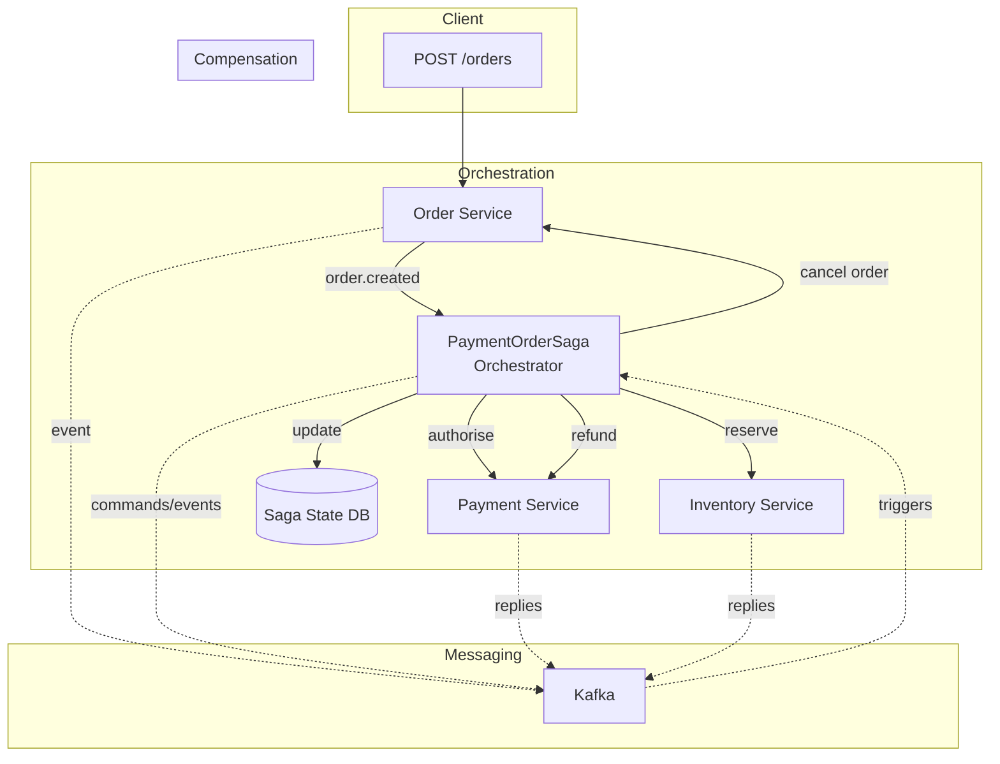
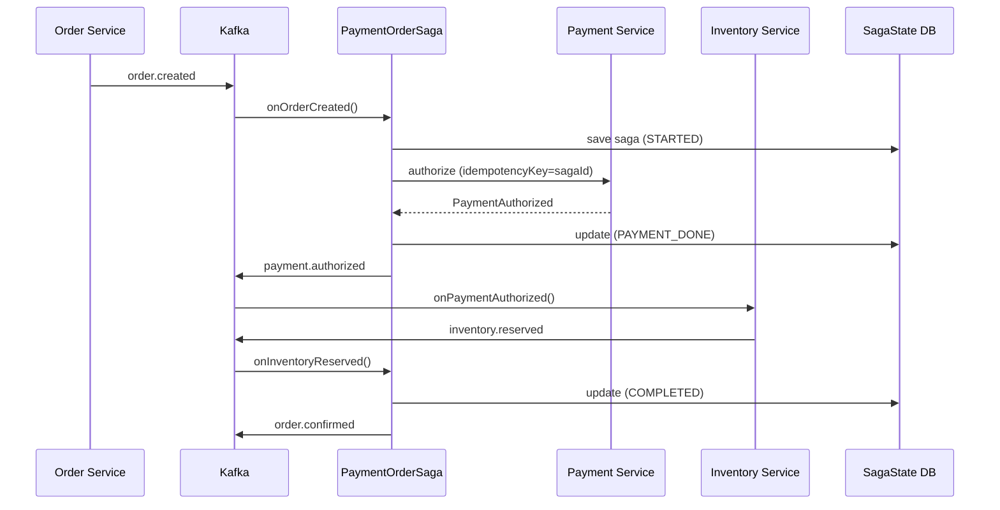
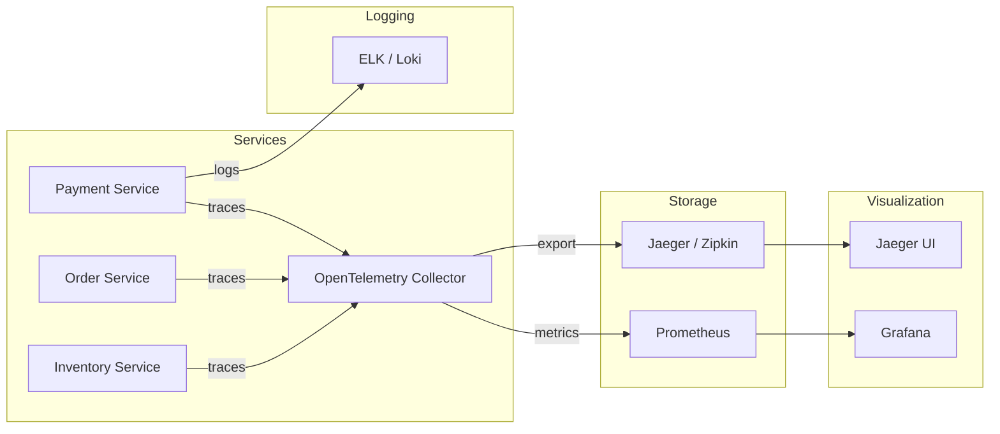
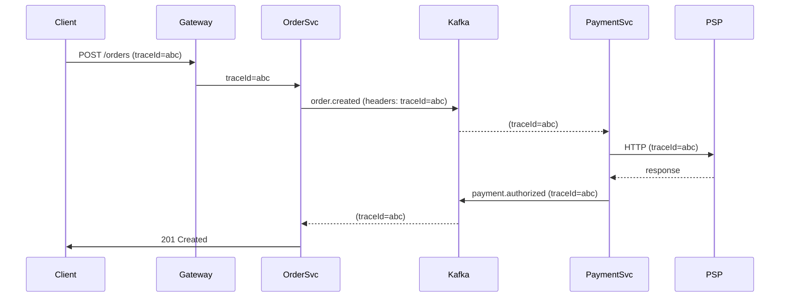
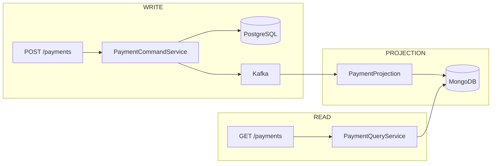
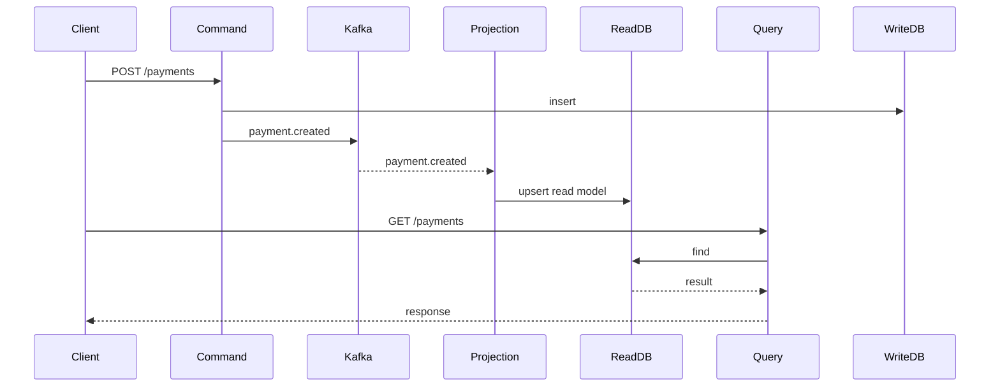

# Day 3 — Distributed Saga, Observability & CQRS (Deep Dive)

> **Target Audience:** Senior Engineers (5–10+ years)  
> **Stack:** Java 17 / Spring Boot 3, Kafka, Micrometer, Zipkin, PostgreSQL, MongoDB  
> **Duration:** 12+ Hours (Self‑Study)  
> **Domain:** Banking / Payments  

---

## Overview

This module transforms you from a microservices practitioner into an architect capable of designing **data‑consistent, observable, and scalable payment systems**. We dissect three critical pillars:

1. **Distributed Transactions with Saga** – Replace XA/2PC with orchestrated compensation flows.
2. **Observability** – Achieve end‑to‑end visibility via tracing, metrics, and structured logs.
3. **Advanced Microservices Patterns** – Apply CQRS, BFF, Anti‑Corruption Layer, and Strangler Fig to payment ecosystems.

All concepts are **code‑validated** with Java 17/Spring Boot and battle‑tested in high‑volume banking environments. Expect deep dives into failure modes, idempotency, and operational trade‑offs.

---

# Part I: Saga Pattern for Distributed Transactions

## 1. What – Concise Technical Definition

**Saga** is a sequence of local transactions where each step publishes an event or message that triggers the next step. If a step fails, the saga executes **compensating transactions** to undo the effects of preceding steps. No global lock or two‑phase commit is used – consistency is eventual but guaranteed.

In payments, a typical saga includes:  
`Order Created → Authorise Payment → Reserve Inventory → Confirm Order`  
with compensation steps like `Refund Payment` if inventory reservation fails.

---

## 2. Why Does It Exist – The Problem Statement

In a monolithic application, a database transaction (ACID) ensures all-or-nothing semantics across multiple tables. In microservices, each service owns its database, and a business operation often spans multiple services. Traditional **Two‑Phase Commit (2PC)** is not suitable because:

- **Tight coupling** – All participants must be available; a single failure blocks the transaction.
- **Performance** – Locks are held during the prepare phase, increasing contention.
- **Scalability** – The coordinator becomes a bottleneck and a single point of failure.

Sagas solve these by breaking the distributed transaction into a series of local ACID transactions, connected via events, with explicit compensation logic.

---

## 3. When to Use It – Specific Triggers / Conditions

Use a saga when:

- A business process spans **multiple services** (e.g., payment, order, inventory, shipping).
- You need **atomicity** but can tolerate **eventual consistency** (most payment flows accept a few milliseconds of inconsistency).
- Each participant service has its own database and cannot share a transaction coordinator.
- You require **high availability** – the flow can continue even if some services are temporarily down (with retries and compensating actions).
- **Compliance** demands a full audit trail of each step (sagas naturally produce events).

**Do not use a saga** if the operation requires **immediate, global consistency** (e.g., transferring funds between two accounts in the same bank – a local database transaction suffices). Also avoid sagas for very short‑lived, single‑service operations.

---

## 4. Where to Use It – Architectural Layers

Sagas operate at the **application / orchestration layer**, not within a single database. In a typical microservices architecture:

- **Edge Layer** – API Gateway receives the initial request (e.g., POST /orders).
- **Orchestrator Service** (if orchestration style) – A dedicated service manages the saga state and step coordination.
- **Participant Services** – Each exposes two endpoints:  
  - **Transactional action** (e.g., `POST /payments/authorise`)  
  - **Compensating action** (e.g., `POST /payments/refund`)
- **Message Broker** – Kafka / RabbitMQ for event propagation (in choreography) or command replies (in orchestration).
- **State Store** – Database table to persist saga progress (for recovery after crashes).

---

## 5. How to Implement – High‑Level Steps

1. **Model the business process** as a set of steps with forward and backward (compensating) actions.
2. **Decide on coordination style** – Orchestration (central controller) or Choreography (event‑driven).
3. **Define domain events** using sealed interfaces (Java 17) to ensure exhaustive handling.
4. **Implement the saga orchestrator** (if orchestration) or event handlers (if choreography).
5. **Ensure idempotency** for all actions and compensations – the same step may be called multiple times due to retries.
6. **Persist saga state** at each step to allow recovery after failures.
7. **Add timeout handling** – if a step does not respond within a defined window, trigger compensation.
8. **Instrument with tracing and metrics** to monitor saga health.

---

## 6. Architecture Diagram – Saga Orchestration



---

## 7. Scenario – Real‑World Production Use Case

**Use Case:** A customer places an order in a mobile banking app that includes a payment and a reward points deduction. The system must ensure either both succeed or both are rolled back.

**Services involved:**
- **Order Service** – Creates order record.
- **Payment Service** – Charges the customer’s card.
- **Rewards Service** – Deducts loyalty points.

**Saga steps:**
1. Order Service creates order (status PENDING).
2. Payment Service authorises payment.
3. Rewards Service deducts points.
4. Order Service marks order as CONFIRMED.

**Compensation:**
- If payment fails → cancel order (no points deducted yet).
- If points deduction fails → refund payment and cancel order.

---

## 8. Goal – Desired Outcome (KPIs)

- **Consistency** – No order is confirmed without both payment and points deduction succeeding; no payment is captured without order confirmation.
- **Latency** – p99 of entire saga < 2 seconds (including external PSP calls).
- **Throughput** – Support 1000 concurrent sagas with minimal resource overhead.
- **Recovery Time** – After a pod crash, in‑flight sagas resume within 5 seconds.
- **Error Rate** – Compensations triggered for < 1% of orders.

---

## 9. What Can Go Wrong – Failure Modes and Edge Cases

### 9.1. Wrong Code Example: Non‑Idempotent Compensation

```java
// ❌ BAD: Refund is NOT idempotent
public void refund(UUID paymentId) {
    Payment payment = paymentRepo.findById(paymentId);
    if (payment.getStatus() == COMPLETED) {
        // Call PSP refund API
        pspClient.refund(paymentId);   // May deduct twice if called again
        payment.setStatus(REFUNDED);
        paymentRepo.save(payment);
    }
}
```

If the compensation is retried (due to network glitch or saga restart), the same refund may be executed twice, causing duplicate refunds to the customer.

### 9.2. Missing Timeout Handling

```java
// ❌ BAD: No timeout on waiting for inventory response
@KafkaListener(topics = "inventory.reserved")
public void onInventoryReserved(InventoryReservedEvent event) {
    // proceed
}
// If inventory service never responds, saga hangs forever.
```

### 9.3. State Loss After Crash

```java
// ❌ BAD: State not persisted before sending message
public void onOrderCreated(OrderCreatedEvent event) {
    paymentService.authorize(event);  // sends Kafka message
    // If crash here, saga is lost – message already sent but no state saved.
}
```

### 9.4. Partial Failures in Choreography

In choreographed sagas, a failure in a later step may leave earlier steps un‑compensated if the compensating events are not propagated correctly.

---

## 10. Why It Fails – Root Cause Analysis

| Failure | Root Cause | Impact |
|---------|------------|--------|
| Duplicate compensation | Lack of idempotency in compensating actions | Financial loss, customer dissatisfaction |
| Hanging saga | No timeout on async replies | Resource leak, orders stuck in pending |
| Lost saga state | State persisted after sending event | Inconsistent state, inability to recover |
| Incomplete compensation in choreography | Missing compensating event handlers | Partial rollback, data inconsistency |
| Race condition | Concurrent execution of same saga step | Double spending, incorrect balances |

---

## 11. Correct Approach – Architectural Patterns to Mitigate Failure

### 11.1. Idempotency Keys

Every action and compensation must be idempotent. Use an idempotency key (e.g., `sagaId + stepName`) passed to participant services. Store the result of the first execution and return it for subsequent calls.

### 11.2. Timeout + Retry with Backoff

Set a timeout for each step. If no response, retry a few times (with exponential backoff) before triggering compensation. Use a scheduled job to detect stale sagas.

### 11.3. State Persistence Before Emitting Events

Persist saga state in the same local transaction that produces the event (using Kafka transactions or transactional outbox). This ensures exactly‑once semantics for step initiation.

### 11.4. Orchestration for Complex Flows

For payment sagas with many steps and compensation logic, orchestration provides a single point of control, making it easier to implement timeouts, retries, and audits.

### 11.5. Sealed Domain Events

Use Java 17 sealed interfaces to model all possible saga events. The compiler then enforces exhaustive handling in all `switch` expressions, preventing missing event cases.

---

## 12. Key Principles – Guiding Laws

- **CAP Theorem** – Sagas prioritise **Availability** and **Partition Tolerance** over strong Consistency. Eventual consistency is accepted.
- **Idempotency** – Every operation must be safe to repeat.
- **Compensating Transaction** – Must semantically undo the forward action (not necessarily revert to exact previous state, e.g., refund instead of void).
- **Event‑Driven Architecture** – Loose coupling via asynchronous events.
- **Transaction Outbox** – Ensure atomicity of database write and message publish.

---

## 13. Correct Implementation – Production‑Grade Code (Java 17 / Spring Boot)

### 13.1. Domain Events – Sealed Interface

```java
package com.bank.payment.common.events;

import java.math.BigDecimal;
import java.time.Instant;
import java.util.UUID;

public sealed interface PaymentSagaEvent
    permits PaymentSagaEvent.OrderCreated,
            PaymentSagaEvent.PaymentAuthorized,
            PaymentSagaEvent.PaymentFailed,
            PaymentSagaEvent.InventoryReserved,
            PaymentSagaEvent.InventoryFailed,
            PaymentSagaEvent.SagaCompleted,
            PaymentSagaEvent.SagaCompensated {

    UUID sagaId();
    UUID orderId();

    record OrderCreated(UUID sagaId, UUID orderId, BigDecimal amount, String currency) implements PaymentSagaEvent {}
    record PaymentAuthorized(UUID sagaId, UUID orderId, String authCode) implements PaymentSagaEvent {}
    record PaymentFailed(UUID sagaId, UUID orderId, String reason) implements PaymentSagaEvent {}
    record InventoryReserved(UUID sagaId, UUID orderId) implements PaymentSagaEvent {}
    record InventoryFailed(UUID sagaId, UUID orderId, String reason) implements PaymentSagaEvent {}
    record SagaCompleted(UUID sagaId, UUID orderId) implements PaymentSagaEvent {}
    record SagaCompensated(UUID sagaId, UUID orderId, String reason) implements PaymentSagaEvent {}
}
```

### 13.2. Saga State Entity (JPA)

```java
package com.bank.payment.saga;

import jakarta.persistence.*;
import java.math.BigDecimal;
import java.time.Instant;
import java.util.UUID;

@Entity
@Table(name = "saga_state")
public class SagaState {

    @Id
    private UUID sagaId;

    @Column(nullable = false)
    private UUID orderId;

    private UUID paymentId;

    @Enumerated(EnumType.STRING)
    private SagaStatus status;  // STARTED, PAYMENT_DONE, INVENTORY_DONE, COMPLETED, COMPENSATING, COMPENSATED

    private String failureReason;
    private Instant createdAt;
    private Instant updatedAt;

    @Version
    private long version;  // optimistic locking

    public static SagaState start(UUID orderId, BigDecimal amount) {
        SagaState state = new SagaState();
        state.sagaId = UUID.randomUUID();
        state.orderId = orderId;
        state.status = SagaStatus.STARTED;
        state.createdAt = Instant.now();
        return state;
    }

    // getters, setters, equals/hashCode
}
```

### 13.3. Orchestrator with Kafka Transactions and Idempotent Compensation

```java
package com.bank.payment.saga;

import com.bank.payment.common.events.PaymentSagaEvent.*;
import lombok.RequiredArgsConstructor;
import lombok.extern.slf4j.Slf4j;
import org.springframework.kafka.annotation.KafkaListener;
import org.springframework.kafka.core.KafkaTemplate;
import org.springframework.stereotype.Component;
import org.springframework.transaction.annotation.Transactional;

@Slf4j
@Component
@RequiredArgsConstructor
public class PaymentOrderSagaOrchestrator {

    private final KafkaTemplate<String, Object> kafkaTemplate;
    private final SagaStateRepository sagaRepo;
    private final PaymentService paymentService; // calls PSP

    @Transactional
    @KafkaListener(topics = "order.created")
    public void onOrderCreated(OrderCreated event) {
        log.info("Saga started for orderId={}", event.orderId());

        SagaState saga = SagaState.start(event.orderId(), event.amount());
        sagaRepo.save(saga);  // persist BEFORE sending

        try {
            // Idempotent payment authorisation – uses idempotency key = saga.sagaId
            var payment = paymentService.authorize(event.orderId(), event.amount(), saga.getSagaId());
            saga.setPaymentId(payment.id());
            saga.setStatus(SagaStatus.PAYMENT_DONE);
            sagaRepo.save(saga);

            kafkaTemplate.send("payment.authorized",
                new PaymentAuthorized(saga.getSagaId(), event.orderId(), payment.authCode()));
        } catch (PaymentDeclinedException e) {
            log.warn("Payment declined for orderId={}, compensating", event.orderId());
            compensate(saga, "Payment declined: " + e.getMessage());
        }
    }

    @Transactional
    @KafkaListener(topics = "inventory.reserved")
    public void onInventoryReserved(InventoryReserved event) {
        SagaState saga = sagaRepo.findById(event.sagaId())
                .orElseThrow(() -> new SagaNotFoundException(event.sagaId()));

        saga.setStatus(SagaStatus.COMPLETED);
        sagaRepo.save(saga);
        kafkaTemplate.send("order.confirmed", new OrderConfirmed(saga.getOrderId()));
    }

    @Transactional
    @KafkaListener(topics = "inventory.failed")
    public void onInventoryFailed(InventoryFailed event) {
        SagaState saga = sagaRepo.findById(event.sagaId())
                .orElseThrow(() -> new SagaNotFoundException(event.sagaId()));

        compensate(saga, "Inventory failed: " + event.reason());
    }

    private void compensate(SagaState saga, String reason) {
        // Idempotent compensation – if already compensated, do nothing
        if (saga.getStatus() == SagaStatus.COMPENSATED ||
            saga.getStatus() == SagaStatus.COMPENSATING) {
            return;
        }

        saga.setStatus(SagaStatus.COMPENSATING);
        saga.setFailureReason(reason);
        sagaRepo.save(saga);

        if (saga.getPaymentId() != null) {
            paymentService.refund(saga.getPaymentId(), saga.getSagaId()); // idempotent
        }

        saga.setStatus(SagaStatus.COMPENSATED);
        sagaRepo.save(saga);

        kafkaTemplate.send("order.cancelled", new OrderCancelled(saga.getOrderId(), reason));
    }

    // Timeout handler – scheduled job to detect stale sagas
    // ...
}
```

### 13.4. Idempotent Payment Service (PSP Adapter)

```java
@Component
public class PaymentService {

    private final PaymentRepository paymentRepo;
    private final PspClient pspClient;

    @Transactional
    public Payment authorize(UUID orderId, BigDecimal amount, UUID idempotencyKey) {
        // Check if already processed
        return paymentRepo.findByIdempotencyKey(idempotencyKey)
            .orElseGet(() -> {
                // Call PSP with idempotency key
                PspResponse response = pspClient.charge(amount, idempotencyKey);
                Payment payment = Payment.create(orderId, amount, response);
                return paymentRepo.save(payment);
            });
    }

    @Transactional
    public void refund(UUID paymentId, UUID idempotencyKey) {
        Payment payment = paymentRepo.findById(paymentId).orElseThrow();
        if (payment.getStatus() == REFUNDED) return; // idempotent

        pspClient.refund(payment.getPspReference(), idempotencyKey);
        payment.setStatus(REFUNDED);
        paymentRepo.save(payment);
    }
}
```

---

## 14. Execution Flow – Sequence Diagram (Orchestration)



---

## 15. Common Mistakes – Anti‑Patterns Seen in Senior Engineering

1. **Using 2PC across microservices** – Leads to availability problems and distributed deadlocks.
2. **Implementing compensation as a direct rollback** – Compensations are business actions, not database rollbacks. E.g., refund is a separate transaction, not a `DELETE` of a payment record.
3. **Forgetting idempotency in compensations** – Causes duplicate refunds.
4. **Not persisting saga state** – After a crash, sagas cannot resume, leading to manual reconciliation.
5. **Using choreography for complex flows** – Debugging becomes a nightmare; orchestrator is easier to maintain.
6. **Ignoring timeouts** – Sagas hang forever if a participant never responds.
7. **Mixing synchronous calls in saga steps** – Kills availability; always use async communication.

---

## 16. Decision Matrix – Saga vs Alternatives

| Concern | 2PC | Saga (Orchestration) | Saga (Choreography) | Distributed Transaction (TCC) |
|---------|-----|-----------------------|----------------------|-------------------------------|
| **Consistency** | Strong | Eventual | Eventual | Strong (if all phases succeed) |
| **Availability** | Low – all participants must be up | High – can proceed if participants recover | High | Medium – requires Try phase |
| **Latency** | High (locking) | Low (async) | Low | Medium (two round trips) |
| **Complexity** | Medium (coordinator) | High (orchestrator) | Very high (event tracing) | High (three phases) |
| **Business Logic Fit** | Any | Long‑running processes | Simple chains | Resources with reserve/confirm |
| **Payment Use Case** | Not recommended | **Best for payment‑order flows** | Simple notification (e.g., email after payment) | Rare – might be used for wallet reservations |

---

# Part II: Observability for Payment Systems

## 1. What – Concise Technical Definition

Observability is the ability to understand a system’s internal state from its external outputs: **logs**, **metrics**, and **traces**. For payments, it means being able to answer: “Why did this transaction fail?” “Where is the bottleneck?” “Are we meeting our SLOs?”

---

## 2. Why Does It Exist – The Problem Statement

In a monolith, debugging is straightforward: you have a single log file and a thread dump. In microservices, a single user request (e.g., placing an order) traverses 5+ services, each with its own logs and metrics. Without a unified view:

- You cannot correlate a failure across services.
- Performance issues are hard to localise.
- Capacity planning becomes guesswork.

Observability provides **end‑to‑end visibility** and enables quick root cause analysis.

---

## 3. When to Use It – Specific Triggers / Conditions

Use observability:

- From day one of any microservices deployment.
- When you need to meet **SLAs/SLOs** for payment processing.
- During incident post‑mortems to understand failure chains.
- For compliance (audit trails require traceability).
- When scaling – to detect bottlenecks before they become critical.

---

## 4. Where to Use It – Architectural Layers

- **Application Layer** – Instrument code with tracing and metrics.
- **Messaging Layer** – Trace messages through Kafka (headers carry trace context).
- **Database Layer** – Capture query latencies.
- **Edge Layer** – API Gateway records ingress spans.
- **Infrastructure Layer** – Collect CPU, memory, network metrics.

---

## 5. How to Implement – High‑Level Steps

1. **Choose a tracing system** – Zipkin, Jaeger (OpenTelemetry compatible).
2. **Add Micrometer Observation** to Spring Boot (or manual instrumentation).
3. **Propagate trace context** across service boundaries via HTTP headers or Kafka headers.
4. **Define golden metrics** – Latency, error rate, saturation, throughput.
5. **Add structured logging** with trace IDs included.
6. **Set up dashboards** (Grafana) and alerts (Prometheus).
7. **Perform chaos experiments** to verify observability works.

---

## 6. Architecture Diagram – Observability Stack



---

## 7. Scenario – Real‑World Production Use Case

**Use Case:** A customer reports that a payment took 10 seconds to complete, but usually it takes 2 seconds. With observability, you can:

- View the distributed trace for that specific payment.
- See that the bottleneck was in the PSP call (latency span of 8 seconds).
- Drill down to the exact PSP endpoint and HTTP status.
- Correlate with logs to see the PSP returned a “timeout” error.

---

## 8. Goal – Desired Outcome (KPIs)

- **Mean Time to Detection (MTTD)** < 1 minute for anomalies.
- **Mean Time to Resolution (MTTR)** < 15 minutes for most incidents.
- **Trace capture rate** > 99% of requests (sampling may reduce in prod).
- **Metrics cardinality** managed to avoid high‑cost tags.

---

## 9. What Can Go Wrong – Failure Modes and Edge Cases

### 9.1. Wrong Code Example: Not Propagating Trace Context

```java
// ❌ BAD: HTTP call without propagating trace headers
public String callPaymentService() {
    RestTemplate rest = new RestTemplate();
    return rest.getForObject("http://payment/api", String.class);
}
```

Trace breaks – the downstream service cannot link the span to the original trace.

### 9.2. High Overhead from Over‑Sampling

Sampling 100% of traces in high‑throughput payment systems can overwhelm storage and increase latency. Using probabilistic sampling (e.g., 10%) may miss rare failures.

### 9.3. Missing Span Annotations

Not adding key attributes (e.g., `paymentId`, `error.type`) makes traces hard to search.

### 9.4. Cardinality Explosion in Metrics

Tagging metrics by `userId` or `orderId` creates millions of time series, crashing Prometheus.

---

## 10. Why It Fails – Root Cause Analysis

| Failure | Root Cause | Impact |
|---------|------------|--------|
| Broken trace | Missing header propagation | Inability to correlate spans |
| High latency from tracing | Synchronous export or too many spans | Performance degradation |
| Lost logs | No trace ID in log MDC | Cannot correlate logs with trace |
| No alert on error spike | Metric not defined or scraped incorrectly | Delayed incident response |

---

## 11. Correct Approach – Architectural Patterns to Mitigate Failure

### 11.1. Automatic Instrumentation with Micrometer Tracing

Spring Boot 3 + Micrometer Tracing provides auto‑configuration for common libraries (RestTemplate, Kafka, JDBC). Use `Observation` to create custom spans.

### 11.2. Headers Propagation

Ensure all HTTP clients and message consumers forward `traceparent` and `tracestate` headers (W3C Trace Context standard).

### 11.3. Sampling Strategies

- Use **head‑based consistent probability sampling** (e.g., 10%) for production.
- For critical transactions (e.g., > $10k), force full sampling via policy.
- Store all traces for a short period in hot storage, then move to cold.

### 11.4. Structured Logging with MDC

Inject `traceId` and `spanId` into every log line via MDC. Use a logging pattern that includes them.

### 11.5. Metrics with Dimensionality Control

Limit tags to low‑cardinality attributes (`service`, `endpoint`, `error`, `psp`). Use separate systems for high‑cardinality analytics (e.g., Elasticsearch).

---

## 12. Key Principles – Guiding Laws

- **Three Pillars** – Logs, Metrics, Traces are complementary; use all.
- **W3C Trace Context** – Standard for interoperability.
- **RED Method** – Rate, Errors, Duration (for services).
- **USE Method** – Utilisation, Saturation, Errors (for resources).

---

## 13. Correct Implementation – Production‑Grade Code

### 13.1. Dependencies (Maven)

```xml
<dependency>
    <groupId>io.micrometer</groupId>
    <artifactId>micrometer-tracing-bridge-brave</artifactId>
</dependency>
<dependency>
    <groupId>io.zipkin.reporter2</groupId>
    <artifactId>zipkin-reporter-brave</artifactId>
</dependency>
<dependency>
    <groupId>org.springframework.boot</groupId>
    <artifactId>spring-boot-starter-actuator</artifactId>
</dependency>
<dependency>
    <groupId>io.micrometer</groupId>
    <artifactId>micrometer-registry-prometheus</artifactId>
</dependency>
```

### 13.2. Application Configuration

```yaml
spring:
  application:
    name: payment-service
management:
  tracing:
    sampling:
      probability: 0.1   # 10% in production
  zipkin:
    tracing:
      endpoint: http://zipkin:9411/api/v2/spans
  endpoints:
    web:
      exposure:
        include: health,prometheus
  metrics:
    distribution:
      percentiles-histogram:
        http.server.requests: true
      slo:
        http.server.requests: 10ms,50ms,100ms,200ms,500ms,1s,2s
logging:
  pattern:
    level: "%5p [${spring.application.name:},%X{traceId:-},%X{spanId:-}]"
```

### 13.3. Custom Observation for PSP Call

```java
@Service
public class PspClient {
    private final RestTemplate restTemplate;
    private final ObservationRegistry observationRegistry;

    public PspClient(ObservationRegistry observationRegistry) {
        this.restTemplate = new RestTemplate();
        this.observationRegistry = observationRegistry;
    }

    public PspResponse charge(BigDecimal amount, UUID idempotencyKey) {
        return Observation.createNotStarted("psp.charge", observationRegistry)
            .lowCardinalityKeyValue("psp.name", "stripe")
            .observe(() -> {
                // Actual HTTP call – trace context automatically propagated via RestTemplate interceptor
                return restTemplate.postForObject(uri, request, PspResponse.class);
            });
    }
}
```

### 13.4. Kafka Header Propagation

```java
@Bean
public ProducerFactory<String, Object> producerFactory() {
    Map<String, Object> props = new HashMap<>();
    // ... standard props
    // Enable tracing headers
    props.put(ProducerConfig.INTERCEPTOR_CLASSES_CONFIG,
        TracingProducerInterceptor.class.getName());
    return new DefaultKafkaProducerFactory<>(props);
}

@Bean
public ConsumerFactory<String, Object> consumerFactory() {
    // Similar with TracingConsumerInterceptor
}
```

### 13.5. Metrics – Payment Metrics Bean

```java
@Component
public class PaymentMetrics {
    private final Counter successCounter;
    private final Counter failureCounter;
    private final Timer paymentDuration;

    public PaymentMetrics(MeterRegistry registry) {
        successCounter = Counter.builder("payments.total")
            .tag("outcome", "success")
            .register(registry);
        failureCounter = Counter.builder("payments.total")
            .tag("outcome", "failure")
            .register(registry);
        paymentDuration = Timer.builder("payments.duration")
            .publishPercentiles(0.5, 0.95, 0.99)
            .register(registry);
    }

    public void recordSuccess(long durationMs) {
        successCounter.increment();
        paymentDuration.record(durationMs, TimeUnit.MILLISECONDS);
    }
}
```

---

## 14. Execution Flow – Trace Propagation



Every interaction carries the same `traceId`. Zipkin assembles all spans into one trace.

---

## 15. Common Mistakes – Anti‑Patterns

1. **Logging without trace IDs** – Cannot correlate logs across services.
2. **Using different tracing libraries across services** – Breaks propagation.
3. **Sampling based on request ID only** – Loss of context for debugging.
4. **Ignoring business metrics** – Only technical metrics (CPU) miss business impact.
5. **Too many custom metrics** – High cardinality kills Prometheus.
6. **Not testing observability under load** – Tracing overhead may cause latency.

---

## 16. Decision Matrix – Observability Tools

| Feature | Micrometer + Prometheus + Zipkin | Elastic Stack (ELK) | Datadog (SaaS) |
|---------|-----------------------------------|---------------------|----------------|
| **Tracing** | Zipkin / Jaeger | APM (paid) | Built‑in |
| **Metrics** | Prometheus | Metricbeat | Built‑in |
| **Logs** | Loki / ELK | Elasticsearch | Built‑in |
| **Cost** | Open source | Free tier, paid for scale | Pay per host |
| **Setup Complexity** | Medium (multiple components) | High | Low |
| **Scalability** | Very high | High | High |
| **Payment Use Case** | Excellent for self‑hosted | Good | Excellent but costly |

---

# Part III: Microservices Design Patterns Applied to Payments

## A. CQRS (Command Query Responsibility Segregation)

### 1. What

CQRS separates the **write model** (commands) from the **read model** (queries). In payments, writes go to an ACID‑compliant database (PostgreSQL), while reads are served from a denormalised, query‑optimised store (MongoDB, Elasticsearch).

### 2. Why

Payment systems have high read volume (customer transaction history, fraud checks) and write volume (authorisations, captures). Using the same database for both leads to contention, lock waits, and poor read performance.

### 3. When

- High ratio of reads to writes.
- Complex queries that would slow down writes.
- Different data models for writes and reads (e.g., writes need normalised tables, reads need denormalised summaries).

### 4. Where

- **Command side** – Payment service (PostgreSQL, JPA).
- **Query side** – Separate read service or same service with separate datasource.
- **Projection** – Kafka consumer that listens to domain events and updates the read model.

### 5. How

1. Define domain events for every state change.
2. Command side persists to write DB and publishes events.
3. Projection service consumes events and updates read DB.
4. Query side serves data from read DB.

### 6. Architecture Diagram (Already in raw content – reuse)



### 7. Scenario

A bank’s mobile app shows the last 10 transactions (fast). An operator runs a report on all transactions > $10k in the last month (complex). CQRS allows both without interfering.

### 8. Goal

- Write latency < 50ms.
- Read latency < 20ms for 99th percentile.
- Read scalability independent of writes.

### 9. What Can Go Wrong – Wrong Code

```java
// ❌ BAD: Query service directly queries write DB
@Service
public class PaymentQueryService {
    @Autowired
    private PaymentRepository writeRepo; // JPA repository pointing to PostgreSQL

    public List<Payment> search(String filter) {
        return writeRepo.findByFilter(filter); // heavy query locks tables
    }
}
```

**Why it fails:** The complex query may lock rows, blocking new payments. Also, the read model is not optimised for the query.

### 10. Why It Fails

- **Contention** – Reads and writes compete for same resources.
- **Locking** – Long‑running read queries block write transactions.
- **Scaling** – Cannot scale reads independently if they share the same DB.

### 11. Correct Approach

Keep read and write models separate. Use eventual consistency – accept that reads may be slightly behind writes (typically <100ms). For critical reads (e.g., balance after a transfer), you may need to read from the write side or use a read‑through cache.

### 12. Key Principles

- **Eventual Consistency** – Read model eventually catches up.
- **Event‑Driven Updates** – Projections listen to events.
- **Polyglot Persistence** – Choose best DB for each model.

### 13. Correct Implementation (Already covered in raw content – use it with enhancements)

```java
// Command side (PostgreSQL)
@Service
@Transactional
public class PaymentCommandService {
    private final PaymentWriteRepository writeRepo;
    private final KafkaTemplate<String, PaymentEvent> kafka;

    public void create(PaymentCommand cmd) {
        Payment payment = new Payment(cmd);
        writeRepo.save(payment);
        kafka.send("payment.created", new PaymentCreatedEvent(payment.getId()));
    }
}

// Projection (MongoDB)
@Component
public class PaymentProjection {
    private final PaymentReadRepository readRepo;

    @KafkaListener(topics = "payment.created")
    public void on(PaymentCreatedEvent event) {
        PaymentReadModel readModel = new PaymentReadModel(event);
        readRepo.save(readModel);
    }

    @KafkaListener(topics = "payment.updated")
    public void on(PaymentUpdatedEvent event) {
        readRepo.findById(event.paymentId())
            .ifPresent(p -> p.setStatus(event.status()));
    }
}

// Query side (MongoDB)
@Service
public class PaymentQueryService {
    private final PaymentReadRepository readRepo;

    public PaymentSummary findById(String id) {
        return readRepo.findById(id).orElseThrow();
    }
}
```

### 14. Execution Flow



### 15. Common Mistakes

- **Strong consistency expectations** – Clients expecting read‑after‑write consistency must be designed to retry or use write side.
- **Complex projections** – Updating multiple read models from one event can become slow; consider separate projections.
- **Not handling duplicates** – Kafka may redeliver; ensure idempotent updates.
- **No error handling in projection** – If projection fails, read model becomes stale.

### 16. Decision Matrix – CQRS vs Traditional CRUD

| Factor | CQRS | Traditional CRUD |
|--------|------|------------------|
| **Read/Write Separation** | Full | None |
| **Consistency** | Eventual | Strong (if same DB) |
| **Performance** | High reads, high writes | May degrade under load |
| **Complexity** | High (eventual consistency, projections) | Low |
| **Best for** | Payment history, reporting, analytics | Simple admin panels |

---

## B. Other Microservices Patterns (Summary)

### BFF (Backend for Frontend)

**What:** A separate API layer for each client type (mobile, web, partner).  
**Why:** Mobile apps need different data shapes than web apps.  
**Where:** Edge layer, sitting between clients and core services.  
**Implementation:** Spring Cloud Gateway with route‑specific filters.

### Strangler Fig

**What:** Gradually replace a monolithic payment system by intercepting calls and routing them to new microservices.  
**Why:** Zero‑downtime migration.  
**Where:** At the edge (proxy/API gateway).  
**Implementation:** Use a routing layer that sends some requests to the monolith, some to new services. Over time, increase traffic to new services.

### Anti‑Corruption Layer (ACL)

**What:** A translation layer between your domain model and an external system (e.g., legacy mainframe, third‑party PSP).  
**Why:** Protect your domain from external models and changes.  
**Where:** Inside the service that communicates with the external system.  
**Implementation:** Adapter pattern, translating requests/responses.

---

## Final Lab Checklist (Expanded)

- [ ] **Saga**
  - Run Kafka and services.
  - Trigger an order and verify all steps succeed.
  - Simulate inventory failure and verify refund.
  - Crash orchestrator mid‑flow and restart; verify saga resumes from last persisted state.
  - Test idempotency by sending duplicate `order.created` events.
  - Verify timeout mechanism moves stale sagas to compensation.

- [ ] **Observability**
  - Generate load and view traces in Zipkin.
  - Search for a specific `orderId` in logs and find its trace.
  - Check Prometheus metrics endpoint for `payments_duration_*`.
  - Create a Grafana dashboard showing p99 latency and error rate.
  - Simulate a slow PSP and verify the alert fires.

- [ ] **CQRS**
  - Insert a payment via command side.
  - Query read side immediately – it may be stale; retry after short delay.
  - Publish a malformed event to Kafka and verify projection error handling.
  - Scale read service to 3 instances and verify reads are load‑balanced.

---

**End of Day 3 – Deep Dive Module**

*© Payments Platform Engineering – Internal Use Only*
