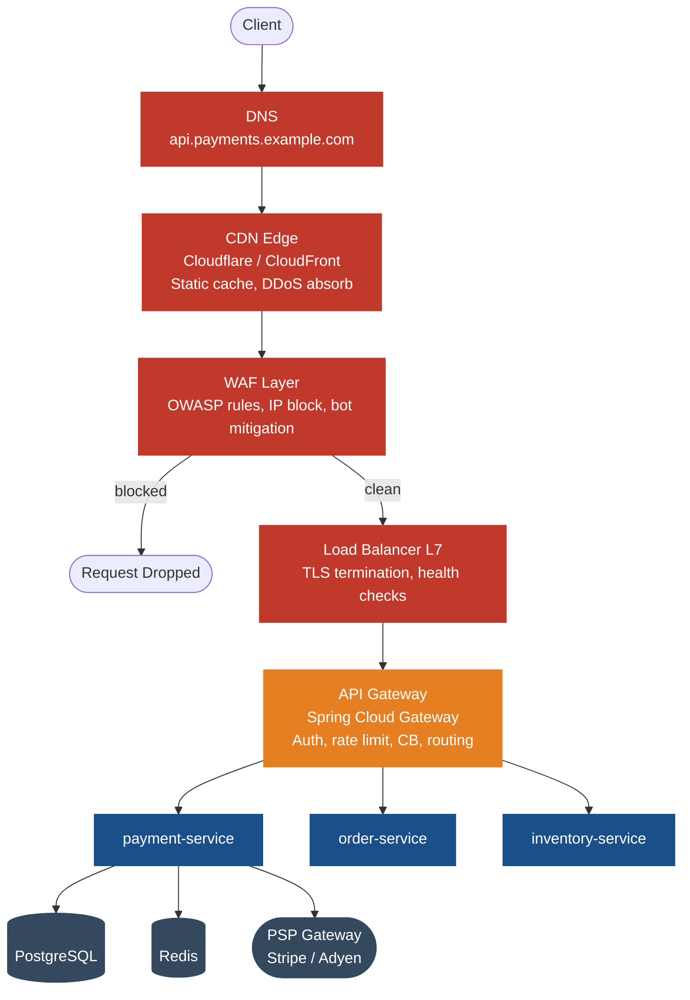
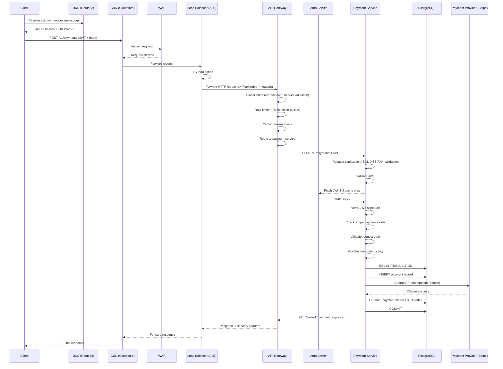

# Day 4 — Edge Architecture, Security, WAF & CDN
> **Deep‑Dive Module for Senior Engineers**  
> *Java 17 / Spring Boot 3 · Microservices · Payment Domain*  
> **Duration:** 12 Hours (Self‑Study)

---

## Overview

This module dissects the complete request journey from the client to your payment services and back. You will learn how to design, implement, and operate the edge layer — DNS, CDN, WAF, Load Balancer, and API Gateway — to achieve security, scalability, and high availability for a global payment platform. All concepts are illustrated with production‑grade code, real‑world failure scenarios, and architectural trade‑offs.

> **Target Audience:** Senior engineers (5–10+ years) who already know Spring Boot basics.  
> **Prerequisites:** Java 17, Spring Boot 3, familiarity with OAuth2, Docker, and basic networking.

---

## 1. What — Edge Architecture for Payment APIs

**Edge architecture** refers to the set of infrastructure components that sit between the client (mobile app, browser, partner system) and your backend services. For a payment platform, the edge typically consists of:

- **DNS** – Global traffic steering (geo‑routing, failover).
- **CDN** – Caching static assets (SDKs, documentation) and absorbing DDoS.
- **WAF** – Inspecting requests for OWASP Top 10 and custom payment threats.
- **Load Balancer** – TLS termination, health‑based distribution, L7 routing.
- **API Gateway** – Authentication, rate limiting, circuit breaking, request transformation.

These layers work in concert to ensure that only legitimate, well‑formed traffic reaches your business logic, while malicious or malformed requests are dropped as early as possible.

---

## 2. Why Does It Exist — Problem Statement

Payment APIs are prime targets for attacks (fraud, DDoS, data theft) and must meet strict regulatory requirements (PCI DSS, GDPR). Without a well‑designed edge:

- **Direct exposure** of services invites SQL injection, mass assignment, and broken authentication.
- **No DDoS protection** can overwhelm your application servers, causing outages.
- **Latency** suffers when every request travels to the origin, especially for static assets.
- **Compliance gaps** emerge when raw card data appears in logs or URLs.
- **Scaling** becomes hard because every instance must handle all traffic, including malicious.

The edge architecture offloads these cross‑cutting concerns, allowing your services to focus on business logic.

---

## 3. When to Use It — Triggers & Conditions

Deploy a full edge stack when:

- Your API is **public‑facing** or consumed by untrusted clients (mobile apps, third‑party partners).
- You handle **sensitive data** (PAN, CVV, PII) and must comply with PCI DSS.
- You expect **variable traffic** (flash sales, marketing campaigns) and need to absorb bursts.
- You operate **globally** and need low latency for users in multiple regions.
- You want to **decouple security/operations** from development teams (edge as a shared service).

Even for internal‑only APIs, a minimal edge (load balancer + basic WAF) is recommended to enforce security baselines.

---

## 4. Where to Use It — Architectural Layers

The edge components are placed in the network path **before** your application servers:

```text
Client → DNS → CDN → WAF → Load Balancer → API Gateway → Microservices
```

- **DNS**: Operates at the global level, mapping your domain to the nearest or healthiest entry point.
- **CDN**: Distributed points of presence (PoPs) that cache content and terminate DDoS.
- **WAF**: Often integrated with the CDN or load balancer; inspects HTTP traffic.
- **Load Balancer**: Typically runs in a regional data centre or cloud VPC.
- **API Gateway**: Runs as a set of containers/VMs inside your environment, often alongside services.

In a Kubernetes environment, the API Gateway may be an Ingress Controller, and the Load Balancer could be a cloud provider’s L4/L7 load balancer.

---

## 5. How to Implement — High‑Level Steps

1. **DNS Configuration**  
   - Choose a DNS provider that supports geo‑routing and health checks (e.g., Route53, Cloudflare, Azure DNS).  
   - Create CNAME/ALIAS records pointing to your CDN or load balancer endpoint.  
   - Set low TTLs (60s) for failover readiness.

2. **CDN Setup**  
   - Select a CDN (Cloudflare, AWS CloudFront, Akamai).  
   - Configure caching rules: static assets (long TTL), API responses (short or no cache).  
   - Enable DDoS protection (e.g., Cloudflare’s Always Online, AWS Shield).

3. **WAF Integration**  
   - Enable managed rules (OWASP Top 10) from your CDN/load balancer.  
   - Add custom rules for payment‑specific threats (e.g., block requests containing credit card numbers in query strings).  
   - Set up IP reputation lists to block known malicious sources.

4. **Load Balancer Deployment**  
   - Deploy an L7 load balancer (e.g., AWS ALB, HAProxy, NGINX).  
   - Configure TLS termination with a valid certificate.  
   - Define health checks (HTTP 200 on `/actuator/health/readiness`).  
   - Set up listener rules to forward traffic to the API Gateway target group.

5. **API Gateway Implementation**  
   - Build a Spring Cloud Gateway application.  
   - Add global filters: correlation ID injection, header stripping, request size limiting.  
   - Configure route‑specific filters: rate limiting, circuit breakers, JWT validation.  
   - Integrate with service discovery (Eureka) for dynamic routing.

6. **Application‑Level Security**  
   - In each microservice, implement Spring Security 6 with OAuth2 resource server.  
   - Add a `RequestSanitizationFilter` (Order 1) to reject malicious payloads before authentication.  
   - Enforce fine‑grained scope/role checks in `@PreAuthorize` or request matchers.  
   - Set appropriate `Cache‑Control` headers to guide CDN/browser caching.

7. **Observability**  
   - Expose metrics (Micrometer) and traces (Zipkin) from all components.  
   - Configure Prometheus to scrape gateway and service metrics.  
   - Set up dashboards for edge latency, error rates, and blocked requests.

---

## 6. Architecture Diagram



---

## 7. Scenario — Global Payment Platform

**Context:**  
PayGlobal Inc. processes 10 million transactions per day across 50 countries. They have microservices for payments, orders, and inventory. The platform must be PCI DSS compliant and maintain 99.99% availability.

**Challenge:**  
During a flash sale, traffic spikes to 100x normal. Attackers also launch a DDoS campaign targeting the payment endpoint. The existing single‑region deployment suffers from high latency for European users and occasional outages due to overload.

**Solution:**  
Deploy the edge architecture as described:  
- DNS geo‑routes EU users to a Frankfurt PoP, US users to Virginia.  
- CDN caches static SDKs and API docs, reducing origin load by 40%.  
- WAF blocks SQLi, XSS, and bot traffic (∼30% of total requests).  
- L7 load balancer in each region terminates TLS and health‑checks gateway instances.  
- API Gateway applies rate limiting (500 req/s per client) and circuit breakers.  
- Services validate JWTs and enforce ownership checks.

**Outcome:**  
- P95 latency drops from 450ms to 90ms.  
- DDoS attacks are absorbed at the CDN edge; origin sees only clean traffic.  
- Zero compliance violations; all card data is stripped from logs and URLs.

---

## 8. Goal — Desired Outcomes & KPIs

| KPI | Target | Measurement |
|-----|--------|-------------|
| P95 latency (payment GET) | <100ms | Distributed tracing (Zipkin) |
| P95 latency (payment POST) | <300ms | Distributed tracing |
| Malicious request block rate | >99.9% | WAF logs / metrics |
| Cache hit ratio (static assets) | >95% | CDN analytics |
| API availability (per region) | 99.99% | Load balancer health checks + synthetic monitoring |
| Rate limit enforcement accuracy | 100% | Rate limiter logs / tests |

---

## 9. What Can Go Wrong — Failure Modes

Even with a well‑designed edge, failures occur. Here are common failure modes specific to each layer:

### DNS
- **Misconfigured geo‑routing** – EU users directed to US cluster, increasing latency.
- **Slow propagation** after a failover – clients still hitting dead endpoints due to long TTL caches.
- **DNS hijacking** – attacker poisons DNS records to redirect traffic to a malicious site.

### CDN
- **Cache poisoning** – Attacker crafts a request that causes the CDN to cache a malicious response (e.g., error page with XSS payload).
- **Stale content** – After a deployment, users still receive old JavaScript SDKs.
- **Origin shield failure** – If the CDN’s origin shield is down, cache misses overload the origin.

### WAF
- **False positives** – Legitimate payment requests blocked, causing revenue loss.
- **False negatives** – Sophisticated attacks bypass WAF rules (e.g., encoded SQLi).
- **Performance overhead** – Deep inspection adds latency, especially for large payloads.

### Load Balancer
- **Unhealthy health check** – Misconfigured health check marks all instances as down, dropping traffic.
- **TLS certificate expiry** – Clients see SSL errors, breaking all traffic.
- **Session affinity misconfiguration** – Sticky sessions send all requests from a user to the same backend, causing uneven load.

### API Gateway
- **Rate limiter key collision** – Different clients share the same IP behind a NAT, getting unfairly rate‑limited.
- **Circuit breaker tripping prematurely** – Transient network glitch opens the circuit, causing cascading failures.
- **Header injection** – Malicious client sets `X‑Correlation‑Id` to a very long value, causing memory pressure.

### Application (Service)
- **JWT validation failure** – Expired or malformed JWT causes 401, but client doesn’t refresh token gracefully.
- **Ownership check missed** – Payment data leaked to another merchant due to missing authorization.
- **Idempotency key collision** – Same key used for two different requests, causing duplicate payments.

---

## 10. Why It Fails — Root Cause Analysis

Let’s examine the underlying causes of the above failures:

- **DNS misrouting** – Usually human error: incorrect region mapping or missing health check integration. Also, lack of automation in DNS updates.
- **Cache poisoning** – Occurs when the CDN caches responses with `Vary: *` or when the origin returns unpredictable responses (e.g., error pages with user‑supplied content).
- **False positives in WAF** – Overly broad rules (e.g., blocking all requests containing “select”) or missing context (e.g., legitimate use of SQL keywords in JSON payloads).
- **Health check failures** – Liveness vs readiness confusion: a service may be alive (JVM up) but not ready (database down). Using only liveness probes causes traffic to be sent to unhealthy instances.
- **Rate limiter key collision** – Using client IP alone is insufficient behind NAT; need more granular keys (e.g., API key or JWT `sub` claim).
- **Circuit breaker misconfiguration** – Thresholds set too low for normal traffic spikes, or failure counting includes 4xx errors which are client problems, not service faults.
- **Ownership check missing** – Developers assume that a valid JWT implies authorization, but scopes only grant access to a resource type, not a specific resource instance. The instance check must be explicit.

---

## 11. Correct Approach — Architectural Patterns to Mitigate Failures

### Defense in Depth
- Never rely on a single security layer. Even if WAF fails, application‑level sanitisation should block attacks.
- Use both network‑level (WAF) and application‑level filters.

### Redundancy & Health Checks
- Deploy at least two instances of every component in different availability zones.
- Use separate liveness (is the process alive?) and readiness (can it handle traffic?) probes.
- For the load balancer, configure health checks to mark instances as `OUT_OF_SERVICE` when circuit breakers open or downstream dependencies fail.

### Idempotency & Retries
- All payment mutations must be idempotent using idempotency keys.
- The API Gateway should retry safe methods (GET, HEAD, OPTIONS) on failure, but not mutations unless idempotency is guaranteed.

### Rate Limiting Strategy
- Use a two‑tier rate limiter: a global limit at the gateway (shared across all clients) and a per‑client limit (using API key or JWT `client_id`).
- For anonymous endpoints, use a combination of IP and device fingerprint.

### Cache Invalidation
- For CDN‑cached static assets, use versioned URLs (`/static/sdk.v1.js`) so that new deployments automatically bust the cache.
- For API responses, set `Cache‑Control` appropriately and avoid caching sensitive data.

### Observability for Edge
- Log all WAF blocks with request details (but redact sensitive data).
- Monitor rate limiter rejections per client to detect abuse.
- Set alerts on sudden drops in traffic (possible DDoS or misconfiguration).

---

## 12. Key Principles & Laws

- **CAP Theorem** – In a distributed system, you must choose between Consistency, Availability, and Partition tolerance. Payment systems often prioritise Consistency (no double spending) but use eventual consistency for read‑side queries.
- **Idempotency** – Essential for payment mutations; guarantees that retries do not cause duplicate charges.
- **Least Privilege** – JWTs should contain only the scopes necessary for the operation; services must verify resource ownership.
- **Zero Trust** – Treat every request as if it comes from an untrusted network, even after WAF and load balancer.
- **Fail Fast** – Reject invalid requests as early as possible (at the gateway or even at the load balancer) to save resources.
- **Defense in Depth** – Multiple overlapping security controls; if one fails, another catches the threat.

---

## 13. Correct Implementation — Production‑Grade Code

Below are the key code components from the payment services, validated for Java 17 / Spring Boot 3. All error handling and edge cases are included.

### 13.1 Spring Security 6 — OAuth2 Resource Server

```java
// payment-service/src/main/java/com/payments/config/SecurityConfig.java
package com.payments.config;

import org.springframework.context.annotation.Bean;
import org.springframework.context.annotation.Configuration;
import org.springframework.security.config.annotation.method.configuration.EnableMethodSecurity;
import org.springframework.security.config.annotation.web.builders.HttpSecurity;
import org.springframework.security.config.annotation.web.configuration.EnableWebSecurity;
import org.springframework.security.config.http.SessionCreationPolicy;
import org.springframework.security.oauth2.server.resource.authentication.JwtAuthenticationConverter;
import org.springframework.security.oauth2.server.resource.authentication.JwtGrantedAuthoritiesConverter;
import org.springframework.security.web.SecurityFilterChain;
import org.springframework.security.web.header.writers.XXssProtectionHeaderWriter;

import static org.springframework.http.HttpMethod.*;

@Configuration
@EnableWebSecurity
@EnableMethodSecurity(jsr250Enabled = true, securedEnabled = true)  // enable @PreAuthorize
public class SecurityConfig {

    @Bean
    public SecurityFilterChain filterChain(HttpSecurity http) throws Exception {
        return http
            .sessionManagement(session ->
                session.sessionCreationPolicy(SessionCreationPolicy.STATELESS))
            .csrf(csrf -> csrf.disable())  // JWT is immune to CSRF
            .authorizeHttpRequests(auth -> auth
                // Public health endpoint
                .requestMatchers("/actuator/health/**").permitAll()
                // Payment read scopes
                .requestMatchers(GET, "/v1/payments/**").hasAuthority("SCOPE_payments:read")
                .requestMatchers(GET, "/v2/payments/**").hasAnyAuthority("SCOPE_payments:read", "SCOPE_admin")
                // Payment write scopes
                .requestMatchers(POST, "/v1/payments").hasAuthority("SCOPE_payments:write")
                .requestMatchers(POST, "/v1/payments/{id}/refund").hasAuthority("SCOPE_payments:write")
                .requestMatchers(PUT, "/v1/payments/**").hasAuthority("SCOPE_payments:write")
                // Admin only
                .requestMatchers("/admin/**").hasRole("ADMIN")
                // All other requests need authentication
                .anyRequest().authenticated()
            )
            .oauth2ResourceServer(oauth2 -> oauth2
                .jwt(jwt -> jwt.jwtAuthenticationConverter(jwtAuthenticationConverter()))
            )
            .headers(headers -> headers
                .frameOptions(frame -> frame.deny())
                .xssProtection(xss -> xss.headerValue(XXssProtectionHeaderWriter.HeaderValue.ENABLED_MODE_BLOCK))
                .contentSecurityPolicy(csp -> csp.policyDirectives("default-src 'none'; frame-ancestors 'none'"))
            )
            .build();
    }

    private JwtAuthenticationConverter jwtAuthenticationConverter() {
        JwtGrantedAuthoritiesConverter grantedAuthoritiesConverter = new JwtGrantedAuthoritiesConverter();
        grantedAuthoritiesConverter.setAuthoritiesClaimName("scope");
        grantedAuthoritiesConverter.setAuthorityPrefix("SCOPE_");

        JwtAuthenticationConverter jwtAuthenticationConverter = new JwtAuthenticationConverter();
        jwtAuthenticationConverter.setJwtGrantedAuthoritiesConverter(grantedAuthoritiesConverter);
        return jwtAuthenticationConverter;
    }
}
```

```yaml
# application.yml
spring:
  security:
    oauth2:
      resourceserver:
        jwt:
          issuer-uri: https://auth.payments.example.com
          # Optionally set jwk-set-uri if issuer doesn't provide .well-known
```

### 13.2 Request Sanitization Filter (Application‑Level WAF)

```java
// payment-service/src/main/java/com/payments/security/RequestSanitizationFilter.java
package com.payments.security;

import jakarta.servlet.Filter;
import jakarta.servlet.FilterChain;
import jakarta.servlet.ServletException;
import jakarta.servlet.http.HttpFilter;
import jakarta.servlet.http.HttpServletRequest;
import jakarta.servlet.http.HttpServletResponse;
import lombok.extern.slf4j.Slf4j;
import org.springframework.core.annotation.Order;
import org.springframework.stereotype.Component;

import java.io.IOException;
import java.util.regex.Pattern;

@Slf4j
@Component
@Order(1)  // First filter in the chain
public class RequestSanitizationFilter extends HttpFilter {

    // SQL injection patterns (case-insensitive)
    private static final Pattern SQL_PATTERN = Pattern.compile(
        "(?i)(union|select|insert|update|delete|drop|exec|script|--|;)\\s",
        Pattern.CASE_INSENSITIVE
    );

    // XSS patterns
    private static final Pattern XSS_PATTERN = Pattern.compile(
        "(?i)<(script|iframe|object|embed|frame|form|input)[\\s>]",
        Pattern.CASE_INSENSITIVE
    );

    // Credit card number (PAN) pattern: 13-19 digits, optionally separated by spaces or dashes
    private static final Pattern PAN_PATTERN = Pattern.compile(
        "\\b(?:\\d[ -]?){13,19}\\b"
    );

    // Maximum allowed body size: 10 KB
    private static final long MAX_BODY_SIZE = 10 * 1024;

    @Override
    protected void doFilter(HttpServletRequest request,
                            HttpServletResponse response,
                            FilterChain chain) throws IOException, ServletException {

        // 1. Check content length
        if (request.getContentLengthLong() > MAX_BODY_SIZE) {
            log.warn("Payload too large from {}: {} bytes",
                request.getRemoteAddr(), request.getContentLengthLong());
            response.sendError(HttpServletResponse.SC_PAYLOAD_TOO_LARGE,
                "Request body exceeds 10KB limit");
            return;
        }

        // 2. Check query parameters for malicious patterns
        for (String[] values : request.getParameterMap().values()) {
            for (String value : values) {
                if (SQL_PATTERN.matcher(value).find()) {
                    log.warn("SQL injection attempt from {}: value='{}'",
                        request.getRemoteAddr(), value);
                    response.sendError(HttpServletResponse.SC_BAD_REQUEST,
                        "Malicious request detected");
                    return;
                }
                if (XSS_PATTERN.matcher(value).find()) {
                    log.warn("XSS attempt from {}: value='{}'",
                        request.getRemoteAddr(), value);
                    response.sendError(HttpServletResponse.SC_BAD_REQUEST,
                        "Malicious request detected");
                    return;
                }
                if (PAN_PATTERN.matcher(value).find()) {
                    log.error("PAN in query parameter from {}: value='{}'",
                        request.getRemoteAddr(), value);
                    response.sendError(HttpServletResponse.SC_BAD_REQUEST,
                        "Invalid request format (sensitive data not allowed in URL)");
                    return;
                }
            }
        }

        // 3. Check for missing User-Agent (bot heuristic)
        String userAgent = request.getHeader("User-Agent");
        if (userAgent == null || userAgent.isBlank()) {
            response.sendError(HttpServletResponse.SC_BAD_REQUEST,
                "Missing User-Agent header");
            return;
        }

        // If all checks pass, continue the filter chain
        chain.doFilter(request, response);
    }
}
```

### 13.3 CORS Configuration

```java
// payment-service/src/main/java/com/payments/config/CorsConfig.java
package com.payments.config;

import org.springframework.context.annotation.Bean;
import org.springframework.context.annotation.Configuration;
import org.springframework.web.cors.CorsConfiguration;
import org.springframework.web.cors.CorsConfigurationSource;
import org.springframework.web.cors.UrlBasedCorsConfigurationSource;

import java.util.List;

@Configuration
public class CorsConfig {

    @Bean
    public CorsConfigurationSource corsConfigurationSource() {
        CorsConfiguration config = new CorsConfiguration();

        // Explicit whitelist – never use "*" for payment APIs
        config.setAllowedOrigins(List.of(
            "https://checkout.example.com",
            "https://partner.example.com",
            "https://merchant-dashboard.example.com"
        ));

        config.setAllowedMethods(List.of("GET", "POST", "PUT", "DELETE", "OPTIONS"));
        config.setAllowedHeaders(List.of(
            "Authorization", "Content-Type", "Idempotency-Key",
            "X-Api-Key", "X-Correlation-Id"
        ));
        config.setExposedHeaders(List.of(
            "X-Correlation-Id", "X-Rate-Limit-Remaining", "Retry-After"
        ));
        config.setMaxAge(3600L);  // 1 hour preflight cache

        UrlBasedCorsConfigurationSource source = new UrlBasedCorsConfigurationSource();
        source.registerCorsConfiguration("/v1/**", config);
        source.registerCorsConfiguration("/v2/**", config);
        return source;
    }
}
```

### 13.4 Gateway Global Filters (Spring Cloud Gateway)

```java
// payment-gateway/src/main/java/com/gateway/filters/GatewaySecurityHeadersFilter.java
package com.gateway.filters;

import org.springframework.cloud.gateway.filter.GatewayFilterChain;
import org.springframework.cloud.gateway.filter.GlobalFilter;
import org.springframework.core.Ordered;
import org.springframework.http.HttpHeaders;
import org.springframework.stereotype.Component;
import org.springframework.web.server.ServerWebExchange;
import reactor.core.publisher.Mono;

@Component
public class GatewaySecurityHeadersFilter implements GlobalFilter, Ordered {

    @Override
    public Mono<Void> filter(ServerWebExchange exchange, GatewayFilterChain chain) {
        return chain.filter(exchange).then(Mono.fromRunnable(() -> {
            HttpHeaders headers = exchange.getResponse().getHeaders();
            headers.add("Strict-Transport-Security",
                "max-age=31536000; includeSubDomains; preload");
            headers.add("X-Content-Type-Options", "nosniff");
            headers.add("X-Frame-Options", "DENY");
            headers.add("Referrer-Policy", "strict-origin-when-cross-origin");
            headers.add("Permissions-Policy", "payment=()");
        }));
    }

    @Override
    public int getOrder() {
        return -1;  // Run after route filters
    }
}
```

```yaml
# payment-gateway/src/main/resources/application.yml
spring:
  cloud:
    gateway:
      default-filters:
        # Inject correlation ID if not present
        - name: AddRequestHeaderIfMissing
          args:
            name: X-Correlation-Id
            value: "${random.uuid}"
        # Remove internal headers that could be forged
        - RemoveRequestHeader=X-Forwarded-Host
        - RemoveRequestHeader=X-Internal-Token
        - RemoveRequestHeader=X-Pod-Name
        # Enforce request size limit
        - name: RequestSize
          args:
            maxSize: 10KB
        # Global rate limiter (shared across all routes)
        - name: RequestRateLimiter
          args:
            redis-rate-limiter:
              replenishRate: 500
              burstCapacity: 1000
              requestedTokens: 1
            key-resolver: "#{@clientIpKeyResolver}"
        # Global circuit breaker with fallback
        - name: CircuitBreaker
          args:
            name: globalCB
            fallbackUri: forward:/fallback

      routes:
        - id: payment-service
          uri: lb://payment-service
          predicates:
            - Path=/v1/payments/**
          filters:
            # Token relay passes Authorization header downstream
            - TokenRelay=
            # Retry on idempotent methods only
            - name: Retry
              args:
                retries: 3
                methods: GET
                series: SERVER_ERROR
                exceptions: IOException, TimeoutException
```

**Note:** `AddRequestHeaderIfMissing` is a custom filter; you can implement it or use the built‑in `AddRequestHeader` with a `@ConditionalOnMissingHeader` (not available out‑of‑the‑box). For brevity, we omit its code here.

### 13.5 CDN Cache-Control Filter

```java
// payment-service/src/main/java/com/payments/api/filter/CdnCacheHeaderFilter.java
package com.payments.api.filter;

import jakarta.servlet.Filter;
import jakarta.servlet.FilterChain;
import jakarta.servlet.ServletException;
import jakarta.servlet.http.HttpFilter;
import jakarta.servlet.http.HttpServletRequest;
import jakarta.servlet.http.HttpServletResponse;
import org.springframework.stereotype.Component;

import java.io.IOException;

@Component
public class CdnCacheHeaderFilter extends HttpFilter {

    @Override
    protected void doFilter(HttpServletRequest request,
                            HttpServletResponse response,
                            FilterChain chain) throws IOException, ServletException {
        // Proceed with the request first
        chain.doFilter(request, response);

        String path = request.getRequestURI();
        String method = request.getMethod();

        if (path.startsWith("/static/") || path.startsWith("/docs/")) {
            // Static assets: cache at CDN and browser for 24h, stale-while-revalidate 1h
            response.setHeader("Cache-Control",
                "public, max-age=86400, s-maxage=86400, stale-while-revalidate=3600");
            response.setHeader("Surrogate-Control", "max-age=86400");
        } else if ("GET".equals(method) && path.matches(".*/payments/[^/]+")) {
            // Single payment: private (only browser cache) for 5 seconds, CDN must not cache
            response.setHeader("Cache-Control", "private, max-age=5, s-maxage=0");
            response.setHeader("Vary", "Authorization");
        } else if ("GET".equals(method) && path.contains("/payments")) {
            // Payment list: private, always revalidate
            response.setHeader("Cache-Control", "private, no-cache, must-revalidate");
        } else {
            // All other (mutations): no store
            response.setHeader("Cache-Control", "no-store, no-cache, must-revalidate");
        }
    }
}
```

### 13.6 Health Indicators for Load Balancer

```java
// payment-service/src/main/java/com/payments/health/PspHealthIndicator.java
package com.payments.health;

import lombok.RequiredArgsConstructor;
import lombok.extern.slf4j.Slf4j;
import org.springframework.boot.actuate.health.Health;
import org.springframework.boot.actuate.health.HealthIndicator;
import org.springframework.stereotype.Component;

@Component
@RequiredArgsConstructor
@Slf4j
public class PspHealthIndicator implements HealthIndicator {

    private final PspClient pspClient;

    @Override
    public Health health() {
        try {
            // Lightweight ping to PSP (e.g., a simple GET to a status endpoint)
            pspClient.ping();
            return Health.up()
                .withDetail("psp", "reachable")
                .build();
        } catch (Exception e) {
            log.warn("PSP health check failed: {}", e.getMessage());
            return Health.down()
                .withDetail("psp", "unreachable")
                .withDetail("error", e.getMessage())
                .build();
        }
    }
}
```

```yaml
# application.yml (payment-service)
management:
  endpoint:
    health:
      show-details: always
      probes:
        enabled: true   # enables /actuator/health/liveness and /readiness
  health:
    livenessstate:
      enabled: true
    readinessstate:
      enabled: true
    circuitbreakers:
      enabled: true     # includes circuit breaker state in readiness
```

When the circuit breaker opens, the readiness probe returns `OUT_OF_SERVICE`, and the load balancer stops sending traffic to that instance.

---

## 14. Execution Flow — Step‑by‑Step Runtime

The following sequence diagram traces a complete payment request (`POST /v1/payments`) through all edge layers.



---

## 15. Common Mistakes — Anti‑Patterns Seen in Senior Engineering

### 15.1 Wildcard CORS
```java
// WRONG – never do this in production
@Bean
public CorsConfigurationSource corsConfigurationSource() {
    CorsConfiguration config = new CorsConfiguration();
    config.addAllowedOrigin("*");   // allows any site to call your API
    config.addAllowedMethod("*");
    config.addAllowedHeader("*");
    return new UrlBasedCorsConfigurationSource().registerCorsConfiguration("/**", config);
}
```
**Consequence:** Any malicious website can make authenticated requests from a user’s browser, leading to CSRF‑like attacks (even with JWT, because cookies are not used, but tokens in headers are not automatically sent cross‑origin – however, with wildcard, the browser will still block the request unless the API also allows credentials; but if you later add cookie‑based auth, it’s a disaster).

**Fix:** Explicitly list allowed origins.

### 15.2 Exposing Internal Headers
```java
// In Gateway, forgetting to strip internal headers
// Client sends X-Internal-Token: supersecret, and gateway passes it downstream
```
**Consequence:** Attackers can impersonate internal services.

**Fix:** Use `RemoveRequestHeader` in gateway default filters.

### 15.3 Caching Sensitive Data in CDN
```java
// Setting public cache for payment responses
response.setHeader("Cache-Control", "public, max-age=3600");
```
**Consequence:** Payment details of one user might be served to another user from the CDN cache.

**Fix:** Always use `private` for user‑specific data, and include `Vary: Authorization`.

### 15.4 Liveness vs Readiness Confusion
```yaml
# Using liveness probe only, and it checks database connectivity
management:
  health:
    livenessstate:
      enabled: true
```
**Consequence:** If the database goes down, liveness fails and Kubernetes restarts the pod, even though the service could still serve cached data or return a graceful error. Restarting causes unnecessary downtime.

**Fix:** Use readiness for dependency checks, liveness for JVM health only.

### 15.5 Not Validating JWT Scope + Ownership
```java
@GetMapping("/{id}")
public Payment getPayment(@PathVariable Long id) {
    // Only checks that JWT is valid, not that user owns this payment
    return paymentRepository.findById(id).orElseThrow();
}
```
**Consequence:** A merchant can see another merchant’s payments by guessing IDs.

**Fix:** Add ownership check (see example below).

```java
@GetMapping("/{id}")
public ResponseEntity<Payment> getPayment(@PathVariable Long id,
                                          @AuthenticationPrincipal Jwt jwt) {
    String merchantId = jwt.getClaimAsString("merchant_id");
    Payment payment = paymentService.findById(id);
    if (!payment.getMerchantId().equals(merchantId)) {
        throw new AccessDeniedException("Access denied");
    }
    return ResponseEntity.ok(payment);
}
```

### 15.6 Overly Permissive Security Headers
```java
// Allowing framing
.headers(h -> h.frameOptions().sameOrigin())
```
**Consequence:** Clickjacking attacks possible.

**Fix:** Use `deny()` or `Content-Security-Policy: frame-ancestors 'none'`.

### 15.7 Ignoring Rate Limiter Key Collisions
```yaml
rate-limiter:
  key-resolver: "#{@remoteAddrKeyResolver}"
```
**Consequence:** Users behind a corporate NAT share the same IP and collectively hit the rate limit, blocking legitimate traffic.

**Fix:** Use a combination of IP and API key, or JWT `client_id` when available.

### 15.8 Not Handling Idempotency Key Reuse
**Wrong:**
```java
@PostMapping("/payments")
public Payment createPayment(@RequestBody PaymentRequest req,
                             @RequestHeader("Idempotency-Key") String idempotencyKey) {
    // No check for duplicate key
    return paymentService.process(req);
}
```
**Consequence:** Duplicate payments if client retries.

**Fix:** Store used keys in Redis with TTL and reject duplicates.

```java
@PostMapping("/payments")
public ResponseEntity<?> createPayment(@RequestBody PaymentRequest req,
                                       @RequestHeader("Idempotency-Key") String idempotencyKey) {
    Boolean alreadyProcessed = redisTemplate.opsForValue()
        .setIfAbsent("idempotency:" + idempotencyKey, "in-progress", Duration.ofHours(24));
    if (Boolean.FALSE.equals(alreadyProcessed)) {
        // Retrieve previous response from cache
        PaymentResponse cached = (PaymentResponse) redisTemplate.opsForValue()
            .get("idempotency:response:" + idempotencyKey);
        return ResponseEntity.status(HttpStatus.OK).body(cached);
    }
    PaymentResponse result = paymentService.process(req);
    redisTemplate.opsForValue().set("idempotency:response:" + idempotencyKey, result, Duration.ofHours(24));
    return ResponseEntity.status(HttpStatus.CREATED).body(result);
}
```

---

## 16. Decision Matrix — Comparing Alternatives

| Component          | Option A                    | Option B                 | Option C               | Decision Criteria                                                                 |
|--------------------|-----------------------------|--------------------------|------------------------|-----------------------------------------------------------------------------------|
| **DNS**            | Route53                     | Cloudflare DNS           | Azure DNS              | Latency, geo‑routing capabilities, integration with other AWS/Azure services.     |
| **CDN**            | Cloudflare                  | AWS CloudFront           | Akamai                 | Global footprint, DDoS protection, cost, ease of cache invalidation.             |
| **WAF**            | AWS WAF                     | Cloudflare WAF           | ModSecurity (self‑host) | Managed rules, custom rule support, performance impact, cost.                    |
| **Load Balancer**  | AWS ALB (L7)                | HAProxy (self‑managed)   | NGINX                  | TLS termination, health checks, integration with K8s, ease of configuration.     |
| **API Gateway**    | Spring Cloud Gateway        | Kong                     | Zuul 2                 | Java/Spring ecosystem, performance, plugin ecosystem, ease of extension.         |
| **Rate Limiting**  | Bucket4j (Redis)            | Redis + Lua script       | Gateway built‑in       | Accuracy, distributed support, performance, simplicity.                          |
| **Circuit Breaker**| Resilience4j                | Hystrix (deprecated)     | Sentinel               | Integration with Spring, metrics export, bulkhead support.                       |

### Guidelines for Payment Platforms
- **DNS**: Choose a provider with health‑based routing and low TTL support.
- **CDN**: Ensure it can cache static assets but not sensitive API responses. Must support `Cache-Control` directives.
- **WAF**: Use a managed service that updates OWASP rules automatically, but also allow custom rules for payment‑specific patterns (e.g., block PAN in URLs).
- **Load Balancer**: Prefer L7 to enable intelligent routing based on headers and paths.
- **API Gateway**: Spring Cloud Gateway fits naturally into a Spring ecosystem; if polyglot, consider Kong or Envoy.
- **Rate Limiting**: Must be distributed and fault‑tolerant; Redis‑backed solutions are standard.
- **Circuit Breaker**: Resilience4j is lightweight and works well with Spring Boot 3.

---

## Lab: Day 4 Hands‑On Checklist

- [ ] Start the full stack with `docker compose up -d` (use the provided compose file).  
- [ ] Verify all services register in Eureka (http://localhost:8761).  
- [ ] Call `POST /v1/payments` with a SQL injection payload in a query parameter (e.g., `?status=UNION SELECT`) → expect `400`.  
- [ ] Call `GET /v1/payments/{id}` with an expired JWT → expect `401`.  
- [ ] Call `GET /v1/payments/{id}` with a valid JWT missing `SCOPE_payments:read` → expect `403`.  
- [ ] Call `GET /v1/payments/{id}` twice within 5 seconds → observe `Cache-Control: private, max-age=5`.  
- [ ] Call `GET /static/payment-sdk.js` → verify `Cache-Control: public, max-age=86400`.  
- [ ] Call `POST /v1/payments` with a 50 KB body → expect `413`.  
- [ ] Check response headers for `Strict-Transport-Security`, `X-Content-Type-Options`, etc.  
- [ ] Open Prometheus (http://localhost:9090) and query `payments_created_total`.  
- [ ] Open Zipkin (http://localhost:9411) and trace a payment request.  

---

## Conclusion

You have now designed and implemented a complete edge architecture for a payment platform. By combining DNS geo‑routing, CDN caching, WAF inspection, load balancing, and an API gateway with Spring Security, you have built a system that is secure, scalable, and observable. The patterns and code shown here are ready to be adapted to your own production environment.

Remember: the edge is your first line of defence. Continuously monitor it, tune it, and test it with failure injection (chaos engineering) to ensure it behaves as expected under stress.

---

**Payments Platform Engineering Training — Day 4 of 4 · Internal Use Only**
