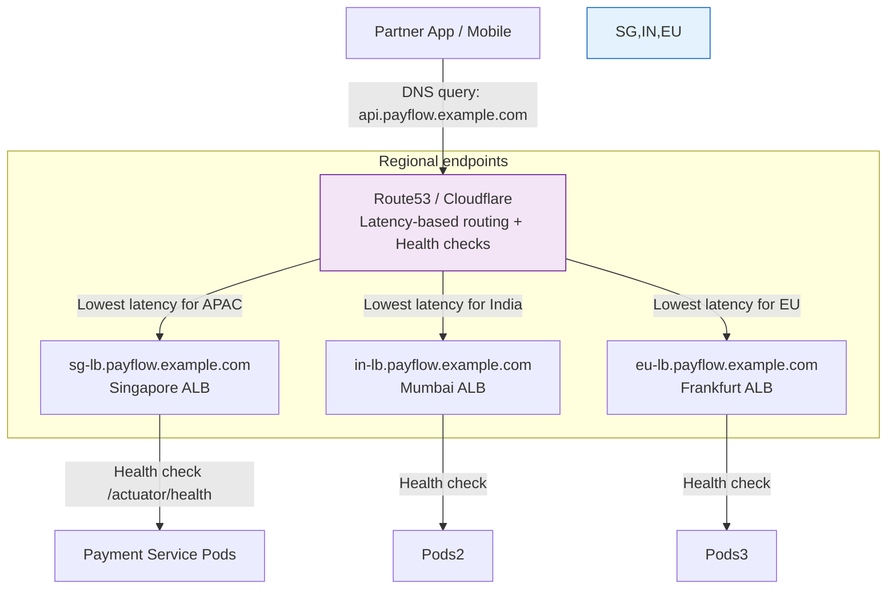
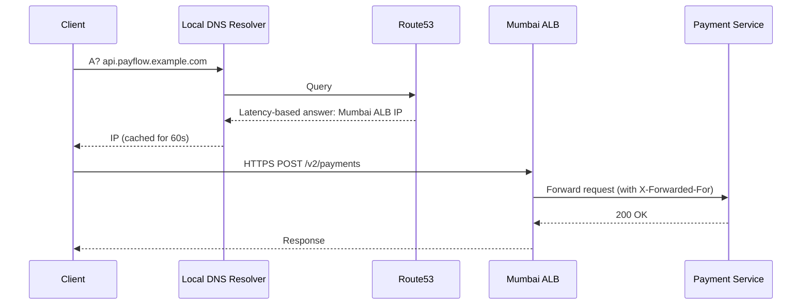
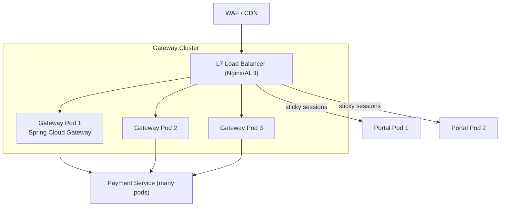
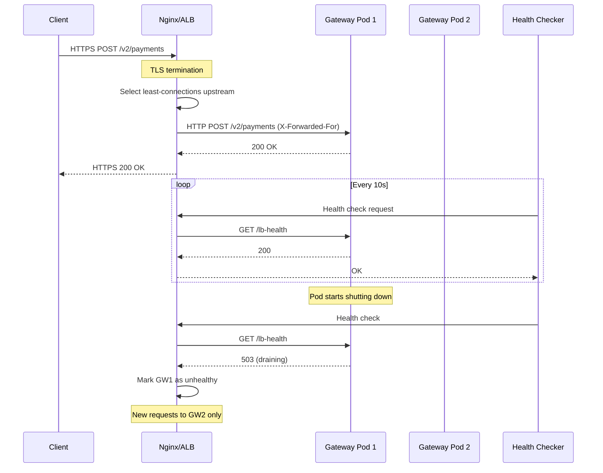
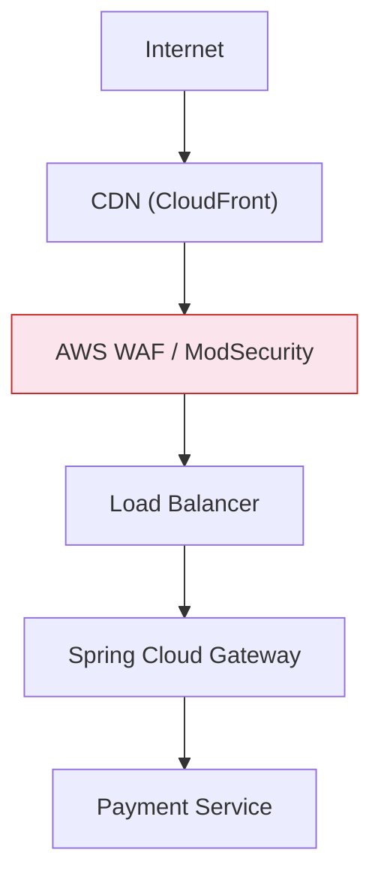
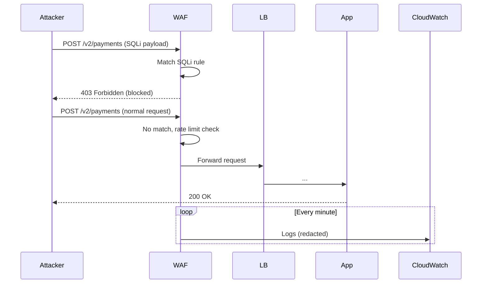
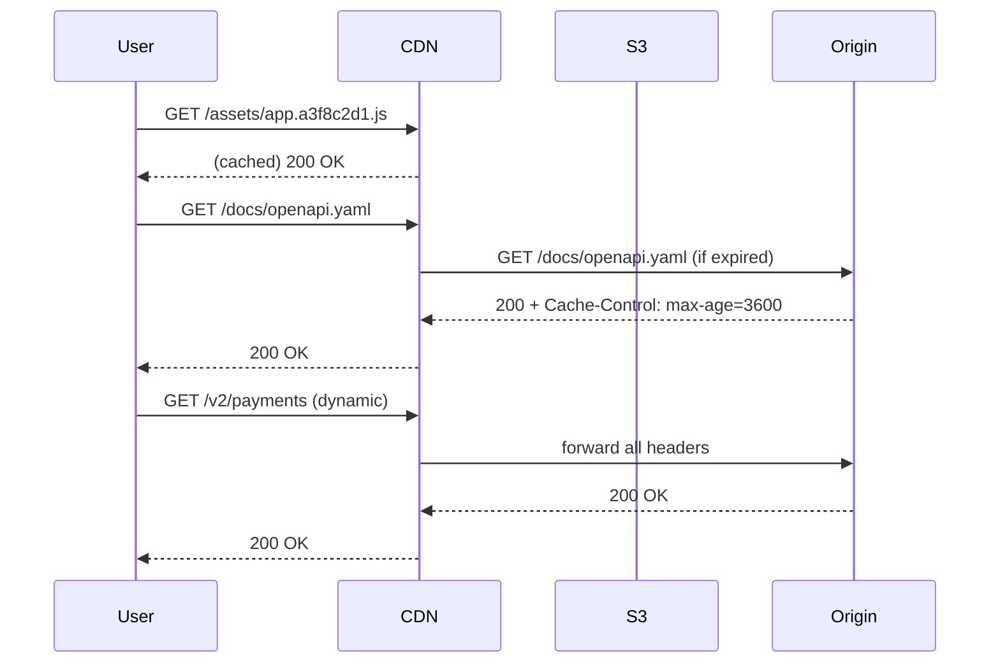

# Payments API — Day 4 Theory  
## Edge Engineering: DNS, Load Balancing, WAF & DDoS Protection, CDN  

**Master Project**: PayFlow — Production‑grade payment processing microservice  
**Continues from**: Day 1 (REST API + OpenAPI), Day 2 (Circuit Breaker, Rate Limiting, Caching, Gateway), Day 3 (Observability, Async)  
**Target Audience**: Senior Engineers (5‑10+ years)  
**Duration**: 4 hours (theory) / 8‑12 hours with labs  
**Domain**: Banking / Payments  
**Stack**: Java 17 / Spring Boot 3, AWS (Route53, ALB, WAF, CloudFront), Nginx/HAProxy  

---

## Table of Contents  

1. [DNS & Traffic Routing — How a Payment Request Finds PayFlow](#1-dns--traffic-routing)  
2. [Load Balancer — Distributing Traffic Safely](#2-load-balancer)  
3. [WAF & DDoS — Blocking Threats Before They Reach the API](#3-waf--ddos-protection)  
4. [CDN & Static Content — Offloading UI and Docs](#4-cdn--static-content-offloading)  

---

# 1. DNS & Traffic Routing  

## 1.1 What  

DNS (Domain Name System) translates human‑readable hostnames (`api.payflow.example.com`) into IP addresses. For a global payment platform, DNS is the first routing decision point. It can be extended with **geo‑routing**, **latency‑based routing**, **health‑check integration**, and **weighted distribution** to steer traffic to the optimal backend.

## 1.2 Why Does It Exist  

Without intelligent DNS, all global traffic hits a single region, adding 100‑200 ms latency for distant clients. DNS also provides the first line of disaster recovery: if a data centre fails, DNS can stop returning its IPs. For partner integrations, DNS allows **CNAME delegation** so partners can use their own domain (`pay.partner‑bank.example`) while PayFlow controls the ultimate resolution.

## 1.3 When to Use It  

- **Multi‑region deployments** – to minimise latency and comply with data residency.  
- **Active‑active or active‑passive failover** – health‑aware DNS enables region failover within minutes.  
- **Partner white‑label domains** – partners CNAME to your domain, you control the routing.  
- **Blue/green deployments** – shifting traffic weight gradually via weighted DNS records.

## 1.4 Where to Use It  

DNS operates at the **edge**, before any traffic enters your infrastructure. It sits between the client and your load balancers.

## 1.5 How to Implement (High‑Level Steps)  

1. Create a hosted zone for your domain (e.g., `payflow.example.com`).  
2. Define regional load balancer endpoints (e.g., `in‑lb.payflow.example.com`, `sg‑lb.payflow.example.com`).  
3. Configure health checks for each endpoint (e.g., HTTPS `GET /actuator/health`).  
4. Create a **latency‑based** or **geo‑proximity** record for `api.payflow.example.com` that points to the regional endpoints.  
5. Set TTLs appropriately: short (30‑60 s) for the main API record, longer (300 s) for stable endpoints like webhooks.  
6. For partner domains, provide a CNAME record pointing to `api.payflow.example.com`.  

## 1.6 Architecture Diagram  



## 1.7 Scenario  

PayFlow expanded from India‑only to Southeast Asia. Partners in Singapore, Indonesia, and Thailand reported that `api.payflow.example.com` resolved to the Mumbai data centre, adding 180‑220 ms latency to every payment call. The SLA requires p99 < 100 ms for authorisations. DNS geo‑routing was never configured – every DNS query returned the same A record regardless of origin.

## 1.8 Goal  

- **Latency**: p99 DNS resolution < 50 ms, total request latency < 100 ms from all regions.  
- **Failover**: unhealthy region removed from DNS within 60 s.  
- **Stability**: partner webhook endpoint has stable IP (long TTL) but can still fail over if needed.  
- **Partner branding**: support `pay.partner‑bank.example → api.payflow.example.com`.

## 1.9 What Can Go Wrong  

**Anti‑pattern A: Single A Record – No Geo or Failover**  
```bash
# BROKEN DNS (e.g., Route53 simple record)
api.payflow.example.com  A  10.0.0.1  TTL=3600
```
- All traffic goes to one region → high latency for distant clients.  
- If 10.0.0.1 goes down, DNS still returns it for up to 3600 s.  
- TTL=3600 means deployment changes take 1 hour to propagate.  

**Anti‑pattern B: TTL Too Low – Resolver Storm**  
```bash
api.payflow.example.com  A  10.0.0.1  TTL=0   # or TTL=5
```
- Every request causes a DNS lookup, overwhelming authoritative servers.  
- Many resolvers enforce a minimum TTL (e.g., 30 s), making “instant failover” ineffective.  
- High load on DNS can become a DDoS vector.  

**Anti‑pattern C: CNAME at Zone Apex**  
```bash
payflow.example.com  CNAME  lb-01.payflow.internal   # ❌ RFC violation
```
- RFC 1034 prohibits CNAME coexisting with NS/SOA records at the apex.  
- Use ALIAS/ANAME records (Route53, Cloudflare) instead.  

## 1.10 Why It Fails  

- **TTL misestimation**: Long TTLs are safe but delay failover; ultra‑short TTLs cause resolver storms because many clients (especially mobile) share the same resolver, and the resolver still caches for its configured minimum.  
- **Health check ignorance**: Without health checks, DNS continues returning dead IPs.  
- **Partner CNAME chaining**: Partners who CNAME directly to an ALB DNS name (which changes when the ALB is recreated) experience outages. They should CNAME to your stable domain.  

## 1.11 Correct Approach  

Use **latency‑based routing** (AWS Route53) or **geo‑proximity** (Cloudflare) with health‑checked regional endpoints. Set separate TTLs for different record types:  

| Record Type | Example                     | TTL   | Reason                                     |
|-------------|-----------------------------|-------|--------------------------------------------|
| ALIAS/A     | `api.payflow.example.com`   | 60 s  | Fast failover, operational agility         |
| CNAME       | `sg.payflow.example.com`    | 60 s  | Regional LB canonical name                  |
| CNAME       | `pay.partner‑bank.example`  | 300 s | Partner cache – stable, changes only if we move |
| A           | `webhooks.payflow.example.com` | 300 s | Long TTL for partner webhook config stability |
| TXT         | `_dmarc.payflow.example.com` | 3600 s | Rarely changes                             |

## 1.12 Key Principles  

- **TTL trade‑off**: short TTL → fast failover but more queries; long TTL → lower DNS load but slower recovery.  
- **Health checks**: DNS must integrate with health status to remove dead endpoints.  
- **CNAME flattening**: at the zone apex, use ALIAS/ANAME to avoid RFC violation.  
- **Negative caching**: SOA negative TTL controls how long `NXDOMAIN` is cached; tune it if you frequently add new records.

## 1.13 Correct Implementation  

### AWS Route53 with Terraform  

```hcl
# dns/route53.tf
terraform {
  required_providers {
    aws = { source = "hashicorp/aws", version = "~> 5.0" }
  }
}

data "aws_route53_zone" "payflow" {
  name = "payflow.example.com."
}

# Health checks
resource "aws_route53_health_check" "mumbai" {
  fqdn              = "in-lb.payflow.example.com"
  port              = 443
  type              = "HTTPS"
  resource_path     = "/actuator/health"
  failure_threshold = 2
  request_interval  = 30
  tags = { Name = "payflow-mumbai-health" }
}

resource "aws_route53_health_check" "singapore" {
  fqdn              = "sg-lb.payflow.example.com"
  port              = 443
  type              = "HTTPS"
  resource_path     = "/actuator/health"
  failure_threshold = 2
  request_interval  = 30
  tags = { Name = "payflow-singapore-health" }
}

# Latency-based records
resource "aws_route53_record" "api_mumbai" {
  zone_id = data.aws_route53_zone.payflow.zone_id
  name    = "api.payflow.example.com"
  type    = "A"

  alias {
    name                   = "in-lb.payflow.example.com"
    zone_id                = var.mumbai_alb_zone_id
    evaluate_target_health = true
  }

  set_identifier = "mumbai"
  latency_routing_policy { region = "ap-south-1" }
  health_check_id = aws_route53_health_check.mumbai.id
}

resource "aws_route53_record" "api_singapore" {
  zone_id = data.aws_route53_zone.payflow.zone_id
  name    = "api.payflow.example.com"
  type    = "A"

  alias {
    name                   = "sg-lb.payflow.example.com"
    zone_id                = var.singapore_alb_zone_id
    evaluate_target_health = true
  }

  set_identifier = "singapore"
  latency_routing_policy { region = "ap-southeast-1" }
  health_check_id = aws_route53_health_check.singapore.id
}

# Stable webhook endpoint
resource "aws_route53_record" "webhooks" {
  zone_id = data.aws_route53_zone.payflow.zone_id
  name    = "webhooks.payflow.example.com"
  type    = "A"
  ttl     = 300
  records = [var.webhook_static_ip]   # Elastic IP attached to a standby NLB
}
```

### Cloudflare Alternative (CNAME Flattening)  

```yaml
# cloudflare-dns.yaml
records:
  - type: CNAME
    name: "@"                              # zone apex
    content: alb-prod.ap-south-1.elb.amazonaws.com
    proxied: true
    ttl: 1                                 # "Auto" (Cloudflare manages)

  - type: CNAME
    name: api
    content: payflow-lb-pool.example.com   # Cloudflare Load Balancing pool
    proxied: true
    ttl: 1

  - type: A
    name: webhooks
    content: 203.0.113.10
    proxied: false
    ttl: 300
```

### DNS Failover Script (Planned vs. Emergency)  

```bash
#!/bin/bash
# scripts/dns-failover.sh
set -euo pipefail

ZONE_ID="Z1234567890"
RECORD_NAME="api.payflow.example.com"
NEW_REGION="ap-southeast-1"
OLD_REGION="ap-south-1"

# Pre‑requisite: TTL already lowered to 60s in previous window
echo "=== DNS Failover to Singapore ==="

# 1. Verify new region health
curl -f https://sg.payflow.example.com/actuator/health || exit 1

# 2. Shift 10% traffic to Singapore using weighted records (or update latency record)
aws route53 change-resource-record-sets \
    --hosted-zone-id "$ZONE_ID" \
    --change-batch '{
        "Changes": [{
            "Action": "UPSERT",
            "ResourceRecordSet": {
                "Name": "'$RECORD_NAME'",
                "Type": "A",
                "SetIdentifier": "singapore",
                "Weight": 10,
                "AliasTarget": {
                    "HostedZoneId": "Z123456",
                    "DNSName": "sg-lb.payflow.example.com",
                    "EvaluateTargetHealth": true
                }
            }
        }]
    }'

# 3. Monitor error rate for 5 min
sleep 300
ERROR_RATE=$(curl -s "http://prometheus:9090/api/v1/query?query=...")
if (( $(echo "$ERROR_RATE > 0.01" | bc -l) )); then
    echo "Rolling back"
    # rollback commands
    exit 1
fi

# 4. Complete switch to 100% Singapore
aws route53 change-resource-record-sets ...
```

### Spring Boot: Handling `X-Forwarded-For`  

```java
// In application.yml
server:
  forward-headers-strategy: framework   # Spring Boot 2.2+ auto-configures for proxy

// Or explicitly configure Tomcat
@Bean
public TomcatServletWebServerFactory tomcatFactory() {
    return new TomcatServletWebServerFactory() {
        @Override
        protected void postProcessContext(Context context) {
            RemoteIpValve valve = new RemoteIpValve();
            valve.setRemoteIpHeader("X-Forwarded-For");
            valve.setProtocolHeader("X-Forwarded-Proto");
            context.getPipeline().addValve(valve);
        }
    };
}
```

## 1.14 Execution Flow (Sequence Diagram)  



## 1.15 Common Mistakes  

- **Setting TTL=0** – causes resolver storms; most resolvers ignore it.  
- **Not pre‑reducing TTL before a planned failover** – old TTL remains, causing long propagation.  
- **CNAME pointing to an IP** – invalid syntax.  
- **Trusting `X-Forwarded-For` without validation** – client can spoof; use `$proxy_add_x_forwarded_for` in LB.  
- **Partner CNAME directly to ALB** – ALB DNS name changes on replacement.  
- **Ignoring negative TTL** – new records invisible until negative cache expires.

## 1.16 Decision Matrix  

| Approach             | Latency Optimization | Failover Speed | Operational Complexity | Cost          | Best For                          |
|----------------------|----------------------|----------------|------------------------|---------------|-----------------------------------|
| Single A record      | None                 | Hours (TTL)    | Low                    | $             | Single‑region, static IP          |
| Geo‑routing (static) | Good                 | Hours          | Medium                 | $             | When region is known statically   |
| Latency‑based (R53)  | Best                 | 60s            | Medium                 | $$ (health checks) | Global, dynamic traffic patterns |
| Anycast (CDN)        | Best (network level) | Seconds       | High (BGP)             | $$$$          | Large‑scale, DDoS mitigation      |

---

# 2. Load Balancer  

## 2.1 What  

A Layer‑7 (HTTP/HTTPS) load balancer distributes incoming requests across multiple backend instances (gateway pods). It terminates TLS, inspects HTTP headers, performs health checks, and can modify requests/responses (add headers, rewrite paths).

## 2.2 Why Does It Exist  

Without a load balancer, clients would need to know individual pod IPs, making scaling, rolling updates, and failure handling impossible. TLS termination at the LB centralises certificate management and reduces CPU load on application servers. Health checks ensure traffic is only sent to healthy instances.

## 2.3 When to Use It  

- Any distributed system with multiple instances of a service.  
- When you need to offload TLS (PCI‑DSS requires TLS 1.2+ everywhere; central termination simplifies compliance).  
- To implement advanced routing (e.g., canary releases, A/B testing).  
- When you need to protect internal services from direct exposure (LB as the only entry point).

## 2.4 Where to Use It  

The load balancer sits between the DNS layer (or WAF) and your application gateway / services. For PayFlow, we place an L7 LB in front of the Spring Cloud Gateway cluster.

## 2.5 How to Implement (High‑Level Steps)  

1. Choose a load balancer (AWS ALB, Nginx, HAProxy, Envoy).  
2. Configure TLS certificate (e.g., from AWS ACM or Let’s Encrypt).  
3. Define upstream server groups (gateway instances).  
4. Set up health checks (HTTP `GET /lb‑health` or `/actuator/health`).  
5. Configure load‑balancing algorithm (least connections for HTTP/2, round‑robin for short‑lived connections).  
6. Enable `X-Forwarded-*` headers to pass client IP and protocol.  
7. Set timeouts aligned with backend SLAs.  
8. Optionally configure sticky sessions for stateful parts (developer portal).  
9. Implement graceful draining (connection draining) for rolling updates.

## 2.6 Architecture Diagram  



## 2.7 Scenario  

A partner runs a monthly settlement job that submits 50,000 payment requests in 15 minutes. Three `payment‑service` pods are behind the gateway. Without an L7 LB, the Spring Cloud Gateway does client‑side round‑robin across the three Eureka‑registered instances. The settlement job’s connection pool opens 100 long‑lived HTTP/2 connections – all to the same IP (connection pinning). One pod handles 80% of the burst, runs out of heap, and starts returning 500s.

## 2.8 Goal  

- **Distribution**: even load across gateway instances, avoiding connection‑pinning overload.  
- **TLS centralisation**: terminate TLS at LB, pods communicate over HTTP (or mTLS).  
- **Health checks**: remove unhealthy pod within 30 s.  
- **Sticky sessions**: only for developer portal, not for payment API.  
- **Graceful draining**: in‑flight requests complete before pod removal.

## 2.9 What Can Go Wrong  

**Anti‑pattern A: Round‑Robin with Long‑Lived Connections**  
```nginx
upstream payment_gateway {
    server gateway-1:8080;
    server gateway-2:8080;
    server gateway-3:8080;
    # round‑robin by default
}
```
- HTTP/2 multiplexing means a client’s single connection stays with one upstream.  
- A burst of connections from one client still pins to one instance.  

**Anti‑pattern B: TLS Termination at Every Pod**  
```yaml
# application.yml (Spring Boot)
server:
  ssl:
    key-store: classpath:keystore.p12   # ❌ certificate in every pod
    enabled: true
```
- Certificate rotation requires restarting every pod → downtime.  
- Inconsistent cipher suites across pods.  
- Certificate material sprawl (security risk).  

**Anti‑pattern C: No Health Checks**  
```nginx
upstream payment_gateway {
    server gateway-1:8080;
    server gateway-2:8080;   # if this crashes, traffic still sent until N failures
}
```
- Passive health checks only trigger after real requests fail → some traffic fails before removal.

**Anti‑pattern D: `proxy_read_timeout` Shorter than Backend Timeout**  
If backend PSP timeout is 10 s, but `proxy_read_timeout = 5s`, LB kills the connection before the backend can respond.

## 2.10 Why It Fails  

- **Connection pinning**: with HTTP/2, a single TCP connection carries many requests; round‑robin at connection‑setup time is useless.  
- **TLS sprawl**: managing certificates per pod is operationally heavy and error‑prone.  
- **Lack of active health checks**: passive checks require traffic to fail; the first N requests after a crash will fail.  
- **Timeout misalignment**: LB must allow backend to process within its expected latency, including retries.

## 2.11 Correct Approach  

Use an L7 load balancer with **least‑connections** algorithm, active health checks, and TLS termination. Separate upstreams for API (stateless) and portal (sticky sessions).  

- **Algorithm**: `least_conn` for API, `ip_hash` or cookie for portal.  
- **TLS**: terminate at LB; pods run HTTP (or mTLS if service mesh).  
- **Health checks**: active HTTP check every 10 s, mark unhealthy after 2 failures.  
- **Timeouts**: set `proxy_read_timeout` > PSP timeout + buffer (e.g., 15 s).  
- **Graceful draining**: enable connection draining on AWS ALB or use `proxy_next_upstream` with nginx.

## 2.12 Key Principles  

- **Least connections** better than round‑robin for long‑lived connections.  
- **TLS termination at edge** reduces complexity and centralises security policy.  
- **Health checks** must be active to detect failures before traffic is affected.  
- **Stickiness** only where stateful (e.g., session data in memory).

## 2.13 Correct Implementation  

### Nginx L7 Configuration  

```nginx
# nginx/nginx.conf
http {
    upstream payment_gateway {
        least_conn;   # ✅ distribute by active connections
        server gateway-1:8080 max_fails=2 fail_timeout=30s;
        server gateway-2:8080 max_fails=2 fail_timeout=30s;
        server gateway-3:8080 max_fails=2 fail_timeout=30s;
        keepalive 64;
    }

    upstream portal {
        ip_hash;      # sticky sessions by client IP (simple for portal)
        server portal-1:3000;
        server portal-2:3000;
    }

    server {
        listen 443 ssl http2;
        server_name api.payflow.example.com;

        ssl_certificate     /etc/nginx/certs/fullchain.pem;
        ssl_certificate_key /etc/nginx/certs/privkey.pem;
        ssl_protocols       TLSv1.2 TLSv1.3;
        ssl_ciphers         'ECDHE-ECDSA-AES256-GCM-SHA384:...';
        ssl_prefer_server_ciphers on;
        add_header Strict-Transport-Security "max-age=31536000" always;
        ssl_stapling on;
        ssl_stapling_verify on;

        location /v1/ {
            proxy_pass http://payment_gateway;
            proxy_set_header X-Forwarded-For $proxy_add_x_forwarded_for;
            proxy_set_header X-Forwarded-Proto $scheme;
            proxy_set_header Host $host;
            proxy_connect_timeout 5s;
            proxy_send_timeout    15s;
            proxy_read_timeout    15s;
            proxy_next_upstream error timeout http_500 http_502 http_503;
            proxy_next_upstream_tries 2;
        }

        location /actuator/ {
            return 403;   # block direct actuator access
        }

        location /lb-health {
            access_log off;
            return 200 "OK";
        }
    }

    server {
        listen 443 ssl http2;
        server_name portal.payflow.example.com;

        ssl_certificate     /etc/nginx/certs/fullchain.pem;
        ssl_certificate_key /etc/nginx/certs/privkey.pem;

        location / {
            proxy_pass http://portal;
            proxy_set_header X-Forwarded-For $proxy_add_x_forwarded_for;
        }
    }
}
```

### HAProxy Alternative (Active Health Checks in OSS)  

```haproxy
# haproxy/haproxy.cfg
defaults
    mode http
    timeout connect 5s
    timeout client  15s
    timeout server  15s
    option forwardfor

frontend payflow_https
    bind :443 ssl crt /etc/haproxy/certs/payflow.pem alpn h2,http/1.1
    redirect scheme https code 301 if !{ ssl_fc }
    use_backend payflow_gateway if { path_beg /v1/ /v2/ }

backend payflow_gateway
    balance leastconn
    option httpchk GET /lb-health
    http-check expect status 200
    default-server inter 10s fall 2 rise 3
    server gateway-1 gateway-1:8080 check
    server gateway-2 gateway-2:8080 check
    server gateway-3 gateway-3:8080 check
```

### Spring Boot: Graceful Shutdown  

```java
// application.yml
server:
  shutdown: graceful
spring:
  lifecycle:
    timeout-per-shutdown-phase: 30s
```

This allows in‑flight requests to complete before the pod shuts down. The load balancer should also have connection draining (AWS ALB) or nginx `proxy_next_upstream` with `max_fails` to detect removal.

### Zero‑Downtime Certificate Rotation  

```bash
#!/bin/bash
# scripts/rotate-cert.sh
cp new-cert.pem /etc/nginx/certs/fullchain.pem
cp new-key.pem  /etc/nginx/certs/privkey.pem
nginx -t && nginx -s reload   # graceful reload, zero connections dropped
```

## 2.14 Execution Flow (Sequence Diagram)  



## 2.15 Common Mistakes  

- **Round‑robin with HTTP/2** – ignores connection pinning.  
- **Sticky sessions on payment API** – destroys load distribution.  
- **Trusting `X-Forwarded-For` without sanitisation** – allow spoofing.  
- **Double TLS** – terminating at LB and again in Spring Boot adds overhead.  
- **`proxy_read_timeout` too short** – kills slow responses.  
- **No health checks** – traffic continues to dead pods.

## 2.16 Decision Matrix  

| Approach               | TLS Mgmt | Load Distribution | Health Checks | Sticky Sessions | Complexity | Best For                     |
|------------------------|----------|-------------------|---------------|-----------------|------------|------------------------------|
| Client‑side (Ribbon)   | Per pod  | Poor (pinning)    | ❌            | Client‑side     | Low        | Small, internal apps         |
| L4 LB (NLB)            | Passthrough | Connection‑based | TCP only      | IP hash         | Medium     | Non‑HTTP, low latency        |
| L7 LB (Nginx/ALB)      | Central  | Least connections | HTTP active   | Cookie          | Medium     | HTTP APIs, need for headers  |
| Service Mesh (Istio)   | mTLS     | Advanced (locality)| Advanced     | Advanced        | High       | Large microservices, security|

---

# 3. WAF & DDoS Protection  

## 3.1 What  

A Web Application Firewall (WAF) inspects HTTP/HTTPS traffic and blocks malicious requests based on rules (e.g., SQL injection, XSS, path traversal). DDoS protection absorbs volumetric attacks at Layers 3‑4 (network) and 7 (application).

## 3.2 Why Does It Exist  

Payment APIs are prime targets for carding, credential stuffing, and OWASP Top 10 attacks. Without WAF, these attacks reach your application, consuming resources and potentially causing data breaches. DDoS protection ensures availability during large‑scale attacks.

## 3.3 When to Use It  

- Any internet‑facing API, especially handling sensitive data (PCI).  
- When you need to block known attack patterns before they hit your app.  
- To comply with security standards (PCI‑DSS requires WAF for public‑facing web apps).  
- When you need rate limiting at the edge (pre‑application).  

## 3.4 Where to Use It  

WAF is placed after DNS/CDN and before the load balancer. It can be cloud‑based (AWS WAF, Cloudflare) or self‑hosted (ModSecurity).

## 3.5 How to Implement (High‑Level Steps)  

1. Choose a WAF solution (AWS WAF + ALB, Cloudflare, or ModSecurity with Nginx).  
2. Enable managed rulesets (e.g., OWASP Core Rule Set).  
3. Configure custom rules for payment‑specific threats (carding, BIN enumeration).  
4. Set rate‑based rules (e.g., 20 POSTs per 5 minutes per IP).  
5. Run in **detection mode** initially, monitor false positives.  
6. Graduate rules to **block mode** after validation.  
7. Integrate with logging (S3, CloudWatch) and redact sensitive data (tokens, PAN).  
8. Set up alerts on block spikes.

## 3.6 Architecture Diagram  



## 3.7 Scenario  

PayFlow’s security team sees 2,000 payment attempts in 5 minutes from 400 IPs, all with structurally identical payloads (carding attack). Simultaneously, logs show `GET /v2/payments?status=<script>alert(1)</script>` (XSS probe). No WAF is in place – attacks reach the application.

## 3.8 Goal  

- Block OWASP Top 10 threats before they hit the gateway.  
- Detect and block carding (20 POSTs/5min/IP).  
- Rate‑limit at edge, separate from application‑level token bucket.  
- Zero false positives after tuning.  
- Alert on attack spikes.

## 3.9 What Can Go Wrong  

**Anti‑pattern A: No Input Validation in Application**  
```java
// BROKEN: Direct string concatenation in SQL
@GetMapping("/v2/payments")
public List<Payment> listPayments(@RequestParam String status) {
    String sql = "SELECT * FROM payments WHERE status = '" + status + "'";
    return jdbcTemplate.query(sql, ...);   // SQL injection
}
```
WAF is defence‑in‑depth, not a replacement for secure coding.

**Anti‑pattern B: WAF in Block Mode from Day One**  
```yaml
# AWS WAF configuration
default_action: block
rules:
  - allow: /v2/payments
  - deny: ALL
```
- A new endpoint added but not allowlisted → all calls blocked → partner outage.  
- No detection period → false positives discovered in production.

**Anti‑pattern C: No Rate Limiting at Edge**  
Distributed carding attack from 1000 IPs each doing 19 requests/5min bypasses a simple IP‑based rate limit.

## 3.10 Why It Fails  

- **False positives** – managed rulesets trigger on legitimate large JSON bodies, custom headers, etc.  
- **Lack of graduation** – rules enabled in block mode without testing cause outages.  
- **Sensitive data in logs** – WAF logs may contain JWTs or PANs, violating PCI.  
- **Distributed attacks** – IP‑based rate limiting alone is insufficient; need behaviour analysis.

## 3.11 Correct Approach  

Defence‑in‑depth:  
- WAF with managed rulesets (CRS, SQLi, IP reputation).  
- Custom rules for payment patterns (carding, BIN range enumeration).  
- Rate limiting at WAF (IP‑based) + application‑level (token bucket per authenticated client).  
- **Graduated rollout**: detect → monitor → block.  
- Redact sensitive data from logs.  
- Alert on block spikes.

## 3.12 Key Principles  

- **Defence‑in‑depth** – WAF is one layer; application must still validate.  
- **Least privilege** – block all by default, allow only needed endpoints.  
- **False positive management** – always start in detection mode.  
- **PCI compliance** – redact PAN/tokens from logs, use TLS 1.2+.

## 3.13 Correct Implementation  

### AWS WAF v2 with Terraform  

```hcl
# waf/main.tf
resource "aws_wafv2_web_acl" "payflow_api" {
  name        = "payflow-api-waf"
  scope       = "REGIONAL"
  default_action { allow {} }   # default allow, block via rules

  # Managed CRS (OWASP Top 10) – start in COUNT mode
  rule {
    name     = "AWSManagedRulesCRS"
    priority = 10
    override_action { count {} }
    statement {
      managed_rule_group_statement {
        name        = "AWSManagedRulesCommonRuleSet"
        vendor_name = "AWS"
        rule_action_override {
          action_to_use { count {} }
          name = "SizeRestrictions_BODY"   # override if too strict
        }
      }
    }
    visibility_config { ... }
  }

  # SQLi rule set – block immediately
  rule {
    name     = "AWSManagedRulesSQLi"
    priority = 20
    override_action { none {} }   # honour rule's block action
    statement {
      managed_rule_group_statement {
        name        = "AWSManagedRulesSQLiRuleSet"
        vendor_name = "AWS"
      }
    }
    visibility_config { ... }
  }

  # IP reputation – block known bad IPs
  rule {
    name     = "AWSManagedRulesIPReputation"
    priority = 30
    override_action { none {} }
    statement {
      managed_rule_group_statement {
        name        = "AWSManagedRulesAmazonIpReputationList"
        vendor_name = "AWS"
      }
    }
    visibility_config { ... }
  }

  # Custom rule: carding protection (20 POSTs/5min/IP)
  rule {
    name     = "CardingProtection"
    priority = 40
    action { block {} }
    statement {
      rate_based_statement {
        limit              = 20
        aggregate_key_type = "IP"
        scope_down_statement {
          byte_match_statement {
            field_to_match { uri_path {} }
            positional_constraint = "STARTS_WITH"
            search_string         = "/v2/payments"
            text_transformation { priority = 0; type = "LOWERCASE" }
          }
        }
      }
    }
    visibility_config { ... }
  }

  # Block scanner user‑agents
  rule {
    name     = "BlockScanners"
    priority = 50
    action { block {} }
    statement {
      regex_match_statement {
        field_to_match { single_header { name = "user-agent" } }
        regex_string = "(sqlmap|nikto|nmap|masscan|zgrab|nuclei|hydra|burpsuite)"
        text_transformation { priority = 0; type = "LOWERCASE" }
      }
    }
    visibility_config { ... }
  }

  # Block internal endpoints
  rule {
    name     = "BlockInternalEndpoints"
    priority = 60
    action { block {} }
    statement {
      regex_match_statement {
        field_to_match { uri_path {} }
        regex_string = "/(actuator/env|actuator/shutdown|h2-console|admin/|console|phpinfo)"
        text_transformation { priority = 0; type = "LOWERCASE" }
      }
    }
    visibility_config { ... }
  }

  visibility_config { ... }
}

# Associate with ALB
resource "aws_wafv2_web_acl_association" "payflow_alb" {
  resource_arn = var.alb_arn
  web_acl_arn  = aws_wafv2_web_acl.payflow_api.arn
}

# Logging with redaction
resource "aws_wafv2_web_acl_logging_configuration" "payflow" {
  log_destination_configs = [aws_kinesis_firehose_delivery_stream.waf_logs.arn]
  resource_arn            = aws_wafv2_web_acl.payflow_api.arn
  redacted_fields {
    single_header { name = "authorization" }
  }
}
```

### ModSecurity with Nginx (Self‑Hosted)  

```nginx
# nginx/modsecurity.conf
modsecurity on;
modsecurity_rules_file /etc/nginx/modsecurity/modsecurity.conf;

# Custom rules (after OWASP CRS)
modsecurity_rules '
    SecRule REQUEST_METHOD "@streq POST" \
        "id:100001,phase:1,chain,pass,nolog"
        SecRule REQUEST_URI "@beginsWith /v2/payments" \
            "setvar:ip.payment_post_count=+1,expirevar:ip.payment_post_count=60"

    SecRule IP:PAYMENT_POST_COUNT "@gt 20" \
        "id:100002,phase:1,deny,status:429,log,\
         msg:'Carding protection: too many payment attempts'"

    SecRule ARGS:paymentId "@rx (\.\.\/|\.\.\\)" \
        "id:100003,phase:2,deny,status:400,log,\
         msg:'Path traversal attempt'"
';
```

### Graduation Runbook  

```bash
#!/bin/bash
# scripts/waf-graduate.sh
RULE_NAME="AWSManagedRulesCRS"
echo "Step 1: Check false positives in CloudWatch for last 7 days"
aws cloudwatch get-metric-statistics ...   # inspect CountedRequests
read -p "Continue? (y/N) " confirm
if [[ "$confirm" == "y" ]]; then
    aws wafv2 update-web-acl --id ... --rule-override none
fi
```

## 3.14 Execution Flow (Sequence Diagram)  



## 3.15 Common Mistakes  

- **Block mode from day one** – causes false positive outages.  
- **No redaction** – PCI violations, sensitive data leaks.  
- **Rate limiting only at WAF** – distributed attacks bypass IP‑based limits.  
- **Not monitoring bypass attempts** – attackers test encoding variations.  
- **Ignoring WAF logs** – miss early warning signs.

## 3.16 Decision Matrix  

| Approach               | Threat Coverage | Customisation | False Positive Mgmt | Cost    | Best For                          |
|------------------------|-----------------|---------------|---------------------|---------|-----------------------------------|
| AWS WAF + ALB          | OWASP, IP rep   | High (rules)  | Graduation          | $$      | AWS‑native, integrated logging    |
| Cloudflare WAF         | OWASP, DDoS     | Medium        | Managed             | $$      | Global, CDN + WAF combo           |
| ModSecurity (self)     | Full control    | Very High     | Manual tuning       | $ (ops) | On‑prem, strict compliance needs |
| No WAF                 | None            | N/A           | N/A                 | $       | Internal, non‑critical apps       |

---

# 4. CDN & Static Content Offloading  

## 4.1 What  

A Content Delivery Network (CDN) caches static assets (JS, CSS, images, docs) at edge locations worldwide, serving them from the node closest to the user. It can also offload dynamic content if configured appropriately (though risky for payment APIs).

## 4.2 Why Does It Exist  

Serving static files from application servers wastes CPU and memory, and increases latency for distant users. CDN reduces origin load, improves page load times, and provides additional DDoS absorption.

## 4.3 When to Use It  

- For developer portals, documentation, and marketing sites.  
- When you have static assets that change infrequently.  
- To reduce latency for globally distributed users.  
- To offload TLS termination for static content (CDN can handle it).  

## 4.4 Where to Use It  

CDN sits between the user and your origin (load balancer or S3). For PayFlow, we use CloudFront (or Cloudflare) for `portal.payflow.example.com` and `docs.payflow.example.com`.

## 4.5 How to Implement (High‑Level Steps)  

1. Identify static vs dynamic content.  
2. For static assets, use content‑addressed filenames (hash in name).  
3. Set appropriate `Cache‑Control` headers on origin responses.  
4. Configure CDN to respect origin cache headers.  
5. For dynamic API calls, bypass CDN cache (or set `no‑cache`).  
6. Set up SPA routing: return `index.html` for 404s.  
7. Invalidate CDN cache on deployment for non‑hashed files.

## 4.6 Architecture Diagram  

```mermaid
graph TD
    User --> CDN["CloudFront / Cloudflare"]
    CDN -->|/assets/* (cache 1yr)| S3["S3 Static Bucket"]
    CDN -->|/docs/* (cache 1hr)| Origin["Portal Service (Spring Boot)"]
    CDN -->|/v2/* (no cache)| Origin
    Origin -->|fallback| S3
```

## 4.7 Scenario  

PayFlow’s developer portal serves a React SPA (2.4 MB bundle), OpenAPI docs (180 KB), and dynamic calls. All served by `portal‑service` Spring Boot app. During peak, portal service runs at 80% CPU just for static assets. 95% of traffic is static, 5% dynamic.

## 4.8 Goal  

- Move static assets to CDN.  
- Reduce origin load by >90%.  
- Cache assets with long TTL (1 year) using content‑addressed filenames.  
- Cache OpenAPI docs for 1 hour, invalidate on API deploy.  
- Dynamic API calls bypass CDN.  
- SPA routing works (deep links return `index.html`).

## 4.9 What Can Go Wrong  

**Anti‑pattern A: Caching Dynamic API Responses**  
```yaml
# CloudFront behaviour: /v2/* cached for 1 hour
```
- POST responses cached → duplicate payments.  
- `GET /v2/payments/{id}` of a non‑terminal state returns stale data.  

**Anti‑pattern B: Long‑Lived Cache Without Content Addressing**  
```html
<script src="/static/app.js"></script>
```
- Deploy new `app.js` over old one; CDN still serves old version for up to TTL.  

**Anti‑pattern C: Caching `index.html` with Long TTL**  
```html
Cache-Control: public, max-age=86400   # on index.html
```
- New deployment changes asset filenames, but `index.html` remains old → references non‑existent JS.

## 4.10 Why It Fails  

- **Cache‑invalidation complexity**: purging CDN cache on every deploy is expensive and error‑prone.  
- **SPA routing**: CDN returns 404 for deep links unless configured to serve `index.html`.  
- **Vary headers**: if origin sends `Vary: Accept-Encoding`, CDN may cache multiple copies, but misconfiguration can cause cache misses.

## 4.11 Correct Approach  

**Content‑addressed filenames**: `app.a3f8c2d1.js` – hash changes when content changes.  
- Cache these forever (max‑age 1 year, immutable).  
- `index.html` has `no‑cache` (always revalidate) but is tiny and rarely requested.  
- OpenAPI docs: cache 1 hour, invalidate on deployment.  
- Payment API: `no‑store` (do not cache).  

Cache strategy matrix:

| Content Type            | Cache‑Control                           | CDN Behaviour                |
|-------------------------|-----------------------------------------|------------------------------|
| Hashed assets (JS/CSS)  | `public, max-age=31536000, immutable`  | Cache forever                |
| OpenAPI YAML/Swagger UI | `public, max-age=3600, must-revalidate`| Cache 1 hour, revalidate     |
| index.html              | `no-cache, public`                      | Always check with origin     |
| Payment API responses   | `no-store`                              | Do not cache                 |
| Payment list (GET)      | `private, max-age=10`                   | Browser cache only (no CDN)  |

## 4.12 Key Principles  

- **Immutable assets** – hash in filename allows eternal caching.  
- **Cache hierarchy** – CDN caches, browser caches, origin serves.  
- **SPA fallback** – CDN must serve `index.html` for unknown paths.  
- **Invalidation minimalism** – only invalidate non‑hashed files.

## 4.13 Correct Implementation  

### Spring Boot: Static Resource Configuration  

```java
package com.payflow.portal;

import org.springframework.context.annotation.Configuration;
import org.springframework.http.CacheControl;
import org.springframework.web.servlet.config.annotation.ResourceHandlerRegistry;
import org.springframework.web.servlet.config.annotation.WebMvcConfigurer;
import java.time.Duration;

@Configuration
public class StaticResourceConfig implements WebMvcConfigurer {

    @Override
    public void addResourceHandlers(ResourceHandlerRegistry registry) {
        // Hashed assets (built by Vite/Webpack)
        registry.addResourceHandler("/assets/**")
                .addResourceLocations("classpath:/static/assets/")
                .setCacheControl(CacheControl
                        .maxAge(Duration.ofDays(365))
                        .cachePublic()
                        .immutable());

        // OpenAPI docs – cache 1 hour
        registry.addResourceHandler("/docs/**")
                .addResourceLocations("classpath:/static/docs/")
                .setCacheControl(CacheControl
                        .maxAge(Duration.ofHours(1))
                        .cachePublic()
                        .mustRevalidate());

        // index.html – no cache
        registry.addResourceHandler("/", "/index.html")
                .addResourceLocations("classpath:/static/")
                .setCacheControl(CacheControl.noCache().cachePublic());

        // favicon etc – 24h
        registry.addResourceHandler("/favicon.ico", "/manifest.json")
                .addResourceLocations("classpath:/static/")
                .setCacheControl(CacheControl.maxAge(24, Duration.ofHours(1)));
    }
}
```

### Vite Build (Content‑Addressed Filenames)  

```javascript
// vite.config.js
export default {
  build: {
    outDir: 'dist',
    rollupOptions: {
      output: {
        entryFileNames: 'assets/[name].[hash].js',
        chunkFileNames: 'assets/[name].[hash].js',
        assetFileNames: 'assets/[name].[hash].[ext]',
        manualChunks: { vendor: ['react', 'react-dom'] }
      }
    },
    manifest: true
  }
};
```

### CloudFront Distribution (Terraform)  

```hcl
# cdn/cloudfront.tf
resource "aws_cloudfront_distribution" "portal" {
  enabled             = true
  default_root_object = "index.html"
  aliases             = ["portal.payflow.example.com"]

  origin {
    domain_name = var.portal_alb_domain
    origin_id   = "portal-origin"
    custom_origin_config {
      http_port              = 80
      https_port             = 443
      origin_protocol_policy = "https-only"
    }
  }

  origin {
    domain_name = aws_s3_bucket.static.bucket_regional_domain_name
    origin_id   = "s3-static"
    s3_origin_config {
      origin_access_identity = aws_cloudfront_origin_access_identity.static.cloudfront_access_identity_path
    }
  }

  ordered_cache_behavior {
    path_pattern           = "/assets/*"
    allowed_methods        = ["GET", "HEAD"]
    cached_methods         = ["GET", "HEAD"]
    target_origin_id       = "s3-static"
    viewer_protocol_policy = "redirect-to-https"
    cache_policy_id        = aws_cloudfront_cache_policy.immutable.id
  }

  ordered_cache_behavior {
    path_pattern           = "/docs/*"
    allowed_methods        = ["GET", "HEAD"]
    cached_methods         = ["GET", "HEAD"]
    target_origin_id       = "portal-origin"
    viewer_protocol_policy = "redirect-to-https"
    cache_policy_id        = aws_cloudfront_cache_policy.docs.id  # respects origin max-age=3600
  }

  ordered_cache_behavior {
    path_pattern           = "/v2/*"
    allowed_methods        = ["GET", "HEAD", "POST", "PUT", "DELETE"]
    cached_methods         = ["GET", "HEAD"]
    target_origin_id       = "portal-origin"
    viewer_protocol_policy = "redirect-to-https"
    cache_policy_id        = data.aws_cloudfront_cache_policy.caching_disabled.id
  }

  default_cache_behavior {
    allowed_methods        = ["GET", "HEAD"]
    cached_methods         = ["GET", "HEAD"]
    target_origin_id       = "portal-origin"
    viewer_protocol_policy = "redirect-to-https"
    cache_policy_id        = aws_cloudfront_cache_policy.no_cache.id
  }

  custom_error_response {
    error_code         = 404
    response_code      = 200
    response_page_path = "/index.html"
    error_caching_min_ttl = 0
  }

  viewer_certificate {
    acm_certificate_arn      = var.cert_arn
    ssl_support_method       = "sni-only"
    minimum_protocol_version = "TLSv1.2_2021"
  }
}

resource "aws_cloudfront_cache_policy" "immutable" {
  name        = "immutable-assets"
  default_ttl = 31536000
  max_ttl     = 31536000
  min_ttl     = 31536000
  parameters_in_cache_key_and_forwarded_to_origin {
    cookies_config   { cookie_behavior = "none" }
    headers_config   { header_behavior = "none" }
    query_strings_config { query_string_behavior = "none" }
  }
}
```

### Deployment Script with Invalidation  

```bash
#!/bin/bash
# scripts/deploy-portal.sh
set -euo pipefail

DISTRIBUTION_ID="E123456"
BUCKET="s3://payflow-static"

npm run build
aws s3 sync dist/assets/ "$BUCKET/assets/" --cache-control "public, max-age=31536000, immutable" --delete
aws s3 sync dist/ "$BUCKET/" --exclude "assets/*" --cache-control "no-cache" --delete

aws cloudfront create-invalidation --distribution-id "$DISTRIBUTION_ID" \
    --paths "/index.html" "/docs/*" "/manifest.json"
```

## 4.14 Execution Flow (Sequence Diagram)  



## 4.15 Common Mistakes  

- **Caching `index.html`** – breaks new deployments.  
- **Not using content‑addressed filenames** – requires cache invalidation.  
- **Caching payment API** – returns stale or dangerous responses.  
- **Missing SPA 404 fallback** – deep links return 404.  
- **Forgetting to invalidate after deployment** – users see old content.

## 4.16 Decision Matrix  

| Approach                      | Origin Load | Cache Efficiency | Deployment Complexity | Best For                         |
|-------------------------------|-------------|------------------|-----------------------|----------------------------------|
| No CDN                        | High        | N/A              | Low                   | Internal tools, low traffic      |
| CDN with content‑addressed    | Very Low    | 100% hit rate    | Low (no invalidation) | SPAs, static sites               |
| CDN with invalidation         | Low         | High (except after deploy) | Medium | Sites with frequent changes but few assets |
| Dynamic content CDN (risky)   | Low         | High             | High (cache rules)    | Rarely changing API responses    |

---

*End of Day 4 Theory Document*  
*Next: Day 4 Labs → `Payments-API-Day4-Labs.md`*
